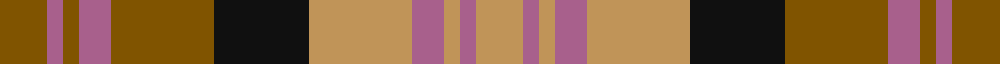

This page is one **sett** — a single exact thread-count. It belongs to the [tartan](/tartans/t6lp2t2lp4t13k12lt13lp4lt2lp2lt6/)
(the same proportion at any scale), whose colour order is pattern [GRGRGKYRYRY](/stripes/grgrgkyryry/).

Sourced from tartans-authority.  It is a [11 stripe tartan](/stripes/stripes11/).

Original link http://www.tartansauthority.com/tartan-ferret/display/5981/

2 attestations — the source records this cloth was collapsed from (oldest owns this page)

<ul>
<li>1999 — Glenmorangie (Corporate) (tartans-authority, <a href="http://www.tartansauthority.com/tartan-ferret/display/5981/">record</a>)</li>
<li>01/01/2003 — Glenmorangie (register-of-tartans, <a href="https://www.tartanregister.gov.uk/tartanDetails.aspx?ref=4868">record</a>)</li>
</ul>

## Register references

External register numbers recorded for this tartan.

- Scottish Register of Tartans: [4868](https://www.tartanregister.gov.uk/tartanDetails.aspx?ref=4868)
- Scottish Tartans Authority (ITI): 5981

## Thread count
T/12 LP4 T4 LP8 T26 K24 LT26 LP8 LT4 LP4 LT/12

## Palette
Each colour and the base-6 reference it is a variant of.

| Colour | Shade | Base |
|---|---|---|
| K | <code style="background-color:#101010;">#101010</code> `oklch(17.3% 0.000 89.9)` <small>#101010</small> | K <code style="background-color:#000000;">#000000</code> |
| LP | <code style="background-color:#A8608C;">#A8608C</code> `oklch(58.5% 0.109 343.6)` <small>#A8608C</small> | R <code style="background-color:#CC0000;">#CC0000</code> |
| LT | <code style="background-color:#C09458;">#C09458</code> `oklch(69.5% 0.094 73.8)` <small>#C09458</small> | Y <code style="background-color:#F2BF00;">#F2BF00</code> |
| T | <code style="background-color:#805400;">#805400</code> `oklch(48.3% 0.102 74.1)` <small>#805400</small> | G <code style="background-color:#006100;">#006100</code> |

## Nearest tartans

The nearest existing variants by ΔTartan distance, with this tartan at the top so the swatches line up against it.

ΔTartan

Tartan

Sett

—

<a href="/ttd/edit/#slug=y6m2y2m4y13k12lo13m4lo2m2lo6~x2">Glenmorangie (Corporate)</a> <a class="nn-out" href="/setts/s11/y6m2y2m4y13k12lo13m4lo2m2lo6~x2/" title="open its dictionary page">↗</a>

1.18

<a href="/ttd/edit/#slug=t2r3db3r5g14r3db2r5g2r3db14r5g3r3t2~x2">Glen Orchy</a> <a class="nn-out" href="/setts/s15/t2r3db3r5g14r3db2r5g2r3db14r5g3r3t2~x2/" title="open its dictionary page">↗</a>

1.18

<a href="/ttd/edit/#slug=r33g17db50g17r11g17r9k7">Carnegie</a> <a class="nn-out" href="/setts/s8/r33g17db50g17r11g17r9k7/" title="open its dictionary page">↗</a>

1.18

<a href="/ttd/edit/#slug=r10k10r4g2r2k2r4g12dt12g3dt4~x2">Hueg (Personal)</a> <a class="nn-out" href="/setts/s11/r10k10r4g2r2k2r4g12dt12g3dt4~x2/" title="open its dictionary page">↗</a>

1.24

<a href="/ttd/edit/#slug=r1g6ly1r2ly1r2ly1db6ly1~x2">Stevenson</a> <a class="nn-out" href="/setts/s9/r1g6ly1r2ly1r2ly1db6ly1~x2/" title="open its dictionary page">↗</a>

1.25

<a href="/setts/s14/o16k4w2k4o6o11o2o16~x2/">Sydney (Nova Scotia) #2</a>

1.27

<a href="/ttd/edit/#slug=db1g4db1r1db1ly1db5r6db1ly1~x2">Unidentified, specimen</a> <a class="nn-out" href="/setts/s10/db1g4db1r1db1ly1db5r6db1ly1~x2/" title="open its dictionary page">↗</a>

1.27

<a href="/ttd/edit/#slug=r5ly3r19do6ly5do6dg12db5dg12db3~x2">Roscommon, County</a> <a class="nn-out" href="/setts/s10/r5ly3r19do6ly5do6dg12db5dg12db3~x2/" title="open its dictionary page">↗</a>

1.27

<a href="/ttd/edit/#slug=lo3dr2o14g17dr14lo8o14dr2lo3~x2">Monaghan</a> <a class="nn-out" href="/setts/s9/lo3dr2o14g17dr14lo8o14dr2lo3~x2/" title="open its dictionary page">↗</a>

1.27

<a href="/ttd/edit/#slug=db9r3ly1r3g9r3ly1~x2">Logan</a> <a class="nn-out" href="/setts/s7/db9r3ly1r3g9r3ly1~x2/" title="open its dictionary page">↗</a>

1.28

<a href="/ttd/edit/#slug=lo3dy2o14dg17dy14lo8o14dy2lo3~x2">Monaghan Irish County Tartan Tartan Number: 2267. Earliest known date: 1996 One of a series of Irish District tartans designed by Polly Wittering of the House of Edgar, with colours reminiscent of the Country with soft warm colours dominating. See products available Copyright © Blair Urquhart, Comrie, 2015</a> <a class="nn-out" href="/setts/s9/lo3dy2o14dg17dy14lo8o14dy2lo3~x2/" title="open its dictionary page">↗</a>

## Neighbour map

Every grey dot is one of 14299 variants placed by the first two principal components of the ΔTartan feature space (44% of its variance). Red is this tartan; blue dots are its nearest — click one to open its page.

<svg viewBox="0 0 640 380" role="img" style="max-width:100%;height:auto;border:1px solid #e0e0e0;border-radius:4px;display:block" xmlns="http://www.w3.org/2000/svg"><image href="/nn/cloud.v1.png" width="640" height="380"/><a href="/setts/s15/t2r3db3r5g14r3db2r5g2r3db14r5g3r3t2~x2/"><circle cx="195.1" cy="185.0" r="4" fill="#3465a4"><title>Glen Orchy</title></circle></a><a href="/setts/s8/r33g17db50g17r11g17r9k7/"><circle cx="158.1" cy="221.0" r="4" fill="#3465a4"><title>Carnegie</title></circle></a><a href="/setts/s11/r10k10r4g2r2k2r4g12dt12g3dt4~x2/"><circle cx="130.0" cy="220.0" r="4" fill="#3465a4"><title>Hueg (Personal)</title></circle></a><a href="/setts/s9/r1g6ly1r2ly1r2ly1db6ly1~x2/"><circle cx="117.6" cy="193.6" r="4" fill="#3465a4"><title>Stevenson</title></circle></a><a href="/setts/s14/o16k4w2k4o6o11o2o16~x2/"><circle cx="203.8" cy="180.2" r="4" fill="#3465a4"><title>Sydney (Nova Scotia) #2</title></circle></a><a href="/setts/s10/db1g4db1r1db1ly1db5r6db1ly1~x2/"><circle cx="188.7" cy="196.1" r="4" fill="#3465a4"><title>Unidentified, specimen</title></circle></a><a href="/setts/s10/r5ly3r19do6ly5do6dg12db5dg12db3~x2/"><circle cx="116.9" cy="208.2" r="4" fill="#3465a4"><title>Roscommon, County</title></circle></a><a href="/setts/s9/lo3dr2o14g17dr14lo8o14dr2lo3~x2/"><circle cx="185.6" cy="220.6" r="4" fill="#3465a4"><title>Monaghan</title></circle></a><a href="/setts/s7/db9r3ly1r3g9r3ly1~x2/"><circle cx="166.9" cy="207.0" r="4" fill="#3465a4"><title>Logan</title></circle></a><a href="/setts/s9/lo3dy2o14dg17dy14lo8o14dy2lo3~x2/"><circle cx="187.0" cy="221.3" r="4" fill="#3465a4"><title>Monaghan Irish County Tartan Tartan Number: 2267. Earliest known date: 1996 One of a series of Irish District tartans designed by Polly Wittering of the House of Edgar, with colours reminiscent of the Country with soft warm colours dominating. See products available Copyright © Blair Urquhart, Comrie, 2015</title></circle></a><circle cx="143.0" cy="202.6" r="5" fill="#c00000"/></svg>

ID: /setts/s11/y6m2y2m4y13k12lo13m4lo2m2lo6~x2/
