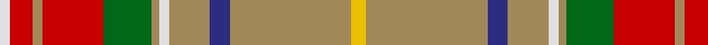

In pattern [WRYRGYWYBYY](/patterns/wryrgywybyy/).

This was sourced from register-of-tartans.  It is a [11 stripes tartan](/stripes/stripes11/).

Original link https://www.tartanregister.gov.uk/tartanDetails.aspx?ref=3040

## Thread count
LN/4 R9 LT4 R24 G19 LT3 LN4 LT16 DB8 LT48 Y/6

## Palette
Each colour and its ΔE from the base-6 reference it is a variant of.

| Colour | Shade | Base | ΔE (OKLab) |
|---|---|---|---|
| DB | <code style="background-color:#2C2C80;">#2C2C80</code> `#2C2C80` | B <code style="background-color:#2A418A;">#2A418A</code> | 0.06 |
| G | <code style="background-color:#006818;">#006818</code> `#006818` | G <code style="background-color:#006100;">#006100</code> | 0.02 |
| LN | <code style="background-color:#E0E0E0;">#E0E0E0</code> `#E0E0E0` | W <code style="background-color:#F7F7F7;">#F7F7F7</code> | 0.07 |
| LT | <code style="background-color:#A08858;">#A08858</code> `#A08858` | Y <code style="background-color:#F2BF00;">#F2BF00</code> | 0.21 |
| R | <code style="background-color:#C80000;">#C80000</code> `#C80000` | R <code style="background-color:#CC0000;">#CC0000</code> | 0.01 |
| Y | <code style="background-color:#E8C000;">#E8C000</code> `#E8C000` | Y <code style="background-color:#F2BF00;">#F2BF00</code> | 0.02 |

## Nearest tartans

The nearest existing variants by ΔTartan distance.

1. [Commonwealth Games - 2014](/setts/s11/g28y18b4y18r3ra2r3ra2r3ra2r3~b2c2c80-g048888-rc80000-rac80050-yd87c00~x2/) — ΔT 1.17
1. [Harmony 1](/setts/s12/b11g3b4y3b3y4b3ga13r34g3r4ba3~b401000-ba506060-g008000-ga908000-r906030-yf0c000~x2/) — ΔT 1.38
1. [Asman, Day Tan (Name)](/setts/s11/g2k1g9y3w1k3w1r3y9ya1y2~g5c6428-k101010-rc80000-wc0c0c0-ya08858-yad09800~x4/) — ΔT 1.39
1. [MacGuire Irish Family Tartan Tartan Number: 2427. Earliest known date: 1985 MacGuire is an Irish Family tartan See products available Copyright © Blair Urquhart, Comrie, 2015](/setts/s14/w10b3g30r4ba12r30ba6r6ba6r6ba6r30g30bb4~b202060-ba5c8ca8-bb003c64-g006818-rc80000-we0e0e0/) — ΔT 1.44
1. [MacKinnon 1](/setts/s12/r3ra4g3b3ra11g30ra3b7g3r2ra4w2~b800080-g008000-rd03030-rac00000-we0e0e0~x2/) — ΔT 1.45
1. [Battle of Bannockburn, The](/setts/s8/r1b1r9g6ba2bb3r2y1~b441800-ba5c8ca8-bb1474b4-g006818-rc80000-ybc8c00~x4/) — ΔT 1.45
1. [Murray of Abercairney](/setts/s9/b3g1k1r12ra1ga9ra1g1b3~b5480b0-g808080-ga008000-k000000-rc00000-rad03030~x2/) — ΔT 1.45
1. [Red Rum](/setts/s7/k2r30g4w2g14ra13y2~g008000-k000000-r806050-ra802040-we0e0e0-yf0c000~x2/) — ΔT 1.46
1. [Harmony 1](/setts/s12/g11ga3g4y3g3y4g3ya13r34ga3r4b3~b500000-g2a2303-ga005020-rbe7832-ye8c000-yac89600~x2/) — ΔT 1.47
1. [Unidentified 31](/setts/s11/y3r24b4r8w2r2g10ra12rb2ra5w2~b304080-g008000-r703000-rac00000-rb806050-we0e0e0-yf0c000~x2/) — ΔT 1.48

## Neighbour map

Every grey dot is one of 15726 variants placed by the first two principal components of the ΔTartan feature space (44% of its variance). Red is this tartan; blue dots are its nearest — click one to open its page.

<svg viewBox="0 0 640 380" role="img" style="max-width:100%;height:auto;border:1px solid #e0e0e0;border-radius:4px;display:block" xmlns="http://www.w3.org/2000/svg"><image href="/nn/cloud.v1.png" width="640" height="380"/><a href="/setts/s11/g28y18b4y18r3ra2r3ra2r3ra2r3~b2c2c80-g048888-rc80000-rac80050-yd87c00~x2/"><circle cx="252.5" cy="134.8" r="4" fill="#3465a4"><title>Commonwealth Games - 2014</title></circle></a><a href="/setts/s12/b11g3b4y3b3y4b3ga13r34g3r4ba3~b401000-ba506060-g008000-ga908000-r906030-yf0c000~x2/"><circle cx="217.0" cy="121.8" r="4" fill="#3465a4"><title>Harmony 1</title></circle></a><a href="/setts/s11/g2k1g9y3w1k3w1r3y9ya1y2~g5c6428-k101010-rc80000-wc0c0c0-ya08858-yad09800~x4/"><circle cx="177.4" cy="151.2" r="4" fill="#3465a4"><title>Asman, Day Tan (Name)</title></circle></a><a href="/setts/s14/w10b3g30r4ba12r30ba6r6ba6r6ba6r30g30bb4~b202060-ba5c8ca8-bb003c64-g006818-rc80000-we0e0e0/"><circle cx="173.4" cy="133.9" r="4" fill="#3465a4"><title>MacGuire Irish Family Tartan Tartan Number: 2427. Earliest known date: 1985 MacGuire is an Irish Family tartan See products available Copyright © Blair Urquhart, Comrie, 2015</title></circle></a><a href="/setts/s12/r3ra4g3b3ra11g30ra3b7g3r2ra4w2~b800080-g008000-rd03030-rac00000-we0e0e0~x2/"><circle cx="264.7" cy="119.6" r="4" fill="#3465a4"><title>MacKinnon 1</title></circle></a><a href="/setts/s8/r1b1r9g6ba2bb3r2y1~b441800-ba5c8ca8-bb1474b4-g006818-rc80000-ybc8c00~x4/"><circle cx="222.3" cy="163.6" r="4" fill="#3465a4"><title>Battle of Bannockburn, The</title></circle></a><a href="/setts/s9/b3g1k1r12ra1ga9ra1g1b3~b5480b0-g808080-ga008000-k000000-rc00000-rad03030~x2/"><circle cx="182.4" cy="128.8" r="4" fill="#3465a4"><title>Murray of Abercairney</title></circle></a><a href="/setts/s7/k2r30g4w2g14ra13y2~g008000-k000000-r806050-ra802040-we0e0e0-yf0c000~x2/"><circle cx="242.9" cy="150.3" r="4" fill="#3465a4"><title>Red Rum</title></circle></a><a href="/setts/s12/g11ga3g4y3g3y4g3ya13r34ga3r4b3~b500000-g2a2303-ga005020-rbe7832-ye8c000-yac89600~x2/"><circle cx="191.7" cy="108.3" r="4" fill="#3465a4"><title>Harmony 1</title></circle></a><a href="/setts/s11/y3r24b4r8w2r2g10ra12rb2ra5w2~b304080-g008000-r703000-rac00000-rb806050-we0e0e0-yf0c000~x2/"><circle cx="201.3" cy="117.5" r="4" fill="#3465a4"><title>Unidentified 31</title></circle></a><circle cx="248.0" cy="121.1" r="5" fill="#c00000"/></svg>

ID: /setts/s11/y6ya48b8ya16w4ya3g19r24ya4r9w4~b2c2c80-g006818-rc80000-we0e0e0-ye8c000-yaa08858/
