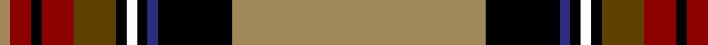

In pattern [YKBKWKGRKRY](/patterns/ykbkwkgrkry/).

This was sourced from tartans-authority.  It is a [11 stripes tartan](/stripes/stripes11/).

Original link http://www.tartansauthority.com/tartan-ferret/display/7567/

## Attestations

This cloth appears in 2 source records; the oldest owns this page.

- Feb 2008 — U.S. Customs & Border Protection (C (tartans-authority, [record](http://www.tartansauthority.com/tartan-ferret/display/7567/))
- undated — U.S. Customs & Border Protection (register-of-tartans, [record](https://www.tartanregister.gov.uk/tartanDetails.aspx?ref=5593))

## Thread count
LT/4 DR8 K4 DR12 T16 K4 W4 K4 DB4 K28 LT/96

## Palette
Each colour and its ΔE from the base-6 reference it is a variant of.

| Colour | Shade | Base | ΔE (OKLab) |
|---|---|---|---|
| DB | <code style="background-color:#2C2C80;">#2C2C80</code> `#2C2C80` | B <code style="background-color:#2C4084;">#2C4084</code> | 0.05 |
| DR | <code style="background-color:#8C0000;">#8C0000</code> `#8C0000` | R <code style="background-color:#C80000;">#C80000</code> | 0.13 |
| K | <code style="background-color:#000000;">#000000</code> `#000000` | K <code style="background-color:#000000;">#000000</code> | 0.00 |
| LT | <code style="background-color:#A08858;">#A08858</code> `#A08858` | Y <code style="background-color:#E8C000;">#E8C000</code> | 0.21 |
| T | <code style="background-color:#604000;">#604000</code> `#604000` | G <code style="background-color:#006400;">#006400</code> | 0.14 |
| W | <code style="background-color:#FCFCFC;">#FCFCFC</code> `#FCFCFC` | W <code style="background-color:#F4F4F0;">#F4F4F0</code> | 0.03 |

## Nearest tartans

The nearest existing variants by ΔTartan distance.

1. [Legion of Frontiersmen](/setts/s8/b124y14g14r6w6ba26w6r10-b441800-ba000048-g008b00-rc80000-wffffff-yffd700/) — ΔT 1.12
1. [Leando (Coldingham) Hunting (Personal)](/setts/s13/r76k8ra4b12w4b4w4b4k24r12b4r12w4-b321308-k000000-r9c661f-raa20d22-wf7f1e8/) — ΔT 1.17
1. [Follower's, Plaid](/setts/s11/r96b16k20y4k6w4g50r20k6r6w4-b5480b0-g008000-k000000-rc00000-we0e0e0-yf0c000/) — ΔT 1.18
1. [Legion of Frontiersmen](/setts/s8/b124y14g14r6w6ba26w6r10-b501400-ba2c2c80-g006818-rc80000-wfcfcfc-yfccc00/) — ΔT 1.28
1. [MacLean of Duart 2](/setts/s11/b28k16y4k6w8k6g42r96b8r10k6-b5480b0-g008000-k000000-rc00000-we0e0e0-yf0c000/) — ΔT 1.31
1. [Spotsylvania County Sheriff's Office](/setts/s10/k4y4k48y4k4y4ya60w6g4r4-g289c18-k101010-rc80000-we0e0e0-ye8c000-yaa08858/) — ΔT 1.31
1. [Hudson Bay Company Corporate Tartan Tartan Number: 1612. Earliest known date: 1984 Designed by Gordon Kirkbright now (2002) of Fraser & Kirkbright, Vancouver, when he worked with West Coast Woolen Mill. Orange sometimes given as Red. Often woven in reprocolours where black becomes a dark brown. See products available Copyright © Blair Urquhart, Comrie, 2015](/setts/s12/r4k68w4k4ra54g2ra4k6ra4y2ra4r4-g006818-k101010-rc80000-ra888888-we0e0e0-ye8c000/) — ΔT 1.35
1. [Holyoke St. Patrick's](/setts/s10/r16b16g2b2g54ba2y2ba6y6w2-b2c2c80-ba780078-g285800-rc80000-we0e0e0-ye8c000/) — ΔT 1.36
1. [Stewart Dress](/setts/s12/y72b8k12ya2k2y2k2g16r8k2r4y2-b000052-g11450d-k000000-raa0000-yaaaaaa-yaaaaa00/) — ΔT 1.37
1. [Stewart Dress](/setts/s12/y36b4k6ya1k1y1k1g8r4k1r2y1-b000052-g11450d-k000000-raa0000-yaaaaaa-yaaaaa00/) — ΔT 1.37

## Neighbour map

Every grey dot is one of 15726 variants placed by the first two principal components of the ΔTartan feature space (44% of its variance). Red is this tartan; blue dots are its nearest — click one to open its page.

<svg viewBox="0 0 640 380" role="img" style="max-width:100%;height:auto;border:1px solid #e0e0e0;border-radius:4px;display:block" xmlns="http://www.w3.org/2000/svg"><image href="/nn/cloud.v1.png" width="640" height="380"/><a href="/setts/s8/b124y14g14r6w6ba26w6r10-b441800-ba000048-g008b00-rc80000-wffffff-yffd700/"><circle cx="312.8" cy="91.5" r="4" fill="#3465a4"><title>Legion of Frontiersmen</title></circle></a><a href="/setts/s13/r76k8ra4b12w4b4w4b4k24r12b4r12w4-b321308-k000000-r9c661f-raa20d22-wf7f1e8/"><circle cx="304.2" cy="85.7" r="4" fill="#3465a4"><title>Leando (Coldingham) Hunting (Personal)</title></circle></a><a href="/setts/s11/r96b16k20y4k6w4g50r20k6r6w4-b5480b0-g008000-k000000-rc00000-we0e0e0-yf0c000/"><circle cx="263.7" cy="72.1" r="4" fill="#3465a4"><title>Follower's, Plaid</title></circle></a><a href="/setts/s8/b124y14g14r6w6ba26w6r10-b501400-ba2c2c80-g006818-rc80000-wfcfcfc-yfccc00/"><circle cx="323.9" cy="92.2" r="4" fill="#3465a4"><title>Legion of Frontiersmen</title></circle></a><a href="/setts/s11/b28k16y4k6w8k6g42r96b8r10k6-b5480b0-g008000-k000000-rc00000-we0e0e0-yf0c000/"><circle cx="216.6" cy="72.2" r="4" fill="#3465a4"><title>MacLean of Duart 2</title></circle></a><a href="/setts/s10/k4y4k48y4k4y4ya60w6g4r4-g289c18-k101010-rc80000-we0e0e0-ye8c000-yaa08858/"><circle cx="206.0" cy="90.1" r="4" fill="#3465a4"><title>Spotsylvania County Sheriff's Office</title></circle></a><a href="/setts/s12/r4k68w4k4ra54g2ra4k6ra4y2ra4r4-g006818-k101010-rc80000-ra888888-we0e0e0-ye8c000/"><circle cx="294.6" cy="54.3" r="4" fill="#3465a4"><title>Hudson Bay Company Corporate Tartan Tartan Number: 1612. Earliest known date: 1984 Designed by Gordon Kirkbright now (2002) of Fraser &amp; Kirkbright, Vancouver, when he worked with West Coast Woolen Mill. Orange sometimes given as Red. Often woven in reprocolours where black becomes a dark brown. See products available Copyright © Blair Urquhart, Comrie, 2015</title></circle></a><a href="/setts/s10/r16b16g2b2g54ba2y2ba6y6w2-b2c2c80-ba780078-g285800-rc80000-we0e0e0-ye8c000/"><circle cx="282.8" cy="84.1" r="4" fill="#3465a4"><title>Holyoke St. Patrick's</title></circle></a><a href="/setts/s12/y72b8k12ya2k2y2k2g16r8k2r4y2-b000052-g11450d-k000000-raa0000-yaaaaaa-yaaaaa00/"><circle cx="298.7" cy="35.2" r="4" fill="#3465a4"><title>Stewart Dress</title></circle></a><a href="/setts/s12/y36b4k6ya1k1y1k1g8r4k1r2y1-b000052-g11450d-k000000-raa0000-yaaaaaa-yaaaaa00/"><circle cx="298.7" cy="35.2" r="4" fill="#3465a4"><title>Stewart Dress</title></circle></a><circle cx="274.9" cy="62.3" r="5" fill="#c00000"/></svg>

ID: /setts/s11/y96k28b4k4w4k4g16r12k4r8y4-b2c2c80-g604000-k000000-r8c0000-wfcfcfc-ya08858/
