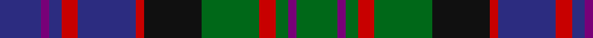

In pattern [BBBRBRKGRGBG](/patterns/bbbrbrkgrgbg/).

This was sourced from register-of-tartans.  It is a [12 stripes tartan](/stripes/stripes12/).

Original link https://www.tartanregister.gov.uk/tartanDetails.aspx?ref=916

## Attestations

This cloth appears in 3 source records; the oldest owns this page.

- 01/01/2002 — Denovan, The Lairdship of (Personal) (register-of-tartans, [record](https://www.tartanregister.gov.uk/tartanDetails.aspx?ref=916))
- pre 2002 — MacDonald of Denovan (Clan) (tartans-authority, [record](http://www.tartansauthority.com/tartan-ferret/display/36/))
- undated — MacDonald of Dunyveg Family Tartan Tartan Number: 36. Earliest known date: 1992 Designed by Captain V.J. MacDonald-Evans for himself and future Lairds of Denovan, regardless of their name. In 2009 Lord Denovan removed the restriction, to allow all Denovan's to wear it with the tartan to be called simply Denovan (rather than Lairds of Denovan). In 2010 Lord Denovan further suggested this tartan for all of the MacDonald's of Dunyveg. See products available Copyright © Blair Urquhart, Comrie, 2015 (house-of-tartan, [record](http://www.house-of-tartan.scotland.net/house/TartanViewjs.asp?colr=Def&tnam=36))

## Thread count
DB/20 P4 DB6 R8 DB28 R4 K28 G28 R8 G6 P4 G/20

## Palette
Each colour and its ΔE from the base-6 reference it is a variant of.

| Colour | Shade | Base | ΔE (OKLab) |
|---|---|---|---|
| DB | <code style="background-color:#2C2C80;">#2C2C80</code> `#2C2C80` | B <code style="background-color:#2A418A;">#2A418A</code> | 0.06 |
| G | <code style="background-color:#006818;">#006818</code> `#006818` | G <code style="background-color:#006100;">#006100</code> | 0.02 |
| K | <code style="background-color:#101010;">#101010</code> `#101010` | K <code style="background-color:#000000;">#000000</code> | 0.17 |
| P | <code style="background-color:#780078;">#780078</code> `#780078` | B <code style="background-color:#2A418A;">#2A418A</code> | 0.17 |
| R | <code style="background-color:#C80000;">#C80000</code> `#C80000` | R <code style="background-color:#CC0000;">#CC0000</code> | 0.01 |

## Nearest tartans

The nearest existing variants by ΔTartan distance.

1. [Macallan](/setts/s13/b12r2b4r5b16r2k16y2g16r5g4r2g12~b2c4084-g005020-k101010-rdc0000-yc89600~x2/) — ΔT 0.40
1. [Kinloch Anderson #2 (Corporate)](/setts/s12/r4g14ra2g4ra2k6g3k6b12r2b4r4~b1c0070-g5c6428-k101010-r880000-raa07c58~x2/) — ΔT 0.55
1. [Ryukoku University Heian SHS (Corp)](/setts/s10/b5k15r5ba9r2bb2r2bb2ba9k3~b2c2c80-ba5c5c5c-bb1c0070-k101010-r888888~x2/) — ΔT 0.56
1. [Swankie (Personal)](/setts/s12/r6k20g4ga10b21k4b21ga10g4k20r6b3~b1474b4-g8c7038-ga604000-k101010-rc80000~x2/) — ΔT 0.58
1. [Hunter of Peebleshire (Clan?)](/setts/s11/g8k1g8k8r1b8w1b8r1k8r1~b2c2c80-g006818-k101010-rc80000-wfcfcfc~x4/) — ΔT 0.65
1. [MacLellan](/setts/s14/b15k8g3r3g5k2y2k2g5r3g3k8b8k8~b382074-g2c7854-k181818-rc80000-ye8c000~x4/) — ΔT 0.69
1. [MacTaggert Clan Tartan Tartan Number: 408. Earliest known date: 1906 Around 1214 A.D. the chief of Clan Ross was known as Fearchar Mac an t'sagirt, which in English, means 'son of the priest'. The clan connection between the MacTaggerts and the Rosses, like many Scottish septs and aliases, is very long standing. The clan is sometimes referred to as Clan Anrias, recalling an ancient connection with the Irish royal house of Tara. The tartan was first published by Johnston's of Edinburgh in 1906. See products available Copyright © Blair Urquhart, Comrie, 2015](/setts/s13/b9k12g2ba4g18ba4g2k12b12r2b2r2b3~b2c2c80-ba5c8ca8-g006818-k101010-rc80000~x2/) — ΔT 0.73
1. [Black Watch Plaid of Pipers](/setts/s13/b12k2r2k2r2k12g11y2g11k12b11k2r2~b202060-g006818-k101010-rc80000-ye8c000~x2/) — ΔT 0.75
1. [Akins of Candler (Personal)](/setts/s12/g12r2g2r2k12b12y2b12k2g11r2g2~b2c2c80-g006818-k101010-rc80000-ye8c000~x2/) — ΔT 0.76
1. [MacClellan](/setts/s14/b18k5g3r3g6k2y2k2g6r3g3k10b5k10~b2c4084-g005020-k101010-rdc0000-ye8c000/) — ΔT 0.77

## Neighbour map

Every grey dot is one of 15726 variants placed by the first two principal components of the ΔTartan feature space (44% of its variance). Red is this tartan; blue dots are its nearest — click one to open its page.

<svg viewBox="0 0 640 380" role="img" style="max-width:100%;height:auto;border:1px solid #e0e0e0;border-radius:4px;display:block" xmlns="http://www.w3.org/2000/svg"><image href="/nn/cloud.v1.png" width="640" height="380"/><a href="/setts/s13/b12r2b4r5b16r2k16y2g16r5g4r2g12~b2c4084-g005020-k101010-rdc0000-yc89600~x2/"><circle cx="140.3" cy="183.2" r="4" fill="#3465a4"><title>Macallan</title></circle></a><a href="/setts/s12/r4g14ra2g4ra2k6g3k6b12r2b4r4~b1c0070-g5c6428-k101010-r880000-raa07c58~x2/"><circle cx="129.4" cy="194.2" r="4" fill="#3465a4"><title>Kinloch Anderson #2 (Corporate)</title></circle></a><a href="/setts/s10/b5k15r5ba9r2bb2r2bb2ba9k3~b2c2c80-ba5c5c5c-bb1c0070-k101010-r888888~x2/"><circle cx="146.5" cy="197.3" r="4" fill="#3465a4"><title>Ryukoku University Heian SHS (Corp)</title></circle></a><a href="/setts/s12/r6k20g4ga10b21k4b21ga10g4k20r6b3~b1474b4-g8c7038-ga604000-k101010-rc80000~x2/"><circle cx="123.7" cy="193.1" r="4" fill="#3465a4"><title>Swankie (Personal)</title></circle></a><a href="/setts/s11/g8k1g8k8r1b8w1b8r1k8r1~b2c2c80-g006818-k101010-rc80000-wfcfcfc~x4/"><circle cx="135.5" cy="194.6" r="4" fill="#3465a4"><title>Hunter of Peebleshire (Clan?)</title></circle></a><a href="/setts/s14/b15k8g3r3g5k2y2k2g5r3g3k8b8k8~b382074-g2c7854-k181818-rc80000-ye8c000~x4/"><circle cx="148.9" cy="192.1" r="4" fill="#3465a4"><title>MacLellan</title></circle></a><a href="/setts/s13/b9k12g2ba4g18ba4g2k12b12r2b2r2b3~b2c2c80-ba5c8ca8-g006818-k101010-rc80000~x2/"><circle cx="134.7" cy="176.4" r="4" fill="#3465a4"><title>MacTaggert Clan Tartan Tartan Number: 408. Earliest known date: 1906 Around 1214 A.D. the chief of Clan Ross was known as Fearchar Mac an t'sagirt, which in English, means 'son of the priest'. The clan connection between the MacTaggerts and the Rosses, like many Scottish septs and aliases, is very long standing. The clan is sometimes referred to as Clan Anrias, recalling an ancient connection with the Irish royal house of Tara. The tartan was first published by Johnston's of Edinburgh in 1906. See products available Copyright © Blair Urquhart, Comrie, 2015</title></circle></a><a href="/setts/s13/b12k2r2k2r2k12g11y2g11k12b11k2r2~b202060-g006818-k101010-rc80000-ye8c000~x2/"><circle cx="142.1" cy="198.4" r="4" fill="#3465a4"><title>Black Watch Plaid of Pipers</title></circle></a><a href="/setts/s12/g12r2g2r2k12b12y2b12k2g11r2g2~b2c2c80-g006818-k101010-rc80000-ye8c000~x2/"><circle cx="145.5" cy="193.1" r="4" fill="#3465a4"><title>Akins of Candler (Personal)</title></circle></a><a href="/setts/s14/b18k5g3r3g6k2y2k2g6r3g3k10b5k10~b2c4084-g005020-k101010-rdc0000-ye8c000/"><circle cx="165.7" cy="178.9" r="4" fill="#3465a4"><title>MacClellan</title></circle></a><circle cx="131.4" cy="194.6" r="5" fill="#c00000"/></svg>

ID: /setts/s12/b10ba2b3r4b14r2k14g14r4g3ba2g10~b2c2c80-ba780078-g006818-k101010-rc80000~x2/
