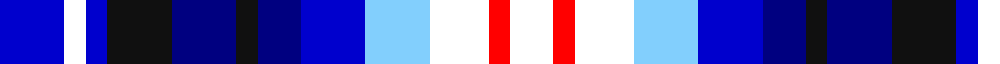

In pattern [BWBKBKBBWWRW](/patterns/bwbkbkbbwwrw/).

This was sourced from register-of-tartans.  It is a [12 stripes tartan](/stripes/stripes12/).

Original link https://www.tartanregister.gov.uk/tartanDetails.aspx?ref=10485

## Thread count
B/12 W4 B4 K12 DB12 K4 DB8 B12 LB12 W11 R4 W/8

## Palette
Each colour and its ΔE from the base-6 reference it is a variant of.

| Colour | Shade | Base | ΔE (OKLab) |
|---|---|---|---|
| B | <code style="background-color:#0000CD;">#0000CD</code> `#0000CD` | B <code style="background-color:#2A418A;">#2A418A</code> | 0.14 |
| DB | <code style="background-color:#000080;">#000080</code> `#000080` | B <code style="background-color:#2A418A;">#2A418A</code> | 0.14 |
| K | <code style="background-color:#101010;">#101010</code> `#101010` | K <code style="background-color:#000000;">#000000</code> | 0.17 |
| LB | <code style="background-color:#82CFFD;">#82CFFD</code> `#82CFFD` | W <code style="background-color:#F7F7F7;">#F7F7F7</code> | 0.18 |
| R | <code style="background-color:#FF0000;">#FF0000</code> `#FF0000` | R <code style="background-color:#CC0000;">#CC0000</code> | 0.11 |
| W | <code style="background-color:#FFFFFF;">#FFFFFF</code> `#FFFFFF` | W <code style="background-color:#F7F7F7;">#F7F7F7</code> | 0.02 |

## Nearest tartans

The nearest existing variants by ΔTartan distance.

1. [Anglicare (Corporate)](/setts/s12/b12w4b4k12ba12k4ba8b12bb12w11r4w8-b2c2c80-ba202060-bb2888c4-k101010-rc80000-wfcfcfc/) — ΔT 1.08
1. [Calgary (Fashion)](/setts/s13/b4ba2b8ba8g8y4g8ba8ya6ba6ya12ba4ya4-b3850c8-ba1c0070-g006818-yd09800-yab8b8b8/) — ΔT 2.05
1. [Calgary (Deerskin Trading Post)](/setts/s13/b4ba2b8ba8g8y4g8ba8ya6ba6ya12ba4ya4-b1c0070-ba3850c8-g006818-yd09800-yab8b8b8/) — ΔT 2.15
1. [Unidentified, Gordon variant](/setts/s13/b8ba4r16ba16bb18y4bb18ba16w8ra8w24ra4w8-b401000-ba304080-bb000050-r806050-ra906030-we0e0e0-yff8500/) — ΔT 2.19
1. [O'Sullivan](/setts/s11/b24k16b40w8ba40g16ba24g36r8g16y8-b1474b4-ba1c0070-g408060-k101010-rc80000-wfcfcfc-ye8c000/) — ΔT 2.28
1. [Unidentified Gordon variant](/setts/s13/g8b4ga16b16ba18r4ba18b16w8ra8w24ra4w8-b2c4084-ba080848-g2a2303-ga503c14-rfa4b00-rabe7832-we0e0e0/) — ΔT 2.30
1. [Stewarton](/setts/s8/g4r10w12b14ba14b14ga10k4-b8080d0-ba4000ff-g008000-ga607030-k000030-r906030-wc0a0e0/) — ΔT 2.41
1. [Lopatinsky](/setts/s8/b24r6w6r6b24k12ba36y6-b0000ff-ba2888c4-k101010-rdc0000-wffffff-yffff00/) — ΔT 2.42
1. [Hummelt, Katherine (Personal)](/setts/s8/b22g20ga12b14w4b6ba20w4-b0000cd-ba6c0070-g004c00-ga767e52-w00fcfc/) — ΔT 2.43
1. [Shanghai Scottish](/setts/s11/w4wa13b5wa8b27wa15ba16r3ba3r23y4-b0000cd-ba000080-rff0000-wffffff-wa82cffd-yffe600/) — ΔT 2.46

## Neighbour map

Every grey dot is one of 15726 variants placed by the first two principal components of the ΔTartan feature space (44% of its variance). Red is this tartan; blue dots are its nearest — click one to open its page.

<svg viewBox="0 0 640 380" role="img" style="max-width:100%;height:auto;border:1px solid #e0e0e0;border-radius:4px;display:block" xmlns="http://www.w3.org/2000/svg"><image href="/nn/cloud.v1.png" width="640" height="380"/><a href="/setts/s12/b12w4b4k12ba12k4ba8b12bb12w11r4w8-b2c2c80-ba202060-bb2888c4-k101010-rc80000-wfcfcfc/"><circle cx="14.0" cy="216.4" r="4" fill="#3465a4"><title>Anglicare (Corporate)</title></circle></a><a href="/setts/s13/b4ba2b8ba8g8y4g8ba8ya6ba6ya12ba4ya4-b3850c8-ba1c0070-g006818-yd09800-yab8b8b8/"><circle cx="43.6" cy="214.2" r="4" fill="#3465a4"><title>Calgary (Fashion)</title></circle></a><a href="/setts/s13/b4ba2b8ba8g8y4g8ba8ya6ba6ya12ba4ya4-b1c0070-ba3850c8-g006818-yd09800-yab8b8b8/"><circle cx="51.8" cy="216.9" r="4" fill="#3465a4"><title>Calgary (Deerskin Trading Post)</title></circle></a><a href="/setts/s13/b8ba4r16ba16bb18y4bb18ba16w8ra8w24ra4w8-b401000-ba304080-bb000050-r806050-ra906030-we0e0e0-yff8500/"><circle cx="14.0" cy="156.0" r="4" fill="#3465a4"><title>Unidentified, Gordon variant</title></circle></a><a href="/setts/s11/b24k16b40w8ba40g16ba24g36r8g16y8-b1474b4-ba1c0070-g408060-k101010-rc80000-wfcfcfc-ye8c000/"><circle cx="15.1" cy="187.3" r="4" fill="#3465a4"><title>O'Sullivan</title></circle></a><a href="/setts/s13/g8b4ga16b16ba18r4ba18b16w8ra8w24ra4w8-b2c4084-ba080848-g2a2303-ga503c14-rfa4b00-rabe7832-we0e0e0/"><circle cx="14.0" cy="156.0" r="4" fill="#3465a4"><title>Unidentified Gordon variant</title></circle></a><a href="/setts/s8/g4r10w12b14ba14b14ga10k4-b8080d0-ba4000ff-g008000-ga607030-k000030-r906030-wc0a0e0/"><circle cx="14.0" cy="232.3" r="4" fill="#3465a4"><title>Stewarton</title></circle></a><a href="/setts/s8/b24r6w6r6b24k12ba36y6-b0000ff-ba2888c4-k101010-rdc0000-wffffff-yffff00/"><circle cx="87.3" cy="180.2" r="4" fill="#3465a4"><title>Lopatinsky</title></circle></a><a href="/setts/s8/b22g20ga12b14w4b6ba20w4-b0000cd-ba6c0070-g004c00-ga767e52-w00fcfc/"><circle cx="104.4" cy="228.3" r="4" fill="#3465a4"><title>Hummelt, Katherine (Personal)</title></circle></a><a href="/setts/s11/w4wa13b5wa8b27wa15ba16r3ba3r23y4-b0000cd-ba000080-rff0000-wffffff-wa82cffd-yffe600/"><circle cx="44.0" cy="138.4" r="4" fill="#3465a4"><title>Shanghai Scottish</title></circle></a><circle cx="14.0" cy="214.0" r="5" fill="#c00000"/></svg>

ID: /setts/s12/b12w4b4k12ba12k4ba8b12wa12w11r4w8-b0000cd-ba000080-k101010-rff0000-wffffff-wa82cffd/
