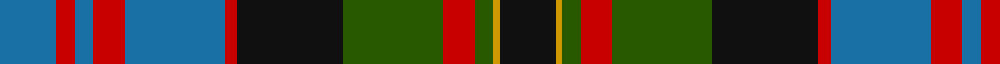

In pattern [BRBRBRKGRGYK](/patterns/brbrbrkgrgyk/).

This was sourced from tartans-authority.  It is a [12 stripes tartan](/stripes/stripes12/).

Original link http://www.tartansauthority.com/tartan-ferret/display/3716/

## Attestations

This cloth appears in 2 source records; the oldest owns this page.

- 1990 — Bowie, Black (Name) (tartans-authority, [record](http://www.tartansauthority.com/tartan-ferret/display/3716/))
- undated — Bowie, Black (register-of-tartans, [record](https://www.tartanregister.gov.uk/tartanDetails.aspx?ref=5268))

## Thread count
B/18 R6 B6 R10 B32 R4 K34 G32 R10 G6 DY2 K/18

## Palette
Each colour and its ΔE from the base-6 reference it is a variant of.

| Colour | Shade | Base | ΔE (OKLab) |
|---|---|---|---|
| B | <code style="background-color:#1870A4;">#1870A4</code> `#1870A4` | B <code style="background-color:#2A418A;">#2A418A</code> | 0.13 |
| DY | <code style="background-color:#D09800;">#D09800</code> `#D09800` | Y <code style="background-color:#F2BF00;">#F2BF00</code> | 0.12 |
| G | <code style="background-color:#285800;">#285800</code> `#285800` | G <code style="background-color:#006100;">#006100</code> | 0.03 |
| K | <code style="background-color:#101010;">#101010</code> `#101010` | K <code style="background-color:#000000;">#000000</code> | 0.17 |
| R | <code style="background-color:#C80000;">#C80000</code> `#C80000` | R <code style="background-color:#CC0000;">#CC0000</code> | 0.01 |

## Nearest tartans

The nearest existing variants by ΔTartan distance.

1. [Cameron of Erracht (Clan)](/setts/s11/g16r2g2r6g32k32r2b32r6b16y4-b2c2c80-g006818-k101010-rc80000-ye8c000/) — ΔT 0.63
1. [Wilson's No.232](/setts/s12/b36k14g10r8g14k2y4k2g14r8g10k14-b1860a8-g006818-k101010-rc80000-ye8c000/) — ΔT 0.66
1. [MacDonell of Glengarry #2](/setts/s11/b16r8b24r2k24g24r6g4r2g8w2-b2c4084-g005020-k101010-rdc0000-we0e0e0/) — ΔT 0.78
1. [MacMillan Htg (1906) (Clan)](/setts/s10/b12y4b48k16y8k16g32r8g32r4-b2c2c80-g285800-k101010-rc80000-ye8c000/) — ΔT 0.79
1. [MacKusick (Piper) #1 (Personal)](/setts/s13/b8k2b4k2b12r4k8r4k16w4g24r4g8-b2c2c80-g006818-k101010-rb468ac-wc0c0c0/) — ΔT 0.80
1. [New Zealand (2003)](/setts/s10/k6b18k4y10b2y10k4g30k2r6-b2c2c80-g285800-k101010-rc80000-ya08858/) — ΔT 0.80
1. [Logan #7](/setts/s11/r12b6r4b4r4b32k24g32r2k2y4-b2c2c80-g006818-k101010-rc80000-ye8c000/) — ΔT 0.87
1. [Bowie](/setts/s12/b18r6b6r10b32r4k34g32r10g6y2g18-b304080-g008000-k000000-rc00000-yf0c000/) — ΔT 0.88
1. [MacDonell of Glengarry #3](/setts/s11/b16r5b30r2k33g30r5g2r2g7w4-b202060-g006818-k101010-rc80000-we0e0e0/) — ΔT 0.88
1. [MacDonell of Glengarry Clan Tartan Tartan Number: 471. Earliest known date: 1906 The Setts No: 112. W & A K Johnston (1906). There is a sample certified by 'Glengarry' in the collection of the Highland Society of London from the period 1815-16 but it is not known whether the threadcount corresponds to MacKays record illustrated here. See products available Copyright © Blair Urquhart, Comrie, 2015](/setts/s13/b16r2b4r6b24r2k24g24r6g4r2g8w2-b2c2c80-g006818-k101010-rc80000-we0e0e0/) — ΔT 0.90

## Neighbour map

Every grey dot is one of 15726 variants placed by the first two principal components of the ΔTartan feature space (44% of its variance). Red is this tartan; blue dots are its nearest — click one to open its page.

<svg viewBox="0 0 640 380" role="img" style="max-width:100%;height:auto;border:1px solid #e0e0e0;border-radius:4px;display:block" xmlns="http://www.w3.org/2000/svg"><image href="/nn/cloud.v1.png" width="640" height="380"/><a href="/setts/s11/g16r2g2r6g32k32r2b32r6b16y4-b2c2c80-g006818-k101010-rc80000-ye8c000/"><circle cx="169.8" cy="152.6" r="4" fill="#3465a4"><title>Cameron of Erracht (Clan)</title></circle></a><a href="/setts/s12/b36k14g10r8g14k2y4k2g14r8g10k14-b1860a8-g006818-k101010-rc80000-ye8c000/"><circle cx="158.1" cy="153.4" r="4" fill="#3465a4"><title>Wilson's No.232</title></circle></a><a href="/setts/s11/b16r8b24r2k24g24r6g4r2g8w2-b2c4084-g005020-k101010-rdc0000-we0e0e0/"><circle cx="158.9" cy="170.7" r="4" fill="#3465a4"><title>MacDonell of Glengarry #2</title></circle></a><a href="/setts/s10/b12y4b48k16y8k16g32r8g32r4-b2c2c80-g285800-k101010-rc80000-ye8c000/"><circle cx="158.4" cy="175.9" r="4" fill="#3465a4"><title>MacMillan Htg (1906) (Clan)</title></circle></a><a href="/setts/s13/b8k2b4k2b12r4k8r4k16w4g24r4g8-b2c2c80-g006818-k101010-rb468ac-wc0c0c0/"><circle cx="129.3" cy="161.1" r="4" fill="#3465a4"><title>MacKusick (Piper) #1 (Personal)</title></circle></a><a href="/setts/s10/k6b18k4y10b2y10k4g30k2r6-b2c2c80-g285800-k101010-rc80000-ya08858/"><circle cx="157.3" cy="155.6" r="4" fill="#3465a4"><title>New Zealand (2003)</title></circle></a><a href="/setts/s11/r12b6r4b4r4b32k24g32r2k2y4-b2c2c80-g006818-k101010-rc80000-ye8c000/"><circle cx="166.0" cy="138.8" r="4" fill="#3465a4"><title>Logan #7</title></circle></a><a href="/setts/s12/b18r6b6r10b32r4k34g32r10g6y2g18-b304080-g008000-k000000-rc00000-yf0c000/"><circle cx="124.2" cy="144.8" r="4" fill="#3465a4"><title>Bowie</title></circle></a><a href="/setts/s11/b16r5b30r2k33g30r5g2r2g7w4-b202060-g006818-k101010-rc80000-we0e0e0/"><circle cx="176.5" cy="146.2" r="4" fill="#3465a4"><title>MacDonell of Glengarry #3</title></circle></a><a href="/setts/s13/b16r2b4r6b24r2k24g24r6g4r2g8w2-b2c2c80-g006818-k101010-rc80000-we0e0e0/"><circle cx="164.6" cy="152.8" r="4" fill="#3465a4"><title>MacDonell of Glengarry Clan Tartan Tartan Number: 471. Earliest known date: 1906 The Setts No: 112. W &amp; A K Johnston (1906). There is a sample certified by 'Glengarry' in the collection of the Highland Society of London from the period 1815-16 but it is not known whether the threadcount corresponds to MacKays record illustrated here. See products available Copyright © Blair Urquhart, Comrie, 2015</title></circle></a><circle cx="146.2" cy="153.3" r="5" fill="#c00000"/></svg>

ID: /setts/s12/b18r6b6r10b32r4k34g32r10g6y2k18-b1870a4-g285800-k101010-rc80000-yd09800/
