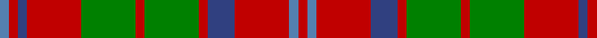

In pattern [BRBRGRGRBRBR](/patterns/brbrgrgrbrbr/).

This was sourced from weddslist.  It is a [12 stripes tartan](/stripes/stripes12/).

Original link http://www.weddslist.com/cgi-bin/tartans/pg.pl?source=sts

## Thread count
Ba/2 R2 B2 R12 G12 R2 G12 R2 B6 R12 Ba2 R/2

## Palette
Each colour and its ΔE from the base-6 reference it is a variant of.

| Colour | Shade | Base | ΔE (OKLab) |
|---|---|---|---|
| B | <code style="background-color:#304080;">#304080</code> `#304080` | B <code style="background-color:#2A418A;">#2A418A</code> | 0.02 |
| Ba | <code style="background-color:#5480B0;">#5480B0</code> `#5480B0` | B <code style="background-color:#2A418A;">#2A418A</code> | 0.19 |
| G | <code style="background-color:#008000;">#008000</code> `#008000` | G <code style="background-color:#006100;">#006100</code> | 0.10 |
| R | <code style="background-color:#C00000;">#C00000</code> `#C00000` | R <code style="background-color:#CC0000;">#CC0000</code> | 0.03 |

## Nearest tartans

The nearest existing variants by ΔTartan distance.

1. [Matheson](/setts/s13/r2g2r12b10ba3g10r2g2r2g10r12g2r2~b304080-ba5480b0-g008000-rc00000~x2/) — ΔT 0.28
1. [MacRae](/setts/s12/g21r5g21r21g5r4g5r21w4r5b21r4~b304080-g008000-rc00000-we0e0e0/) — ΔT 0.63
1. [MacQuarrie](/setts/s12/b1r1ba1r6g6r1g6r1ba3r6b1r1~b3c82af-ba2c4084-g005020-rdc0000~x2/) — ΔT 0.71
1. [Matheson (Logan 1831)](/setts/s13/r2g2r12b10ba3g10r2g2r2g10r12g2r2~b2c4084-ba3c82af-g005020-rdc0000~x2/) — ΔT 0.73
1. [MacKinnon 7](/setts/s11/w2r4g8r16b2r3g16r4b2r4w2~b5480b0-g008000-rc00000-we0e0e0~x2/) — ΔT 0.91
1. [MacRae (Sample)](/setts/s12/g21r5g21r21g5r4g5r21w4r5b21r4~b2c4084-g005020-rdc0000-we0e0e0/) — ΔT 0.93
1. [Sydney (Nova Scotia) #2](/setts/s14/r16k4w2k4r6ra11r2ra16r2ra11r6k4w2k4~k101010-r888888-rab84c00-we0e0e0~x2/) — ΔT 1.03
1. [MacKinnon 10](/setts/s14/b3r4g3ba3r7g17r3ba5g4r21g7b3r6w3~b800080-ba304080-g008000-rc00000-we0e0e0~x2/) — ΔT 1.05
1. [Grant of Ballindalloch (Personal)](/setts/s15/r5b3r3g16r3g3r3b5r3ga5r12b5r3b3r5~b2c2c80-g006818-ga789484-rc80000~x4/) — ΔT 1.06
1. [Invertere (Daks #1)](/setts/s14/g6y2b2y11g2y2r3y2g2y11b2y2g6r3~b202060-g003820-ra00048-ya08858~x2/) — ΔT 1.09

## Neighbour map

Every grey dot is one of 15726 variants placed by the first two principal components of the ΔTartan feature space (44% of its variance). Red is this tartan; blue dots are its nearest — click one to open its page.

<svg viewBox="0 0 640 380" role="img" style="max-width:100%;height:auto;border:1px solid #e0e0e0;border-radius:4px;display:block" xmlns="http://www.w3.org/2000/svg"><image href="/nn/cloud.v1.png" width="640" height="380"/><a href="/setts/s13/r2g2r12b10ba3g10r2g2r2g10r12g2r2~b304080-ba5480b0-g008000-rc00000~x2/"><circle cx="225.3" cy="199.0" r="4" fill="#3465a4"><title>Matheson</title></circle></a><a href="/setts/s12/g21r5g21r21g5r4g5r21w4r5b21r4~b304080-g008000-rc00000-we0e0e0/"><circle cx="202.6" cy="210.0" r="4" fill="#3465a4"><title>MacRae</title></circle></a><a href="/setts/s12/b1r1ba1r6g6r1g6r1ba3r6b1r1~b3c82af-ba2c4084-g005020-rdc0000~x2/"><circle cx="235.7" cy="195.9" r="4" fill="#3465a4"><title>MacQuarrie</title></circle></a><a href="/setts/s13/r2g2r12b10ba3g10r2g2r2g10r12g2r2~b2c4084-ba3c82af-g005020-rdc0000~x2/"><circle cx="223.2" cy="195.9" r="4" fill="#3465a4"><title>Matheson (Logan 1831)</title></circle></a><a href="/setts/s11/w2r4g8r16b2r3g16r4b2r4w2~b5480b0-g008000-rc00000-we0e0e0~x2/"><circle cx="264.5" cy="180.7" r="4" fill="#3465a4"><title>MacKinnon 7</title></circle></a><a href="/setts/s12/g21r5g21r21g5r4g5r21w4r5b21r4~b2c4084-g005020-rdc0000-we0e0e0/"><circle cx="201.6" cy="207.4" r="4" fill="#3465a4"><title>MacRae (Sample)</title></circle></a><a href="/setts/s14/r16k4w2k4r6ra11r2ra16r2ra11r6k4w2k4~k101010-r888888-rab84c00-we0e0e0~x2/"><circle cx="202.6" cy="179.9" r="4" fill="#3465a4"><title>Sydney (Nova Scotia) #2</title></circle></a><a href="/setts/s14/b3r4g3ba3r7g17r3ba5g4r21g7b3r6w3~b800080-ba304080-g008000-rc00000-we0e0e0~x2/"><circle cx="209.4" cy="162.1" r="4" fill="#3465a4"><title>MacKinnon 10</title></circle></a><a href="/setts/s15/r5b3r3g16r3g3r3b5r3ga5r12b5r3b3r5~b2c2c80-g006818-ga789484-rc80000~x4/"><circle cx="215.4" cy="199.7" r="4" fill="#3465a4"><title>Grant of Ballindalloch (Personal)</title></circle></a><a href="/setts/s14/g6y2b2y11g2y2r3y2g2y11b2y2g6r3~b202060-g003820-ra00048-ya08858~x2/"><circle cx="249.1" cy="200.9" r="4" fill="#3465a4"><title>Invertere (Daks #1)</title></circle></a><circle cx="239.1" cy="199.6" r="5" fill="#c00000"/></svg>

ID: /setts/s12/b1r1ba1r6g6r1g6r1ba3r6b1r1~b5480b0-ba304080-g008000-rc00000~x2/
