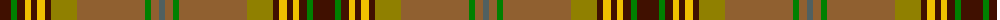

In pattern [BGBYBYBGRGRB](/patterns/bgbybybgrgrb/).

This was sourced from weddslist.  It is a [12 stripes tartan](/stripes/stripes12/).

Original link http://www.weddslist.com/cgi-bin/tartans/pg.pl?source=sts

## Thread count
DR/22 G6 DR8 Y6 DR6 Y8 DR6 LG26 LT68 G6 LT8 N/6

## Palette
Each colour and its ΔE from the base-6 reference it is a variant of.

| Colour | Shade | Base | ΔE (OKLab) |
|---|---|---|---|
| DR | <code style="background-color:#401000;">#401000</code> `#401000` | B <code style="background-color:#2C4084;">#2C4084</code> | 0.23 |
| G | <code style="background-color:#008000;">#008000</code> `#008000` | G <code style="background-color:#006400;">#006400</code> | 0.09 |
| LG | <code style="background-color:#908000;">#908000</code> `#908000` | G <code style="background-color:#006400;">#006400</code> | 0.19 |
| LT | <code style="background-color:#906030;">#906030</code> `#906030` | R <code style="background-color:#C80000;">#C80000</code> | 0.15 |
| N | <code style="background-color:#506060;">#506060</code> `#506060` | B <code style="background-color:#2C4084;">#2C4084</code> | 0.14 |
| Y | <code style="background-color:#F0C000;">#F0C000</code> `#F0C000` | Y <code style="background-color:#E8C000;">#E8C000</code> | 0.01 |

ID: /setts/s12/b22g6b8y6b6y8b6ga26r68g6r8ba6-b401000-ba506060-g008000-ga908000-r906030-yf0c000/
