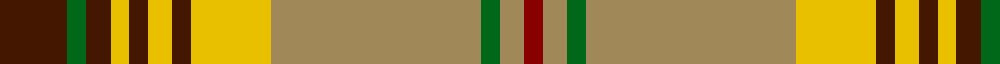

In pattern [BGBYBYBYYGYR](/patterns/bgbybybyygyr/).

This was sourced from house-of-tartan.  It is a [12 stripes tartan](/stripes/stripes12/).

Original link http://www.house-of-tartan.scotland.net/house/TartanViewjs.asp?colr=Def&tnam=1658

## Thread count
DR/22 G6 DR8 Ya6 DR6 Ya8 DR6 Y26 LT68 G6 LT8 DRa/6

## Palette
Each colour and its ΔE from the base-6 reference it is a variant of.

| Colour | Shade | Base | ΔE (OKLab) |
|---|---|---|---|
| DR | <code style="background-color:#441800;">#441800</code> `#441800` | B <code style="background-color:#2A418A;">#2A418A</code> | 0.23 |
| DRa | <code style="background-color:#880000;">#880000</code> `#880000` | R <code style="background-color:#CC0000;">#CC0000</code> | 0.15 |
| G | <code style="background-color:#006818;">#006818</code> `#006818` | G <code style="background-color:#006100;">#006100</code> | 0.02 |
| LT | <code style="background-color:#A08858;">#A08858</code> `#A08858` | Y <code style="background-color:#F2BF00;">#F2BF00</code> | 0.21 |
| Y | <code style="background-color:#E8C000;">#E8C000</code> `#E8C000` | Y <code style="background-color:#F2BF00;">#F2BF00</code> | 0.02 |
| Ya | <code style="background-color:#E8C000;">#E8C000</code> `#E8C000` | Y <code style="background-color:#F2BF00;">#F2BF00</code> | 0.02 |

## Nearest tartans

The nearest existing variants by ΔTartan distance.

1. [Harmony 1](/setts/s12/g22ga6g8y6g6y8g6ya26r68ga6r8b6-b500000-g2a2303-ga005020-rbe7832-ye8c000-yac89600/) — ΔT 0.43
1. [North West Territories](/setts/s10/y8g4y4g4y4g48k4r32w18b6-b2c2c80-g006818-k101010-rc80000-we0e0e0-yd09800/) — ΔT 0.75
1. [North West Territories Canadian District Tartan Tartan Number: 662. Earliest known date: 1969 Designed at the request of an official of the Canadian Commission who decreed that the predominant colours should be "Green and White - White for the snow covering the Territories for six months of every year and the Green for the other six months." See products available Copyright © Blair Urquhart, Comrie, 2015](/setts/s10/y8g4y4g4y4g48k4r32w18b6-b2c2c80-g006818-k101010-rc80000-we0e0e0-ye8c000/) — ΔT 0.85
1. [Wilson's, No 128](/setts/s11/b8r6y4r18b6g48b6r18k6r6w4-b5480b0-g008000-k000000-rc00000-we0e0e0-yf0c000/) — ΔT 0.91
1. [North West Territories](/setts/s10/y8g4y4g4y4g48k4r32w18b6-b304080-g008000-k000000-rc00000-we0e0e0-yf0c000/) — ΔT 0.94
1. [Dunblane](/setts/s12/g12y10w2g4w2g10w2g4w2r30b4w2-b304080-g008000-rc00000-we0e0e0-yf0c000/) — ΔT 1.19
1. [Harmony 1](/setts/s12/b22g6b8y6b6y8b6ga26r68g6r8ba6-b401000-ba506060-g008000-ga908000-r906030-yf0c000/) — ΔT 1.23
1. [Aguilar Gorrondona Family (Personal)](/setts/s11/r60y60b10w10g10k10g6b6k6w6y6-b788cb4-g289c18-k101010-r960000-wffffff-ye0a126/) — ΔT 1.25
1. [Dunblane District Tartan Tartan Number: 1022. Earliest known date: 1729 Peregrine, 2nd Viscount Dunblane in a portrait hanging in Hornby Castle, Yorkshire. See products available Copyright © Blair Urquhart, Comrie, 2015](/setts/s12/g12y10w2g4w2g10w2g4w2r30b4w2-b2c2c80-g006818-rc80000-we0e0e0-ye8c000/) — ΔT 1.26
1. [Baxter of Balgavies](/setts/s11/w4r32k2b4k2y8k2b4k2g32b2-b5480b0-g008000-k000000-rc00000-we0e0e0-yf0c000/) — ΔT 1.27

## Neighbour map

Every grey dot is one of 15726 variants placed by the first two principal components of the ΔTartan feature space (44% of its variance). Red is this tartan; blue dots are its nearest — click one to open its page.

<svg viewBox="0 0 640 380" role="img" style="max-width:100%;height:auto;border:1px solid #e0e0e0;border-radius:4px;display:block" xmlns="http://www.w3.org/2000/svg"><image href="/nn/cloud.v1.png" width="640" height="380"/><a href="/setts/s12/g22ga6g8y6g6y8g6ya26r68ga6r8b6-b500000-g2a2303-ga005020-rbe7832-ye8c000-yac89600/"><circle cx="189.6" cy="109.3" r="4" fill="#3465a4"><title>Harmony 1</title></circle></a><a href="/setts/s10/y8g4y4g4y4g48k4r32w18b6-b2c2c80-g006818-k101010-rc80000-we0e0e0-yd09800/"><circle cx="168.4" cy="115.8" r="4" fill="#3465a4"><title>North West Territories</title></circle></a><a href="/setts/s10/y8g4y4g4y4g48k4r32w18b6-b2c2c80-g006818-k101010-rc80000-we0e0e0-ye8c000/"><circle cx="161.7" cy="112.9" r="4" fill="#3465a4"><title>North West Territories Canadian District Tartan Tartan Number: 662. Earliest known date: 1969 Designed at the request of an official of the Canadian Commission who decreed that the predominant colours should be &quot;Green and White - White for the snow covering the Territories for six months of every year and the Green for the other six months.&quot; See products available Copyright © Blair Urquhart, Comrie, 2015</title></circle></a><a href="/setts/s11/b8r6y4r18b6g48b6r18k6r6w4-b5480b0-g008000-k000000-rc00000-we0e0e0-yf0c000/"><circle cx="162.7" cy="118.2" r="4" fill="#3465a4"><title>Wilson's, No 128</title></circle></a><a href="/setts/s10/y8g4y4g4y4g48k4r32w18b6-b304080-g008000-k000000-rc00000-we0e0e0-yf0c000/"><circle cx="158.3" cy="111.9" r="4" fill="#3465a4"><title>North West Territories</title></circle></a><a href="/setts/s12/g12y10w2g4w2g10w2g4w2r30b4w2-b304080-g008000-rc00000-we0e0e0-yf0c000/"><circle cx="176.6" cy="111.3" r="4" fill="#3465a4"><title>Dunblane</title></circle></a><a href="/setts/s12/b22g6b8y6b6y8b6ga26r68g6r8ba6-b401000-ba506060-g008000-ga908000-r906030-yf0c000/"><circle cx="214.4" cy="123.6" r="4" fill="#3465a4"><title>Harmony 1</title></circle></a><a href="/setts/s11/r60y60b10w10g10k10g6b6k6w6y6-b788cb4-g289c18-k101010-r960000-wffffff-ye0a126/"><circle cx="127.1" cy="101.4" r="4" fill="#3465a4"><title>Aguilar Gorrondona Family (Personal)</title></circle></a><a href="/setts/s12/g12y10w2g4w2g10w2g4w2r30b4w2-b2c2c80-g006818-rc80000-we0e0e0-ye8c000/"><circle cx="175.5" cy="110.4" r="4" fill="#3465a4"><title>Dunblane District Tartan Tartan Number: 1022. Earliest known date: 1729 Peregrine, 2nd Viscount Dunblane in a portrait hanging in Hornby Castle, Yorkshire. See products available Copyright © Blair Urquhart, Comrie, 2015</title></circle></a><a href="/setts/s11/w4r32k2b4k2y8k2b4k2g32b2-b5480b0-g008000-k000000-rc00000-we0e0e0-yf0c000/"><circle cx="149.3" cy="84.8" r="4" fill="#3465a4"><title>Baxter of Balgavies</title></circle></a><circle cx="181.8" cy="106.5" r="5" fill="#c00000"/></svg>

ID: /setts/s12/b22g6b8y6b6y8b6y26ya68g6ya8r6-b441800-g006818-r880000-ye8c000-yaa08858/
