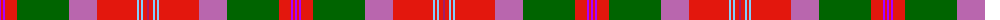

In pattern [BRBRGRRWRWRR](/patterns/brbrgrrwrwrr/).

This was sourced from register-of-tartans.  It is a [12 stripes tartan](/stripes/stripes12/).

Original link https://www.tartanregister.gov.uk/tartanDetails.aspx?ref=10247

## Thread count
P/2 R2 P2 R12 G52 Pa28 R40 LB2 R2 LB2 R4 Ra/2

## Palette
Each colour and its ΔE from the base-6 reference it is a variant of.

| Colour | Shade | Base | ΔE (OKLab) |
|---|---|---|---|
| G | <code style="background-color:#006400;">#006400</code> `#006400` | G <code style="background-color:#006400;">#006400</code> | 0.00 |
| LB | <code style="background-color:#82CFFD;">#82CFFD</code> `#82CFFD` | W <code style="background-color:#F4F4F0;">#F4F4F0</code> | 0.18 |
| P | <code style="background-color:#AA00FF;">#AA00FF</code> `#AA00FF` | B <code style="background-color:#2C4084;">#2C4084</code> | 0.29 |
| Pa | <code style="background-color:#B966AE;">#B966AE</code> `#B966AE` | R <code style="background-color:#C80000;">#C80000</code> | 0.21 |
| R | <code style="background-color:#E3170D;">#E3170D</code> `#E3170D` | R <code style="background-color:#C80000;">#C80000</code> | 0.06 |
| Ra | <code style="background-color:#A01D69;">#A01D69</code> `#A01D69` | R <code style="background-color:#C80000;">#C80000</code> | 0.14 |

ID: /setts/s12/b2r2b2r12g52ra28r40w2r2w2r4rb2-baa00ff-g006400-re3170d-rab966ae-rba01d69-w82cffd/
