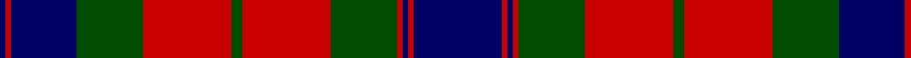

In pattern [BRBGRGRGRBRB](/patterns/brbgrgrgrbrb/).

This was sourced from weddslist.  It is a [12 stripes tartan](/stripes/stripes12/).

Original link http://www.weddslist.com/cgi-bin/tartans/pg.pl?source=rb

## Thread count
DB/2 R2 DB24 G24 R32 G4 R32 G24 R2 DB2 R2 DB/32

## Palette
Each colour and its ΔE from the base-6 reference it is a variant of.

| Colour | Shade | Base | ΔE (OKLab) |
|---|---|---|---|
| DB | <code style="background-color:#000064;">#000064</code> `#000064` | B <code style="background-color:#2C4084;">#2C4084</code> | 0.17 |
| G | <code style="background-color:#004C00;">#004C00</code> `#004C00` | G <code style="background-color:#006400;">#006400</code> | 0.08 |
| R | <code style="background-color:#C80000;">#C80000</code> `#C80000` | R <code style="background-color:#C80000;">#C80000</code> | 0.00 |

## Nearest tartans

The nearest existing variants by ΔTartan distance.

1. [Fraser](/setts/s12/b32r2b2r2g24r32g4r32g24b24r2b2-b000052-g11450d-raa0000/) — ΔT 0.64
1. [Wcwm 9285 4906-1](/setts/s11/k24y8k8y8k8y20k8y6k16r48y4-k101010-r880000-yb8b8b8/) — ΔT 0.95
1. [MacInroy](/setts/s12/b20g2b4g6b32g2k32r32g6r4g2r20-b304080-g008000-k000000-rc00000/) — ΔT 1.10
1. [Fraser of Lovat Clan Tartan Tartan Number: 391. Earliest known date: 1893 'Old and Rare Scottish Tartans' (1893), contains a selection of forty five setts, woven in silk, of special interest and antiquity. The author was D.W. Stewart. Lord Lovat, 84 year old war veteran and chief of the Frasers of Lovat, died in March 1995. His grandson, Simon Fraser, became the 25th chief of the clan. See products available Copyright © Blair Urquhart, Comrie, 2015](/setts/s12/b32r2b2r2g24r32w4r32g24b24r2b2-b2c2c80-g006818-rc80000-we0e0e0/) — ΔT 1.15
1. [Fraser of Stratherrick](/setts/s12/b40r4b4r4g38r36g4r36g38b38r4b4-b2c2c80-g006818-rc80000/) — ΔT 1.17
1. [Douglas (WCWM)](/setts/s10/k4r48b48k4b4k4b6k28r4k4-b646464-k000000-r8c0000/) — ΔT 1.18
1. [Unidentified (1996)](/setts/s12/g4b2r32b24g32w2g32b24r32b2g4b2-b202060-g006818-rc80000-wfcfcfc/) — ΔT 1.21
1. [Frankfurt & Disttrict P & D (Corpora](/setts/s15/b43k4b4k4b4k26r32k4w10k4r32k26b32k4r10-b003c64-k101010-rc80000-we0e0e0/) — ΔT 1.22
1. [Bonner (Bonnar) Family Tartan Tartan Number: 285. Earliest known date: 1930 MacKinlay (Fractional scale). Meaning 'gentle' (from the french) or `Bona res...' A good thing, this reputedly spoken by the King of France after a very un-gentle act of war on the part of Guilhen de Bonares as he was called thereafter. (Guilhen de Bonares is recorded in Perthshire c.1200) Coulson Bonnar was a tatan collecter c1930-1950. See products available Copyright © Blair Urquhart, Comrie, 2015](/setts/s13/r26k2r6g20r10k4r6k24b4k4b4k4b24-b2c2c80-g006818-k101010-rc80000/) — ΔT 1.22
1. [Fraser, Stewart of Athol](/setts/s12/b32r2b2r2g24r32g4r32g24b24r2b2-b304080-g008000-rc00000/) — ΔT 1.22

## Neighbour map

Every grey dot is one of 15726 variants placed by the first two principal components of the ΔTartan feature space (44% of its variance). Red is this tartan; blue dots are its nearest — click one to open its page.

<svg viewBox="0 0 640 380" role="img" style="max-width:100%;height:auto;border:1px solid #e0e0e0;border-radius:4px;display:block" xmlns="http://www.w3.org/2000/svg"><image href="/nn/cloud.v1.png" width="640" height="380"/><a href="/setts/s12/b32r2b2r2g24r32g4r32g24b24r2b2-b000052-g11450d-raa0000/"><circle cx="254.5" cy="181.6" r="4" fill="#3465a4"><title>Fraser</title></circle></a><a href="/setts/s11/k24y8k8y8k8y20k8y6k16r48y4-k101010-r880000-yb8b8b8/"><circle cx="214.9" cy="175.9" r="4" fill="#3465a4"><title>Wcwm 9285 4906-1</title></circle></a><a href="/setts/s12/b20g2b4g6b32g2k32r32g6r4g2r20-b304080-g008000-k000000-rc00000/"><circle cx="182.6" cy="146.6" r="4" fill="#3465a4"><title>MacInroy</title></circle></a><a href="/setts/s12/b32r2b2r2g24r32w4r32g24b24r2b2-b2c2c80-g006818-rc80000-we0e0e0/"><circle cx="225.5" cy="155.9" r="4" fill="#3465a4"><title>Fraser of Lovat Clan Tartan Tartan Number: 391. Earliest known date: 1893 'Old and Rare Scottish Tartans' (1893), contains a selection of forty five setts, woven in silk, of special interest and antiquity. The author was D.W. Stewart. Lord Lovat, 84 year old war veteran and chief of the Frasers of Lovat, died in March 1995. His grandson, Simon Fraser, became the 25th chief of the clan. See products available Copyright © Blair Urquhart, Comrie, 2015</title></circle></a><a href="/setts/s12/b40r4b4r4g38r36g4r36g38b38r4b4-b2c2c80-g006818-rc80000/"><circle cx="216.8" cy="198.9" r="4" fill="#3465a4"><title>Fraser of Stratherrick</title></circle></a><a href="/setts/s10/k4r48b48k4b4k4b6k28r4k4-b646464-k000000-r8c0000/"><circle cx="246.1" cy="169.3" r="4" fill="#3465a4"><title>Douglas (WCWM)</title></circle></a><a href="/setts/s12/g4b2r32b24g32w2g32b24r32b2g4b2-b202060-g006818-rc80000-wfcfcfc/"><circle cx="221.0" cy="160.8" r="4" fill="#3465a4"><title>Unidentified (1996)</title></circle></a><a href="/setts/s15/b43k4b4k4b4k26r32k4w10k4r32k26b32k4r10-b003c64-k101010-rc80000-we0e0e0/"><circle cx="177.6" cy="161.4" r="4" fill="#3465a4"><title>Frankfurt &amp; Disttrict P &amp; D (Corpora</title></circle></a><a href="/setts/s13/r26k2r6g20r10k4r6k24b4k4b4k4b24-b2c2c80-g006818-k101010-rc80000/"><circle cx="180.4" cy="162.7" r="4" fill="#3465a4"><title>Bonner (Bonnar) Family Tartan Tartan Number: 285. Earliest known date: 1930 MacKinlay (Fractional scale). Meaning 'gentle' (from the french) or `Bona res...' A good thing, this reputedly spoken by the King of France after a very un-gentle act of war on the part of Guilhen de Bonares as he was called thereafter. (Guilhen de Bonares is recorded in Perthshire c.1200) Coulson Bonnar was a tatan collecter c1930-1950. See products available Copyright © Blair Urquhart, Comrie, 2015</title></circle></a><a href="/setts/s12/b32r2b2r2g24r32g4r32g24b24r2b2-b304080-g008000-rc00000/"><circle cx="255.9" cy="176.8" r="4" fill="#3465a4"><title>Fraser, Stewart of Athol</title></circle></a><circle cx="237.6" cy="172.1" r="5" fill="#c00000"/></svg>

ID: /setts/s12/b32r2b2r2g24r32g4r32g24b24r2b2-b000064-g004c00-rc80000/
