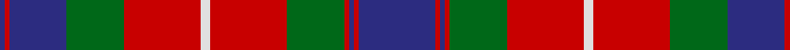

In pattern [BRBGRWRGRBRB](/patterns/brbgrwrgrbrb/).

This was sourced from house-of-tartan.  It is a [12 stripes tartan](/stripes/stripes12/).

Original link http://www.house-of-tartan.scotland.net/house/TartanViewjs.asp?colr=Def&tnam=391

## Thread count
DB/2 R2 DB24 G24 R32 LN4 R32 G24 R2 DB2 R2 DB/32

## Palette
Each colour and its ΔE from the base-6 reference it is a variant of.

| Colour | Shade | Base | ΔE (OKLab) |
|---|---|---|---|
| DB | <code style="background-color:#2C2C80;">#2C2C80</code> `#2C2C80` | B <code style="background-color:#2A418A;">#2A418A</code> | 0.06 |
| G | <code style="background-color:#006818;">#006818</code> `#006818` | G <code style="background-color:#006100;">#006100</code> | 0.02 |
| LN | <code style="background-color:#E0E0E0;">#E0E0E0</code> `#E0E0E0` | W <code style="background-color:#F7F7F7;">#F7F7F7</code> | 0.07 |
| R | <code style="background-color:#C80000;">#C80000</code> `#C80000` | R <code style="background-color:#CC0000;">#CC0000</code> | 0.01 |

## Nearest tartans

The nearest existing variants by ΔTartan distance.

1. [Fraser of Lovat](/setts/s12/b32r2b2r2g24r32w4r32g24b24r2b2-b304080-g008000-rc00000-we0e0e0/) — ΔT 0.51
1. [Unidentified (1996)](/setts/s12/g4b2r32b24g32w2g32b24r32b2g4b2-b202060-g006818-rc80000-wfcfcfc/) — ΔT 0.67
1. [MacEdward Tartan Tartan Number: 1335. Earliest known date: pre 2003 This sample comes from the MacGregor-Hastie collection which forms the basis of the cloth archive of the Scottish Tartans Society. Some of the samples, including this one, were unmarked. One can assume that the sample dates between 1930 and 1950. See products available Copyright © Blair Urquhart, Comrie, 2015](/setts/s10/r12y4r38g25b8g10b8g8b25r3-b2c2c80-g006818-rc80000-ye8c000/) — ΔT 0.70
1. [MacEdward (Personal)](/setts/s10/r12y4r38g25b8g10b8g8b25r3-b2c2c80-g285800-rc80000-ye8c000/) — ΔT 0.71
1. [MacIntyre (of Gatehouse)](/setts/s15/b6r48ba8r16g64r8ba8r16g8r8ba64r16g8r8b4-b2888c4-ba2c2c80-g006818-rc80000/) — ΔT 0.79
1. [MacInroy (Wedding) (Personal)](/setts/s12/b20g2b4g6b32g2k32r32g6r4g2r20-b2c2c80-g408060-k101010-rc80000/) — ΔT 0.91
1. [North Berwick Pipe Band Dancers](/setts/s11/b40r8b40r40g8r8g8r8g40r4w8-b003c64-g003820-rc80000-wffffff/) — ΔT 0.95
1. [North Berwick (Dance)](/setts/s11/b40r8b40r40g8r8g8r8g40r4w8-b003c64-g003820-rc80000-wfcfcfc/) — ΔT 0.95
1. [Bonner (Bonnar) Family Tartan Tartan Number: 285. Earliest known date: 1930 MacKinlay (Fractional scale). Meaning 'gentle' (from the french) or `Bona res...' A good thing, this reputedly spoken by the King of France after a very un-gentle act of war on the part of Guilhen de Bonares as he was called thereafter. (Guilhen de Bonares is recorded in Perthshire c.1200) Coulson Bonnar was a tatan collecter c1930-1950. See products available Copyright © Blair Urquhart, Comrie, 2015](/setts/s13/r26k2r6g20r10k4r6k24b4k4b4k4b24-b2c2c80-g006818-k101010-rc80000/) — ΔT 0.98
1. [MacEdward](/setts/s10/r12y4r38g25b8g10b8g8b25r3-b304080-g008000-rc00000-yf0c000/) — ΔT 1.01

## Neighbour map

Every grey dot is one of 15726 variants placed by the first two principal components of the ΔTartan feature space (44% of its variance). Red is this tartan; blue dots are its nearest — click one to open its page.

<svg viewBox="0 0 640 380" role="img" style="max-width:100%;height:auto;border:1px solid #e0e0e0;border-radius:4px;display:block" xmlns="http://www.w3.org/2000/svg"><image href="/nn/cloud.v1.png" width="640" height="380"/><a href="/setts/s12/b32r2b2r2g24r32w4r32g24b24r2b2-b304080-g008000-rc00000-we0e0e0/"><circle cx="227.8" cy="157.6" r="4" fill="#3465a4"><title>Fraser of Lovat</title></circle></a><a href="/setts/s12/g4b2r32b24g32w2g32b24r32b2g4b2-b202060-g006818-rc80000-wfcfcfc/"><circle cx="221.0" cy="160.8" r="4" fill="#3465a4"><title>Unidentified (1996)</title></circle></a><a href="/setts/s10/r12y4r38g25b8g10b8g8b25r3-b2c2c80-g006818-rc80000-ye8c000/"><circle cx="207.7" cy="181.0" r="4" fill="#3465a4"><title>MacEdward Tartan Tartan Number: 1335. Earliest known date: pre 2003 This sample comes from the MacGregor-Hastie collection which forms the basis of the cloth archive of the Scottish Tartans Society. Some of the samples, including this one, were unmarked. One can assume that the sample dates between 1930 and 1950. See products available Copyright © Blair Urquhart, Comrie, 2015</title></circle></a><a href="/setts/s10/r12y4r38g25b8g10b8g8b25r3-b2c2c80-g285800-rc80000-ye8c000/"><circle cx="213.3" cy="182.5" r="4" fill="#3465a4"><title>MacEdward (Personal)</title></circle></a><a href="/setts/s15/b6r48ba8r16g64r8ba8r16g8r8ba64r16g8r8b4-b2888c4-ba2c2c80-g006818-rc80000/"><circle cx="248.6" cy="135.2" r="4" fill="#3465a4"><title>MacIntyre (of Gatehouse)</title></circle></a><a href="/setts/s12/b20g2b4g6b32g2k32r32g6r4g2r20-b2c2c80-g408060-k101010-rc80000/"><circle cx="204.3" cy="153.3" r="4" fill="#3465a4"><title>MacInroy (Wedding) (Personal)</title></circle></a><a href="/setts/s11/b40r8b40r40g8r8g8r8g40r4w8-b003c64-g003820-rc80000-wffffff/"><circle cx="197.0" cy="184.4" r="4" fill="#3465a4"><title>North Berwick Pipe Band Dancers</title></circle></a><a href="/setts/s11/b40r8b40r40g8r8g8r8g40r4w8-b003c64-g003820-rc80000-wfcfcfc/"><circle cx="197.5" cy="184.7" r="4" fill="#3465a4"><title>North Berwick (Dance)</title></circle></a><a href="/setts/s13/r26k2r6g20r10k4r6k24b4k4b4k4b24-b2c2c80-g006818-k101010-rc80000/"><circle cx="180.4" cy="162.7" r="4" fill="#3465a4"><title>Bonner (Bonnar) Family Tartan Tartan Number: 285. Earliest known date: 1930 MacKinlay (Fractional scale). Meaning 'gentle' (from the french) or `Bona res...' A good thing, this reputedly spoken by the King of France after a very un-gentle act of war on the part of Guilhen de Bonares as he was called thereafter. (Guilhen de Bonares is recorded in Perthshire c.1200) Coulson Bonnar was a tatan collecter c1930-1950. See products available Copyright © Blair Urquhart, Comrie, 2015</title></circle></a><a href="/setts/s10/r12y4r38g25b8g10b8g8b25r3-b304080-g008000-rc00000-yf0c000/"><circle cx="209.1" cy="182.2" r="4" fill="#3465a4"><title>MacEdward</title></circle></a><circle cx="225.5" cy="155.9" r="5" fill="#c00000"/></svg>

ID: /setts/s12/b32r2b2r2g24r32w4r32g24b24r2b2-b2c2c80-g006818-rc80000-we0e0e0/
