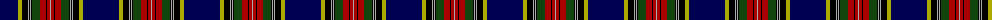

In pattern [BYKYKYKGRKRY](/patterns/bykykykgrkry/).

This was sourced from weddslist.  It is a [12 stripes tartan](/stripes/stripes12/).

Original link http://www.weddslist.com/cgi-bin/tartans/pg.pl?source=x

## Thread count
DB/36 LG4 K6 N1 K1 N1 K1 DG8 DR6 K1 DR3 N/1

## Palette
Each colour and its ΔE from the base-6 reference it is a variant of.

| Colour | Shade | Base | ΔE (OKLab) |
|---|---|---|---|
| DB | <code style="background-color:#000052;">#000052</code> `#000052` | B <code style="background-color:#2C4084;">#2C4084</code> | 0.20 |
| DG | <code style="background-color:#11450D;">#11450D</code> `#11450D` | G <code style="background-color:#006400;">#006400</code> | 0.10 |
| DR | <code style="background-color:#AA0000;">#AA0000</code> `#AA0000` | R <code style="background-color:#C80000;">#C80000</code> | 0.06 |
| K | <code style="background-color:#000000;">#000000</code> `#000000` | K <code style="background-color:#000000;">#000000</code> | 0.00 |
| LG | <code style="background-color:#AAAA00;">#AAAA00</code> `#AAAA00` | Y <code style="background-color:#E8C000;">#E8C000</code> | 0.11 |
| N | <code style="background-color:#AAAAAA;">#AAAAAA</code> `#AAAAAA` | Y <code style="background-color:#E8C000;">#E8C000</code> | 0.19 |

## Nearest tartans

The nearest existing variants by ΔTartan distance.

1. [MacBeth](/setts/s12/b72y8k12ya2k2ya2k2g16r12k2r6ya2-b000052-g11450d-k000000-raa0000-yaaaa00-yaaaaaaa/) — ΔT 0.00
1. [MacBeth](/setts/s12/b36y4k6w1k1w1k1g8r6k1r3w1-b00004c-g004c00-k000000-rc80000-wd0d0d0-yffff00/) — ΔT 0.64
1. [Voluntary Service Aberdeen](/setts/s10/r8w2k70b2ba4ra8w2ba28ra16w2-b5c5c5c-ba003c64-k101010-r888888-ra984c90-we0e0e0/) — ΔT 0.98
1. [Wcwm 1571](/setts/s13/b128r6k6w4b6r56g52b6r6k6y4b6g32-b00008c-g004c00-k000000-r8c0000-wc8c8c8-yc89800/) — ΔT 1.09
1. [Astrobiology](/setts/s15/k46b2g2r6b4r2b24y2k2w2k12b8g4k4g6-b1c0070-g00643c-k101010-rff0000-wffffff-yffff00/) — ΔT 1.14
1. [Correctional Service Canada](/setts/s11/y8k10b4k60ka2k8ka8k2ka30r12w6-b0596fa-k000028-ka001e00-rdc0000-we0e0e0-ye8c000/) — ΔT 1.16
1. [Dama Weekend](/setts/s11/k84b4k4b8g8y4g12ka18g4ka4r4-b2f4f4f-g777733-k000033-ka101010-rff0000-ye6b426/) — ΔT 1.18
1. [Melrose Newbigging Grey](/setts/s10/b2k12ba70k12k4bb6b2k12k4w2-b385064-ba686468-bb481478-k000000-wece8d0/) — ΔT 1.20
1. [Northfield Academy Corporate Tartan Tartan Number: 11490. Earliest known date: 2016, March Northfield is built on Freedom Lands gifted by Robert the Bruce to the Burgh of Aberdeen around 1313 and this Academy design is based on the complex 1782 Aberdeen tartan. The dark blue squares number 56 threads for the year 1956 when the Academy was opened; the maroon is from the original 1956 school badge; the predominantly dark blue and light blue colours represent the colours of the school tie in 2016; the four light blue lines around the white represent the four capacities of Scottish education's Curriculum for Excellence in the 21st century. Finally, the grey remembers the 19th century Cairncry Granite Quarry on part of which, Northfield Academy was built. See products available Copyright © Blair Urquhart, Comrie, 2015](/setts/s15/y4b2ba4b4k2ba24b4k2k20b56ba2b6ba4b6w2-b101448-ba0070a4-k000000-we8e8e8-ya4a8a8/) — ΔT 1.21
1. [MacBeth](/setts/s12/b144y16k20w4k4w4k8g32r24k4r12w4-b2c2c80-g006818-k101010-rc80000-wfcfcfc-ye8c000/) — ΔT 1.23

## Neighbour map

Every grey dot is one of 15726 variants placed by the first two principal components of the ΔTartan feature space (44% of its variance). Red is this tartan; blue dots are its nearest — click one to open its page.

<svg viewBox="0 0 640 380" role="img" style="max-width:100%;height:auto;border:1px solid #e0e0e0;border-radius:4px;display:block" xmlns="http://www.w3.org/2000/svg"><image href="/nn/cloud.v1.png" width="640" height="380"/><a href="/setts/s12/b72y8k12ya2k2ya2k2g16r12k2r6ya2-b000052-g11450d-k000000-raa0000-yaaaa00-yaaaaaaa/"><circle cx="283.1" cy="60.1" r="4" fill="#3465a4"><title>MacBeth</title></circle></a><a href="/setts/s12/b36y4k6w1k1w1k1g8r6k1r3w1-b00004c-g004c00-k000000-rc80000-wd0d0d0-yffff00/"><circle cx="265.6" cy="51.2" r="4" fill="#3465a4"><title>MacBeth</title></circle></a><a href="/setts/s10/r8w2k70b2ba4ra8w2ba28ra16w2-b5c5c5c-ba003c64-k101010-r888888-ra984c90-we0e0e0/"><circle cx="282.8" cy="80.3" r="4" fill="#3465a4"><title>Voluntary Service Aberdeen</title></circle></a><a href="/setts/s13/b128r6k6w4b6r56g52b6r6k6y4b6g32-b00008c-g004c00-k000000-r8c0000-wc8c8c8-yc89800/"><circle cx="265.8" cy="76.9" r="4" fill="#3465a4"><title>Wcwm 1571</title></circle></a><a href="/setts/s15/k46b2g2r6b4r2b24y2k2w2k12b8g4k4g6-b1c0070-g00643c-k101010-rff0000-wffffff-yffff00/"><circle cx="274.3" cy="84.8" r="4" fill="#3465a4"><title>Astrobiology</title></circle></a><a href="/setts/s11/y8k10b4k60ka2k8ka8k2ka30r12w6-b0596fa-k000028-ka001e00-rdc0000-we0e0e0-ye8c000/"><circle cx="270.1" cy="91.0" r="4" fill="#3465a4"><title>Correctional Service Canada</title></circle></a><a href="/setts/s11/k84b4k4b8g8y4g12ka18g4ka4r4-b2f4f4f-g777733-k000033-ka101010-rff0000-ye6b426/"><circle cx="314.0" cy="94.0" r="4" fill="#3465a4"><title>Dama Weekend</title></circle></a><a href="/setts/s10/b2k12ba70k12k4bb6b2k12k4w2-b385064-ba686468-bb481478-k000000-wece8d0/"><circle cx="314.0" cy="67.8" r="4" fill="#3465a4"><title>Melrose Newbigging Grey</title></circle></a><a href="/setts/s15/y4b2ba4b4k2ba24b4k2k20b56ba2b6ba4b6w2-b101448-ba0070a4-k000000-we8e8e8-ya4a8a8/"><circle cx="301.8" cy="76.1" r="4" fill="#3465a4"><title>Northfield Academy Corporate Tartan Tartan Number: 11490. Earliest known date: 2016, March Northfield is built on Freedom Lands gifted by Robert the Bruce to the Burgh of Aberdeen around 1313 and this Academy design is based on the complex 1782 Aberdeen tartan. The dark blue squares number 56 threads for the year 1956 when the Academy was opened; the maroon is from the original 1956 school badge; the predominantly dark blue and light blue colours represent the colours of the school tie in 2016; the four light blue lines around the white represent the four capacities of Scottish education's Curriculum for Excellence in the 21st century. Finally, the grey remembers the 19th century Cairncry Granite Quarry on part of which, Northfield Academy was built. See products available Copyright © Blair Urquhart, Comrie, 2015</title></circle></a><a href="/setts/s12/b144y16k20w4k4w4k8g32r24k4r12w4-b2c2c80-g006818-k101010-rc80000-wfcfcfc-ye8c000/"><circle cx="280.8" cy="50.7" r="4" fill="#3465a4"><title>MacBeth</title></circle></a><circle cx="283.1" cy="60.1" r="5" fill="#c00000"/></svg>

ID: /setts/s12/b36y4k6ya1k1ya1k1g8r6k1r3ya1-b000052-g11450d-k000000-raa0000-yaaaa00-yaaaaaaa/
