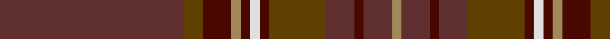

In pattern [BGBYBWBGBBBY](/patterns/bgbybwbgbbby/).

This was sourced from tartans-authority.  It is a [12 stripes tartan](/stripes/stripes12/).

Original link http://www.tartansauthority.com/tartan-ferret/display/1748/

## Attestations

This cloth appears in 2 source records; the oldest owns this page.

- pre 1986 — Glen Clova #2 (Fashion) (tartans-authority, [record](http://www.tartansauthority.com/tartan-ferret/display/1748/))
- 01/01/2002 — Glen Clova #2 (register-of-tartans, [record](https://www.tartanregister.gov.uk/tartanDetails.aspx?ref=1371))

## Thread count
DR/78 T8 DRa12 LT4 DRa4 LN4 DRa4 T24 DR12 DRa4 DR12 LT/4

## Palette
Each colour and its ΔE from the base-6 reference it is a variant of.

| Colour | Shade | Base | ΔE (OKLab) |
|---|---|---|---|
| DR | <code style="background-color:#603030;">#603030</code> `#603030` | B <code style="background-color:#2A418A;">#2A418A</code> | 0.17 |
| DRa | <code style="background-color:#480800;">#480800</code> `#480800` | B <code style="background-color:#2A418A;">#2A418A</code> | 0.24 |
| LN | <code style="background-color:#E0E0E0;">#E0E0E0</code> `#E0E0E0` | W <code style="background-color:#F7F7F7;">#F7F7F7</code> | 0.07 |
| LT | <code style="background-color:#A08858;">#A08858</code> `#A08858` | Y <code style="background-color:#F2BF00;">#F2BF00</code> | 0.21 |
| T | <code style="background-color:#604000;">#604000</code> `#604000` | G <code style="background-color:#006100;">#006100</code> | 0.14 |

## Nearest tartans

The nearest existing variants by ΔTartan distance.

1. [Ulster (Peat) (District](/setts/s10/g28k2g28k2g2k2ga29k2r2k2x2~g7c5428-ga604000-k101010-rc80000/) — ΔT 1.57
1. [Mead (Tennessee) Hunting (Personal)](/setts/s10/g36k3r6k3b10r5b3y4k1g2x2~b4b2e24-g4e3d20-k120a01-ra5422f-yc5831b/) — ΔT 1.66
1. [Williams (Fashion)](/setts/s11/g50b6r3b3ga3b3ba10g8b3g6ga3x2~b441800-ba14283c-g604000-ga8c7038-r98481c/) — ΔT 1.66
1. [Isaia](/setts/s7/r80b8r4k4g4k45ba8~b430506-ba42333a-g6c6964-k2f0200-r76333a/) — ΔT 1.77
1. [Wanstall](/setts/s10/b12g4b8ba3g3ba3g8ba12b38y2x2~b680028-ba14283c-g003820-ybc8c00/) — ΔT 1.86
1. [Isaia (Fashion)](/setts/s7/r80ra8r4g4y4g45b8~b5c5c5c-g604000-rac6c64-ra904c40-ya0a0a0/) — ΔT 1.93
1. [Tyrone](/setts/s12/r50ra6b7g2b2w2b2ra16r8b2r9g3x2~b401000-g008000-r802040-ra806050-we0e0e0/) — ΔT 1.96
1. [Historic Scotland Corporate Tartan Tartan Number: 2122. Earliest known date: 1988 Custodians at Historic Scotland properties throughout Scotland, including Edinburgh Castle, wear this distinctive tartan. See products available Copyright © Blair Urquhart, Comrie, 2015](/setts/s9/g2r1g1r2g21ga9k1ga7k2x2~g604000-ga5c6428-k101010-r888888/) — ΔT 2.00
1. [Drummond of Megginch - 1997 Kilt](/setts/s15/r7b2r3g32r2g2r2b10r2w2r31b2r2b1r6x2~b282c39-g304f45-r983029-w98c8e8/) — ΔT 2.01
1. [Tyrone, County](/setts/s12/r50g6b7ga2b2w2b2g14r8ga2r9ga3x2~b4c3428-g8c7038-ga003820-r880000-wc0c0c0/) — ΔT 2.03

## Neighbour map

Every grey dot is one of 15726 variants placed by the first two principal components of the ΔTartan feature space (44% of its variance). Red is this tartan; blue dots are its nearest — click one to open its page.

<svg viewBox="0 0 640 380" role="img" style="max-width:100%;height:auto;border:1px solid #e0e0e0;border-radius:4px;display:block" xmlns="http://www.w3.org/2000/svg"><image href="/nn/cloud.v1.png" width="640" height="380"/><a href="/setts/s10/g28k2g28k2g2k2ga29k2r2k2x2~g7c5428-ga604000-k101010-rc80000/"><circle cx="481.6" cy="205.8" r="4" fill="#3465a4"><title>Ulster (Peat) (District</title></circle></a><a href="/setts/s10/g36k3r6k3b10r5b3y4k1g2x2~b4b2e24-g4e3d20-k120a01-ra5422f-yc5831b/"><circle cx="412.8" cy="134.3" r="4" fill="#3465a4"><title>Mead (Tennessee) Hunting (Personal)</title></circle></a><a href="/setts/s11/g50b6r3b3ga3b3ba10g8b3g6ga3x2~b441800-ba14283c-g604000-ga8c7038-r98481c/"><circle cx="528.4" cy="177.5" r="4" fill="#3465a4"><title>Williams (Fashion)</title></circle></a><a href="/setts/s7/r80b8r4k4g4k45ba8~b430506-ba42333a-g6c6964-k2f0200-r76333a/"><circle cx="445.0" cy="179.1" r="4" fill="#3465a4"><title>Isaia</title></circle></a><a href="/setts/s10/b12g4b8ba3g3ba3g8ba12b38y2x2~b680028-ba14283c-g003820-ybc8c00/"><circle cx="486.5" cy="196.5" r="4" fill="#3465a4"><title>Wanstall</title></circle></a><a href="/setts/s7/r80ra8r4g4y4g45b8~b5c5c5c-g604000-rac6c64-ra904c40-ya0a0a0/"><circle cx="443.0" cy="173.4" r="4" fill="#3465a4"><title>Isaia (Fashion)</title></circle></a><a href="/setts/s12/r50ra6b7g2b2w2b2ra16r8b2r9g3x2~b401000-g008000-r802040-ra806050-we0e0e0/"><circle cx="456.3" cy="124.2" r="4" fill="#3465a4"><title>Tyrone</title></circle></a><a href="/setts/s9/g2r1g1r2g21ga9k1ga7k2x2~g604000-ga5c6428-k101010-r888888/"><circle cx="457.3" cy="197.6" r="4" fill="#3465a4"><title>Historic Scotland Corporate Tartan Tartan Number: 2122. Earliest known date: 1988 Custodians at Historic Scotland properties throughout Scotland, including Edinburgh Castle, wear this distinctive tartan. See products available Copyright © Blair Urquhart, Comrie, 2015</title></circle></a><a href="/setts/s15/r7b2r3g32r2g2r2b10r2w2r31b2r2b1r6x2~b282c39-g304f45-r983029-w98c8e8/"><circle cx="433.6" cy="128.6" r="4" fill="#3465a4"><title>Drummond of Megginch - 1997 Kilt</title></circle></a><a href="/setts/s12/r50g6b7ga2b2w2b2g14r8ga2r9ga3x2~b4c3428-g8c7038-ga003820-r880000-wc0c0c0/"><circle cx="469.9" cy="124.3" r="4" fill="#3465a4"><title>Tyrone, County</title></circle></a><circle cx="463.8" cy="153.7" r="5" fill="#c00000"/></svg>

ID: /setts/s12/b39g4ba6y2ba2w2ba2g12b6ba2b6y2x2~b603030-ba480800-g604000-we0e0e0-ya08858/
