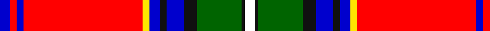

In pattern [BRBRYBKBKGKW](/patterns/brbrybkbkgkw/).

This was sourced from register-of-tartans.  It is a [12 stripes tartan](/stripes/stripes12/).

Original link https://www.tartanregister.gov.uk/tartanDetails.aspx?ref=10411

## Register references

External register numbers recorded for this tartan.

- Scottish Register of Tartans: [10411](https://www.tartanregister.gov.uk/tartanDetails.aspx?ref=10411)

## Thread count
B/6 R4 B4 R70 Y4 B6 K4 B10 K8 G26 K2 W/6

## Palette
Each colour and its ΔE from the base-6 reference it is a variant of.

| Colour | Shade | Base | ΔE (OKLab) |
|---|---|---|---|
| B | <code style="background-color:#0000CD;">#0000CD</code> `#0000CD` | B <code style="background-color:#2A418A;">#2A418A</code> | 0.14 |
| G | <code style="background-color:#006400;">#006400</code> `#006400` | G <code style="background-color:#006100;">#006100</code> | 0.01 |
| K | <code style="background-color:#101010;">#101010</code> `#101010` | K <code style="background-color:#000000;">#000000</code> | 0.17 |
| R | <code style="background-color:#FF0000;">#FF0000</code> `#FF0000` | R <code style="background-color:#CC0000;">#CC0000</code> | 0.11 |
| W | <code style="background-color:#FFFFFF;">#FFFFFF</code> `#FFFFFF` | W <code style="background-color:#F7F7F7;">#F7F7F7</code> | 0.02 |
| Y | <code style="background-color:#FFE700;">#FFE700</code> `#FFE700` | Y <code style="background-color:#F2BF00;">#F2BF00</code> | 0.10 |

## Nearest tartans

The nearest existing variants by ΔTartan distance.

1. [MacGill](/setts/s13/r41g13k8w2y2r1y2w2b6k2r3y2w5~b000064-g004c00-k000000-rc80000-wd0d0d0-yffff00~x2/) — ΔT 0.84
1. [Celtic Nations (Fashion)](/setts/s12/b3r2b2r35y2b3k2b5k4g13k1w3~b2c2c80-g006818-k101010-rc80000-wfcfcfc-ybc8c00~x2/) — ΔT 0.98
1. [Stratford Police Pipe Band (Ontario)](/setts/s13/r5b2y1r45b4w1k4wa9b2y2b2k10w2~b035f9d-k101010-rcb2026-wffffff-wa6cc5d8-yf5b800~x2/) — ΔT 1.02
1. [MacGill](/setts/s13/r28g10k7w2y2r1y2w2b5k2r2y2w3~b202060-g006818-k101010-rc80000-we0e0e0-ye8c000~x4/) — ΔT 1.04
1. [MacGill Clan Tartan Tartan Number: 1487. Earliest known date: pre 1745 This sample comes from the MacGregor-Hastie collection which forms the basis of the cloth archive of the Scottish Tartans Society. One can assume that the sample dates between 1930 and 1950. The family tartan, which originated with the MacGills of Jura, was in use before 1745 but when tartan was proscribed the sett seemed to have been lost until a piece was discovered in Kintyre. It is now in the Museum of Antiquities, Edinburgh. The current version, which first appeared in 1930, is known as the MacGill Society tartan. See products available Copyright © Blair Urquhart, Comrie, 2015](/setts/s13/r47g16k8w3y3r2y3w3b6k3r4y4w3~b2c2c80-g006818-k101010-rc80000-we0e0e0-ye8c000~x2/) — ΔT 1.10
1. [Mehrtens variant (Personal)](/setts/s14/w4b4r18ra4r1ra36k1ra4k6r2k6r6ka4r2~b003c64-k101010-ka000000-rc80000-ra848488-wf8f8f8~x2/) — ΔT 1.14
1. [Drummond Relic](/setts/s12/r26w1k8y1g13k1w4k1y2k4b3r8~b3c82af-g005020-k101010-rdc0000-we0e0e0-ye8c000~x4/) — ΔT 1.14
1. [MacLean of Duart #5](/setts/s11/b14k8y2k3w4k3g21r48b4r5k3~b3c82af-g005020-k101010-rdc0000-we0e0e0-ye8c000~x2/) — ΔT 1.19
1. [Stratford Police Pipe Band Corporate Tartan Tartan Number: 10638. Earliest known date: 14/06/2012 Designed by Scott Baughman for the Stratford Police Pipe Band also known as Perth County Pipe Band Incorporated. Colours: blue white and gold are for the city of Stratford; red and black are for the Stratford Police Service, Ontario. See products available Copyright © Blair Urquhart, Comrie, 2015](/setts/s13/r5b2y1r45b4w1k4wa9b2y2b2k10w2~b035f9d-k101010-r9f0805-wffffff-wa6cc5d8-yf5b800~x2/) — ΔT 1.19
1. [Stratford Police PB (Corporate)](/setts/s13/r5b2y1r45b4w1k4ba9b2y2b2k10w2~b2888c4-ba5c8ca8-k101010-rc80000-wfcfcfc-ybc8c00~x2/) — ΔT 1.22

## Neighbour map

Every grey dot is one of 15726 variants placed by the first two principal components of the ΔTartan feature space (44% of its variance). Red is this tartan; blue dots are its nearest — click one to open its page.

<svg viewBox="0 0 640 380" role="img" style="max-width:100%;height:auto;border:1px solid #e0e0e0;border-radius:4px;display:block" xmlns="http://www.w3.org/2000/svg"><image href="/nn/cloud.v1.png" width="640" height="380"/><a href="/setts/s13/r41g13k8w2y2r1y2w2b6k2r3y2w5~b000064-g004c00-k000000-rc80000-wd0d0d0-yffff00~x2/"><circle cx="261.7" cy="28.2" r="4" fill="#3465a4"><title>MacGill</title></circle></a><a href="/setts/s12/b3r2b2r35y2b3k2b5k4g13k1w3~b2c2c80-g006818-k101010-rc80000-wfcfcfc-ybc8c00~x2/"><circle cx="279.3" cy="50.9" r="4" fill="#3465a4"><title>Celtic Nations (Fashion)</title></circle></a><a href="/setts/s13/r5b2y1r45b4w1k4wa9b2y2b2k10w2~b035f9d-k101010-rcb2026-wffffff-wa6cc5d8-yf5b800~x2/"><circle cx="327.0" cy="25.0" r="4" fill="#3465a4"><title>Stratford Police Pipe Band (Ontario)</title></circle></a><a href="/setts/s13/r28g10k7w2y2r1y2w2b5k2r2y2w3~b202060-g006818-k101010-rc80000-we0e0e0-ye8c000~x4/"><circle cx="218.7" cy="51.2" r="4" fill="#3465a4"><title>MacGill</title></circle></a><a href="/setts/s13/r47g16k8w3y3r2y3w3b6k3r4y4w3~b2c2c80-g006818-k101010-rc80000-we0e0e0-ye8c000~x2/"><circle cx="253.8" cy="53.7" r="4" fill="#3465a4"><title>MacGill Clan Tartan Tartan Number: 1487. Earliest known date: pre 1745 This sample comes from the MacGregor-Hastie collection which forms the basis of the cloth archive of the Scottish Tartans Society. One can assume that the sample dates between 1930 and 1950. The family tartan, which originated with the MacGills of Jura, was in use before 1745 but when tartan was proscribed the sett seemed to have been lost until a piece was discovered in Kintyre. It is now in the Museum of Antiquities, Edinburgh. The current version, which first appeared in 1930, is known as the MacGill Society tartan. See products available Copyright © Blair Urquhart, Comrie, 2015</title></circle></a><a href="/setts/s14/w4b4r18ra4r1ra36k1ra4k6r2k6r6ka4r2~b003c64-k101010-ka000000-rc80000-ra848488-wf8f8f8~x2/"><circle cx="243.5" cy="51.0" r="4" fill="#3465a4"><title>Mehrtens variant (Personal)</title></circle></a><a href="/setts/s12/r26w1k8y1g13k1w4k1y2k4b3r8~b3c82af-g005020-k101010-rdc0000-we0e0e0-ye8c000~x4/"><circle cx="228.8" cy="69.6" r="4" fill="#3465a4"><title>Drummond Relic</title></circle></a><a href="/setts/s11/b14k8y2k3w4k3g21r48b4r5k3~b3c82af-g005020-k101010-rdc0000-we0e0e0-ye8c000~x2/"><circle cx="232.5" cy="75.3" r="4" fill="#3465a4"><title>MacLean of Duart #5</title></circle></a><a href="/setts/s13/r5b2y1r45b4w1k4wa9b2y2b2k10w2~b035f9d-k101010-r9f0805-wffffff-wa6cc5d8-yf5b800~x2/"><circle cx="329.5" cy="30.9" r="4" fill="#3465a4"><title>Stratford Police Pipe Band Corporate Tartan Tartan Number: 10638. Earliest known date: 14/06/2012 Designed by Scott Baughman for the Stratford Police Pipe Band also known as Perth County Pipe Band Incorporated. Colours: blue white and gold are for the city of Stratford; red and black are for the Stratford Police Service, Ontario. See products available Copyright © Blair Urquhart, Comrie, 2015</title></circle></a><a href="/setts/s13/r5b2y1r45b4w1k4ba9b2y2b2k10w2~b2888c4-ba5c8ca8-k101010-rc80000-wfcfcfc-ybc8c00~x2/"><circle cx="336.9" cy="28.7" r="4" fill="#3465a4"><title>Stratford Police PB (Corporate)</title></circle></a><circle cx="255.0" cy="37.5" r="5" fill="#c00000"/></svg>

ID: /setts/s12/b3r2b2r35y2b3k2b5k4g13k1w3~b0000cd-g006400-k101010-rff0000-wffffff-yffe700~x2/
