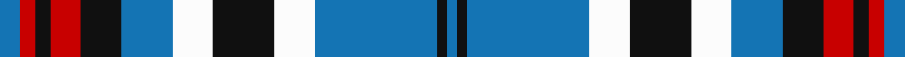

In pattern [BKBWKWBKRKRB](/stripes/bkbwkwbkrkrb/).

This was sourced from register-of-tartans.  It is a [12 stripe tartan](/stripes/stripes12/).

Original link https://www.tartanregister.gov.uk/tartanDetails.aspx?ref=5455

## Attestations

This cloth appears in 2 source records; the oldest owns this page.

- 01/11/2003 — Trillard (Personal) (register-of-tartans, [record](https://www.tartanregister.gov.uk/tartanDetails.aspx?ref=5455))
- pre 2004 — Trillard (Personal) (tartans-authority, [record](http://www.tartansauthority.com/tartan-ferret/display/6235/))

## Register references

External register numbers recorded for this tartan.

- Scottish Register of Tartans: [5455](https://www.tartanregister.gov.uk/tartanDetails.aspx?ref=5455)
- Scottish Tartans Authority (ITI): 6235
- Scottish Tartans World Register: 2983

## Thread count
B/8 R6 K6 R12 K16 B20 W16 K24 W16 B48 K4 B/4

## Palette
Each colour and the base-6 reference it is a variant of.

| Colour | Shade | Base |
|---|---|---|
| B | <code style="background-color:#1474B4;">#1474B4</code> `oklch(54.0% 0.129 245.1)` <small>#1474B4</small> | B <code style="background-color:#2A418A;">#2A418A</code> |
| K | <code style="background-color:#101010;">#101010</code> `oklch(17.3% 0.000 89.9)` <small>#101010</small> | K <code style="background-color:#000000;">#000000</code> |
| R | <code style="background-color:#C80000;">#C80000</code> `oklch(52.3% 0.215 29.2)` <small>#C80000</small> | R <code style="background-color:#CC0000;">#CC0000</code> |
| W | <code style="background-color:#FCFCFC;">#FCFCFC</code> `oklch(99.1% 0.000 89.9)` <small>#FCFCFC</small> | W <code style="background-color:#F7F7F7;">#F7F7F7</code> |

## Nearest tartans

The nearest existing variants by ΔTartan distance, with this tartan at the top so the swatches line up against it.

ΔTartan

Tartan

Sett

—

<a href="/ttd/edit/#slug=b4r3k3r6k8b10w8k12w8b24k2b2~x2">Trillard (Personal)</a> <a class="nn-out" href="/setts/s12/b4r3k3r6k8b10w8k12w8b24k2b2~x2/" title="open its dictionary page">↗</a>

0.92

<a href="/ttd/edit/#slug=b27w2b14k14lg4k4lg4k4lg27">(1) Abercrombie</a> <a class="nn-out" href="/setts/s9/b27w2b14k14lg4k4lg4k4lg27/" title="open its dictionary page">↗</a>

0.97

<a href="/ttd/edit/#slug=db11k4w5k1r3k1w5k4db11r1~x4">Hydro-Electric</a> <a class="nn-out" href="/setts/s10/db11k4w5k1r3k1w5k4db11r1~x4/" title="open its dictionary page">↗</a>

1.03

<a href="/ttd/edit/#slug=r2w7dt3w3dt3w3dt3w1dt12db14r1db1r2~x2">Hogmany Plaid (Fashion)</a> <a class="nn-out" href="/setts/s13/r2w7dt3w3dt3w3dt3w1dt12db14r1db1r2~x2/" title="open its dictionary page">↗</a>

1.04

<a href="/ttd/edit/#slug=r2k6db4w2k14w1db4w16db2w6r2~x2">McRae, Dress</a> <a class="nn-out" href="/setts/s11/r2k6db4w2k14w1db4w16db2w6r2~x2/" title="open its dictionary page">↗</a>

1.06

<a href="/ttd/edit/#slug=lr3dg18k4lb12dg2lb3dg2lb3dg2lb12lr4lb3~x2">Breifne</a> <a class="nn-out" href="/setts/s12/lr3dg18k4lb12dg2lb3dg2lb3dg2lb12lr4lb3~x2/" title="open its dictionary page">↗</a>

1.10

<a href="/setts/s12/dt7w3dt2w6dt16t26r4~x2/">Keela</a>

1.10

<a href="/ttd/edit/#slug=k4lo2k13lo1w8b13lo2b4~x2">Bannockbane Blue #1</a> <a class="nn-out" href="/setts/s8/k4lo2k13lo1w8b13lo2b4~x2/" title="open its dictionary page">↗</a>

1.12

<a href="/setts/s12/t35k23w18r3w18k2w3~x2/">Ferguson Dress Blue (Dance)</a>

1.13

<a href="/setts/s12/db4r2db31k10g4w21g2~x2/">Sinclair Dress (Dance)</a>

1.14

<a href="/setts/s14/db20w3db3w3db3w3k5ly10~x2/">Kile (No red line) (Personal)</a>

## Neighbour map

Every grey dot is one of 14299 variants placed by the first two principal components of the ΔTartan feature space (44% of its variance). Red is this tartan; blue dots are its nearest — click one to open its page.

<svg viewBox="0 0 640 380" role="img" style="max-width:100%;height:auto;border:1px solid #e0e0e0;border-radius:4px;display:block" xmlns="http://www.w3.org/2000/svg"><image href="/nn/cloud.v1.png" width="640" height="380"/><a href="/setts/s9/b27w2b14k14lg4k4lg4k4lg27/"><circle cx="184.6" cy="159.4" r="4" fill="#3465a4"><title>(1) Abercrombie</title></circle></a><a href="/setts/s10/db11k4w5k1r3k1w5k4db11r1~x4/"><circle cx="194.0" cy="170.6" r="4" fill="#3465a4"><title>Hydro-Electric</title></circle></a><a href="/setts/s13/r2w7dt3w3dt3w3dt3w1dt12db14r1db1r2~x2/"><circle cx="177.9" cy="141.5" r="4" fill="#3465a4"><title>Hogmany Plaid (Fashion)</title></circle></a><a href="/setts/s11/r2k6db4w2k14w1db4w16db2w6r2~x2/"><circle cx="190.1" cy="134.4" r="4" fill="#3465a4"><title>McRae, Dress</title></circle></a><a href="/setts/s12/lr3dg18k4lb12dg2lb3dg2lb3dg2lb12lr4lb3~x2/"><circle cx="220.0" cy="167.0" r="4" fill="#3465a4"><title>Breifne</title></circle></a><a href="/setts/s12/dt7w3dt2w6dt16t26r4~x2/"><circle cx="218.9" cy="160.0" r="4" fill="#3465a4"><title>Keela</title></circle></a><a href="/setts/s8/k4lo2k13lo1w8b13lo2b4~x2/"><circle cx="149.3" cy="172.1" r="4" fill="#3465a4"><title>Bannockbane Blue #1</title></circle></a><a href="/setts/s12/t35k23w18r3w18k2w3~x2/"><circle cx="181.1" cy="136.8" r="4" fill="#3465a4"><title>Ferguson Dress Blue (Dance)</title></circle></a><a href="/setts/s12/db4r2db31k10g4w21g2~x2/"><circle cx="193.5" cy="125.6" r="4" fill="#3465a4"><title>Sinclair Dress (Dance)</title></circle></a><a href="/setts/s14/db20w3db3w3db3w3k5ly10~x2/"><circle cx="158.2" cy="155.2" r="4" fill="#3465a4"><title>Kile (No red line) (Personal)</title></circle></a><circle cx="176.5" cy="159.2" r="5" fill="#c00000"/></svg>

ID: /setts/s12/b4r3k3r6k8b10w8k12w8b24k2b2~x2/
