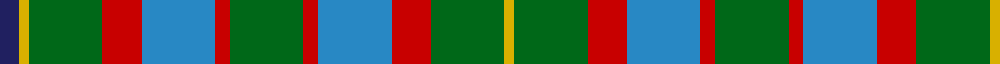

In pattern [BYGRBRGRBRGY](/patterns/bygrbrgrbrgy/).

This was sourced from house-of-tartan.  It is a [12 stripes tartan](/stripes/stripes12/).

Original link http://www.house-of-tartan.scotland.net/house/TartanViewjs.asp?colr=Def&tnam=2334

## Thread count
DB/8 Y4 G30 R16 B30 R6 G30 R6 B30 R16 G30 Y/4

## Palette
Each colour and its ΔE from the base-6 reference it is a variant of.

| Colour | Shade | Base | ΔE (OKLab) |
|---|---|---|---|
| B | <code style="background-color:#2888C4;">#2888C4</code> `#2888C4` | B <code style="background-color:#2A418A;">#2A418A</code> | 0.21 |
| DB | <code style="background-color:#202060;">#202060</code> `#202060` | B <code style="background-color:#2A418A;">#2A418A</code> | 0.11 |
| G | <code style="background-color:#006818;">#006818</code> `#006818` | G <code style="background-color:#006100;">#006100</code> | 0.02 |
| R | <code style="background-color:#C80000;">#C80000</code> `#C80000` | R <code style="background-color:#CC0000;">#CC0000</code> | 0.01 |
| Y | <code style="background-color:#D8B000;">#D8B000</code> `#D8B000` | Y <code style="background-color:#F2BF00;">#F2BF00</code> | 0.06 |

## Nearest tartans

The nearest existing variants by ΔTartan distance.

1. [Niagara Falls](/setts/s12/b22g4b4g17r17g17b4g4b22y8r8ra8x2~b304080-g008000-r806050-rac00000-yf0c000/) — ΔT 0.82
1. [Niagara Falls](/setts/s12/b22g4b4g17ga17g17b4g4b22y8ga8r8x2~b14283c-g408060-ga604000-rc80000-ye8c000/) — ΔT 1.02
1. [Aceo](/setts/s12/k2g10b5g20b5y3b7k3b7k4b4w2x2~b646464-g789484-k101010-wffffff-ybc8c00/) — ΔT 1.09
1. [Fraser hunting, dress](/setts/s11/b4r24g17r3w18r3w18r3g17r24ra4x2~b304080-g008000-r806050-rac00000-we0e0e0/) — ΔT 1.11
1. [Balmoral Hotel Edinburgh](/setts/s13/g5b1g1b1g1ga3g3ga1g3ga3y3ya1y1x4~b64008c-g5c6428-ga005020-yf8e38c-ya9c9c00/) — ΔT 1.11
1. [Muirhead (Clan)](/setts/s11/y3g14ga9b4ga8w2ga12r12ga2r5w2x2~b1c0070-g006818-ga408060-rc80000-we0e0e0-ye8c000/) — ΔT 1.13
1. [Niagra Falls Trade Tartan Tartan Number: 1915. Earliest known date: 1967 Designed to be used in the refurbishing of Johnstons of Elgin new mill shop and based on the colours of the mill shop house style. The lighter square is represented here as green from the 'Antique' colour range, a speciality of Johnstons of Elgin. See products available Copyright © Blair Urquhart, Comrie, 2015](/setts/s12/b22g4b4g17ga17g17b4g4b22y8ga8r8x2~b2c2c80-g006818-ga604000-rc80000-ye8c000/) — ΔT 1.14
1. [Vasseur Mignon (Personal)](/setts/s11/r2y2r2y2g5w5g11b11g5w11y2x2~b5c5c5c-g00643c-rc80000-wc8c8c8-yd4a800/) — ΔT 1.21
1. [Bowie (Lochcarron)](/setts/s12/b10r2b3r4b13r2k13g13r4g3y2g10x2~b1870a4-g285800-k101010-rc80000-yd09800/) — ΔT 1.21
1. [Mariverain](/setts/s11/b3g8b5r1b5g2y1g2r5b4y1x2~b304080-g30a010-rc00000-yf0c000/) — ΔT 1.21

## Neighbour map

Every grey dot is one of 15726 variants placed by the first two principal components of the ΔTartan feature space (44% of its variance). Red is this tartan; blue dots are its nearest — click one to open its page.

<svg viewBox="0 0 640 380" role="img" style="max-width:100%;height:auto;border:1px solid #e0e0e0;border-radius:4px;display:block" xmlns="http://www.w3.org/2000/svg"><image href="/nn/cloud.v1.png" width="640" height="380"/><a href="/setts/s12/b22g4b4g17r17g17b4g4b22y8r8ra8x2~b304080-g008000-r806050-rac00000-yf0c000/"><circle cx="139.5" cy="213.7" r="4" fill="#3465a4"><title>Niagara Falls</title></circle></a><a href="/setts/s12/b22g4b4g17ga17g17b4g4b22y8ga8r8x2~b14283c-g408060-ga604000-rc80000-ye8c000/"><circle cx="137.7" cy="213.6" r="4" fill="#3465a4"><title>Niagara Falls</title></circle></a><a href="/setts/s12/k2g10b5g20b5y3b7k3b7k4b4w2x2~b646464-g789484-k101010-wffffff-ybc8c00/"><circle cx="212.4" cy="175.2" r="4" fill="#3465a4"><title>Aceo</title></circle></a><a href="/setts/s11/b4r24g17r3w18r3w18r3g17r24ra4x2~b304080-g008000-r806050-rac00000-we0e0e0/"><circle cx="160.0" cy="179.5" r="4" fill="#3465a4"><title>Fraser hunting, dress</title></circle></a><a href="/setts/s13/g5b1g1b1g1ga3g3ga1g3ga3y3ya1y1x4~b64008c-g5c6428-ga005020-yf8e38c-ya9c9c00/"><circle cx="162.7" cy="207.5" r="4" fill="#3465a4"><title>Balmoral Hotel Edinburgh</title></circle></a><a href="/setts/s11/y3g14ga9b4ga8w2ga12r12ga2r5w2x2~b1c0070-g006818-ga408060-rc80000-we0e0e0-ye8c000/"><circle cx="137.8" cy="179.1" r="4" fill="#3465a4"><title>Muirhead (Clan)</title></circle></a><a href="/setts/s12/b22g4b4g17ga17g17b4g4b22y8ga8r8x2~b2c2c80-g006818-ga604000-rc80000-ye8c000/"><circle cx="138.1" cy="214.4" r="4" fill="#3465a4"><title>Niagra Falls Trade Tartan Tartan Number: 1915. Earliest known date: 1967 Designed to be used in the refurbishing of Johnstons of Elgin new mill shop and based on the colours of the mill shop house style. The lighter square is represented here as green from the 'Antique' colour range, a speciality of Johnstons of Elgin. See products available Copyright © Blair Urquhart, Comrie, 2015</title></circle></a><a href="/setts/s11/r2y2r2y2g5w5g11b11g5w11y2x2~b5c5c5c-g00643c-rc80000-wc8c8c8-yd4a800/"><circle cx="112.7" cy="192.4" r="4" fill="#3465a4"><title>Vasseur Mignon (Personal)</title></circle></a><a href="/setts/s12/b10r2b3r4b13r2k13g13r4g3y2g10x2~b1870a4-g285800-k101010-rc80000-yd09800/"><circle cx="121.0" cy="196.3" r="4" fill="#3465a4"><title>Bowie (Lochcarron)</title></circle></a><a href="/setts/s11/b3g8b5r1b5g2y1g2r5b4y1x2~b304080-g30a010-rc00000-yf0c000/"><circle cx="193.2" cy="207.0" r="4" fill="#3465a4"><title>Mariverain</title></circle></a><circle cx="168.3" cy="195.8" r="5" fill="#c00000"/></svg>

ID: /setts/s12/b4y2g15r8ba15r3g15r3ba15r8g15y2x2~b202060-ba2888c4-g006818-rc80000-yd8b000/
