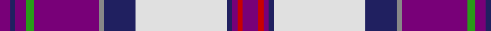

In pattern [BBBGBRBWBBRB](/patterns/bbbgbrbwbbrb/).

This was sourced from register-of-tartans.  It is a [12 stripes tartan](/stripes/stripes12/).

Original link https://www.tartanregister.gov.uk/tartanDetails.aspx?ref=2363

## Attestations

This cloth appears in 2 source records; the oldest owns this page.

- 01/01/2005 — MacDonald of Glencoe (Dance) (register-of-tartans, [record](https://www.tartanregister.gov.uk/tartanDetails.aspx?ref=2363))
- pre 2005 — MacDonald of Glencoe - 2005 (Dance) (tartans-authority, [record](http://www.tartansauthority.com/tartan-ferret/display/6553/))

## Thread count
P/8 DB4 P8 G6 P50 N4 DB24 LN70 DB4 P4 R4 P/12

## Palette
Each colour and its ΔE from the base-6 reference it is a variant of.

| Colour | Shade | Base | ΔE (OKLab) |
|---|---|---|---|
| DB | <code style="background-color:#202060;">#202060</code> `#202060` | B <code style="background-color:#2A418A;">#2A418A</code> | 0.11 |
| G | <code style="background-color:#289C18;">#289C18</code> `#289C18` | G <code style="background-color:#006100;">#006100</code> | 0.19 |
| LN | <code style="background-color:#E0E0E0;">#E0E0E0</code> `#E0E0E0` | W <code style="background-color:#F7F7F7;">#F7F7F7</code> | 0.07 |
| N | <code style="background-color:#888888;">#888888</code> `#888888` | R <code style="background-color:#CC0000;">#CC0000</code> | 0.24 |
| P | <code style="background-color:#780078;">#780078</code> `#780078` | B <code style="background-color:#2A418A;">#2A418A</code> | 0.17 |
| R | <code style="background-color:#C80000;">#C80000</code> `#C80000` | R <code style="background-color:#CC0000;">#CC0000</code> | 0.01 |

## Nearest tartans

The nearest existing variants by ΔTartan distance.

1. [MacDonald of Glencoe (Dance) Fashion Tartan Tartan Number: 6553. Earliest known date: 01/01/2005 Threadcount taken from DC Dalgliesh Dancers' Swatch book, 2005./Threadcount and colours aren't 100% original. Generated manually./ See products available Copyright © Blair Urquhart, Comrie, 2015](/setts/s12/b6r2b2ba2w31ba12wa2b26g3b4bb2b4~b8c008c-ba002440-bb2c2c80-g289c18-ra00024-we0e0e0-waa8ace8~x2/) — ΔT 0.90
1. [Scotland's Charity Air Ambulance](/setts/s9/w2b27k1g3k1ba10k1r24w2~b3850c8-ba646464-g289c18-k101010-rff0000-wffffff~x2/) — ΔT 1.27
1. [MacKellar Dress, Cerise (Dance)](/setts/s11/r18w2r2b3r2w2r4k10ra2w25k3~b2888c4-k101010-rc04094-ra981c70-we0e0e0~x2/) — ΔT 1.30
1. [MacLean of Duart Dress #5](/setts/s12/b12ba2k4y2k3r3k3r19w31ba2w4k2~b5c8ca8-ba2c2c80-k101010-ra00048-we0e0e0-ye8c000~x2/) — ΔT 1.32
1. [Russian Arctic Convoy](/setts/s14/r1w16ra6b2w1r8w1b28k3b3k3b3k1wa1~b2c4084-k101010-rdc0000-ra888888-wffffff-wac8c8c8~x2/) — ΔT 1.36
1. [MacLean, dress Burgundy](/setts/s12/b12ba2k4y2k3r3k3r19w31ba2w4k2~b5480b0-ba304080-k000000-r900030-we0e0e0-yf0c000~x2/) — ΔT 1.38
1. [Clinton Wedding (Personal)](/setts/s12/w5b6r20k6ba5k3b26r2y1r2b3w3~b2c2c80-ba5c788c-k101010-rc8002c-we0e0e0-yc4bc68~x2/) — ΔT 1.42
1. [Royal Stuart/Stewart (Variant)](/setts/s16/b81r4b8r8b4r12w16k8w32k16y6b8g16r8w4r24~b2c4084-g005020-k101010-rdc0000-we0e0e0-ye8c000/) — ΔT 1.43
1. [SOBHD](/setts/s8/r3w30b10k3ba15g2ba3g1~b2c3c98-ba640064-g208414-k101010-rc80000-we0e0e0~x2/) — ΔT 1.46
1. [Edinburgh Dress District Tartan Tartan Number: 1461. Earliest known date: Edinburgh One of a number of dress tartans produced by Hugh Macpherson, a kiltmaker in Edinburgh, intended for dancing and other informal occassions. The 'dress' version of clan tartan is usually created by substituting white for one of the 'ground' colours. See products available Copyright © Blair Urquhart, Comrie, 2015](/setts/s10/w4k2w30g3b3g3b7ba14g3r3~b780078-ba2c2c80-g006818-k101010-rc80000-we0e0e0~x2/) — ΔT 1.46

## Neighbour map

Every grey dot is one of 15726 variants placed by the first two principal components of the ΔTartan feature space (44% of its variance). Red is this tartan; blue dots are its nearest — click one to open its page.

<svg viewBox="0 0 640 380" role="img" style="max-width:100%;height:auto;border:1px solid #e0e0e0;border-radius:4px;display:block" xmlns="http://www.w3.org/2000/svg"><image href="/nn/cloud.v1.png" width="640" height="380"/><a href="/setts/s12/b6r2b2ba2w31ba12wa2b26g3b4bb2b4~b8c008c-ba002440-bb2c2c80-g289c18-ra00024-we0e0e0-waa8ace8~x2/"><circle cx="173.5" cy="65.6" r="4" fill="#3465a4"><title>MacDonald of Glencoe (Dance) Fashion Tartan Tartan Number: 6553. Earliest known date: 01/01/2005 Threadcount taken from DC Dalgliesh Dancers' Swatch book, 2005./Threadcount and colours aren't 100% original. Generated manually./ See products available Copyright © Blair Urquhart, Comrie, 2015</title></circle></a><a href="/setts/s9/w2b27k1g3k1ba10k1r24w2~b3850c8-ba646464-g289c18-k101010-rff0000-wffffff~x2/"><circle cx="203.3" cy="76.4" r="4" fill="#3465a4"><title>Scotland's Charity Air Ambulance</title></circle></a><a href="/setts/s11/r18w2r2b3r2w2r4k10ra2w25k3~b2888c4-k101010-rc04094-ra981c70-we0e0e0~x2/"><circle cx="179.4" cy="108.2" r="4" fill="#3465a4"><title>MacKellar Dress, Cerise (Dance)</title></circle></a><a href="/setts/s12/b12ba2k4y2k3r3k3r19w31ba2w4k2~b5c8ca8-ba2c2c80-k101010-ra00048-we0e0e0-ye8c000~x2/"><circle cx="151.2" cy="76.9" r="4" fill="#3465a4"><title>MacLean of Duart Dress #5</title></circle></a><a href="/setts/s14/r1w16ra6b2w1r8w1b28k3b3k3b3k1wa1~b2c4084-k101010-rdc0000-ra888888-wffffff-wac8c8c8~x2/"><circle cx="208.6" cy="50.0" r="4" fill="#3465a4"><title>Russian Arctic Convoy</title></circle></a><a href="/setts/s12/b12ba2k4y2k3r3k3r19w31ba2w4k2~b5480b0-ba304080-k000000-r900030-we0e0e0-yf0c000~x2/"><circle cx="143.9" cy="76.1" r="4" fill="#3465a4"><title>MacLean, dress Burgundy</title></circle></a><a href="/setts/s12/w5b6r20k6ba5k3b26r2y1r2b3w3~b2c2c80-ba5c788c-k101010-rc8002c-we0e0e0-yc4bc68~x2/"><circle cx="208.7" cy="82.1" r="4" fill="#3465a4"><title>Clinton Wedding (Personal)</title></circle></a><a href="/setts/s16/b81r4b8r8b4r12w16k8w32k16y6b8g16r8w4r24~b2c4084-g005020-k101010-rdc0000-we0e0e0-ye8c000/"><circle cx="157.1" cy="66.5" r="4" fill="#3465a4"><title>Royal Stuart/Stewart (Variant)</title></circle></a><a href="/setts/s8/r3w30b10k3ba15g2ba3g1~b2c3c98-ba640064-g208414-k101010-rc80000-we0e0e0~x2/"><circle cx="203.8" cy="79.1" r="4" fill="#3465a4"><title>SOBHD</title></circle></a><a href="/setts/s10/w4k2w30g3b3g3b7ba14g3r3~b780078-ba2c2c80-g006818-k101010-rc80000-we0e0e0~x2/"><circle cx="180.3" cy="92.3" r="4" fill="#3465a4"><title>Edinburgh Dress District Tartan Tartan Number: 1461. Earliest known date: Edinburgh One of a number of dress tartans produced by Hugh Macpherson, a kiltmaker in Edinburgh, intended for dancing and other informal occassions. The 'dress' version of clan tartan is usually created by substituting white for one of the 'ground' colours. See products available Copyright © Blair Urquhart, Comrie, 2015</title></circle></a><circle cx="190.2" cy="74.9" r="5" fill="#c00000"/></svg>

ID: /setts/s12/b6r2b2ba2w35ba12ra2b25g3b4ba2b4~b780078-ba202060-g289c18-rc80000-ra888888-we0e0e0~x2/
