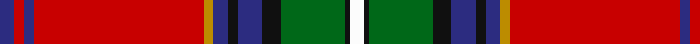

In pattern [BRBRYBKBKGKW](/patterns/brbrybkbkgkw/).

This was sourced from tartans-authority.  It is a [12 stripes tartan](/stripes/stripes12/).

Original link http://www.tartansauthority.com/tartan-ferret/display/10411/

## Thread count
DB/6 R4 DB4 R70 DY4 DB6 K4 DB10 K8 G26 K2 W/6

## Palette
Each colour and its ΔE from the base-6 reference it is a variant of.

| Colour | Shade | Base | ΔE (OKLab) |
|---|---|---|---|
| DB | <code style="background-color:#2C2C80;">#2C2C80</code> `#2C2C80` | B <code style="background-color:#2A418A;">#2A418A</code> | 0.06 |
| DY | <code style="background-color:#BC8C00;">#BC8C00</code> `#BC8C00` | Y <code style="background-color:#F2BF00;">#F2BF00</code> | 0.16 |
| G | <code style="background-color:#006818;">#006818</code> `#006818` | G <code style="background-color:#006100;">#006100</code> | 0.02 |
| K | <code style="background-color:#101010;">#101010</code> `#101010` | K <code style="background-color:#000000;">#000000</code> | 0.17 |
| R | <code style="background-color:#C80000;">#C80000</code> `#C80000` | R <code style="background-color:#CC0000;">#CC0000</code> | 0.01 |
| W | <code style="background-color:#FCFCFC;">#FCFCFC</code> `#FCFCFC` | W <code style="background-color:#F7F7F7;">#F7F7F7</code> | 0.01 |

## Nearest tartans

The nearest existing variants by ΔTartan distance.

1. [Holyrood, Chair](/setts/s13/r68w2b20g20w2y2g4ba4w2b4ba20r12w2-b304080-ba5480b0-g008000-rc00000-we0e0e0-yf0c000/) — ΔT 0.81
1. [King (Austria) (Personal)](/setts/s9/w4r4b28g32y4k4g4r70g2-b2c2c80-g006818-k101010-rc80000-we0e0e0-ye8c000/) — ΔT 0.82
1. [MacLean of Duart #5](/setts/s11/b28k16y4k6w8k6g42r96b8r10k6-b3c82af-g005020-k101010-rdc0000-we0e0e0-ye8c000/) — ΔT 0.85
1. [Banause-Zunft zu Olte](/setts/s11/y4g8b2r6b6g6ga2r64b28w6y4-b003c64-g285800-ga289c18-r880000-we0e0e0-ye8c000/) — ΔT 0.90
1. [Birral/Burrell](/setts/s17/b8ba16w4g64w4r16ra8ba4ra8r16w4ba32r130w4ba16b8w4-b5c8ca8-ba440044-g006818-rc80000-rad05054-we0e0e0/) — ΔT 0.92
1. [Birral (Clan)](/setts/s17/r130w4b16ba8w4ba8b16w4g64w4r16ra8b4ra8r16w4b32-b440044-ba5c8ca8-g006818-rc80000-rad05054-we0e0e0/) — ΔT 0.92
1. [Mehrtens variant (Personal)](/setts/s14/w8b8r36ra8r2ra72k2ra8k12r4k12r12ka8r4-b003c64-k101010-ka000000-rc80000-ra848488-wf8f8f8/) — ΔT 0.93
1. [Royal Stewart](/setts/s11/r128b24k32y4k8w6g64r16k8r6w4-b5480b0-g003000-k000000-rc00000-we0e0e0-yf0c000/) — ΔT 0.94
1. [Stratford Police Pipe Band Corporate Tartan Tartan Number: 10638. Earliest known date: 14/06/2012 Designed by Scott Baughman for the Stratford Police Pipe Band also known as Perth County Pipe Band Incorporated. Colours: blue white and gold are for the city of Stratford; red and black are for the Stratford Police Service, Ontario. See products available Copyright © Blair Urquhart, Comrie, 2015](/setts/s13/r10b4y2r90b8w2k8wa18b4y4b4k20w4-b035f9d-k101010-r9f0805-wffffff-wa6cc5d8-yf5b800/) — ΔT 0.94
1. [Celtic Nations](/setts/s12/b6r4b4r70y4b6k4b10k8g26k2w6-b0000cd-g006400-k101010-rff0000-wffffff-yffe700/) — ΔT 0.97

## Neighbour map

Every grey dot is one of 15726 variants placed by the first two principal components of the ΔTartan feature space (44% of its variance). Red is this tartan; blue dots are its nearest — click one to open its page.

<svg viewBox="0 0 640 380" role="img" style="max-width:100%;height:auto;border:1px solid #e0e0e0;border-radius:4px;display:block" xmlns="http://www.w3.org/2000/svg"><image href="/nn/cloud.v1.png" width="640" height="380"/><a href="/setts/s13/r68w2b20g20w2y2g4ba4w2b4ba20r12w2-b304080-ba5480b0-g008000-rc00000-we0e0e0-yf0c000/"><circle cx="282.3" cy="55.3" r="4" fill="#3465a4"><title>Holyrood, Chair</title></circle></a><a href="/setts/s9/w4r4b28g32y4k4g4r70g2-b2c2c80-g006818-k101010-rc80000-we0e0e0-ye8c000/"><circle cx="286.1" cy="76.1" r="4" fill="#3465a4"><title>King (Austria) (Personal)</title></circle></a><a href="/setts/s11/b28k16y4k6w8k6g42r96b8r10k6-b3c82af-g005020-k101010-rdc0000-we0e0e0-ye8c000/"><circle cx="230.1" cy="74.7" r="4" fill="#3465a4"><title>MacLean of Duart #5</title></circle></a><a href="/setts/s11/y4g8b2r6b6g6ga2r64b28w6y4-b003c64-g285800-ga289c18-r880000-we0e0e0-ye8c000/"><circle cx="305.8" cy="71.2" r="4" fill="#3465a4"><title>Banause-Zunft zu Olte</title></circle></a><a href="/setts/s17/b8ba16w4g64w4r16ra8ba4ra8r16w4ba32r130w4ba16b8w4-b5c8ca8-ba440044-g006818-rc80000-rad05054-we0e0e0/"><circle cx="265.5" cy="35.6" r="4" fill="#3465a4"><title>Birral/Burrell</title></circle></a><a href="/setts/s17/r130w4b16ba8w4ba8b16w4g64w4r16ra8b4ra8r16w4b32-b440044-ba5c8ca8-g006818-rc80000-rad05054-we0e0e0/"><circle cx="265.5" cy="35.6" r="4" fill="#3465a4"><title>Birral (Clan)</title></circle></a><a href="/setts/s14/w8b8r36ra8r2ra72k2ra8k12r4k12r12ka8r4-b003c64-k101010-ka000000-rc80000-ra848488-wf8f8f8/"><circle cx="240.4" cy="50.5" r="4" fill="#3465a4"><title>Mehrtens variant (Personal)</title></circle></a><a href="/setts/s11/r128b24k32y4k8w6g64r16k8r6w4-b5480b0-g003000-k000000-rc00000-we0e0e0-yf0c000/"><circle cx="262.9" cy="61.5" r="4" fill="#3465a4"><title>Royal Stewart</title></circle></a><a href="/setts/s13/r10b4y2r90b8w2k8wa18b4y4b4k20w4-b035f9d-k101010-r9f0805-wffffff-wa6cc5d8-yf5b800/"><circle cx="326.4" cy="29.0" r="4" fill="#3465a4"><title>Stratford Police Pipe Band Corporate Tartan Tartan Number: 10638. Earliest known date: 14/06/2012 Designed by Scott Baughman for the Stratford Police Pipe Band also known as Perth County Pipe Band Incorporated. Colours: blue white and gold are for the city of Stratford; red and black are for the Stratford Police Service, Ontario. See products available Copyright © Blair Urquhart, Comrie, 2015</title></circle></a><a href="/setts/s12/b6r4b4r70y4b6k4b10k8g26k2w6-b0000cd-g006400-k101010-rff0000-wffffff-yffe700/"><circle cx="252.4" cy="35.8" r="4" fill="#3465a4"><title>Celtic Nations</title></circle></a><circle cx="276.3" cy="50.0" r="5" fill="#c00000"/></svg>

ID: /setts/s12/b6r4b4r70y4b6k4b10k8g26k2w6-b2c2c80-g006818-k101010-rc80000-wfcfcfc-ybc8c00/
