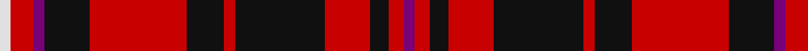

In pattern [BRKRKRKRKBRW](/patterns/brkrkrkrkbrw/).

This was sourced from tartans-authority.  It is a [12 stripes tartan](/stripes/stripes12/).

Original link http://www.tartansauthority.com/tartan-ferret/display/7494/

## Thread count
LN/6 R12 P6 K24 R52 K20 R6 K48 R24 K10 R8 P/6

## Palette
Each colour and its ΔE from the base-6 reference it is a variant of.

| Colour | Shade | Base | ΔE (OKLab) |
|---|---|---|---|
| K | <code style="background-color:#101010;">#101010</code> `#101010` | K <code style="background-color:#000000;">#000000</code> | 0.17 |
| LN | <code style="background-color:#E0E0E0;">#E0E0E0</code> `#E0E0E0` | W <code style="background-color:#F4F4F0;">#F4F4F0</code> | 0.06 |
| P | <code style="background-color:#780078;">#780078</code> `#780078` | B <code style="background-color:#2C4084;">#2C4084</code> | 0.16 |
| R | <code style="background-color:#C80000;">#C80000</code> `#C80000` | R <code style="background-color:#C80000;">#C80000</code> | 0.00 |

ID: /setts/s12/b6r8k10r24k48r6k20r52k24b6r12w6-b780078-k101010-rc80000-we0e0e0/
