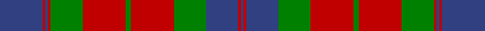

In pattern [BRBGRGRGRBRB](/stripes/brbgrgrgrbrb/).

This was sourced from weddslist.  It is a [12 stripe tartan](/stripes/stripes12/).

Original link http://www.weddslist.com/cgi-bin/tartans/pg.pl?source=sts

## Thread count
B/32 R2 B2 R2 G24 R32 G4 R32 G24 B24 R2 B/2

## Palette
Each colour and the base-6 reference it is a variant of.

| Colour | Shade | Base |
|---|---|---|
| B | <code style="background-color:#304080;">#304080</code> `oklch(39.4% 0.109 270.2)` <small>#304080</small> | B <code style="background-color:#2A418A;">#2A418A</code> |
| G | <code style="background-color:#008000;">#008000</code> `oklch(52.0% 0.177 142.5)` <small>#008000</small> | G <code style="background-color:#006100;">#006100</code> |
| R | <code style="background-color:#C00000;">#C00000</code> `oklch(50.7% 0.208 29.2)` <small>#C00000</small> | R <code style="background-color:#CC0000;">#CC0000</code> |

## Nearest tartans

The nearest existing variants by ΔTartan distance.

1. [Inverness, Fencibles](/setts/s12/db10r1db1r1g10r13g2r13g10db10r1db1~x2/) — ΔT 0.38
1. [Frasers Highlanders (Military?)](/setts/s12/r28g2r2g2db12g18r2g18db12r15g2r3~x2/) — ΔT 0.78
1. [Fraser, Stewart of Athol](/setts/s12/db28r3db3r3g20r30g4r30g20db22r3db3~x2/) — ΔT 0.78
1. [Stuart/Stewart of Urrard](/setts/s14/dg6r2dg2r18db9r3dg3r3db9r3dg24r2dg2r4~x2/) — ΔT 0.82
1. [Fraser of Lovat](/setts/s12/db16r1db1r1g12r16w2r16g12db12r1db1~x2/) — ΔT 0.88
1. [Wilson's No.119](/setts/s12/r6g28r6dp2r6dp19r6dp2r6g28r6dp2~x2/) — ΔT 0.93
1. [Fraser of Stratherrick](/setts/s12/db20r2db2r2g19r18g2r18g19db19r2db2~x2/) — ΔT 0.95
1. [Drummond](/setts/s12/db24r7g7r39db4r2db2r5g42r7db6r7~x2/) — ΔT 0.97
1. [Unidentified (1996)](/setts/s12/g2db1r16db12g16w1g16db12r16db1g2db1~x2/) — ΔT 1.00
1. [Fraser Stewart of Athol](/setts/s12/db28r3db3r3dg20r30dg4r30dg20db22r3db3~x2/) — ΔT 1.02

## Neighbour map

Every grey dot is one of 14299 variants placed by the first two principal components of the ΔTartan feature space (44% of its variance). Red is this tartan; blue dots are its nearest — click one to open its page.

<svg viewBox="0 0 640 380" role="img" style="max-width:100%;height:auto;border:1px solid #e0e0e0;border-radius:4px;display:block" xmlns="http://www.w3.org/2000/svg"><image href="/nn/cloud.v1.png" width="640" height="380"/><a href="/setts/s12/db10r1db1r1g10r13g2r13g10db10r1db1~x2/"><circle cx="251.5" cy="189.0" r="4" fill="#3465a4"><title>Inverness, Fencibles</title></circle></a><a href="/setts/s12/r28g2r2g2db12g18r2g18db12r15g2r3~x2/"><circle cx="273.3" cy="180.0" r="4" fill="#3465a4"><title>Frasers Highlanders (Military?)</title></circle></a><a href="/setts/s12/db28r3db3r3g20r30g4r30g20db22r3db3~x2/"><circle cx="247.3" cy="199.8" r="4" fill="#3465a4"><title>Fraser, Stewart of Athol</title></circle></a><a href="/setts/s14/dg6r2dg2r18db9r3dg3r3db9r3dg24r2dg2r4~x2/"><circle cx="271.3" cy="171.1" r="4" fill="#3465a4"><title>Stuart/Stewart of Urrard</title></circle></a><a href="/setts/s12/db16r1db1r1g12r16w2r16g12db12r1db1~x2/"><circle cx="230.7" cy="159.3" r="4" fill="#3465a4"><title>Fraser of Lovat</title></circle></a><a href="/setts/s12/r6g28r6dp2r6dp19r6dp2r6g28r6dp2~x2/"><circle cx="305.2" cy="179.3" r="4" fill="#3465a4"><title>Wilson's No.119</title></circle></a><a href="/setts/s12/db20r2db2r2g19r18g2r18g19db19r2db2~x2/"><circle cx="219.3" cy="200.9" r="4" fill="#3465a4"><title>Fraser of Stratherrick</title></circle></a><a href="/setts/s12/db24r7g7r39db4r2db2r5g42r7db6r7~x2/"><circle cx="307.4" cy="152.7" r="4" fill="#3465a4"><title>Drummond</title></circle></a><a href="/setts/s12/g2db1r16db12g16w1g16db12r16db1g2db1~x2/"><circle cx="224.1" cy="162.6" r="4" fill="#3465a4"><title>Unidentified (1996)</title></circle></a><a href="/setts/s12/db28r3db3r3dg20r30dg4r30dg20db22r3db3~x2/"><circle cx="246.1" cy="196.8" r="4" fill="#3465a4"><title>Fraser Stewart of Athol</title></circle></a><circle cx="258.3" cy="178.9" r="5" fill="#c00000"/></svg>

ID: /setts/s12/db16r1db1r1g12r16g2r16g12db12r1db1~x2/
