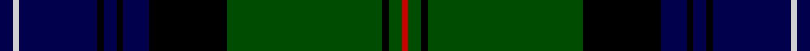

In pattern [BWBKBKBKGKGR](/stripes/bwbkbkbkgkgr/).

This was sourced from weddslist.  It is a [12 stripe tartan](/stripes/stripes12/).

Original link http://www.weddslist.com/cgi-bin/tartans/pg.pl?source=rb

## Thread count
DB/4 N2 DB24 K2 DB4 K2 DB8 K24 G48 K2 G4 R/2

## Palette
Each colour and the base-6 reference it is a variant of.

| Colour | Shade | Base |
|---|---|---|
| DB | <code style="background-color:#00004C;">#00004C</code> `oklch(18.8% 0.130 264.1)` <small>#00004C</small> | B <code style="background-color:#2A418A;">#2A418A</code> |
| G | <code style="background-color:#004C00;">#004C00</code> `oklch(36.1% 0.123 142.5)` <small>#004C00</small> | G <code style="background-color:#006100;">#006100</code> |
| K | <code style="background-color:#000000;">#000000</code> `oklch(0.0% 0.000 0.0)` <small>#000000</small> | K <code style="background-color:#000000;">#000000</code> |
| N | <code style="background-color:#D0D0D0;">#D0D0D0</code> `oklch(85.8% 0.000 89.9)` <small>#D0D0D0</small> | W <code style="background-color:#F7F7F7;">#F7F7F7</code> |
| R | <code style="background-color:#C80000;">#C80000</code> `oklch(52.3% 0.215 29.2)` <small>#C80000</small> | R <code style="background-color:#CC0000;">#CC0000</code> |

## Nearest tartans

The nearest existing variants by ΔTartan distance.

1. [Urquhart](/setts/s12/db4lr2db24k3db3k3db8k24dg48k3dg3r2~x2/) — ΔT 0.43
1. [Urquhart](/setts/s12/db4lr2db24k3db3k3db8k24dg48k3dg3r2/) — ΔT 0.43
1. [Sutherland](/setts/s12/dg6lr2dg24k12db3k2db2k2db12r1db1r3~x2/) — ΔT 0.57
1. [Sutherland](/setts/s12/dg6lr2dg24k12db3k2db2k2db12r1db1r3/) — ΔT 0.57
1. [Sutherland](/setts/s12/dg6lb2dg24k12db3k2db2k2db12r1db1r3/) — ΔT 0.75
1. [Ogilvy Hunting](/setts/s9/db24ly2k8dg16k1dg3k1dg3r4~x2/) — ΔT 1.00
1. [Ogilvy VS](/setts/s8/db28ly1db2k16dg24k1dg2r3~x2/) — ΔT 1.06
1. [Urquhart - 1842 (Clan)](/setts/s12/db4w2db24k3db3k3db8k24g48k3g3r2~x2/) — ΔT 1.15
1. [MacThomas](/setts/s9/dg1dg1r2dg21k11db21r2db1db1~x2/) — ΔT 1.19
1. [Ogilvie of Inverarity (V.S.)](/setts/s14/db28ly1db2k26g24k1g2r3~x2/) — ΔT 1.21

## Neighbour map

Every grey dot is one of 14299 variants placed by the first two principal components of the ΔTartan feature space (44% of its variance). Red is this tartan; blue dots are its nearest — click one to open its page.

<svg viewBox="0 0 640 380" role="img" style="max-width:100%;height:auto;border:1px solid #e0e0e0;border-radius:4px;display:block" xmlns="http://www.w3.org/2000/svg"><image href="/nn/cloud.v1.png" width="640" height="380"/><a href="/setts/s12/db4lr2db24k3db3k3db8k24dg48k3dg3r2~x2/"><circle cx="264.4" cy="130.7" r="4" fill="#3465a4"><title>Urquhart</title></circle></a><a href="/setts/s12/db4lr2db24k3db3k3db8k24dg48k3dg3r2/"><circle cx="264.4" cy="130.7" r="4" fill="#3465a4"><title>Urquhart</title></circle></a><a href="/setts/s12/dg6lr2dg24k12db3k2db2k2db12r1db1r3~x2/"><circle cx="247.9" cy="131.1" r="4" fill="#3465a4"><title>Sutherland</title></circle></a><a href="/setts/s12/dg6lr2dg24k12db3k2db2k2db12r1db1r3/"><circle cx="247.9" cy="131.1" r="4" fill="#3465a4"><title>Sutherland</title></circle></a><a href="/setts/s12/dg6lb2dg24k12db3k2db2k2db12r1db1r3/"><circle cx="232.8" cy="123.7" r="4" fill="#3465a4"><title>Sutherland</title></circle></a><a href="/setts/s9/db24ly2k8dg16k1dg3k1dg3r4~x2/"><circle cx="225.8" cy="139.3" r="4" fill="#3465a4"><title>Ogilvy Hunting</title></circle></a><a href="/setts/s8/db28ly1db2k16dg24k1dg2r3~x2/"><circle cx="250.2" cy="147.2" r="4" fill="#3465a4"><title>Ogilvy VS</title></circle></a><a href="/setts/s12/db4w2db24k3db3k3db8k24g48k3g3r2~x2/"><circle cx="268.3" cy="128.4" r="4" fill="#3465a4"><title>Urquhart - 1842 (Clan)</title></circle></a><a href="/setts/s9/dg1dg1r2dg21k11db21r2db1db1~x2/"><circle cx="259.3" cy="160.3" r="4" fill="#3465a4"><title>MacThomas</title></circle></a><a href="/setts/s14/db28ly1db2k26g24k1g2r3~x2/"><circle cx="251.9" cy="123.7" r="4" fill="#3465a4"><title>Ogilvie of Inverarity (V.S.)</title></circle></a><circle cx="259.6" cy="124.9" r="5" fill="#c00000"/></svg>

ID: /setts/s12/db2lb1db12k1db2k1db4k12dg24k1dg2r1~x2/
