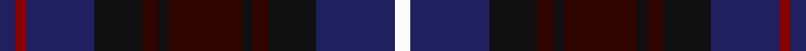

In pattern [BRBKKKKKKKBW](/stripes/brbkkkkkkkbw/).

This was sourced from tartans-authority.  It is a [12 stripe tartan](/stripes/stripes12/).

Original link http://www.tartansauthority.com/tartan-ferret/display/11155/

## Thread count
DB/6 DRa4 DB26 K18 DR6 K4 DR28 K4 DR6 K18 DB30 W/6

## Palette
Each colour and the base-6 reference it is a variant of.

| Colour | Shade | Base |
|---|---|---|
| DB | <code style="background-color:#202060;">#202060</code> `oklch(28.9% 0.111 276.9)` <small>#202060</small> | B <code style="background-color:#2A418A;">#2A418A</code> |
| DR | <code style="background-color:#300500;">#300500</code> `oklch(20.3% 0.072 34.5)` <small>#300500</small> | K <code style="background-color:#000000;">#000000</code> |
| DRa | <code style="background-color:#880000;">#880000</code> `oklch(39.4% 0.162 29.2)` <small>#880000</small> | R <code style="background-color:#CC0000;">#CC0000</code> |
| K | <code style="background-color:#101010;">#101010</code> `oklch(17.3% 0.000 89.9)` <small>#101010</small> | K <code style="background-color:#000000;">#000000</code> |
| W | <code style="background-color:#FCFCFC;">#FCFCFC</code> `oklch(99.1% 0.000 89.9)` <small>#FCFCFC</small> | W <code style="background-color:#F7F7F7;">#F7F7F7</code> |

## Nearest tartans

The nearest existing variants by ΔTartan distance.

1. [McWilliams Dress (2014)](/setts/s12/dt3r2dt13k9do3k2do14k2do3k9dt15lb3~x2/) — ΔT 1.09
1. [Stephenson Htg (Name)](/setts/s15/dg2k1db9k9dg9k1w1k2w1k1dg9k9db9k1r2~x4/) — ΔT 1.20
1. [Westwood MacPoiret (Fashion)](/setts/s13/db21o3db3o3db3k20dp18w3dp18k20db18o3db3~x2/) — ΔT 1.23
1. [Humphries (Personal)](/setts/s14/k16k4k4k4k6k14dg17k2r3k2dg17k14k18w4~x2/) — ΔT 1.23
1. [MacAllum of Berwick (Clan?)](/setts/s9/db10r7db31k25dg23k8db7r8ly5~x2/) — ΔT 1.25
1. [United Scots American](/setts/s11/dp3dt12db2dt2db11dp2db11r2db2r10w3~x2/) — ΔT 1.27
1. [Bannatyne (Corporate)](/setts/s12/k8r8k42k4k4k4k4k20dg4k10dg25w8/) — ΔT 1.28
1. [Haus of RvR](/setts/s11/db13w2db13k3db13k21lo3k18db9k2db2~x2/) — ΔT 1.31
1. [Scottish Women's Rural Institutes, The](/setts/s12/db4lo3db24k18dg24t3dg4lo3dg24k18db24t3~x2/) — ΔT 1.31
1. [Bamcroft (Corporate)](/setts/s15/db11ly2db2r2db2k11db11k2db3k2db11k11db11k2r3~x2/) — ΔT 1.33

## Neighbour map

Every grey dot is one of 14299 variants placed by the first two principal components of the ΔTartan feature space (44% of its variance). Red is this tartan; blue dots are its nearest — click one to open its page.

<svg viewBox="0 0 640 380" role="img" style="max-width:100%;height:auto;border:1px solid #e0e0e0;border-radius:4px;display:block" xmlns="http://www.w3.org/2000/svg"><image href="/nn/cloud.v1.png" width="640" height="380"/><a href="/setts/s12/dt3r2dt13k9do3k2do14k2do3k9dt15lb3~x2/"><circle cx="222.8" cy="224.9" r="4" fill="#3465a4"><title>McWilliams Dress (2014)</title></circle></a><a href="/setts/s15/dg2k1db9k9dg9k1w1k2w1k1dg9k9db9k1r2~x4/"><circle cx="190.6" cy="186.7" r="4" fill="#3465a4"><title>Stephenson Htg (Name)</title></circle></a><a href="/setts/s13/db21o3db3o3db3k20dp18w3dp18k20db18o3db3~x2/"><circle cx="172.1" cy="199.3" r="4" fill="#3465a4"><title>Westwood MacPoiret (Fashion)</title></circle></a><a href="/setts/s14/k16k4k4k4k6k14dg17k2r3k2dg17k14k18w4~x2/"><circle cx="182.0" cy="212.0" r="4" fill="#3465a4"><title>Humphries (Personal)</title></circle></a><a href="/setts/s9/db10r7db31k25dg23k8db7r8ly5~x2/"><circle cx="165.0" cy="230.0" r="4" fill="#3465a4"><title>MacAllum of Berwick (Clan?)</title></circle></a><a href="/setts/s11/dp3dt12db2dt2db11dp2db11r2db2r10w3~x2/"><circle cx="195.4" cy="211.8" r="4" fill="#3465a4"><title>United Scots American</title></circle></a><a href="/setts/s12/k8r8k42k4k4k4k4k20dg4k10dg25w8/"><circle cx="214.3" cy="184.1" r="4" fill="#3465a4"><title>Bannatyne (Corporate)</title></circle></a><a href="/setts/s11/db13w2db13k3db13k21lo3k18db9k2db2~x2/"><circle cx="244.1" cy="207.0" r="4" fill="#3465a4"><title>Haus of RvR</title></circle></a><a href="/setts/s12/db4lo3db24k18dg24t3dg4lo3dg24k18db24t3~x2/"><circle cx="201.4" cy="226.1" r="4" fill="#3465a4"><title>Scottish Women's Rural Institutes, The</title></circle></a><a href="/setts/s15/db11ly2db2r2db2k11db11k2db3k2db11k11db11k2r3~x2/"><circle cx="178.6" cy="229.2" r="4" fill="#3465a4"><title>Bamcroft (Corporate)</title></circle></a><circle cx="206.7" cy="215.1" r="5" fill="#c00000"/></svg>

ID: /setts/s12/db3r2db13k9k3k2k14k2k3k9db15w3~x2/
