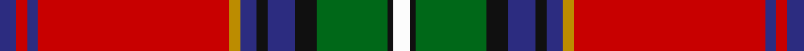

This page is one **sett** — a single exact thread-count. It belongs to the [tartan](/tartans/db3r2db2r35lo2db3k2db5k4g13k1w3/)
(the same proportion at any scale), whose colour order is pattern [BRBRYBKBKGKW](/stripes/brbrybkbkgkw/).

Sourced from tartans-authority.  It is a [12 stripe tartan](/stripes/stripes12/).

Original link http://www.tartansauthority.com/tartan-ferret/display/10411/

## Register references

External register numbers recorded for this tartan.

- Scottish Register of Tartans: [10411](https://www.tartanregister.gov.uk/tartanDetails?ref=10411)
- Scottish Tartans Authority (ITI): 10411

## Thread count
DB/6 R4 DB4 R70 DY4 DB6 K4 DB10 K8 G26 K2 W/6

## Palette

Palette: <strong>Tartan Register</strong>
<table><thead><tr><th>Colour</th><th>Threads</th><th>Shade</th><th>Base</th><th>OKLCh</th></tr></thead><tbody><tr><td>DB/</td><td style="text-align:right;font-variant-numeric:tabular-nums">6</td><td><code style="background-color:#2C2C80;">#2C2C80</code> <small style="color:#888">#2C2C80</small></td><td>B <code style="background-color:#2A418A;">#2A418A</code></td><td><small style="color:#888">oklch(35.0% 0.138 276.6)</small></td></tr><tr><td>R</td><td style="text-align:right;font-variant-numeric:tabular-nums">4</td><td><code style="background-color:#C80000;">#C80000</code> <small style="color:#888">#C80000</small></td><td>R <code style="background-color:#CC0000;">#CC0000</code></td><td><small style="color:#888">oklch(52.3% 0.215 29.2)</small></td></tr><tr><td>DB</td><td style="text-align:right;font-variant-numeric:tabular-nums">4</td><td><code style="background-color:#2C2C80;">#2C2C80</code> <small style="color:#888">#2C2C80</small></td><td>B <code style="background-color:#2A418A;">#2A418A</code></td><td><small style="color:#888">oklch(35.0% 0.138 276.6)</small></td></tr><tr><td>R</td><td style="text-align:right;font-variant-numeric:tabular-nums">70</td><td><code style="background-color:#C80000;">#C80000</code> <small style="color:#888">#C80000</small></td><td>R <code style="background-color:#CC0000;">#CC0000</code></td><td><small style="color:#888">oklch(52.3% 0.215 29.2)</small></td></tr><tr><td>DY</td><td style="text-align:right;font-variant-numeric:tabular-nums">4</td><td><code style="background-color:#BC8C00;">#BC8C00</code> <small style="color:#888">#BC8C00</small></td><td>Y <code style="background-color:#F2BF00;">#F2BF00</code></td><td><small style="color:#888">oklch(66.8% 0.137 84.1)</small></td></tr><tr><td>DB</td><td style="text-align:right;font-variant-numeric:tabular-nums">6</td><td><code style="background-color:#2C2C80;">#2C2C80</code> <small style="color:#888">#2C2C80</small></td><td>B <code style="background-color:#2A418A;">#2A418A</code></td><td><small style="color:#888">oklch(35.0% 0.138 276.6)</small></td></tr><tr><td>K</td><td style="text-align:right;font-variant-numeric:tabular-nums">4</td><td><code style="background-color:#101010;">#101010</code> <small style="color:#888">#101010</small></td><td>K <code style="background-color:#000000;">#000000</code></td><td><small style="color:#888">oklch(17.3% 0.000 89.9)</small></td></tr><tr><td>DB</td><td style="text-align:right;font-variant-numeric:tabular-nums">10</td><td><code style="background-color:#2C2C80;">#2C2C80</code> <small style="color:#888">#2C2C80</small></td><td>B <code style="background-color:#2A418A;">#2A418A</code></td><td><small style="color:#888">oklch(35.0% 0.138 276.6)</small></td></tr><tr><td>K</td><td style="text-align:right;font-variant-numeric:tabular-nums">8</td><td><code style="background-color:#101010;">#101010</code> <small style="color:#888">#101010</small></td><td>K <code style="background-color:#000000;">#000000</code></td><td><small style="color:#888">oklch(17.3% 0.000 89.9)</small></td></tr><tr><td>G</td><td style="text-align:right;font-variant-numeric:tabular-nums">26</td><td><code style="background-color:#006818;">#006818</code> <small style="color:#888">#006818</small></td><td>G <code style="background-color:#006100;">#006100</code></td><td><small style="color:#888">oklch(45.0% 0.142 145.0)</small></td></tr><tr><td>K</td><td style="text-align:right;font-variant-numeric:tabular-nums">2</td><td><code style="background-color:#101010;">#101010</code> <small style="color:#888">#101010</small></td><td>K <code style="background-color:#000000;">#000000</code></td><td><small style="color:#888">oklch(17.3% 0.000 89.9)</small></td></tr><tr><td>W/</td><td style="text-align:right;font-variant-numeric:tabular-nums">6</td><td><code style="background-color:#FCFCFC;">#FCFCFC</code> <small style="color:#888">#FCFCFC</small></td><td>W <code style="background-color:#F7F7F7;">#F7F7F7</code></td><td><small style="color:#888">oklch(99.1% 0.000 89.9)</small></td></tr></tbody></table>

## Nearest tartans

The nearest existing variants by ΔTartan distance, with this tartan at the top so the swatches line up against it.

ΔTartan

Tartan

Sett

—

<a href="/ttd/edit/#slug=db3r2db2r35lo2db3k2db5k4g13k1w3~x2">Celtic Nations (Fashion)</a> <a class="nn-out" href="/setts/s12/db3r2db2r35lo2db3k2db5k4g13k1w3~x2/" title="open its dictionary page">↗</a>

0.81

<a href="/ttd/edit/#slug=r34w1db10g10w1ly1g2t2w1db2t10r6w1~x2">Holyrood, Chair</a> <a class="nn-out" href="/setts/s13/r34w1db10g10w1ly1g2t2w1db2t10r6w1~x2/" title="open its dictionary page">↗</a>

0.82

<a href="/ttd/edit/#slug=w2r2db14g16ly2k2g2r35g1~x2">King (Austria) (Personal)</a> <a class="nn-out" href="/setts/s9/w2r2db14g16ly2k2g2r35g1~x2/" title="open its dictionary page">↗</a>

0.86

<a href="/ttd/edit/#slug=t14k8ly2k3w4k3dg21r48t4r5k3~x2">MacLean of Duart #5</a> <a class="nn-out" href="/setts/s11/t14k8ly2k3w4k3dg21r48t4r5k3~x2/" title="open its dictionary page">↗</a>

0.91

<a href="/ttd/edit/#slug=ly2dg4dt1r3dt3dg3g1r32dt14w3ly2~x2">Banause-Zunft zu Olte</a> <a class="nn-out" href="/setts/s11/ly2dg4dt1r3dt3dg3g1r32dt14w3ly2~x2/" title="open its dictionary page">↗</a>

0.92

<a href="/ttd/edit/#slug=t4dp8w2g32w2r8ri4dp2ri4r8w2dp16r65w2dp8t4w2~x2">Birral/Burrell</a> <a class="nn-out" href="/setts/s17/t4dp8w2g32w2r8ri4dp2ri4r8w2dp16r65w2dp8t4w2~x2/" title="open its dictionary page">↗</a>

0.92

<a href="/ttd/edit/#slug=r65w2dp8t4w2t4dp8w2g32w2r8ri4dp2ri4r8w2dp16~x2">Birral (Clan)</a> <a class="nn-out" href="/setts/s17/r65w2dp8t4w2t4dp8w2g32w2r8ri4dp2ri4r8w2dp16~x2/" title="open its dictionary page">↗</a>

0.93

<a href="/setts/s14/w4dt4r18o4r1o36ki1o4ki6r2ki6r6k4r2~x2/">Mehrtens variant (Personal)</a>

0.94

<a href="/ttd/edit/#slug=r64t12k16ly2k4w3dg32r8k4r3w2~x2">Royal Stewart</a> <a class="nn-out" href="/setts/s11/r64t12k16ly2k4w3dg32r8k4r3w2~x2/" title="open its dictionary page">↗</a>

0.98

<a href="/ttd/edit/#slug=db3r2db2r35ly2db3k2db5k4g13k1w3~x2">Celtic Nations</a> <a class="nn-out" href="/setts/s12/db3r2db2r35ly2db3k2db5k4g13k1w3~x2/" title="open its dictionary page">↗</a>

0.99

<a href="/ttd/edit/#slug=r48t8k10ly2k3w2g25r10k3r3w2~x2">Followers' Plaid</a> <a class="nn-out" href="/setts/s11/r48t8k10ly2k3w2g25r10k3r3w2~x2/" title="open its dictionary page">↗</a>

## Neighbour map

Every grey dot is one of 14359 variants placed by the first two principal components of the ΔTartan feature space (44% of its variance). Red is this tartan; blue dots are its nearest — click one to open its page.

<svg viewBox="0 0 640 380" role="img" style="max-width:100%;height:auto;border:1px solid #e0e0e0;border-radius:4px;display:block" xmlns="http://www.w3.org/2000/svg"><image href="/nn/cloud.v1.png" width="640" height="380"/><a href="/setts/s13/r34w1db10g10w1ly1g2t2w1db2t10r6w1~x2/"><circle cx="285.3" cy="56.8" r="4" fill="#3465a4"><title>Holyrood, Chair</title></circle></a><a href="/setts/s9/w2r2db14g16ly2k2g2r35g1~x2/"><circle cx="288.4" cy="77.0" r="4" fill="#3465a4"><title>King (Austria) (Personal)</title></circle></a><a href="/setts/s11/t14k8ly2k3w4k3dg21r48t4r5k3~x2/"><circle cx="232.6" cy="74.8" r="4" fill="#3465a4"><title>MacLean of Duart #5</title></circle></a><a href="/setts/s11/ly2dg4dt1r3dt3dg3g1r32dt14w3ly2~x2/"><circle cx="309.0" cy="73.3" r="4" fill="#3465a4"><title>Banause-Zunft zu Olte</title></circle></a><a href="/setts/s17/t4dp8w2g32w2r8ri4dp2ri4r8w2dp16r65w2dp8t4w2~x2/"><circle cx="268.6" cy="36.5" r="4" fill="#3465a4"><title>Birral/Burrell</title></circle></a><a href="/setts/s17/r65w2dp8t4w2t4dp8w2g32w2r8ri4dp2ri4r8w2dp16~x2/"><circle cx="268.6" cy="36.5" r="4" fill="#3465a4"><title>Birral (Clan)</title></circle></a><a href="/setts/s14/w4dt4r18o4r1o36ki1o4ki6r2ki6r6k4r2~x2/"><circle cx="244.0" cy="51.2" r="4" fill="#3465a4"><title>Mehrtens variant (Personal)</title></circle></a><a href="/setts/s11/r64t12k16ly2k4w3dg32r8k4r3w2~x2/"><circle cx="265.4" cy="61.1" r="4" fill="#3465a4"><title>Royal Stewart</title></circle></a><a href="/setts/s12/db3r2db2r35ly2db3k2db5k4g13k1w3~x2/"><circle cx="254.8" cy="34.1" r="4" fill="#3465a4"><title>Celtic Nations</title></circle></a><a href="/setts/s11/r48t8k10ly2k3w2g25r10k3r3w2~x2/"><circle cx="280.4" cy="76.3" r="4" fill="#3465a4"><title>Followers' Plaid</title></circle></a><circle cx="279.2" cy="50.5" r="5" fill="#c00000"/></svg>

ID: /setts/s12/db3r2db2r35lo2db3k2db5k4g13k1w3~x2/
