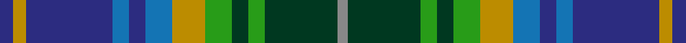

In pattern [BYBBBBYGGGGR](/stripes/bybbbbyggggr/).

This was sourced from tartans-authority.  It is a [12 stripe tartan](/stripes/stripes12/).

Original link http://www.tartansauthority.com/tartan-ferret/display/8640/

## Thread count
DB/8 DY8 DB52 B10 DB10 B16 DY20 G16 DG10 G10 DG44 N/6

## Palette
Each colour and the base-6 reference it is a variant of.

| Colour | Shade | Base |
|---|---|---|
| B | <code style="background-color:#1474B4;">#1474B4</code> `oklch(54.0% 0.129 245.1)` <small>#1474B4</small> | B <code style="background-color:#2A418A;">#2A418A</code> |
| DB | <code style="background-color:#2C2C80;">#2C2C80</code> `oklch(35.0% 0.138 276.6)` <small>#2C2C80</small> | B <code style="background-color:#2A418A;">#2A418A</code> |
| DG | <code style="background-color:#003820;">#003820</code> `oklch(30.0% 0.070 158.3)` <small>#003820</small> | G <code style="background-color:#006100;">#006100</code> |
| DY | <code style="background-color:#BC8C00;">#BC8C00</code> `oklch(66.8% 0.137 84.1)` <small>#BC8C00</small> | Y <code style="background-color:#F2BF00;">#F2BF00</code> |
| G | <code style="background-color:#289C18;">#289C18</code> `oklch(60.6% 0.191 141.6)` <small>#289C18</small> | G <code style="background-color:#006100;">#006100</code> |
| N | <code style="background-color:#888888;">#888888</code> `oklch(62.7% 0.000 89.9)` <small>#888888</small> | R <code style="background-color:#CC0000;">#CC0000</code> |

## Nearest tartans

The nearest existing variants by ΔTartan distance.

1. [Patterson, William John Magee (Personal)](/setts/s12/db9n3db2lb2db9n6db3lb3db3g18dg8r2~x2/) — ΔT 0.55
1. [State Seal of Kentucky (Fashion)](/setts/s11/lb6g13k12b3k3lo3b30k3o11lo3o5~x2/) — ΔT 0.76
1. [State Seal of Nebraska (Fashion)](/setts/s10/lo7g11db4t31db4g11dy4db14lb3db4~x2/) — ΔT 0.90
1. [Ithilien Heather (Personal)](/setts/s9/g20r2y3dt12k20r2t3dt4t3~x2/) — ΔT 0.92
1. [Haines Family (Personal)](/setts/s10/r2y6t1y1t1y1t3dt8ly1b1~x4/) — ΔT 0.93
1. [Penman Family Tartan Tartan Number: 167. Earliest known date: pre 1992 The late William Penman supplied members of the Penman family with this tartan for many years. See products available Copyright © Blair Urquhart, Comrie, 2015](/setts/s14/o11db6g6ly1db2ly1g6db6o11k1r3k1g5db5~x2/) — ΔT 0.97
1. [Patterson, William J.M. (Personal)](/setts/s12/db9o3db2w2db9o6db3w3db3y18dg8r2~x2/) — ΔT 1.00
1. [Paisley](/setts/s12/g7r2g3r5g17ly2k15ly2t22g3w2t7~x2/) — ΔT 1.01
1. [Royal Pharmaceutical Society Commemorative Tartan Tartan Number: 2091. Earliest known date: 1991 Created by Kinloch Anderson of Edinburgh for the 150th Anniversary of the Royal Pharmaceutical Society of Great Britain which was held at Scone Palace, Perthshire in 1991. See products available Copyright © Blair Urquhart, Comrie, 2015](/setts/s10/do3db2g19db6g2db6lo14w2dp4w2~x2/) — ΔT 1.01
1. [Drennan](/setts/s12/db7w3g3db18lo3k15lo3g17r6g3r2g7~x2/) — ΔT 1.02

## Neighbour map

Every grey dot is one of 14299 variants placed by the first two principal components of the ΔTartan feature space (44% of its variance). Red is this tartan; blue dots are its nearest — click one to open its page.

<svg viewBox="0 0 640 380" role="img" style="max-width:100%;height:auto;border:1px solid #e0e0e0;border-radius:4px;display:block" xmlns="http://www.w3.org/2000/svg"><image href="/nn/cloud.v1.png" width="640" height="380"/><a href="/setts/s12/db9n3db2lb2db9n6db3lb3db3g18dg8r2~x2/"><circle cx="137.6" cy="166.5" r="4" fill="#3465a4"><title>Patterson, William John Magee (Personal)</title></circle></a><a href="/setts/s11/lb6g13k12b3k3lo3b30k3o11lo3o5~x2/"><circle cx="120.9" cy="147.0" r="4" fill="#3465a4"><title>State Seal of Kentucky (Fashion)</title></circle></a><a href="/setts/s10/lo7g11db4t31db4g11dy4db14lb3db4~x2/"><circle cx="137.9" cy="165.0" r="4" fill="#3465a4"><title>State Seal of Nebraska (Fashion)</title></circle></a><a href="/setts/s9/g20r2y3dt12k20r2t3dt4t3~x2/"><circle cx="120.6" cy="164.0" r="4" fill="#3465a4"><title>Ithilien Heather (Personal)</title></circle></a><a href="/setts/s10/r2y6t1y1t1y1t3dt8ly1b1~x4/"><circle cx="131.7" cy="163.1" r="4" fill="#3465a4"><title>Haines Family (Personal)</title></circle></a><a href="/setts/s14/o11db6g6ly1db2ly1g6db6o11k1r3k1g5db5~x2/"><circle cx="128.6" cy="158.6" r="4" fill="#3465a4"><title>Penman Family Tartan Tartan Number: 167. Earliest known date: pre 1992 The late William Penman supplied members of the Penman family with this tartan for many years. See products available Copyright © Blair Urquhart, Comrie, 2015</title></circle></a><a href="/setts/s12/db9o3db2w2db9o6db3w3db3y18dg8r2~x2/"><circle cx="148.3" cy="166.9" r="4" fill="#3465a4"><title>Patterson, William J.M. (Personal)</title></circle></a><a href="/setts/s12/g7r2g3r5g17ly2k15ly2t22g3w2t7~x2/"><circle cx="145.1" cy="146.4" r="4" fill="#3465a4"><title>Paisley</title></circle></a><a href="/setts/s10/do3db2g19db6g2db6lo14w2dp4w2~x2/"><circle cx="129.1" cy="151.6" r="4" fill="#3465a4"><title>Royal Pharmaceutical Society Commemorative Tartan Tartan Number: 2091. Earliest known date: 1991 Created by Kinloch Anderson of Edinburgh for the 150th Anniversary of the Royal Pharmaceutical Society of Great Britain which was held at Scone Palace, Perthshire in 1991. See products available Copyright © Blair Urquhart, Comrie, 2015</title></circle></a><a href="/setts/s12/db7w3g3db18lo3k15lo3g17r6g3r2g7~x2/"><circle cx="106.8" cy="160.1" r="4" fill="#3465a4"><title>Drennan</title></circle></a><circle cx="108.6" cy="165.5" r="5" fill="#c00000"/></svg>

ID: /setts/s12/db4lo4db26b5db5b8lo10g8dg5g5dg22o3~x2/
