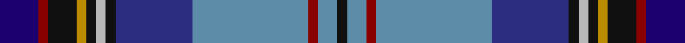

This page is one **sett** — a single exact thread-count. It belongs to the [tartan](/tartans/db4r1k3lo1k1lr1k1dbi8t12r1t2k1/)
(the same proportion at any scale), whose colour order is pattern [BRKYKYKBBRBK](/stripes/brkykykbbrbk/).

Sourced from register-of-tartans.  It is a [12 stripe tartan](/stripes/stripes12/).

Original link https://www.tartanregister.gov.uk/tartanDetails.aspx?ref=4836

## Register references

External register numbers recorded for this tartan.

- Scottish Register of Tartans: [4836](https://www.tartanregister.gov.uk/tartanDetails.aspx?ref=4836)
- Scottish Tartans Authority (ITI): 3442

## Thread count
DBa/16 DR4 K12 DY4 K4 N4 K4 DB32 B48 DR4 B8 K/4

## Palette

Palette: <strong>Tartan Register</strong> <small style="color:#888">(6 of 7 colours)</small>
<table><thead><tr><th>Colour</th><th>Threads</th><th>Shade</th><th>Base</th><th>OKLCh</th></tr></thead><tbody><tr><td>DBa/</td><td style="text-align:right;font-variant-numeric:tabular-nums">16</td><td><code style="background-color:#1C0070;">#1C0070</code> <small style="color:#888">#1C0070</small></td><td>B <code style="background-color:#2A418A;">#2A418A</code></td><td><small style="color:#888">oklch(26.3% 0.162 277.1)</small></td></tr><tr><td>DR</td><td style="text-align:right;font-variant-numeric:tabular-nums">4</td><td><code style="background-color:#880000;">#880000</code> <small style="color:#888">#880000</small></td><td>R <code style="background-color:#CC0000;">#CC0000</code></td><td><small style="color:#888">oklch(39.4% 0.162 29.2)</small></td></tr><tr><td>K</td><td style="text-align:right;font-variant-numeric:tabular-nums">12</td><td><code style="background-color:#101010;">#101010</code> <small style="color:#888">#101010</small></td><td>K <code style="background-color:#000000;">#000000</code></td><td><small style="color:#888">oklch(17.3% 0.000 89.9)</small></td></tr><tr><td>DY</td><td style="text-align:right;font-variant-numeric:tabular-nums">4</td><td><code style="background-color:#BC8C00;">#BC8C00</code> <small style="color:#888">#BC8C00</small></td><td>Y <code style="background-color:#F2BF00;">#F2BF00</code></td><td><small style="color:#888">oklch(66.8% 0.137 84.1)</small></td></tr><tr><td>K</td><td style="text-align:right;font-variant-numeric:tabular-nums">4</td><td><code style="background-color:#101010;">#101010</code> <small style="color:#888">#101010</small></td><td>K <code style="background-color:#000000;">#000000</code></td><td><small style="color:#888">oklch(17.3% 0.000 89.9)</small></td></tr><tr><td>N</td><td style="text-align:right;font-variant-numeric:tabular-nums">4</td><td><code style="background-color:#B8B8B8;">#B8B8B8</code> <small style="color:#888">#B8B8B8</small></td><td>Y <code style="background-color:#F2BF00;">#F2BF00</code></td><td><small style="color:#888">oklch(78.3% 0.000 89.9)</small></td></tr><tr><td>K</td><td style="text-align:right;font-variant-numeric:tabular-nums">4</td><td><code style="background-color:#101010;">#101010</code> <small style="color:#888">#101010</small></td><td>K <code style="background-color:#000000;">#000000</code></td><td><small style="color:#888">oklch(17.3% 0.000 89.9)</small></td></tr><tr><td>DB</td><td style="text-align:right;font-variant-numeric:tabular-nums">32</td><td><code style="background-color:#2C2C80;">#2C2C80</code> <small style="color:#888">#2C2C80</small></td><td>B <code style="background-color:#2A418A;">#2A418A</code></td><td><small style="color:#888">oklch(35.0% 0.138 276.6)</small></td></tr><tr><td>B</td><td style="text-align:right;font-variant-numeric:tabular-nums">48</td><td><code style="background-color:#5C8CA8;">#5C8CA8</code> <small style="color:#888">#5C8CA8</small></td><td>B <code style="background-color:#2A418A;">#2A418A</code></td><td><small style="color:#888">oklch(61.7% 0.067 235.0)</small></td></tr><tr><td>DR</td><td style="text-align:right;font-variant-numeric:tabular-nums">4</td><td><code style="background-color:#880000;">#880000</code> <small style="color:#888">#880000</small></td><td>R <code style="background-color:#CC0000;">#CC0000</code></td><td><small style="color:#888">oklch(39.4% 0.162 29.2)</small></td></tr><tr><td>B</td><td style="text-align:right;font-variant-numeric:tabular-nums">8</td><td><code style="background-color:#5C8CA8;">#5C8CA8</code> <small style="color:#888">#5C8CA8</small></td><td>B <code style="background-color:#2A418A;">#2A418A</code></td><td><small style="color:#888">oklch(61.7% 0.067 235.0)</small></td></tr><tr><td>K/</td><td style="text-align:right;font-variant-numeric:tabular-nums">4</td><td><code style="background-color:#101010;">#101010</code> <small style="color:#888">#101010</small></td><td>K <code style="background-color:#000000;">#000000</code></td><td><small style="color:#888">oklch(17.3% 0.000 89.9)</small></td></tr></tbody></table>

## Nearest tartans

The nearest existing variants by ΔTartan distance, with this tartan at the top so the swatches line up against it.

ΔTartan

Tartan

Sett

—

<a href="/ttd/edit/#slug=db4r1k3lo1k1lr1k1dbi8t12r1t2k1~x4">MacLean (Dress)</a> <a class="nn-out" href="/setts/s12/db4r1k3lo1k1lr1k1dbi8t12r1t2k1~x4/" title="open its dictionary page">↗</a>

0.90

<a href="/ttd/edit/#slug=db24g2db12k2w2k3dp2k3b4k3dp2k3w2k2r12g2b24~x2">Selkirk, New (District)</a> <a class="nn-out" href="/setts/s17/db24g2db12k2w2k3dp2k3b4k3dp2k3w2k2r12g2b24~x2/" title="open its dictionary page">↗</a>

0.93

<a href="/ttd/edit/#slug=r2db22dy4lr3dg7ly2dg4lr2dg9dp6ly2dp4lr2~x2">Man, Isle of</a> <a class="nn-out" href="/setts/s13/r2db22dy4lr3dg7ly2dg4lr2dg9dp6ly2dp4lr2~x2/" title="open its dictionary page">↗</a>

1.07

<a href="/ttd/edit/#slug=k1ri4k1w3k1g7k2db16r2lo1~x2">Twempy</a> <a class="nn-out" href="/setts/s10/k1ri4k1w3k1g7k2db16r2lo1~x2/" title="open its dictionary page">↗</a>

1.12

<a href="/ttd/edit/#slug=r2db14k2o5g3lb1g3lb1g3k1g3k1g3o5k2db14lo2~x2">Service of Drymen (Personal)</a> <a class="nn-out" href="/setts/s17/r2db14k2o5g3lb1g3lb1g3k1g3k1g3o5k2db14lo2~x2/" title="open its dictionary page">↗</a>

1.13

<a href="/ttd/edit/#slug=r2db14k2o5g3w1g3w1g3k1g3k1g3o5k2db14ly2~x2">Service of Drymen Corporate Tartan Tartan Number: 1380. Earliest known date: pre 2003 The design is based on the Sillers connection with the Isle of Arran and the Clan Stewart. See products available Copyright © Blair Urquhart, Comrie, 2015</a> <a class="nn-out" href="/setts/s17/r2db14k2o5g3w1g3w1g3k1g3k1g3o5k2db14ly2~x2/" title="open its dictionary page">↗</a>

1.14

<a href="/ttd/edit/#slug=db16ti8lo1ti1w1ti1t6g3ti1g3w1~x4">Brighton &amp; Hove</a> <a class="nn-out" href="/setts/s11/db16ti8lo1ti1w1ti1t6g3ti1g3w1~x4/" title="open its dictionary page">↗</a>

1.14

<a href="/ttd/edit/#slug=w3db5b2db9dp10k2dp4k2gi10g33w2~x2">Inverclyde, Green (Corporate)</a> <a class="nn-out" href="/setts/s11/w3db5b2db9dp10k2dp4k2gi10g33w2~x2/" title="open its dictionary page">↗</a>

1.15

<a href="/ttd/edit/#slug=w4dbi8r3dbi25k13db4t29dbi3t8dbi2r3~x2">Royal Air Force Regimental Tartan Tartan Number: 2123. Earliest known date: 1988 The Royal Air Force initially declined to approve this tartan for members of the Air Services. However the tartan was worn by Scottish ex-servicemen and those who have served in Scotland and became quite popular. In 2002 it was officially adopted by the RAF. See products available Copyright © Blair Urquhart, Comrie, 2015</a> <a class="nn-out" href="/setts/s11/w4dbi8r3dbi25k13db4t29dbi3t8dbi2r3~x2/" title="open its dictionary page">↗</a>

1.17

<a href="/ttd/edit/#slug=w4db8m3db25k13g4t29db3t8db2m3~x2">Air Force</a> <a class="nn-out" href="/setts/s11/w4db8m3db25k13g4t29db3t8db2m3~x2/" title="open its dictionary page">↗</a>

1.20

<a href="/ttd/edit/#slug=w3dbi1g18r3t4r3db4dbi3db2dbi24ri1~x2">Queen of the South Football Club</a> <a class="nn-out" href="/setts/s11/w3dbi1g18r3t4r3db4dbi3db2dbi24ri1~x2/" title="open its dictionary page">↗</a>

## Neighbour map

Every grey dot is one of 14359 variants placed by the first two principal components of the ΔTartan feature space (44% of its variance). Red is this tartan; blue dots are its nearest — click one to open its page.

<svg viewBox="0 0 640 380" role="img" style="max-width:100%;height:auto;border:1px solid #e0e0e0;border-radius:4px;display:block" xmlns="http://www.w3.org/2000/svg"><image href="/nn/cloud.v1.png" width="640" height="380"/><a href="/setts/s17/db24g2db12k2w2k3dp2k3b4k3dp2k3w2k2r12g2b24~x2/"><circle cx="128.8" cy="93.2" r="4" fill="#3465a4"><title>Selkirk, New (District)</title></circle></a><a href="/setts/s13/r2db22dy4lr3dg7ly2dg4lr2dg9dp6ly2dp4lr2~x2/"><circle cx="96.8" cy="117.6" r="4" fill="#3465a4"><title>Man, Isle of</title></circle></a><a href="/setts/s10/k1ri4k1w3k1g7k2db16r2lo1~x2/"><circle cx="161.7" cy="96.1" r="4" fill="#3465a4"><title>Twempy</title></circle></a><a href="/setts/s17/r2db14k2o5g3lb1g3lb1g3k1g3k1g3o5k2db14lo2~x2/"><circle cx="154.5" cy="98.4" r="4" fill="#3465a4"><title>Service of Drymen (Personal)</title></circle></a><a href="/setts/s17/r2db14k2o5g3w1g3w1g3k1g3k1g3o5k2db14ly2~x2/"><circle cx="158.6" cy="98.2" r="4" fill="#3465a4"><title>Service of Drymen Corporate Tartan Tartan Number: 1380. Earliest known date: pre 2003 The design is based on the Sillers connection with the Isle of Arran and the Clan Stewart. See products available Copyright © Blair Urquhart, Comrie, 2015</title></circle></a><a href="/setts/s11/db16ti8lo1ti1w1ti1t6g3ti1g3w1~x4/"><circle cx="175.4" cy="117.5" r="4" fill="#3465a4"><title>Brighton &amp; Hove</title></circle></a><a href="/setts/s11/w3db5b2db9dp10k2dp4k2gi10g33w2~x2/"><circle cx="158.5" cy="97.5" r="4" fill="#3465a4"><title>Inverclyde, Green (Corporate)</title></circle></a><a href="/setts/s11/w4dbi8r3dbi25k13db4t29dbi3t8dbi2r3~x2/"><circle cx="174.7" cy="135.9" r="4" fill="#3465a4"><title>Royal Air Force Regimental Tartan Tartan Number: 2123. Earliest known date: 1988 The Royal Air Force initially declined to approve this tartan for members of the Air Services. However the tartan was worn by Scottish ex-servicemen and those who have served in Scotland and became quite popular. In 2002 it was officially adopted by the RAF. See products available Copyright © Blair Urquhart, Comrie, 2015</title></circle></a><a href="/setts/s11/w4db8m3db25k13g4t29db3t8db2m3~x2/"><circle cx="161.2" cy="130.8" r="4" fill="#3465a4"><title>Air Force</title></circle></a><a href="/setts/s11/w3dbi1g18r3t4r3db4dbi3db2dbi24ri1~x2/"><circle cx="199.7" cy="85.3" r="4" fill="#3465a4"><title>Queen of the South Football Club</title></circle></a><circle cx="143.7" cy="110.0" r="5" fill="#c00000"/></svg>

ID: /setts/s12/db4r1k3lo1k1lr1k1dbi8t12r1t2k1~x4/
