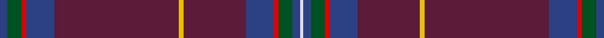

In pattern [BGRBBYBBRGBW](/stripes/bgrbbybbrgbw/).

This was sourced from register-of-tartans.  It is a [12 stripe tartan](/stripes/stripes12/).

Original link https://www.tartanregister.gov.uk/tartanDetails.aspx?ref=5848

## Register references

External register numbers recorded for this tartan.

- Scottish Register of Tartans: [5848](https://www.tartanregister.gov.uk/tartanDetails.aspx?ref=5848)
- Scottish Tartans World Register: 3143

## Thread count
B/10 G18 R6 B36 DR160 Y6 DR80 B36 R6 G18 B10 LN/4

## Palette
Each colour and the base-6 reference it is a variant of.

| Colour | Shade | Base |
|---|---|---|
| B | <code style="background-color:#2C4084;">#2C4084</code> `oklch(39.4% 0.117 268.3)` <small>#2C4084</small> | B <code style="background-color:#2A418A;">#2A418A</code> |
| DR | <code style="background-color:#5A1C38;">#5A1C38</code> `oklch(33.3% 0.096 355.7)` <small>#5A1C38</small> | B <code style="background-color:#2A418A;">#2A418A</code> |
| G | <code style="background-color:#005020;">#005020</code> `oklch(37.7% 0.105 149.6)` <small>#005020</small> | G <code style="background-color:#006100;">#006100</code> |
| LN | <code style="background-color:#E0E0E0;">#E0E0E0</code> `oklch(90.7% 0.000 89.9)` <small>#E0E0E0</small> | W <code style="background-color:#F7F7F7;">#F7F7F7</code> |
| R | <code style="background-color:#DC0000;">#DC0000</code> `oklch(56.2% 0.230 29.2)` <small>#DC0000</small> | R <code style="background-color:#CC0000;">#CC0000</code> |
| Y | <code style="background-color:#E8C000;">#E8C000</code> `oklch(81.9% 0.168 93.7)` <small>#E8C000</small> | Y <code style="background-color:#F2BF00;">#F2BF00</code> |

## Nearest tartans

The nearest existing variants by ΔTartan distance, with this tartan at the top so the swatches line up against it.

ΔTartan

Tartan

Sett

—

<a href="/ttd/edit/#slug=db5dg9r3db18dr80ly3dr40db18r3dg9db5w2~x2">Roseline</a> <a class="nn-out" href="/setts/s12/db5dg9r3db18dr80ly3dr40db18r3dg9db5w2~x2/" title="open its dictionary page">↗</a>

1.09

<a href="/ttd/edit/#slug=g6db3w1db3g6r2db15dp60lo2dp30db15r2~x2">Roslin Roseline Da Vinci</a> <a class="nn-out" href="/setts/s12/g6db3w1db3g6r2db15dp60lo2dp30db15r2~x2/" title="open its dictionary page">↗</a>

1.63

<a href="/ttd/edit/#slug=do68k4do18dt20k3lb3k10lr8lo4">Carbon</a> <a class="nn-out" href="/setts/s9/do68k4do18dt20k3lb3k10lr8lo4/" title="open its dictionary page">↗</a>

1.73

<a href="/ttd/edit/#slug=m50o6dr7g2dr2w2dr2o16m8dr2m9g3~x2">Tyrone</a> <a class="nn-out" href="/setts/s12/m50o6dr7g2dr2w2dr2o16m8dr2m9g3~x2/" title="open its dictionary page">↗</a>

1.76

<a href="/ttd/edit/#slug=r6lo1r24dg6db2k1db2k1db12r1~x2">MacEdward (MacGregor Hastie)</a> <a class="nn-out" href="/setts/s10/r6lo1r24dg6db2k1db2k1db12r1~x2/" title="open its dictionary page">↗</a>

1.77

<a href="/ttd/edit/#slug=db4t1w1t1k29db3ly1k4db20k2db1k3db3~x2">Silverton Family (Basingstoke)</a> <a class="nn-out" href="/setts/s13/db4t1w1t1k29db3ly1k4db20k2db1k3db3~x2/" title="open its dictionary page">↗</a>

1.80

<a href="/ttd/edit/#slug=lo4dp2db30k3dp8db5dp1r2~x2">Royal British Legion Scotland (Corp)</a> <a class="nn-out" href="/setts/s8/lo4dp2db30k3dp8db5dp1r2~x2/" title="open its dictionary page">↗</a>

1.87

<a href="/ttd/edit/#slug=r6r1db2r2dg40r6db13t1r48dg2r4r1dg4~x2">MacDonald of Glenaladale #2</a> <a class="nn-out" href="/setts/s13/r6r1db2r2dg40r6db13t1r48dg2r4r1dg4~x2/" title="open its dictionary page">↗</a>

1.87

<a href="/ttd/edit/#slug=db56dg11r2dg7k2dg7r2dg7db3lo4~x2">CAL FIRE Local 2881</a> <a class="nn-out" href="/setts/s10/db56dg11r2dg7k2dg7r2dg7db3lo4~x2/" title="open its dictionary page">↗</a>

1.88

<a href="/ttd/edit/#slug=r3dp34r4dg6r4dp4r40dg2ly2r2dg4r4dp36r4dg4r48dg6w1~x2">Unnamed C18th - S.Uist</a> <a class="nn-out" href="/setts/s18/r3dp34r4dg6r4dp4r40dg2ly2r2dg4r4dp36r4dg4r48dg6w1~x2/" title="open its dictionary page">↗</a>

1.89

<a href="/ttd/edit/#slug=n60db12t1db2w1db12n5k1n2r2~x2">Kervegant (Personal)</a> <a class="nn-out" href="/setts/s10/n60db12t1db2w1db12n5k1n2r2~x2/" title="open its dictionary page">↗</a>

## Neighbour map

Every grey dot is one of 14299 variants placed by the first two principal components of the ΔTartan feature space (44% of its variance). Red is this tartan; blue dots are its nearest — click one to open its page.

<svg viewBox="0 0 640 380" role="img" style="max-width:100%;height:auto;border:1px solid #e0e0e0;border-radius:4px;display:block" xmlns="http://www.w3.org/2000/svg"><image href="/nn/cloud.v1.png" width="640" height="380"/><a href="/setts/s12/g6db3w1db3g6r2db15dp60lo2dp30db15r2~x2/"><circle cx="452.8" cy="99.0" r="4" fill="#3465a4"><title>Roslin Roseline Da Vinci</title></circle></a><a href="/setts/s9/do68k4do18dt20k3lb3k10lr8lo4/"><circle cx="403.3" cy="143.1" r="4" fill="#3465a4"><title>Carbon</title></circle></a><a href="/setts/s12/m50o6dr7g2dr2w2dr2o16m8dr2m9g3~x2/"><circle cx="455.7" cy="131.5" r="4" fill="#3465a4"><title>Tyrone</title></circle></a><a href="/setts/s10/r6lo1r24dg6db2k1db2k1db12r1~x2/"><circle cx="394.4" cy="141.6" r="4" fill="#3465a4"><title>MacEdward (MacGregor Hastie)</title></circle></a><a href="/setts/s13/db4t1w1t1k29db3ly1k4db20k2db1k3db3~x2/"><circle cx="375.6" cy="106.8" r="4" fill="#3465a4"><title>Silverton Family (Basingstoke)</title></circle></a><a href="/setts/s8/lo4dp2db30k3dp8db5dp1r2~x2/"><circle cx="451.0" cy="153.9" r="4" fill="#3465a4"><title>Royal British Legion Scotland (Corp)</title></circle></a><a href="/setts/s13/r6r1db2r2dg40r6db13t1r48dg2r4r1dg4~x2/"><circle cx="407.1" cy="93.8" r="4" fill="#3465a4"><title>MacDonald of Glenaladale #2</title></circle></a><a href="/setts/s10/db56dg11r2dg7k2dg7r2dg7db3lo4~x2/"><circle cx="405.5" cy="133.0" r="4" fill="#3465a4"><title>CAL FIRE Local 2881</title></circle></a><a href="/setts/s18/r3dp34r4dg6r4dp4r40dg2ly2r2dg4r4dp36r4dg4r48dg6w1~x2/"><circle cx="407.5" cy="90.3" r="4" fill="#3465a4"><title>Unnamed C18th - S.Uist</title></circle></a><a href="/setts/s10/n60db12t1db2w1db12n5k1n2r2~x2/"><circle cx="519.6" cy="93.5" r="4" fill="#3465a4"><title>Kervegant (Personal)</title></circle></a><circle cx="443.4" cy="108.9" r="5" fill="#c00000"/></svg>

ID: /setts/s12/db5dg9r3db18dr80ly3dr40db18r3dg9db5w2~x2/
