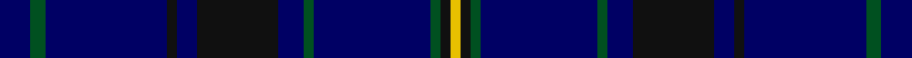

**Bands:** [YKGBGBKBKBGB](/stripes/ykgbgbkbkbgb/) · **Stripes:** [LY K DG DB DG DB K DB K DB DG DB](/stripes/stripes12/) LY K DG DB DG DB K DB K DB DG DB

This was sourced from register-of-tartans.  It is a [12 band tartan](/bands/bands12/).

Original link https://www.tartanregister.gov.uk/tartanDetails.aspx?ref=3003

## Register references

External register numbers recorded for this tartan.

- Scottish Register of Tartans: [3003](https://www.tartanregister.gov.uk/tartanDetails.aspx?ref=3003)
- Scottish Tartans World Register: 2744

## Thread count
DB/12 G6 DB48 K4 DB8 K32 DB10 G4 DB46 G4 K4 Y/4

## Palette
Each colour and its ΔE from the base-6 reference it is a variant of.

| Colour | Shade | Base | ΔE (OKLab) |
|---|---|---|---|
| DB | <code style="background-color:#000064;">#000064</code> `#000064` | B <code style="background-color:#2A418A;">#2A418A</code> | 0.18 |
| G | <code style="background-color:#005020;">#005020</code> `#005020` | G <code style="background-color:#006100;">#006100</code> | 0.07 |
| K | <code style="background-color:#101010;">#101010</code> `#101010` | K <code style="background-color:#000000;">#000000</code> | 0.17 |
| Y | <code style="background-color:#E8C000;">#E8C000</code> `#E8C000` | Y <code style="background-color:#F2BF00;">#F2BF00</code> | 0.02 |

## Nearest tartans

The nearest existing variants by ΔTartan distance.

1. [Indigo Blue (Corporate)](/setts/s11/db9k1db4k1db18t5k1t1k1t5db4~x2/) — ΔT 1.50
1. [Bredillet (Personal)](/setts/s13/db16k2lo2k2lo2k15db14k2db14k15db16k4w1~x2/) — ΔT 1.72
1. [Trotter (Personal)](/setts/s9/dt23k2dt2k2dt2k28r2k4n2~x2/) — ΔT 1.77
1. [Benyon of Wales (Name)](/setts/s15/db22k1dg3db6k1db6dg3db4dg7db11ly1db11dg7ly2k4~x2/) — ΔT 1.88
1. [The Caledonian Hotel](/setts/s8/k24k3k3k3k3k18dg20r4~x2/) — ΔT 1.90
1. [Benyon of Wales](/setts/s15/db22k1dg3db6k1db6dg3db4dg7db11ly1db11dg7ly2k6/) — ΔT 1.90
1. [MacKerrell, of Hillhouse hunting](/setts/s12/db28db49ly3db49db28w4db28db49r3db49db28w4~x2/) — ΔT 1.94
1. [Slanj Dress](/setts/s14/db36k4db4k34b3k3w4k3b3k34db4k4db36k4~x2/) — ΔT 2.03
1. [Orlando, City of](/setts/s16/db12k1g16db1g1db14g3db14r2~x4/) — ΔT 2.05
1. [Damson (Fashion)](/setts/s12/db48g4db6y2db2db2db2g10db6db2db3db2~x2/) — ΔT 2.06

## Neighbour map

Every grey dot is one of 14299 variants placed by the first two principal components of the ΔTartan feature space (44% of its variance). Red is this tartan; blue dots are its nearest — click one to open its page.

<svg viewBox="0 0 640 380" role="img" style="max-width:100%;height:auto;border:1px solid #e0e0e0;border-radius:4px;display:block" xmlns="http://www.w3.org/2000/svg"><image href="/nn/cloud.v1.png" width="640" height="380"/><a href="/setts/s11/db9k1db4k1db18t5k1t1k1t5db4~x2/"><circle cx="406.6" cy="185.9" r="4" fill="#3465a4"><title>Indigo Blue (Corporate)</title></circle></a><a href="/setts/s13/db16k2lo2k2lo2k15db14k2db14k15db16k4w1~x2/"><circle cx="390.6" cy="214.6" r="4" fill="#3465a4"><title>Bredillet (Personal)</title></circle></a><a href="/setts/s9/dt23k2dt2k2dt2k28r2k4n2~x2/"><circle cx="404.6" cy="198.9" r="4" fill="#3465a4"><title>Trotter (Personal)</title></circle></a><a href="/setts/s15/db22k1dg3db6k1db6dg3db4dg7db11ly1db11dg7ly2k4~x2/"><circle cx="428.3" cy="175.8" r="4" fill="#3465a4"><title>Benyon of Wales (Name)</title></circle></a><a href="/setts/s8/k24k3k3k3k3k18dg20r4~x2/"><circle cx="464.3" cy="274.1" r="4" fill="#3465a4"><title>The Caledonian Hotel</title></circle></a><a href="/setts/s15/db22k1dg3db6k1db6dg3db4dg7db11ly1db11dg7ly2k6/"><circle cx="415.7" cy="177.9" r="4" fill="#3465a4"><title>Benyon of Wales</title></circle></a><a href="/setts/s12/db28db49ly3db49db28w4db28db49r3db49db28w4~x2/"><circle cx="358.5" cy="202.0" r="4" fill="#3465a4"><title>MacKerrell, of Hillhouse hunting</title></circle></a><a href="/setts/s14/db36k4db4k34b3k3w4k3b3k34db4k4db36k4~x2/"><circle cx="370.0" cy="199.8" r="4" fill="#3465a4"><title>Slanj Dress</title></circle></a><a href="/setts/s16/db12k1g16db1g1db14g3db14r2~x4/"><circle cx="389.0" cy="182.2" r="4" fill="#3465a4"><title>Orlando, City of</title></circle></a><a href="/setts/s12/db48g4db6y2db2db2db2g10db6db2db3db2~x2/"><circle cx="500.4" cy="157.0" r="4" fill="#3465a4"><title>Damson (Fashion)</title></circle></a><circle cx="449.3" cy="214.8" r="5" fill="#c00000"/></svg>

ID: /setts/s12/db6dg3db24k2db4k16db5dg2db23dg2k2ly2~x2/
