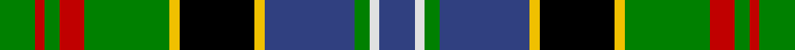

In pattern [BWGBYKYGRGRG](/stripes/bwgbykygrgrg/).

This was sourced from weddslist.  It is a [12 stripe tartan](/stripes/stripes12/).

Original link http://www.weddslist.com/cgi-bin/tartans/pg.pl?source=sts

## Attestations

This cloth appears in 2 source records; the oldest owns this page.

- undated — Paisley (weddslist, [record](http://www.weddslist.com/cgi-bin/tartans/pg.pl?source=sts))
- undated — Paisley District Tartan Tartan Number: 640. Earliest known date: 1952 This design won a first prize at Kelso Highland Show for designer, Allan Drennan, in 1952. He regarded it as having 'a motif of the Clan Donald'. It is also worn by members of the Paisley & Allied Families Society and the '100 Pipers' pipe band (in ancient colours). See products available Copyright © Blair Urquhart, Comrie, 2015 (house-of-tartan, [record](http://www.house-of-tartan.scotland.net/house/TartanViewjs.asp?colr=Def&tnam=640))

## Thread count
G/14 R4 G6 R10 G34 Y4 K30 Y4 B36 G6 LN4 B/14

## Palette
Each colour and the base-6 reference it is a variant of.

| Colour | Shade | Base |
|---|---|---|
| B | <code style="background-color:#304080;">#304080</code> `oklch(39.4% 0.109 270.2)` <small>#304080</small> | B <code style="background-color:#2A418A;">#2A418A</code> |
| G | <code style="background-color:#008000;">#008000</code> `oklch(52.0% 0.177 142.5)` <small>#008000</small> | G <code style="background-color:#006100;">#006100</code> |
| K | <code style="background-color:#000000;">#000000</code> `oklch(0.0% 0.000 0.0)` <small>#000000</small> | K <code style="background-color:#000000;">#000000</code> |
| LN | <code style="background-color:#E0E0E0;">#E0E0E0</code> `oklch(90.7% 0.000 89.9)` <small>#E0E0E0</small> | W <code style="background-color:#F7F7F7;">#F7F7F7</code> |
| R | <code style="background-color:#C00000;">#C00000</code> `oklch(50.7% 0.208 29.2)` <small>#C00000</small> | R <code style="background-color:#CC0000;">#CC0000</code> |
| Y | <code style="background-color:#F0C000;">#F0C000</code> `oklch(82.7% 0.169 90.5)` <small>#F0C000</small> | Y <code style="background-color:#F2BF00;">#F2BF00</code> |

## Nearest tartans

The nearest existing variants by ΔTartan distance.

1. [MacKellar](/setts/s12/g30w3g4ly5g4w3g6k14t3k14db18w4~x2/) — ΔT 0.51
1. [Unnamed 4](/setts/s10/k6g14t2r3t2k16ly2b16g16r3~x2/) — ΔT 0.57
1. [Farquharson Dress](/setts/s13/w6k1w1k1w1k8g8lo2g8k8db8k1r2~x2/) — ΔT 0.64
1. [Farquharson Dress (Fashion)](/setts/s13/lb6k1lb1k1lb1k8g8lo2g8k8db8k1r2~x2/) — ΔT 0.66
1. [Esteba-Quer (Personal)](/setts/s14/g10r2g2r3g11lb2k10r2db12k1lo2r2lo2r2~x2/) — ΔT 0.70
1. [Kelsey, William (Personal)](/setts/s12/g12r2g2r5g16db3lr2k2lr3db6k20ly3~x2/) — ΔT 0.78
1. [Stephenson](/setts/s11/k6g20t2r5t2k20ly3db20g26r3db5~x2/) — ΔT 0.80
1. [Esteba-Quer (Personal)](/setts/s15/g10r2g2r3g11lb2k10r2db12k1lo2r2lo2r2lo2~x2/) — ΔT 0.81
1. [MacInnes](/setts/s13/r2g6db12k3t3k3g16k2g2k2g2k12ly2~x2/) — ΔT 0.85
1. [Gordonstoun](/setts/s12/ly4g20r3db11t3r11g11r3k20r3k3t3~x2/) — ΔT 0.89

## Neighbour map

Every grey dot is one of 14299 variants placed by the first two principal components of the ΔTartan feature space (44% of its variance). Red is this tartan; blue dots are its nearest — click one to open its page.

<svg viewBox="0 0 640 380" role="img" style="max-width:100%;height:auto;border:1px solid #e0e0e0;border-radius:4px;display:block" xmlns="http://www.w3.org/2000/svg"><image href="/nn/cloud.v1.png" width="640" height="380"/><a href="/setts/s12/g30w3g4ly5g4w3g6k14t3k14db18w4~x2/"><circle cx="127.9" cy="139.2" r="4" fill="#3465a4"><title>MacKellar</title></circle></a><a href="/setts/s10/k6g14t2r3t2k16ly2b16g16r3~x2/"><circle cx="92.1" cy="157.3" r="4" fill="#3465a4"><title>Unnamed 4</title></circle></a><a href="/setts/s13/w6k1w1k1w1k8g8lo2g8k8db8k1r2~x2/"><circle cx="70.4" cy="146.3" r="4" fill="#3465a4"><title>Farquharson Dress</title></circle></a><a href="/setts/s13/lb6k1lb1k1lb1k8g8lo2g8k8db8k1r2~x2/"><circle cx="86.3" cy="155.4" r="4" fill="#3465a4"><title>Farquharson Dress (Fashion)</title></circle></a><a href="/setts/s14/g10r2g2r3g11lb2k10r2db12k1lo2r2lo2r2~x2/"><circle cx="105.8" cy="124.4" r="4" fill="#3465a4"><title>Esteba-Quer (Personal)</title></circle></a><a href="/setts/s12/g12r2g2r5g16db3lr2k2lr3db6k20ly3~x2/"><circle cx="113.4" cy="127.4" r="4" fill="#3465a4"><title>Kelsey, William (Personal)</title></circle></a><a href="/setts/s11/k6g20t2r5t2k20ly3db20g26r3db5~x2/"><circle cx="140.2" cy="137.3" r="4" fill="#3465a4"><title>Stephenson</title></circle></a><a href="/setts/s15/g10r2g2r3g11lb2k10r2db12k1lo2r2lo2r2lo2~x2/"><circle cx="97.7" cy="118.9" r="4" fill="#3465a4"><title>Esteba-Quer (Personal)</title></circle></a><a href="/setts/s13/r2g6db12k3t3k3g16k2g2k2g2k12ly2~x2/"><circle cx="117.2" cy="144.9" r="4" fill="#3465a4"><title>MacInnes</title></circle></a><a href="/setts/s12/ly4g20r3db11t3r11g11r3k20r3k3t3~x2/"><circle cx="65.5" cy="155.8" r="4" fill="#3465a4"><title>Gordonstoun</title></circle></a><circle cx="102.1" cy="143.1" r="5" fill="#c00000"/></svg>

ID: /setts/s12/db7w2g3db18ly2k15ly2g17r5g3r2g7~x2/
