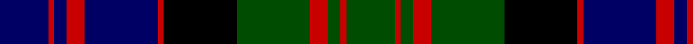

**Bands:** [BRBRBRKGRGRG](/stripes/brbrbrkgrgrg/) · **Stripes:** [DB R DB R DB R K DG R DG R DG](/stripes/stripes12/) DB R DB R DB R K DG R DG R DG

This was sourced from weddslist.  It is a [12 band tartan](/bands/bands12/).

Original link http://www.weddslist.com/cgi-bin/tartans/pg.pl?source=rb

## Attestations

This cloth appears in 3 source records; the oldest owns this page.

- undated — MacDonald (weddslist, [record](http://www.weddslist.com/cgi-bin/tartans/pg.pl?source=rb))
- undated — MacDonald (weddslist, [record](http://www.weddslist.com/cgi-bin/tartans/pg.pl?source=tinsel))
- undated — MacDonald (weddslist, [record](http://www.weddslist.com/cgi-bin/tartans/pg.pl?source=x))

## Register references

External register numbers recorded for this tartan.

- Scottish Register of Tartans: [1166](https://www.tartanregister.gov.uk/tartanDetails.aspx?ref=1166)
- Scottish Register of Tartans: [1510](https://www.tartanregister.gov.uk/tartanDetails.aspx?ref=1510)
- Scottish Register of Tartans: [1758](https://www.tartanregister.gov.uk/tartanDetails.aspx?ref=1758)
- Scottish Register of Tartans: [2307](https://www.tartanregister.gov.uk/tartanDetails.aspx?ref=2307)
- Scottish Register of Tartans: [2349](https://www.tartanregister.gov.uk/tartanDetails.aspx?ref=2349)
- Scottish Register of Tartans: [2540](https://www.tartanregister.gov.uk/tartanDetails.aspx?ref=2540)
- Scottish Register of Tartans: [2582](https://www.tartanregister.gov.uk/tartanDetails.aspx?ref=2582)
- Scottish Register of Tartans: [2585](https://www.tartanregister.gov.uk/tartanDetails.aspx?ref=2585)
- Scottish Register of Tartans: [2625](https://www.tartanregister.gov.uk/tartanDetails.aspx?ref=2625)
- Scottish Register of Tartans: [2666](https://www.tartanregister.gov.uk/tartanDetails.aspx?ref=2666)
- Scottish Register of Tartans: [2730](https://www.tartanregister.gov.uk/tartanDetails.aspx?ref=2730)
- Scottish Register of Tartans: [2862](https://www.tartanregister.gov.uk/tartanDetails.aspx?ref=2862)
- Scottish Register of Tartans: [3072](https://www.tartanregister.gov.uk/tartanDetails.aspx?ref=3072)
- Scottish Register of Tartans: [3555](https://www.tartanregister.gov.uk/tartanDetails.aspx?ref=3555)
- Scottish Register of Tartans: [3808](https://www.tartanregister.gov.uk/tartanDetails.aspx?ref=3808)
- Scottish Register of Tartans: [4925](https://www.tartanregister.gov.uk/tartanDetails.aspx?ref=4925)
- Scottish Register of Tartans: [696](https://www.tartanregister.gov.uk/tartanDetails.aspx?ref=696)
- Scottish Register of Tartans: [697](https://www.tartanregister.gov.uk/tartanDetails.aspx?ref=697)
- Scottish Register of Tartans: [982](https://www.tartanregister.gov.uk/tartanDetails.aspx?ref=982)
- Scottish Tartans Authority (ITI): 1277
- Scottish Tartans Authority (ITI): 1429
- Scottish Tartans Authority (ITI): 218
- Scottish Tartans Authority (ITI): 977
- Scottish Tartans World Register: 1010
- Scottish Tartans World Register: 1042
- Scottish Tartans World Register: 127
- Scottish Tartans World Register: 1277
- Scottish Tartans World Register: 1399
- Scottish Tartans World Register: 1429
- Scottish Tartans World Register: 1585
- Scottish Tartans World Register: 1593
- Scottish Tartans World Register: 218
- Scottish Tartans World Register: 2218
- Scottish Tartans World Register: 3061
- Scottish Tartans World Register: 441
- Scottish Tartans World Register: 737
- Scottish Tartans World Register: 858
- Scottish Tartans World Register: 864
- Scottish Tartans World Register: 873
- Scottish Tartans World Register: 897
- Scottish Tartans World Register: 977
- Scottish Tartans World Register: 978

## Variants

Other setts woven to the same stripe pattern.

- [MacDonald #2](/setts/s12/db11r2db2r4db15r2k15dg15r4dg2r2dg11~x2/)
- [MacDonald #3](/setts/s12/db16r2db2r5db29r2k31dg29r5dg2r2dg16~x2/)
- [MacDonald #4](/setts/s12/db17r2db2r6db32r2k34dg32r6dg2r2dg17~x2/)
- [MacDonald #5](/setts/s12/db12r2db2r5db26r2k29dg27r5dg2r2dg12~x2/)
- [MacDonald #6](/setts/s12/db8r2db2r4db10r2k11dg10r4dg2r2dg8~x2/)

## Thread count
DB/16 R2 DB4 R6 DB24 R2 K24 G24 R6 G4 R2 G/16

## Palette
Each colour and its ΔE from the base-6 reference it is a variant of.

| Colour | Shade | Base | ΔE (OKLab) |
|---|---|---|---|
| DB | <code style="background-color:#000064;">#000064</code> `#000064` | B <code style="background-color:#2A418A;">#2A418A</code> | 0.18 |
| G | <code style="background-color:#004C00;">#004C00</code> `#004C00` | G <code style="background-color:#006100;">#006100</code> | 0.07 |
| K | <code style="background-color:#000000;">#000000</code> `#000000` | K <code style="background-color:#000000;">#000000</code> | 0.00 |
| R | <code style="background-color:#C80000;">#C80000</code> `#C80000` | R <code style="background-color:#CC0000;">#CC0000</code> | 0.01 |

## Nearest tartans

The nearest existing variants by ΔTartan distance.

1. [Murray of Atholl](/setts/s13/db12k2db2k2db2k12dg12r3dg12k12db12k1r3/) — ΔT 0.70
1. [Highfield (Name)](/setts/s11/db10k2g2r2g2k2r2k2r4k1g2~x4/) — ΔT 0.72
1. [Dewar, Highlander](/setts/s13/dg46k5dg6k5dg6k30db38ly6db38k30dg36k6dg6/) — ΔT 0.86
1. [MacDonald of Clanranald](/setts/s13/db8r1db2r3db12r1k12lb1dg12r3dg2r1dg8~x2/) — ΔT 0.90
1. [Urquhart D](/setts/s9/r3db6k1db1k1db1k6dg9k2/) — ΔT 0.92
1. [MacDonell of Glengarry](/setts/s11/db8r4db12r1k12dg12r3dg2r1dg4lb1~x2/) — ΔT 0.92
1. [Murray of Atholl](/setts/s12/db25k2db2k2db2k21g23r5g23k20db19r5~x2/) — ΔT 0.93
1. [MacDonell of Glengarry](/setts/s11/db8r4db12r1k12dg12r3dg2r1dg4lr1~x2/) — ΔT 0.95
1. [MacDonald of Clanranald](/setts/s13/db8r1db2r3db12r1k12lr1dg12r3dg2r1dg8~x2/) — ΔT 0.95
1. [MacDonell of Glengarry D](/setts/s13/db8r1db2r3db12r1k12dg12r3dg2r1dg4lb1/) — ΔT 0.97

## Neighbour map

Every grey dot is one of 14313 variants placed by the first two principal components of the ΔTartan feature space (44% of its variance). Red is this tartan; blue dots are its nearest — click one to open its page.

<svg viewBox="0 0 640 380" role="img" style="max-width:100%;height:auto;border:1px solid #e0e0e0;border-radius:4px;display:block" xmlns="http://www.w3.org/2000/svg"><image href="/nn/cloud.v1.png" width="640" height="380"/><a href="/setts/s13/db12k2db2k2db2k12dg12r3dg12k12db12k1r3/"><circle cx="170.0" cy="195.9" r="4" fill="#3465a4"><title>Murray of Atholl</title></circle></a><a href="/setts/s11/db10k2g2r2g2k2r2k2r4k1g2~x4/"><circle cx="143.5" cy="183.1" r="4" fill="#3465a4"><title>Highfield (Name)</title></circle></a><a href="/setts/s13/dg46k5dg6k5dg6k30db38ly6db38k30dg36k6dg6/"><circle cx="192.1" cy="200.4" r="4" fill="#3465a4"><title>Dewar, Highlander</title></circle></a><a href="/setts/s13/db8r1db2r3db12r1k12lb1dg12r3dg2r1dg8~x2/"><circle cx="146.2" cy="158.2" r="4" fill="#3465a4"><title>MacDonald of Clanranald</title></circle></a><a href="/setts/s9/r3db6k1db1k1db1k6dg9k2/"><circle cx="168.7" cy="209.1" r="4" fill="#3465a4"><title>Urquhart D</title></circle></a><a href="/setts/s11/db8r4db12r1k12dg12r3dg2r1dg4lb1~x2/"><circle cx="139.2" cy="167.9" r="4" fill="#3465a4"><title>MacDonell of Glengarry</title></circle></a><a href="/setts/s12/db25k2db2k2db2k21g23r5g23k20db19r5~x2/"><circle cx="146.7" cy="177.6" r="4" fill="#3465a4"><title>Murray of Atholl</title></circle></a><a href="/setts/s11/db8r4db12r1k12dg12r3dg2r1dg4lr1~x2/"><circle cx="154.1" cy="176.1" r="4" fill="#3465a4"><title>MacDonell of Glengarry</title></circle></a><a href="/setts/s13/db8r1db2r3db12r1k12lr1dg12r3dg2r1dg8~x2/"><circle cx="161.4" cy="166.5" r="4" fill="#3465a4"><title>MacDonald of Clanranald</title></circle></a><a href="/setts/s13/db8r1db2r3db12r1k12dg12r3dg2r1dg4lb1/"><circle cx="153.3" cy="153.8" r="4" fill="#3465a4"><title>MacDonell of Glengarry D</title></circle></a><circle cx="170.2" cy="184.3" r="5" fill="#c00000"/></svg>

ID: /setts/s12/db8r1db2r3db12r1k12dg12r3dg2r1dg8~x2/
