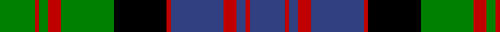

This page is one **sett** — a single exact thread-count. It belongs to the [tartan](/tartans/g8r1g2r3g12k12r1b12r3b2r1b8/)
(the same proportion at any scale), whose colour order is pattern [BRBRBRKGRGRG](/stripes/brbrbrkgrgrg/).

Sourced from weddslist.  It is a [12 stripe tartan](/stripes/stripes12/).

Original link http://www.weddslist.com/cgi-bin/tartans/pg.pl?source=sts

## Also known as

This cloth is also recorded under:

- MacDonald

2 attestations — the source records this cloth was collapsed from (oldest owns this page)

<ul>
<li>undated — MacDonald 8 (weddslist, <a href="http://www.weddslist.com/cgi-bin/tartans/pg.pl?source=sts">record</a>)</li>
<li>undated — MacDonald Clan Tartan Tartan Number: 419. Earliest known date: 1810-15 This is oldest recorded version of the Clan sett. It varies slightly from those recorded by Logan, Smibert, Grant etc., but the motif is the same throughout. Of the nine independant branches of the Clan Donald, there are at least 27 different setts. It was not until 1947 that the MacDonalds again had a high chief, MacDhomnuill, who by tradition has the final word on the tartans of the clan. That right was granted to Alexander MacDonald of MacDonald whose son Godfrey is now the 8th Chief. See products available Copyright © Blair Urquhart, Comrie, 2015 (house-of-tartan, <a href="http://www.house-of-tartan.scotland.net/house/TartanViewjs.asp?colr=Def&tnam=419">record</a>)</li>
</ul>

## Thread count
G/16 R2 G4 R6 G24 K24 R2 B24 R6 B4 R2 B/16

## Palette
Each colour and the base-6 reference it is a variant of.

| Colour | Shade | Base |
|---|---|---|
| B | <code style="background-color:#304080;">#304080</code> `oklch(39.4% 0.109 270.2)` <small>#304080</small> | B <code style="background-color:#2A418A;">#2A418A</code> |
| G | <code style="background-color:#008000;">#008000</code> `oklch(52.0% 0.177 142.5)` <small>#008000</small> | G <code style="background-color:#006100;">#006100</code> |
| K | <code style="background-color:#000000;">#000000</code> `oklch(0.0% 0.000 0.0)` <small>#000000</small> | K <code style="background-color:#000000;">#000000</code> |
| R | <code style="background-color:#C00000;">#C00000</code> `oklch(50.7% 0.208 29.2)` <small>#C00000</small> | R <code style="background-color:#CC0000;">#CC0000</code> |

## Nearest tartans

The nearest existing variants by ΔTartan distance, with this tartan at the top so the swatches line up against it.

ΔTartan

Tartan

Sett

—

<a href="/ttd/edit/#slug=db8r1db2r3db12r1k12g12r3g2r1g8~x2">MacDonald 8</a> <a class="nn-out" href="/setts/s12/db8r1db2r3db12r1k12g12r3g2r1g8~x2/" title="open its dictionary page">↗</a>

0.64

<a href="/ttd/edit/#slug=db12r2db2r5db26r2k29g27r5g2r2g12~x2">MacDonald 3</a> <a class="nn-out" href="/setts/s12/db12r2db2r5db26r2k29g27r5g2r2g12~x2/" title="open its dictionary page">↗</a>

0.64

<a href="/ttd/edit/#slug=db25k2db2k2db2k21g23r5g23k20db19r5~x2">Murray of Atholl</a> <a class="nn-out" href="/setts/s12/db25k2db2k2db2k21g23r5g23k20db19r5~x2/" title="open its dictionary page">↗</a>

0.65

<a href="/ttd/edit/#slug=db16r2db2r5db29r2k31g29r5g2r2g16~x2">MacDonald 5</a> <a class="nn-out" href="/setts/s12/db16r2db2r5db29r2k31g29r5g2r2g16~x2/" title="open its dictionary page">↗</a>

0.74

<a href="/ttd/edit/#slug=db11r2db2r4db15r2k15g15r4g2r2g11~x2">MacDonald 7</a> <a class="nn-out" href="/setts/s12/db11r2db2r4db15r2k15g15r4g2r2g11~x2/" title="open its dictionary page">↗</a>

0.76

<a href="/ttd/edit/#slug=db17r2db2r6db32r2k34g32r6g2r2g17~x2">MacDonald 4</a> <a class="nn-out" href="/setts/s12/db17r2db2r6db32r2k34g32r6g2r2g17~x2/" title="open its dictionary page">↗</a>

0.89

<a href="/ttd/edit/#slug=db8r1db2r3db12r1k12w1g12r3g2r1g8~x2">MacDonald of Clanranald 2</a> <a class="nn-out" href="/setts/s13/db8r1db2r3db12r1k12w1g12r3g2r1g8~x2/" title="open its dictionary page">↗</a>

0.91

<a href="/ttd/edit/#slug=db8r4db12r1k12g12r3g2r1g4w1~x2">MacDonell of Glengarry</a> <a class="nn-out" href="/setts/s11/db8r4db12r1k12g12r3g2r1g4w1~x2/" title="open its dictionary page">↗</a>

0.91

<a href="/ttd/edit/#slug=b25k4b4k4b4k26g25r9g25k26b25k2r9~x2">Atholl</a> <a class="nn-out" href="/setts/s13/b25k4b4k4b4k26g25r9g25k26b25k2r9~x2/" title="open its dictionary page">↗</a>

0.96

<a href="/ttd/edit/#slug=db8r1db2r3db12r1k12g12r3g2r1g4w1~x2">MacDonell of Glengarry</a> <a class="nn-out" href="/setts/s13/db8r1db2r3db12r1k12g12r3g2r1g4w1~x2/" title="open its dictionary page">↗</a>

0.97

<a href="/ttd/edit/#slug=b25k4b4k4b4k26g25r6g25k26b25k2r6~x2">Atholl (District)</a> <a class="nn-out" href="/setts/s13/b25k4b4k4b4k26g25r6g25k26b25k2r6~x2/" title="open its dictionary page">↗</a>

## Neighbour map

Every grey dot is one of 14299 variants placed by the first two principal components of the ΔTartan feature space (44% of its variance). Red is this tartan; blue dots are its nearest — click one to open its page.

<svg viewBox="0 0 640 380" role="img" style="max-width:100%;height:auto;border:1px solid #e0e0e0;border-radius:4px;display:block" xmlns="http://www.w3.org/2000/svg"><image href="/nn/cloud.v1.png" width="640" height="380"/><a href="/setts/s12/db12r2db2r5db26r2k29g27r5g2r2g12~x2/"><circle cx="164.8" cy="152.1" r="4" fill="#3465a4"><title>MacDonald 3</title></circle></a><a href="/setts/s12/db25k2db2k2db2k21g23r5g23k20db19r5~x2/"><circle cx="146.8" cy="177.6" r="4" fill="#3465a4"><title>Murray of Atholl</title></circle></a><a href="/setts/s12/db16r2db2r5db29r2k31g29r5g2r2g16~x2/"><circle cx="172.4" cy="151.8" r="4" fill="#3465a4"><title>MacDonald 5</title></circle></a><a href="/setts/s12/db11r2db2r4db15r2k15g15r4g2r2g11~x2/"><circle cx="129.2" cy="190.6" r="4" fill="#3465a4"><title>MacDonald 7</title></circle></a><a href="/setts/s12/db17r2db2r6db32r2k34g32r6g2r2g17~x2/"><circle cx="174.9" cy="147.8" r="4" fill="#3465a4"><title>MacDonald 4</title></circle></a><a href="/setts/s13/db8r1db2r3db12r1k12w1g12r3g2r1g8~x2/"><circle cx="132.8" cy="147.3" r="4" fill="#3465a4"><title>MacDonald of Clanranald 2</title></circle></a><a href="/setts/s11/db8r4db12r1k12g12r3g2r1g4w1~x2/"><circle cx="127.0" cy="157.5" r="4" fill="#3465a4"><title>MacDonell of Glengarry</title></circle></a><a href="/setts/s13/b25k4b4k4b4k26g25r9g25k26b25k2r9~x2/"><circle cx="160.7" cy="186.7" r="4" fill="#3465a4"><title>Atholl</title></circle></a><a href="/setts/s13/db8r1db2r3db12r1k12g12r3g2r1g4w1~x2/"><circle cx="141.2" cy="143.3" r="4" fill="#3465a4"><title>MacDonell of Glengarry</title></circle></a><a href="/setts/s13/b25k4b4k4b4k26g25r6g25k26b25k2r6~x2/"><circle cx="174.4" cy="185.2" r="4" fill="#3465a4"><title>Atholl (District)</title></circle></a><circle cx="154.7" cy="172.1" r="5" fill="#c00000"/></svg>

ID: /setts/s12/db8r1db2r3db12r1k12g12r3g2r1g8~x2/
