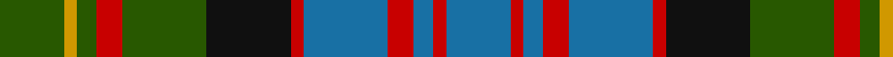

This page is one **sett** — a single exact thread-count. It belongs to the [tartan](/tartans/g10dy2g3r4g13k13r2b13r4b3r2b10/)
(the same proportion at any scale), whose colour order is pattern [BRBRBRKGRGYG](/stripes/brbrbrkgrgyg/).

Sourced from register-of-tartans.  It is a [12 stripe tartan](/stripes/stripes12/).

Original link https://www.tartanregister.gov.uk/tartanDetails.aspx?ref=323

2 attestations — the source records this cloth was collapsed from (oldest owns this page)

<ul>
<li>01/01/1978 — Bowie (Lochcarron) (register-of-tartans, <a href="https://www.tartanregister.gov.uk/tartanDetails.aspx?ref=323">record</a>)</li>
<li>1960s — Bowie (Name) (tartans-authority, <a href="http://www.tartansauthority.com/tartan-ferret/display/435/">record</a>)</li>
</ul>

## Register references

External register numbers recorded for this tartan.

- Scottish Register of Tartans: [323](https://www.tartanregister.gov.uk/tartanDetails.aspx?ref=323)
- Scottish Tartans Authority (ITI): 435
- Scottish Tartans World Register: 435

## Thread count
G/20 DY4 G6 R8 G26 K26 R4 B26 R8 B6 R4 B/20

## Palette
Each colour and the base-6 reference it is a variant of.

| Colour | Shade | Base |
|---|---|---|
| B | <code style="background-color:#1870A4;">#1870A4</code> `oklch(52.2% 0.113 241.2)` <small>#1870A4</small> | B <code style="background-color:#2A418A;">#2A418A</code> |
| Ba | <code style="background-color:#1474B4;">#1474B4</code> `oklch(54.0% 0.129 245.1)` <small>#1474B4</small> | B <code style="background-color:#2A418A;">#2A418A</code> |
| DR | <code style="background-color:#880000;">#880000</code> `oklch(39.4% 0.162 29.2)` <small>#880000</small> | R <code style="background-color:#CC0000;">#CC0000</code> |
| DY | <code style="background-color:#D09800;">#D09800</code> `oklch(71.4% 0.147 82.1)` <small>#D09800</small> | Y <code style="background-color:#F2BF00;">#F2BF00</code> |
| G | <code style="background-color:#285800;">#285800</code> `oklch(41.0% 0.122 135.8)` <small>#285800</small> | G <code style="background-color:#006100;">#006100</code> |
| Ga | <code style="background-color:#408060;">#408060</code> `oklch(54.8% 0.084 160.1)` <small>#408060</small> | G <code style="background-color:#006100;">#006100</code> |
| K | <code style="background-color:#101010;">#101010</code> `oklch(17.3% 0.000 89.9)` <small>#101010</small> | K <code style="background-color:#000000;">#000000</code> |
| R | <code style="background-color:#C80000;">#C80000</code> `oklch(52.3% 0.215 29.2)` <small>#C80000</small> | R <code style="background-color:#CC0000;">#CC0000</code> |

## Nearest tartans

The nearest existing variants by ΔTartan distance, with this tartan at the top so the swatches line up against it.

ΔTartan

Tartan

Sett

—

<a href="/ttd/edit/#slug=dg10lo2dg3r4dg13k13r2b13r4b3r2b10~x2">Bowie (Lochcarron)</a> <a class="nn-out" href="/setts/s12/dg10lo2dg3r4dg13k13r2b13r4b3r2b10~x2/" title="open its dictionary page">↗</a>

0.69

<a href="/ttd/edit/#slug=dt22g4dt4g17dy17g17dt4g4dt22ly8dy8r8~x2">Niagara Falls</a> <a class="nn-out" href="/setts/s12/dt22g4dt4g17dy17g17dt4g4dt22ly8dy8r8~x2/" title="open its dictionary page">↗</a>

0.71

<a href="/ttd/edit/#slug=db22g4db4g17dy17g17db4g4db22ly8dy8r8~x2">Niagra Falls Trade Tartan Tartan Number: 1915. Earliest known date: 1967 Designed to be used in the refurbishing of Johnstons of Elgin new mill shop and based on the colours of the mill shop house style. The lighter square is represented here as green from the 'Antique' colour range, a speciality of Johnstons of Elgin. See products available Copyright © Blair Urquhart, Comrie, 2015</a> <a class="nn-out" href="/setts/s12/db22g4db4g17dy17g17db4g4db22ly8dy8r8~x2/" title="open its dictionary page">↗</a>

0.80

<a href="/ttd/edit/#slug=db10dp2db3r4db14r2k14g14r4g3dp2g10~x2">Denovan, The Lairdship of (Personal)</a> <a class="nn-out" href="/setts/s12/db10dp2db3r4db14r2k14g14r4g3dp2g10~x2/" title="open its dictionary page">↗</a>

0.80

<a href="/ttd/edit/#slug=dg12r2dg4r5dg16lo2k16r2db16r5db4r2db12~x2">Macallan</a> <a class="nn-out" href="/setts/s13/dg12r2dg4r5dg16lo2k16r2db16r5db4r2db12~x2/" title="open its dictionary page">↗</a>

0.81

<a href="/ttd/edit/#slug=g12r2g2r2k12db12ly2db12k2g11r2g2~x2">Akins of Candler (Personal)</a> <a class="nn-out" href="/setts/s12/g12r2g2r2k12db12ly2db12k2g11r2g2~x2/" title="open its dictionary page">↗</a>

0.90

<a href="/ttd/edit/#slug=db22g4db4g17o17g17db4g4db22ly8o8r8~x2">Niagara Falls</a> <a class="nn-out" href="/setts/s12/db22g4db4g17o17g17db4g4db22ly8o8r8~x2/" title="open its dictionary page">↗</a>

0.91

<a href="/ttd/edit/#slug=r6k20y4dy10b21k4b21dy10y4k20r6b3~x2">Swankie (Personal)</a> <a class="nn-out" href="/setts/s12/r6k20y4dy10b21k4b21dy10y4k20r6b3~x2/" title="open its dictionary page">↗</a>

0.92

<a href="/ttd/edit/#slug=b18r5b3r5b3k20g18ly4g18k20b20k6b6">Keith (District)</a> <a class="nn-out" href="/setts/s13/b18r5b3r5b3k20g18ly4g18k20b20k6b6/" title="open its dictionary page">↗</a>

0.94

<a href="/ttd/edit/#slug=db6ly2db18k6ly3k6g14r3g10r2~x2">MacMillan Hunting Clan Tartan Tartan Number: 668. Earliest known date: 1906 The Setts No: 160. W &amp; A K Johnston See products available Copyright © Blair Urquhart, Comrie, 2015</a> <a class="nn-out" href="/setts/s10/db6ly2db18k6ly3k6g14r3g10r2~x2/" title="open its dictionary page">↗</a>

0.94

<a href="/ttd/edit/#slug=dt14lb2dt2r2dt3k12g14k2g4k2g14dt14lb14r2~x2">Scotland's National Dress</a> <a class="nn-out" href="/setts/s14/dt14lb2dt2r2dt3k12g14k2g4k2g14dt14lb14r2~x2/" title="open its dictionary page">↗</a>

## Neighbour map

Every grey dot is one of 14299 variants placed by the first two principal components of the ΔTartan feature space (44% of its variance). Red is this tartan; blue dots are its nearest — click one to open its page.

<svg viewBox="0 0 640 380" role="img" style="max-width:100%;height:auto;border:1px solid #e0e0e0;border-radius:4px;display:block" xmlns="http://www.w3.org/2000/svg"><image href="/nn/cloud.v1.png" width="640" height="380"/><a href="/setts/s12/dt22g4dt4g17dy17g17dt4g4dt22ly8dy8r8~x2/"><circle cx="140.3" cy="218.8" r="4" fill="#3465a4"><title>Niagara Falls</title></circle></a><a href="/setts/s12/db22g4db4g17dy17g17db4g4db22ly8dy8r8~x2/"><circle cx="140.8" cy="220.0" r="4" fill="#3465a4"><title>Niagra Falls Trade Tartan Tartan Number: 1915. Earliest known date: 1967 Designed to be used in the refurbishing of Johnstons of Elgin new mill shop and based on the colours of the mill shop house style. The lighter square is represented here as green from the 'Antique' colour range, a speciality of Johnstons of Elgin. See products available Copyright © Blair Urquhart, Comrie, 2015</title></circle></a><a href="/setts/s12/db10dp2db3r4db14r2k14g14r4g3dp2g10~x2/"><circle cx="134.5" cy="200.4" r="4" fill="#3465a4"><title>Denovan, The Lairdship of (Personal)</title></circle></a><a href="/setts/s13/dg12r2dg4r5dg16lo2k16r2db16r5db4r2db12~x2/"><circle cx="143.1" cy="189.1" r="4" fill="#3465a4"><title>Macallan</title></circle></a><a href="/setts/s12/g12r2g2r2k12db12ly2db12k2g11r2g2~x2/"><circle cx="148.8" cy="197.9" r="4" fill="#3465a4"><title>Akins of Candler (Personal)</title></circle></a><a href="/setts/s12/db22g4db4g17o17g17db4g4db22ly8o8r8~x2/"><circle cx="142.1" cy="219.6" r="4" fill="#3465a4"><title>Niagara Falls</title></circle></a><a href="/setts/s12/r6k20y4dy10b21k4b21dy10y4k20r6b3~x2/"><circle cx="126.8" cy="196.9" r="4" fill="#3465a4"><title>Swankie (Personal)</title></circle></a><a href="/setts/s13/b18r5b3r5b3k20g18ly4g18k20b20k6b6/"><circle cx="110.7" cy="198.0" r="4" fill="#3465a4"><title>Keith (District)</title></circle></a><a href="/setts/s10/db6ly2db18k6ly3k6g14r3g10r2~x2/"><circle cx="136.0" cy="189.2" r="4" fill="#3465a4"><title>MacMillan Hunting Clan Tartan Tartan Number: 668. Earliest known date: 1906 The Setts No: 160. W &amp; A K Johnston See products available Copyright © Blair Urquhart, Comrie, 2015</title></circle></a><a href="/setts/s14/dt14lb2dt2r2dt3k12g14k2g4k2g14dt14lb14r2~x2/"><circle cx="108.6" cy="180.0" r="4" fill="#3465a4"><title>Scotland's National Dress</title></circle></a><circle cx="123.9" cy="201.5" r="5" fill="#c00000"/></svg>

ID: /setts/s12/dg10lo2dg3r4dg13k13r2b13r4b3r2b10~x2/
