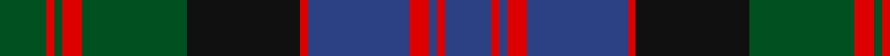

**Bands:** [GRGRGKRBRBRB](/stripes/grgrgkrbrbrb/) · **Stripes:** [DG R DG R DG K R DB R DB R DB](/stripes/stripes12/) DG R DG R DG K R DB R DB R DB

This was sourced from register-of-tartans.  It is a [12 band tartan](/bands/bands12/).

Original link https://www.tartanregister.gov.uk/tartanDetails.aspx?ref=2338

## Also known as

This cloth is also recorded under:

- MacDonald #5

## Register references

External register numbers recorded for this tartan.

- Scottish Register of Tartans: [2338](https://www.tartanregister.gov.uk/tartanDetails.aspx?ref=2338)
- Scottish Tartans World Register: 423

## Variants

Other setts woven to the same stripe pattern.

- [MacDonald](/setts/s12/dg8r1dg2r3dg12k12r1db12r3db2r1db8~x2/)
- [MacDonald](/setts/s12/dg8r1dg2r3dg12k12r1db12r3db2r1db8/)
- [MacDonald #2](/setts/s12/dg11r2dg2r4dg15k15r2db15r4db2r2db11~x2/)
- [MacDonald #3](/setts/s12/dg16r2dg2r5dg29k31r2db29r5db2r2db16~x2/)
- [MacDonald #4](/setts/s12/dg17r2dg2r6dg32k34r2db32r6db2r2db17~x2/)
- [MacDonald #6](/setts/s12/dg8r2dg2r4dg10k11r2db10r4db2r2db8~x2/)

## Thread count
G/24 R4 G4 R10 G54 K58 R4 B52 R10 B4 R4 B/24

## Palette
Each colour and its ΔE from the base-6 reference it is a variant of.

| Colour | Shade | Base | ΔE (OKLab) |
|---|---|---|---|
| B | <code style="background-color:#2C4084;">#2C4084</code> `#2C4084` | B <code style="background-color:#2A418A;">#2A418A</code> | 0.01 |
| G | <code style="background-color:#005020;">#005020</code> `#005020` | G <code style="background-color:#006100;">#006100</code> | 0.07 |
| K | <code style="background-color:#101010;">#101010</code> `#101010` | K <code style="background-color:#000000;">#000000</code> | 0.17 |
| R | <code style="background-color:#DC0000;">#DC0000</code> `#DC0000` | R <code style="background-color:#CC0000;">#CC0000</code> | 0.03 |

## Nearest tartans

The nearest existing variants by ΔTartan distance.

1. [MacDonald #3](/setts/s12/dg16r2dg2r5dg29k31r2db29r5db2r2db16~x2/) — ΔT 0.21
1. [MacDonald #4](/setts/s12/dg17r2dg2r6dg32k34r2db32r6db2r2db17~x2/) — ΔT 0.28
1. [MacDonald](/setts/s12/db17r2db2r5db29r2k31g29r5g2r2g17~x2/) — ΔT 0.45
1. [Campbell of Breadalbane #2](/setts/s13/db26k4db4k4db4k27ly5dg47ly5k27db25k4db4~x2/) — ΔT 0.78
1. [Black from Cumnock (Personal)](/setts/s13/db8k1db1k1db1k8ly1dg14ly1k8db8k1db1~x2/) — ΔT 0.78
1. [Gordon #2](/setts/s10/db56k6db6k6db6k44dg44ly4dg5ly8/) — ΔT 0.87
1. [Campbell of Breadalbane (Military)](/setts/s13/db26k4db4k4db4k27ly5g47ly5k27db25k4db4~x2/) — ΔT 0.93
1. [Stewart of Appin (Clan)](/setts/s17/db12k1g2k1g2k1db12r2k12r1k12r2g12k1db2k1g12~x2/) — ΔT 0.93
1. [Murray of Atholl #2](/setts/s12/db25k2db2k2db2k21dg23r5dg23k20db19r5~x2/) — ΔT 0.93
1. [Kettles, Ryan & Alan (Personal)](/setts/s16/g13k2g2k2g2k12dp16k1g2k1dp16k12g12k1ly2dp1~x2/) — ΔT 0.94

## Neighbour map

Every grey dot is one of 14299 variants placed by the first two principal components of the ΔTartan feature space (44% of its variance). Red is this tartan; blue dots are its nearest — click one to open its page.

<svg viewBox="0 0 640 380" role="img" style="max-width:100%;height:auto;border:1px solid #e0e0e0;border-radius:4px;display:block" xmlns="http://www.w3.org/2000/svg"><image href="/nn/cloud.v1.png" width="640" height="380"/><a href="/setts/s12/dg16r2dg2r5dg29k31r2db29r5db2r2db16~x2/"><circle cx="223.4" cy="176.6" r="4" fill="#3465a4"><title>MacDonald #3</title></circle></a><a href="/setts/s12/dg17r2dg2r6dg32k34r2db32r6db2r2db17~x2/"><circle cx="225.3" cy="172.2" r="4" fill="#3465a4"><title>MacDonald #4</title></circle></a><a href="/setts/s12/db17r2db2r5db29r2k31g29r5g2r2g17~x2/"><circle cx="210.3" cy="170.0" r="4" fill="#3465a4"><title>MacDonald</title></circle></a><a href="/setts/s13/db26k4db4k4db4k27ly5dg47ly5k27db25k4db4~x2/"><circle cx="214.9" cy="183.5" r="4" fill="#3465a4"><title>Campbell of Breadalbane #2</title></circle></a><a href="/setts/s13/db8k1db1k1db1k8ly1dg14ly1k8db8k1db1~x2/"><circle cx="238.8" cy="179.2" r="4" fill="#3465a4"><title>Black from Cumnock (Personal)</title></circle></a><a href="/setts/s10/db56k6db6k6db6k44dg44ly4dg5ly8/"><circle cx="230.4" cy="178.3" r="4" fill="#3465a4"><title>Gordon #2</title></circle></a><a href="/setts/s13/db26k4db4k4db4k27ly5g47ly5k27db25k4db4~x2/"><circle cx="207.6" cy="180.0" r="4" fill="#3465a4"><title>Campbell of Breadalbane (Military)</title></circle></a><a href="/setts/s17/db12k1g2k1g2k1db12r2k12r1k12r2g12k1db2k1g12~x2/"><circle cx="204.0" cy="170.1" r="4" fill="#3465a4"><title>Stewart of Appin (Clan)</title></circle></a><a href="/setts/s12/db25k2db2k2db2k21dg23r5dg23k20db19r5~x2/"><circle cx="209.0" cy="208.1" r="4" fill="#3465a4"><title>Murray of Atholl #2</title></circle></a><a href="/setts/s16/g13k2g2k2g2k12dp16k1g2k1dp16k12g12k1ly2dp1~x2/"><circle cx="227.1" cy="160.9" r="4" fill="#3465a4"><title>Kettles, Ryan &amp; Alan (Personal)</title></circle></a><circle cx="213.2" cy="175.4" r="5" fill="#c00000"/></svg>

ID: /setts/s12/dg12r2dg2r5dg27k29r2db26r5db2r2db12~x2/
