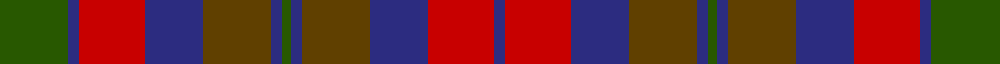

In pattern [BRBGBGBGBRBG](/stripes/brbgbgbgbrbg/).

This was sourced from register-of-tartans.  It is a [12 stripe tartan](/stripes/stripes12/).

Original link https://www.tartanregister.gov.uk/tartanDetails.aspx?ref=3259

## Also known as

This cloth is also recorded under:

- Orban-Prentice Personal

## Attestations

This cloth appears in 2 source records; the oldest owns this page.

- 01/01/2002 — Orban-Prentice (Personal) (register-of-tartans, [record](https://www.tartanregister.gov.uk/tartanDetails.aspx?ref=3259))
- undated — Orban-Prentice Personal Tartan Tartan Number: 5769. Earliest known date: 2002 Nothing See products available Copyright © Blair Urquhart, Comrie, 2015 (house-of-tartan, [record](http://www.house-of-tartan.scotland.net/house/TartanViewjs.asp?colr=Def&tnam=5769))

## Register references

External register numbers recorded for this tartan.

- Scottish Register of Tartans: [3259](https://www.tartanregister.gov.uk/tartanDetails.aspx?ref=3259)
- Scottish Tartans Authority (ITI): 5769

## Thread count
G/50 DB8 R48 DB42 T50 DB8 G6 DB8 T50 DB42 R48 DB/8

## Palette
Each colour and the base-6 reference it is a variant of.

| Colour | Shade | Base |
|---|---|---|
| DB | <code style="background-color:#2C2C80;">#2C2C80</code> `oklch(35.0% 0.138 276.6)` <small>#2C2C80</small> | B <code style="background-color:#2A418A;">#2A418A</code> |
| G | <code style="background-color:#285800;">#285800</code> `oklch(41.0% 0.122 135.8)` <small>#285800</small> | G <code style="background-color:#006100;">#006100</code> |
| R | <code style="background-color:#C80000;">#C80000</code> `oklch(52.3% 0.215 29.2)` <small>#C80000</small> | R <code style="background-color:#CC0000;">#CC0000</code> |
| T | <code style="background-color:#604000;">#604000</code> `oklch(39.8% 0.083 76.8)` <small>#604000</small> | G <code style="background-color:#006100;">#006100</code> |

## Nearest tartans

The nearest existing variants by ΔTartan distance.

1. [Murray of Atholl](/setts/s13/db18dy4db3dy3db3dy18g18r10g18dy18db18dy3r10~x2/) — ΔT 0.81
1. [Hueg (Munich) Hunting (Personal)](/setts/s11/r10do10r4dg2r2do2r4dg12dp12dg3dp4~x2/) — ΔT 0.85
1. [Clare Irish County Tartan Tartan Number: 2248. Earliest known date: 1995 One of a series of Irish District tartans designed by Polly Wittering of the House of Edgar, with colours reminiscent of the Country with soft warm colours dominating. See products available Copyright © Blair Urquhart, Comrie, 2015](/setts/s11/r3db14g14db2r14db2r14db2g14db2lo3~x2/) — ΔT 1.05
1. [Ruben Delanghe (Personal)](/setts/s10/dg14k5db2r21dg18k4db18r9k2r12/) — ΔT 1.11
1. [Crook](/setts/s9/k4m14b2y16m3k3m3b12y4~x2/) — ΔT 1.11
1. [Monaghan Irish County Tartan Tartan Number: 2267. Earliest known date: 1996 One of a series of Irish District tartans designed by Polly Wittering of the House of Edgar, with colours reminiscent of the Country with soft warm colours dominating. See products available Copyright © Blair Urquhart, Comrie, 2015](/setts/s9/lo3dy2o14dg17dy14lo8o14dy2lo3~x2/) — ΔT 1.13
1. [Glenmorangie #2](/setts/s11/dy6m2dy2m4dy13dy12o13m4o2m2o6~x2/) — ΔT 1.13
1. [Clare, County](/setts/s10/r3dp14dg14dp2r14dp2r14dg14dp2ly3~x2/) — ΔT 1.15
1. [Orban-Prentice (Personal)](/setts/s7/dg25db4r24db21dy25db4dg3~x2/) — ΔT 1.23
1. [Kinloch Anderson](/setts/s12/r4dy14lo2dy4lo2k6dy3k6db14r2db4r4~x2/) — ΔT 1.24

## Neighbour map

Every grey dot is one of 14299 variants placed by the first two principal components of the ΔTartan feature space (44% of its variance). Red is this tartan; blue dots are its nearest — click one to open its page.

<svg viewBox="0 0 640 380" role="img" style="max-width:100%;height:auto;border:1px solid #e0e0e0;border-radius:4px;display:block" xmlns="http://www.w3.org/2000/svg"><image href="/nn/cloud.v1.png" width="640" height="380"/><a href="/setts/s13/db18dy4db3dy3db3dy18g18r10g18dy18db18dy3r10~x2/"><circle cx="159.8" cy="235.3" r="4" fill="#3465a4"><title>Murray of Atholl</title></circle></a><a href="/setts/s11/r10do10r4dg2r2do2r4dg12dp12dg3dp4~x2/"><circle cx="175.1" cy="238.9" r="4" fill="#3465a4"><title>Hueg (Munich) Hunting (Personal)</title></circle></a><a href="/setts/s11/r3db14g14db2r14db2r14db2g14db2lo3~x2/"><circle cx="206.9" cy="216.3" r="4" fill="#3465a4"><title>Clare Irish County Tartan Tartan Number: 2248. Earliest known date: 1995 One of a series of Irish District tartans designed by Polly Wittering of the House of Edgar, with colours reminiscent of the Country with soft warm colours dominating. See products available Copyright © Blair Urquhart, Comrie, 2015</title></circle></a><a href="/setts/s10/dg14k5db2r21dg18k4db18r9k2r12/"><circle cx="242.8" cy="231.8" r="4" fill="#3465a4"><title>Ruben Delanghe (Personal)</title></circle></a><a href="/setts/s9/k4m14b2y16m3k3m3b12y4~x2/"><circle cx="201.4" cy="225.0" r="4" fill="#3465a4"><title>Crook</title></circle></a><a href="/setts/s9/lo3dy2o14dg17dy14lo8o14dy2lo3~x2/"><circle cx="187.0" cy="221.3" r="4" fill="#3465a4"><title>Monaghan Irish County Tartan Tartan Number: 2267. Earliest known date: 1996 One of a series of Irish District tartans designed by Polly Wittering of the House of Edgar, with colours reminiscent of the Country with soft warm colours dominating. See products available Copyright © Blair Urquhart, Comrie, 2015</title></circle></a><a href="/setts/s11/dy6m2dy2m4dy13dy12o13m4o2m2o6~x2/"><circle cx="181.9" cy="225.1" r="4" fill="#3465a4"><title>Glenmorangie #2</title></circle></a><a href="/setts/s10/r3dp14dg14dp2r14dp2r14dg14dp2ly3~x2/"><circle cx="232.1" cy="236.3" r="4" fill="#3465a4"><title>Clare, County</title></circle></a><a href="/setts/s7/dg25db4r24db21dy25db4dg3~x2/"><circle cx="170.4" cy="244.0" r="4" fill="#3465a4"><title>Orban-Prentice (Personal)</title></circle></a><a href="/setts/s12/r4dy14lo2dy4lo2k6dy3k6db14r2db4r4~x2/"><circle cx="138.5" cy="193.0" r="4" fill="#3465a4"><title>Kinloch Anderson</title></circle></a><circle cx="174.3" cy="220.2" r="5" fill="#c00000"/></svg>

ID: /setts/s12/dg25db4r24db21dy25db4dg3~x2/
