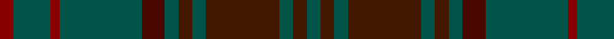

This page is one **sett** — a single exact thread-count. It belongs to the [tartan](/tartans/dg3do3dg3do16dg3do3dg3dr5dg18r2dg8r3/)
(the same proportion at any scale), whose colour order is pattern [GBGBGBGBGRGR](/stripes/gbgbgbgbgrgr/).

Sourced from register-of-tartans.  It is a [12 stripe tartan](/stripes/stripes12/).

Original link https://www.tartanregister.gov.uk/tartanDetails.aspx?ref=999

2 attestations — the source records this cloth was collapsed from (oldest owns this page)

<ul>
<li>01/01/1996 — Dublin, County (register-of-tartans, <a href="https://www.tartanregister.gov.uk/tartanDetails.aspx?ref=999">record</a>)</li>
<li>1997 — Dublin, County (District) (tartans-authority, <a href="http://www.tartansauthority.com/tartan-ferret/display/2250/">record</a>)</li>
</ul>

## Register references

External register numbers recorded for this tartan.

- Scottish Register of Tartans: [999](https://www.tartanregister.gov.uk/tartanDetails.aspx?ref=999)
- Scottish Tartans Authority (ITI): 2250
- Scottish Tartans World Register: 2250

## Thread count
G/6 DR6 G6 DR32 G6 DR6 G6 DRb10 G36 DRa4 G16 DRa/6

## Palette

Palette: <strong>Tartan Register</strong> <small style="color:#888">(3 of 4 colours)</small>
<table><thead><tr><th>Colour</th><th>Threads</th><th>Shade</th><th>Base</th><th>OKLCh</th></tr></thead><tbody><tr><td>G/</td><td style="text-align:right;font-variant-numeric:tabular-nums">6</td><td><code style="background-color:#005448;">#005448</code> <small style="color:#888">#005448</small></td><td>G <code style="background-color:#006100;">#006100</code></td><td><small style="color:#888">oklch(39.9% 0.073 178.8)</small></td></tr><tr><td>DR</td><td style="text-align:right;font-variant-numeric:tabular-nums">6</td><td><code style="background-color:#441800;">#441800</code> <small style="color:#888">#441800</small></td><td>B <code style="background-color:#2A418A;">#2A418A</code></td><td><small style="color:#888">oklch(27.3% 0.076 46.3)</small></td></tr><tr><td>G</td><td style="text-align:right;font-variant-numeric:tabular-nums">6</td><td><code style="background-color:#005448;">#005448</code> <small style="color:#888">#005448</small></td><td>G <code style="background-color:#006100;">#006100</code></td><td><small style="color:#888">oklch(39.9% 0.073 178.8)</small></td></tr><tr><td>DR</td><td style="text-align:right;font-variant-numeric:tabular-nums">32</td><td><code style="background-color:#441800;">#441800</code> <small style="color:#888">#441800</small></td><td>B <code style="background-color:#2A418A;">#2A418A</code></td><td><small style="color:#888">oklch(27.3% 0.076 46.3)</small></td></tr><tr><td>G</td><td style="text-align:right;font-variant-numeric:tabular-nums">6</td><td><code style="background-color:#005448;">#005448</code> <small style="color:#888">#005448</small></td><td>G <code style="background-color:#006100;">#006100</code></td><td><small style="color:#888">oklch(39.9% 0.073 178.8)</small></td></tr><tr><td>DR</td><td style="text-align:right;font-variant-numeric:tabular-nums">6</td><td><code style="background-color:#441800;">#441800</code> <small style="color:#888">#441800</small></td><td>B <code style="background-color:#2A418A;">#2A418A</code></td><td><small style="color:#888">oklch(27.3% 0.076 46.3)</small></td></tr><tr><td>G</td><td style="text-align:right;font-variant-numeric:tabular-nums">6</td><td><code style="background-color:#005448;">#005448</code> <small style="color:#888">#005448</small></td><td>G <code style="background-color:#006100;">#006100</code></td><td><small style="color:#888">oklch(39.9% 0.073 178.8)</small></td></tr><tr><td>DRb</td><td style="text-align:right;font-variant-numeric:tabular-nums">10</td><td><code style="background-color:#480800;">#480800</code> <small style="color:#888">#480800</small></td><td>B <code style="background-color:#2A418A;">#2A418A</code></td><td><small style="color:#888">oklch(26.1% 0.096 33.1)</small></td></tr><tr><td>G</td><td style="text-align:right;font-variant-numeric:tabular-nums">36</td><td><code style="background-color:#005448;">#005448</code> <small style="color:#888">#005448</small></td><td>G <code style="background-color:#006100;">#006100</code></td><td><small style="color:#888">oklch(39.9% 0.073 178.8)</small></td></tr><tr><td>DRa</td><td style="text-align:right;font-variant-numeric:tabular-nums">4</td><td><code style="background-color:#880000;">#880000</code> <small style="color:#888">#880000</small></td><td>R <code style="background-color:#CC0000;">#CC0000</code></td><td><small style="color:#888">oklch(39.4% 0.162 29.2)</small></td></tr><tr><td>G</td><td style="text-align:right;font-variant-numeric:tabular-nums">16</td><td><code style="background-color:#005448;">#005448</code> <small style="color:#888">#005448</small></td><td>G <code style="background-color:#006100;">#006100</code></td><td><small style="color:#888">oklch(39.9% 0.073 178.8)</small></td></tr><tr><td>DRa/</td><td style="text-align:right;font-variant-numeric:tabular-nums">6</td><td><code style="background-color:#880000;">#880000</code> <small style="color:#888">#880000</small></td><td>R <code style="background-color:#CC0000;">#CC0000</code></td><td><small style="color:#888">oklch(39.4% 0.162 29.2)</small></td></tr></tbody></table>

## Nearest tartans

The nearest existing variants by ΔTartan distance, with this tartan at the top so the swatches line up against it.

ΔTartan

Tartan

Sett

—

<a href="/ttd/edit/#slug=dg3do3dg3do16dg3do3dg3dr5dg18r2dg8r3~x2">Dublin, County</a> <a class="nn-out" href="/setts/s12/dg3do3dg3do16dg3do3dg3dr5dg18r2dg8r3~x2/" title="open its dictionary page">↗</a>

1.19

<a href="/ttd/edit/#slug=do8y2do27k10n4k2n3k2n16do2~x2">Highland Granite</a> <a class="nn-out" href="/setts/s10/do8y2do27k10n4k2n3k2n16do2~x2/" title="open its dictionary page">↗</a>

1.32

<a href="/ttd/edit/#slug=dg4ly2dg17dg2r4dg2dg3dg11dg2~x2">Armagh, County</a> <a class="nn-out" href="/setts/s9/dg4ly2dg17dg2r4dg2dg3dg11dg2~x2/" title="open its dictionary page">↗</a>

1.50

<a href="/ttd/edit/#slug=dy6w1do18k6do4k4do8k1do8k2dy5~x2">Bute Heather, Weathered</a> <a class="nn-out" href="/setts/s11/dy6w1do18k6do4k4do8k1do8k2dy5~x2/" title="open its dictionary page">↗</a>

1.55

<a href="/ttd/edit/#slug=g4dy2g2dy2g2dy3db1dy1g4dy1db1dy12db2dy3~x2">MacAlister of Glenbarr Clan Tartan Tartan Number: 910. Earliest known date: pre 1984 This version of the MacAlister of Glenbarr tartan is the same as the MacGillivray hunting tartan. This sample was taken from a piece woven by Lochcarron Weavers around 1984. See products available Copyright © Blair Urquhart, Comrie, 2015</a> <a class="nn-out" href="/setts/s14/g4dy2g2dy2g2dy3db1dy1g4dy1db1dy12db2dy3~x2/" title="open its dictionary page">↗</a>

1.56

<a href="/ttd/edit/#slug=dy9n4dy2n4dy2n30dy9n4t14lo2~x2">Hanna of Leith (yellow line)</a> <a class="nn-out" href="/setts/s10/dy9n4dy2n4dy2n30dy9n4t14lo2~x2/" title="open its dictionary page">↗</a>

1.59

<a href="/ttd/edit/#slug=r3do23k3db3k3do18k2do2k2do2k19o3~x2">MacInnes Homecoming</a> <a class="nn-out" href="/setts/s12/r3do23k3db3k3do18k2do2k2do2k19o3~x2/" title="open its dictionary page">↗</a>

1.60

<a href="/ttd/edit/#slug=n12y3n36k12n8k8n16k2n18k4n10">Bute Heather, Hunting (Fashion)</a> <a class="nn-out" href="/setts/s11/n12y3n36k12n8k8n16k2n18k4n10/" title="open its dictionary page">↗</a>

1.64

<a href="/ttd/edit/#slug=w2dy14dg7dy1db7dy1db7dy1dg7dy14r2dy14dg7dy1db7dy1~x4">Fraser Hunting (unmarked sample)</a> <a class="nn-out" href="/setts/s16/w2dy14dg7dy1db7dy1db7dy1dg7dy14r2dy14dg7dy1db7dy1~x4/" title="open its dictionary page">↗</a>

1.67

<a href="/ttd/edit/#slug=dg27r2dg3r3n3lo2n14r2n3lo3n3r2n14~x2">Crowne Plaza (Corporate)</a> <a class="nn-out" href="/setts/s13/dg27r2dg3r3n3lo2n14r2n3lo3n3r2n14~x2/" title="open its dictionary page">↗</a>

1.71

<a href="/ttd/edit/#slug=y4dg18do3dg3do3dg18k2r4k2do16dg3do3dg3do16dg3~x2">Ontario, Ensign of</a> <a class="nn-out" href="/setts/s15/y4dg18do3dg3do3dg18k2r4k2do16dg3do3dg3do16dg3~x2/" title="open its dictionary page">↗</a>

## Neighbour map

Every grey dot is one of 14299 variants placed by the first two principal components of the ΔTartan feature space (44% of its variance). Red is this tartan; blue dots are its nearest — click one to open its page.

<svg viewBox="0 0 640 380" role="img" style="max-width:100%;height:auto;border:1px solid #e0e0e0;border-radius:4px;display:block" xmlns="http://www.w3.org/2000/svg"><image href="/nn/cloud.v1.png" width="640" height="380"/><a href="/setts/s10/do8y2do27k10n4k2n3k2n16do2~x2/"><circle cx="386.0" cy="231.4" r="4" fill="#3465a4"><title>Highland Granite</title></circle></a><a href="/setts/s9/dg4ly2dg17dg2r4dg2dg3dg11dg2~x2/"><circle cx="385.9" cy="256.1" r="4" fill="#3465a4"><title>Armagh, County</title></circle></a><a href="/setts/s11/dy6w1do18k6do4k4do8k1do8k2dy5~x2/"><circle cx="447.4" cy="243.4" r="4" fill="#3465a4"><title>Bute Heather, Weathered</title></circle></a><a href="/setts/s14/g4dy2g2dy2g2dy3db1dy1g4dy1db1dy12db2dy3~x2/"><circle cx="467.8" cy="247.7" r="4" fill="#3465a4"><title>MacAlister of Glenbarr Clan Tartan Tartan Number: 910. Earliest known date: pre 1984 This version of the MacAlister of Glenbarr tartan is the same as the MacGillivray hunting tartan. This sample was taken from a piece woven by Lochcarron Weavers around 1984. See products available Copyright © Blair Urquhart, Comrie, 2015</title></circle></a><a href="/setts/s10/dy9n4dy2n4dy2n30dy9n4t14lo2~x2/"><circle cx="396.8" cy="215.8" r="4" fill="#3465a4"><title>Hanna of Leith (yellow line)</title></circle></a><a href="/setts/s12/r3do23k3db3k3do18k2do2k2do2k19o3~x2/"><circle cx="386.0" cy="201.4" r="4" fill="#3465a4"><title>MacInnes Homecoming</title></circle></a><a href="/setts/s11/n12y3n36k12n8k8n16k2n18k4n10/"><circle cx="421.3" cy="227.4" r="4" fill="#3465a4"><title>Bute Heather, Hunting (Fashion)</title></circle></a><a href="/setts/s16/w2dy14dg7dy1db7dy1db7dy1dg7dy14r2dy14dg7dy1db7dy1~x4/"><circle cx="324.5" cy="199.6" r="4" fill="#3465a4"><title>Fraser Hunting (unmarked sample)</title></circle></a><a href="/setts/s13/dg27r2dg3r3n3lo2n14r2n3lo3n3r2n14~x2/"><circle cx="358.4" cy="197.5" r="4" fill="#3465a4"><title>Crowne Plaza (Corporate)</title></circle></a><a href="/setts/s15/y4dg18do3dg3do3dg18k2r4k2do16dg3do3dg3do16dg3~x2/"><circle cx="380.4" cy="241.4" r="4" fill="#3465a4"><title>Ontario, Ensign of</title></circle></a><circle cx="393.4" cy="249.5" r="5" fill="#c00000"/></svg>

ID: /setts/s12/dg3do3dg3do16dg3do3dg3dr5dg18r2dg8r3~x2/
