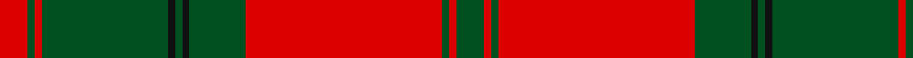

This page is one **sett** — a single exact thread-count. It belongs to the [tartan](/tartans/dg4r1dg1r28dg8k1dg1k1dg18r1dg1r4/)
(the same proportion at any scale), whose colour order is pattern [GRGRGKGKGRGR](/stripes/grgrgkgkgrgr/).

Sourced from register-of-tartans.  It is a [12 stripe tartan](/stripes/stripes12/).

Original link https://www.tartanregister.gov.uk/tartanDetails.aspx?ref=982

## Also known as

This cloth is also recorded under:

- Drummond #3

4 attestations — the source records this cloth was collapsed from (oldest owns this page)

<ul>
<li>undated — Drummond #3 (register-of-tartans, <a href="https://www.tartanregister.gov.uk/tartanDetails.aspx?ref=982">record</a>)</li>
<li>undated — Drummond VS (weddslist, <a href="http://www.weddslist.com/cgi-bin/tartans/pg.pl?source=rb">record</a>)</li>
<li>undated — Drummond VS (weddslist, <a href="http://www.weddslist.com/cgi-bin/tartans/pg.pl?source=tinsel">record</a>)</li>
<li>undated — Drummond VS (weddslist, <a href="http://www.weddslist.com/cgi-bin/tartans/pg.pl?source=x">record</a>)</li>
</ul>

## Register references

External register numbers recorded for this tartan.

- Scottish Register of Tartans: [982](https://www.tartanregister.gov.uk/tartanDetails.aspx?ref=982)
- Scottish Tartans World Register: 897

## Thread count
R/8 G2 R2 G36 K2 G2 K2 G16 R56 G2 R2 G/8

## Palette

Palette: <strong>Tartan Register</strong>
<table><thead><tr><th>Colour</th><th>Threads</th><th>Shade</th><th>Base</th><th>OKLCh</th></tr></thead><tbody><tr><td>R/</td><td style="text-align:right;font-variant-numeric:tabular-nums">8</td><td><code style="background-color:#DC0000;">#DC0000</code> <small style="color:#888">#DC0000</small></td><td>R <code style="background-color:#CC0000;">#CC0000</code></td><td><small style="color:#888">oklch(56.2% 0.230 29.2)</small></td></tr><tr><td>G</td><td style="text-align:right;font-variant-numeric:tabular-nums">2</td><td><code style="background-color:#005020;">#005020</code> <small style="color:#888">#005020</small></td><td>G <code style="background-color:#006100;">#006100</code></td><td><small style="color:#888">oklch(37.7% 0.105 149.6)</small></td></tr><tr><td>R</td><td style="text-align:right;font-variant-numeric:tabular-nums">2</td><td><code style="background-color:#DC0000;">#DC0000</code> <small style="color:#888">#DC0000</small></td><td>R <code style="background-color:#CC0000;">#CC0000</code></td><td><small style="color:#888">oklch(56.2% 0.230 29.2)</small></td></tr><tr><td>G</td><td style="text-align:right;font-variant-numeric:tabular-nums">36</td><td><code style="background-color:#005020;">#005020</code> <small style="color:#888">#005020</small></td><td>G <code style="background-color:#006100;">#006100</code></td><td><small style="color:#888">oklch(37.7% 0.105 149.6)</small></td></tr><tr><td>K</td><td style="text-align:right;font-variant-numeric:tabular-nums">2</td><td><code style="background-color:#101010;">#101010</code> <small style="color:#888">#101010</small></td><td>K <code style="background-color:#000000;">#000000</code></td><td><small style="color:#888">oklch(17.3% 0.000 89.9)</small></td></tr><tr><td>G</td><td style="text-align:right;font-variant-numeric:tabular-nums">2</td><td><code style="background-color:#005020;">#005020</code> <small style="color:#888">#005020</small></td><td>G <code style="background-color:#006100;">#006100</code></td><td><small style="color:#888">oklch(37.7% 0.105 149.6)</small></td></tr><tr><td>K</td><td style="text-align:right;font-variant-numeric:tabular-nums">2</td><td><code style="background-color:#101010;">#101010</code> <small style="color:#888">#101010</small></td><td>K <code style="background-color:#000000;">#000000</code></td><td><small style="color:#888">oklch(17.3% 0.000 89.9)</small></td></tr><tr><td>G</td><td style="text-align:right;font-variant-numeric:tabular-nums">16</td><td><code style="background-color:#005020;">#005020</code> <small style="color:#888">#005020</small></td><td>G <code style="background-color:#006100;">#006100</code></td><td><small style="color:#888">oklch(37.7% 0.105 149.6)</small></td></tr><tr><td>R</td><td style="text-align:right;font-variant-numeric:tabular-nums">56</td><td><code style="background-color:#DC0000;">#DC0000</code> <small style="color:#888">#DC0000</small></td><td>R <code style="background-color:#CC0000;">#CC0000</code></td><td><small style="color:#888">oklch(56.2% 0.230 29.2)</small></td></tr><tr><td>G</td><td style="text-align:right;font-variant-numeric:tabular-nums">2</td><td><code style="background-color:#005020;">#005020</code> <small style="color:#888">#005020</small></td><td>G <code style="background-color:#006100;">#006100</code></td><td><small style="color:#888">oklch(37.7% 0.105 149.6)</small></td></tr><tr><td>R</td><td style="text-align:right;font-variant-numeric:tabular-nums">2</td><td><code style="background-color:#DC0000;">#DC0000</code> <small style="color:#888">#DC0000</small></td><td>R <code style="background-color:#CC0000;">#CC0000</code></td><td><small style="color:#888">oklch(56.2% 0.230 29.2)</small></td></tr><tr><td>G/</td><td style="text-align:right;font-variant-numeric:tabular-nums">8</td><td><code style="background-color:#005020;">#005020</code> <small style="color:#888">#005020</small></td><td>G <code style="background-color:#006100;">#006100</code></td><td><small style="color:#888">oklch(37.7% 0.105 149.6)</small></td></tr></tbody></table>

## Nearest tartans

The nearest existing variants by ΔTartan distance, with this tartan at the top so the swatches line up against it.

ΔTartan

Tartan

Sett

—

<a href="/ttd/edit/#slug=dg4r1dg1r28dg8k1dg1k1dg18r1dg1r4~x2">Drummond #3</a> <a class="nn-out" href="/setts/s12/dg4r1dg1r28dg8k1dg1k1dg18r1dg1r4~x2/" title="open its dictionary page">↗</a>

0.84

<a href="/ttd/edit/#slug=dg18r3dg2r2db6r2dg2r24dg1r2dg6~x2">MacDonell of Glengarry #4</a> <a class="nn-out" href="/setts/s11/dg18r3dg2r2db6r2dg2r24dg1r2dg6~x2/" title="open its dictionary page">↗</a>

0.90

<a href="/ttd/edit/#slug=r4g1r1g18k1g1k1g8r28g1r1g4~x2">Drummond</a> <a class="nn-out" href="/setts/s12/r4g1r1g18k1g1k1g8r28g1r1g4~x2/" title="open its dictionary page">↗</a>

1.00

<a href="/ttd/edit/#slug=g20r3g6r6g6r8dp2r2g20r2dp2r46dp3r8~x2">MacAlister of Glenbarr</a> <a class="nn-out" href="/setts/s14/g20r3g6r6g6r8dp2r2g20r2dp2r46dp3r8~x2/" title="open its dictionary page">↗</a>

1.00

<a href="/ttd/edit/#slug=r2db1g2db1g19db2r27g2~x2">Thomas of Wales</a> <a class="nn-out" href="/setts/s8/r2db1g2db1g19db2r27g2~x2/" title="open its dictionary page">↗</a>

1.01

<a href="/ttd/edit/#slug=dg15r1dg1r1dg1r18dg24r1dg1r18dg1r1dg1r3~x2">Robertson #2</a> <a class="nn-out" href="/setts/s14/dg15r1dg1r1dg1r18dg24r1dg1r18dg1r1dg1r3~x2/" title="open its dictionary page">↗</a>

1.10

<a href="/ttd/edit/#slug=g18r3g2r2db6r2g2r24g1r2g6~x2">MacDonell of Glengarry</a> <a class="nn-out" href="/setts/s11/g18r3g2r2db6r2g2r24g1r2g6~x2/" title="open its dictionary page">↗</a>

1.18

<a href="/setts/s12/r60db2g24r8db2t3db2/">Unidentified Cant #12</a>

1.19

<a href="/ttd/edit/#slug=r6db1r1g28r4db8w1r32g1r4g2~x2">MacDonell of Keppoch</a> <a class="nn-out" href="/setts/s11/r6db1r1g28r4db8w1r32g1r4g2~x2/" title="open its dictionary page">↗</a>

1.20

<a href="/ttd/edit/#slug=r1g1r32db32r8g1r1g1r8g32r32g1r1~x2">Grant of Rothiemurchus</a> <a class="nn-out" href="/setts/s13/r1g1r32db32r8g1r1g1r8g32r32g1r1~x2/" title="open its dictionary page">↗</a>

1.21

<a href="/ttd/edit/#slug=r6db1r1dg28r4db8w1r32dg1r4dg2~x2">MacDonell of Keppoch (artefact)</a> <a class="nn-out" href="/setts/s11/r6db1r1dg28r4db8w1r32dg1r4dg2~x2/" title="open its dictionary page">↗</a>

## Neighbour map

Every grey dot is one of 14359 variants placed by the first two principal components of the ΔTartan feature space (44% of its variance). Red is this tartan; blue dots are its nearest — click one to open its page.

<svg viewBox="0 0 640 380" role="img" style="max-width:100%;height:auto;border:1px solid #e0e0e0;border-radius:4px;display:block" xmlns="http://www.w3.org/2000/svg"><image href="/nn/cloud.v1.png" width="640" height="380"/><a href="/setts/s11/dg18r3dg2r2db6r2dg2r24dg1r2dg6~x2/"><circle cx="359.9" cy="143.1" r="4" fill="#3465a4"><title>MacDonell of Glengarry #4</title></circle></a><a href="/setts/s12/r4g1r1g18k1g1k1g8r28g1r1g4~x2/"><circle cx="389.2" cy="121.5" r="4" fill="#3465a4"><title>Drummond</title></circle></a><a href="/setts/s14/g20r3g6r6g6r8dp2r2g20r2dp2r46dp3r8~x2/"><circle cx="407.8" cy="136.7" r="4" fill="#3465a4"><title>MacAlister of Glenbarr</title></circle></a><a href="/setts/s8/r2db1g2db1g19db2r27g2~x2/"><circle cx="403.9" cy="147.1" r="4" fill="#3465a4"><title>Thomas of Wales</title></circle></a><a href="/setts/s14/dg15r1dg1r1dg1r18dg24r1dg1r18dg1r1dg1r3~x2/"><circle cx="414.1" cy="143.1" r="4" fill="#3465a4"><title>Robertson #2</title></circle></a><a href="/setts/s11/g18r3g2r2db6r2g2r24g1r2g6~x2/"><circle cx="362.4" cy="147.6" r="4" fill="#3465a4"><title>MacDonell of Glengarry</title></circle></a><a href="/setts/s12/r60db2g24r8db2t3db2/"><circle cx="385.4" cy="105.4" r="4" fill="#3465a4"><title>Unidentified Cant #12</title></circle></a><a href="/setts/s11/r6db1r1g28r4db8w1r32g1r4g2~x2/"><circle cx="377.4" cy="109.7" r="4" fill="#3465a4"><title>MacDonell of Keppoch</title></circle></a><a href="/setts/s13/r1g1r32db32r8g1r1g1r8g32r32g1r1~x2/"><circle cx="388.6" cy="127.0" r="4" fill="#3465a4"><title>Grant of Rothiemurchus</title></circle></a><a href="/setts/s11/r6db1r1dg28r4db8w1r32dg1r4dg2~x2/"><circle cx="373.8" cy="104.4" r="4" fill="#3465a4"><title>MacDonell of Keppoch (artefact)</title></circle></a><circle cx="395.0" cy="120.6" r="5" fill="#c00000"/></svg>

ID: /setts/s12/dg4r1dg1r28dg8k1dg1k1dg18r1dg1r4~x2/
