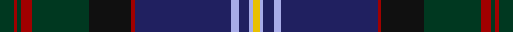

This page is one **sett** — a single exact thread-count. It belongs to the [tartan](/tartans/dg4r1dg1r3dg16k12r1db27lb2db3lb1ly2/)
(the same proportion at any scale), whose colour order is pattern [GRGRGKRBWBWY](/stripes/grgrgkrbwbwy/).

Sourced from tartans-authority.  It is a [12 stripe tartan](/stripes/stripes12/).

Original link http://www.tartansauthority.com/tartan-ferret/display/10904/

## Thread count
DG/8 DR2 DG2 DR6 DG32 K24 DR2 DB54 LP4 DB6 LP2 Y/4

## Palette

Palette: <strong>Tartan Register</strong>
<table><thead><tr><th>Colour</th><th>Threads</th><th>Shade</th><th>Base</th><th>OKLCh</th></tr></thead><tbody><tr><td>DG/</td><td style="text-align:right;font-variant-numeric:tabular-nums">8</td><td><code style="background-color:#003820;">#003820</code> <small style="color:#888">#003820</small></td><td>G <code style="background-color:#006100;">#006100</code></td><td><small style="color:#888">oklch(30.0% 0.070 158.3)</small></td></tr><tr><td>DR</td><td style="text-align:right;font-variant-numeric:tabular-nums">2</td><td><code style="background-color:#A00000;">#A00000</code> <small style="color:#888">#A00000</small></td><td>R <code style="background-color:#CC0000;">#CC0000</code></td><td><small style="color:#888">oklch(44.3% 0.182 29.2)</small></td></tr><tr><td>DG</td><td style="text-align:right;font-variant-numeric:tabular-nums">2</td><td><code style="background-color:#003820;">#003820</code> <small style="color:#888">#003820</small></td><td>G <code style="background-color:#006100;">#006100</code></td><td><small style="color:#888">oklch(30.0% 0.070 158.3)</small></td></tr><tr><td>DR</td><td style="text-align:right;font-variant-numeric:tabular-nums">6</td><td><code style="background-color:#A00000;">#A00000</code> <small style="color:#888">#A00000</small></td><td>R <code style="background-color:#CC0000;">#CC0000</code></td><td><small style="color:#888">oklch(44.3% 0.182 29.2)</small></td></tr><tr><td>DG</td><td style="text-align:right;font-variant-numeric:tabular-nums">32</td><td><code style="background-color:#003820;">#003820</code> <small style="color:#888">#003820</small></td><td>G <code style="background-color:#006100;">#006100</code></td><td><small style="color:#888">oklch(30.0% 0.070 158.3)</small></td></tr><tr><td>K</td><td style="text-align:right;font-variant-numeric:tabular-nums">24</td><td><code style="background-color:#101010;">#101010</code> <small style="color:#888">#101010</small></td><td>K <code style="background-color:#000000;">#000000</code></td><td><small style="color:#888">oklch(17.3% 0.000 89.9)</small></td></tr><tr><td>DR</td><td style="text-align:right;font-variant-numeric:tabular-nums">2</td><td><code style="background-color:#A00000;">#A00000</code> <small style="color:#888">#A00000</small></td><td>R <code style="background-color:#CC0000;">#CC0000</code></td><td><small style="color:#888">oklch(44.3% 0.182 29.2)</small></td></tr><tr><td>DB</td><td style="text-align:right;font-variant-numeric:tabular-nums">54</td><td><code style="background-color:#202060;">#202060</code> <small style="color:#888">#202060</small></td><td>B <code style="background-color:#2A418A;">#2A418A</code></td><td><small style="color:#888">oklch(28.9% 0.111 276.9)</small></td></tr><tr><td>LP</td><td style="text-align:right;font-variant-numeric:tabular-nums">4</td><td><code style="background-color:#A8ACE8;">#A8ACE8</code> <small style="color:#888">#A8ACE8</small></td><td>W <code style="background-color:#F7F7F7;">#F7F7F7</code></td><td><small style="color:#888">oklch(76.3% 0.086 281.2)</small></td></tr><tr><td>DB</td><td style="text-align:right;font-variant-numeric:tabular-nums">6</td><td><code style="background-color:#202060;">#202060</code> <small style="color:#888">#202060</small></td><td>B <code style="background-color:#2A418A;">#2A418A</code></td><td><small style="color:#888">oklch(28.9% 0.111 276.9)</small></td></tr><tr><td>LP</td><td style="text-align:right;font-variant-numeric:tabular-nums">2</td><td><code style="background-color:#A8ACE8;">#A8ACE8</code> <small style="color:#888">#A8ACE8</small></td><td>W <code style="background-color:#F7F7F7;">#F7F7F7</code></td><td><small style="color:#888">oklch(76.3% 0.086 281.2)</small></td></tr><tr><td>Y/</td><td style="text-align:right;font-variant-numeric:tabular-nums">4</td><td><code style="background-color:#E8C000;">#E8C000</code> <small style="color:#888">#E8C000</small></td><td>Y <code style="background-color:#F2BF00;">#F2BF00</code></td><td><small style="color:#888">oklch(81.9% 0.168 93.7)</small></td></tr></tbody></table>

## Nearest tartans

The nearest existing variants by ΔTartan distance, with this tartan at the top so the swatches line up against it.

ΔTartan

Tartan

Sett

—

<a href="/ttd/edit/#slug=dg4r1dg1r3dg16k12r1db27lb2db3lb1ly2~x2">McGuirk (2013)</a> <a class="nn-out" href="/setts/s12/dg4r1dg1r3dg16k12r1db27lb2db3lb1ly2~x2/" title="open its dictionary page">↗</a>

0.68

<a href="/ttd/edit/#slug=db2r2db2r2db20k24dg12ly1k2dg2t2~x2">Unidentified #7</a> <a class="nn-out" href="/setts/s11/db2r2db2r2db20k24dg12ly1k2dg2t2~x2/" title="open its dictionary page">↗</a>

0.70

<a href="/ttd/edit/#slug=db9dg2dp2dp2dg18dp2k2dg1k19db33w2~x2">Highland Pride of Scotland (Fashion)</a> <a class="nn-out" href="/setts/s11/db9dg2dp2dp2dg18dp2k2dg1k19db33w2~x2/" title="open its dictionary page">↗</a>

0.82

<a href="/ttd/edit/#slug=db4w1k2db25k12b1k2g16k2r1~x2">Sidey Family Tartan (Name)</a> <a class="nn-out" href="/setts/s10/db4w1k2db25k12b1k2g16k2r1~x2/" title="open its dictionary page">↗</a>

0.96

<a href="/ttd/edit/#slug=dg4r1dg1r3dg16k12r1db27t2db3t1ly2~x2">McGuirk (2013)</a> <a class="nn-out" href="/setts/s12/dg4r1dg1r3dg16k12r1db27t2db3t1ly2~x2/" title="open its dictionary page">↗</a>

1.02

<a href="/ttd/edit/#slug=db2w2y24k24ly1r2y2r2ly1db24y2~x2">Smithsonian (Corporate)</a> <a class="nn-out" href="/setts/s11/db2w2y24k24ly1r2y2r2ly1db24y2~x2/" title="open its dictionary page">↗</a>

1.08

<a href="/ttd/edit/#slug=dg5r4m1db36r4dg15r8y1db15r4dg36r4r1db5y1~x2">Glen Orchy (Fashion)</a> <a class="nn-out" href="/setts/s15/dg5r4m1db36r4dg15r8y1db15r4dg36r4r1db5y1~x2/" title="open its dictionary page">↗</a>

1.10

<a href="/ttd/edit/#slug=g1dt28k11r5w1r5k11lr1k2g1~x2">Scragg Moran (Personal)</a> <a class="nn-out" href="/setts/s10/g1dt28k11r5w1r5k11lr1k2g1~x2/" title="open its dictionary page">↗</a>

1.10

<a href="/ttd/edit/#slug=dg8dp2dp2dg3dp16dg2k2dg1k16db30w2~x2">Pride of Scotland General Tartan Tartan Number: 2469. Earliest known date: 1997 The Pride of Scotland tartan was designed by Kenneth Dalgleish of D C Dalgleish, Selkirk and promoted by McCalls of Aberdeen who own copyright and patent. See products available Copyright © Blair Urquhart, Comrie, 2015</a> <a class="nn-out" href="/setts/s11/dg8dp2dp2dg3dp16dg2k2dg1k16db30w2~x2/" title="open its dictionary page">↗</a>

1.13

<a href="/ttd/edit/#slug=n4o3n4o2n4dt8n30k4dt4k36n4r2k4w2">Capercaillie Corporate Tartan Tartan Number: 6857. Earliest known date: 2005 RSPB Scotland will receive a 7% royalty on all products made from the new tartan, created in the colours of the world's largest woodland grouse, in a deal struck with the leading tartan weavers Lochcarron. See products available Copyright © Blair Urquhart, Comrie, 2015</a> <a class="nn-out" href="/setts/s14/n4o3n4o2n4dt8n30k4dt4k36n4r2k4w2/" title="open its dictionary page">↗</a>

1.16

<a href="/ttd/edit/#slug=db3db3db1g26db10n1db3dp5db4lo2~x2">Rikaco Heirloom (Fashion)</a> <a class="nn-out" href="/setts/s10/db3db3db1g26db10n1db3dp5db4lo2~x2/" title="open its dictionary page">↗</a>

## Neighbour map

Every grey dot is one of 14299 variants placed by the first two principal components of the ΔTartan feature space (44% of its variance). Red is this tartan; blue dots are its nearest — click one to open its page.

<svg viewBox="0 0 640 380" role="img" style="max-width:100%;height:auto;border:1px solid #e0e0e0;border-radius:4px;display:block" xmlns="http://www.w3.org/2000/svg"><image href="/nn/cloud.v1.png" width="640" height="380"/><a href="/setts/s11/db2r2db2r2db20k24dg12ly1k2dg2t2~x2/"><circle cx="232.6" cy="118.4" r="4" fill="#3465a4"><title>Unidentified #7</title></circle></a><a href="/setts/s11/db9dg2dp2dp2dg18dp2k2dg1k19db33w2~x2/"><circle cx="297.0" cy="119.8" r="4" fill="#3465a4"><title>Highland Pride of Scotland (Fashion)</title></circle></a><a href="/setts/s10/db4w1k2db25k12b1k2g16k2r1~x2/"><circle cx="275.2" cy="129.7" r="4" fill="#3465a4"><title>Sidey Family Tartan (Name)</title></circle></a><a href="/setts/s12/dg4r1dg1r3dg16k12r1db27t2db3t1ly2~x2/"><circle cx="241.0" cy="100.6" r="4" fill="#3465a4"><title>McGuirk (2013)</title></circle></a><a href="/setts/s11/db2w2y24k24ly1r2y2r2ly1db24y2~x2/"><circle cx="207.6" cy="108.7" r="4" fill="#3465a4"><title>Smithsonian (Corporate)</title></circle></a><a href="/setts/s15/dg5r4m1db36r4dg15r8y1db15r4dg36r4r1db5y1~x2/"><circle cx="287.7" cy="96.9" r="4" fill="#3465a4"><title>Glen Orchy (Fashion)</title></circle></a><a href="/setts/s10/g1dt28k11r5w1r5k11lr1k2g1~x2/"><circle cx="276.5" cy="116.2" r="4" fill="#3465a4"><title>Scragg Moran (Personal)</title></circle></a><a href="/setts/s11/dg8dp2dp2dg3dp16dg2k2dg1k16db30w2~x2/"><circle cx="244.1" cy="127.9" r="4" fill="#3465a4"><title>Pride of Scotland General Tartan Tartan Number: 2469. Earliest known date: 1997 The Pride of Scotland tartan was designed by Kenneth Dalgleish of D C Dalgleish, Selkirk and promoted by McCalls of Aberdeen who own copyright and patent. See products available Copyright © Blair Urquhart, Comrie, 2015</title></circle></a><a href="/setts/s14/n4o3n4o2n4dt8n30k4dt4k36n4r2k4w2/"><circle cx="270.0" cy="118.7" r="4" fill="#3465a4"><title>Capercaillie Corporate Tartan Tartan Number: 6857. Earliest known date: 2005 RSPB Scotland will receive a 7% royalty on all products made from the new tartan, created in the colours of the world's largest woodland grouse, in a deal struck with the leading tartan weavers Lochcarron. See products available Copyright © Blair Urquhart, Comrie, 2015</title></circle></a><a href="/setts/s10/db3db3db1g26db10n1db3dp5db4lo2~x2/"><circle cx="276.2" cy="124.0" r="4" fill="#3465a4"><title>Rikaco Heirloom (Fashion)</title></circle></a><circle cx="257.3" cy="112.0" r="5" fill="#c00000"/></svg>

ID: /setts/s12/dg4r1dg1r3dg16k12r1db27lb2db3lb1ly2~x2/
