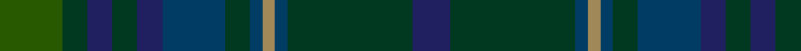

**Bands:** [GGBGBBGBYBGB](/stripes/ggbgbbgbybgb/) · **Stripes:** [DG DG DB DG DB DT DG DT LO DT DG DB](/stripes/stripes12/) DG DG DB DG DB DT DG DT LO DT DG DB

This was sourced from tartans-authority.  It is a [12 band tartan](/bands/bands12/).

Original link http://www.tartansauthority.com/tartan-ferret/display/5752/

## Attestations

This cloth appears in 2 source records; the oldest owns this page.

- 2002 — Protheroe (Welsh Name) (tartans-authority, [record](http://www.tartansauthority.com/tartan-ferret/display/5752/))
- undated — Protheroe Welsh Name Tartan Tartan Number: 5752. Earliest known date: 2002 The tartan for this Welsh surname and its variations, Prothero, Protheroe, Prothers, Prytherch, Rothero, Rotherough, Ruddock, Rudz, Ruther, Rutherch, Rhydderch, Rhodri, Roderick, is actually woven in Wales at the Cambrian Woollen Mill, weaving on the same site since 1830. This tartan differs from many traditional patterns in that the warp and weft differ, giving the finished worsted wool cloth more of a predominant stripe, noticeable in the finished Kilt, or Cilt in Wales. See products available Copyright © Blair Urquhart, Comrie, 2015 (house-of-tartan, [record](http://www.house-of-tartan.scotland.net/house/TartanViewjs.asp?colr=Def&tnam=5752))

## Thread count
G/20 DG8 DBa8 DG8 DBa8 DB20 DG8 DB4 LT4 DB4 DG40 DBa/12

## Palette
Each colour and its ΔE from the base-6 reference it is a variant of.

| Colour | Shade | Base | ΔE (OKLab) |
|---|---|---|---|
| DB | <code style="background-color:#003C64;">#003C64</code> `#003C64` | B <code style="background-color:#2A418A;">#2A418A</code> | 0.08 |
| DBa | <code style="background-color:#202060;">#202060</code> `#202060` | B <code style="background-color:#2A418A;">#2A418A</code> | 0.11 |
| DG | <code style="background-color:#003820;">#003820</code> `#003820` | G <code style="background-color:#006100;">#006100</code> | 0.15 |
| G | <code style="background-color:#285800;">#285800</code> `#285800` | G <code style="background-color:#006100;">#006100</code> | 0.03 |
| LT | <code style="background-color:#A08858;">#A08858</code> `#A08858` | Y <code style="background-color:#F2BF00;">#F2BF00</code> | 0.21 |

## Nearest tartans

The nearest existing variants by ΔTartan distance.

1. [Richard of Wales](/setts/s12/db5dg2db2dg2db2dt5dg2dt1t1dt1dg10r3~x4/) — ΔT 0.82
1. [Ryder Cup 2006](/setts/s10/k10lo1k3dt8dg8dg1dg8dt8k15lo1~x2/) — ΔT 1.32
1. [Protheroe of Wales](/setts/s22/dg10dt1lo1dt1dg2dt5db2dg2db2dg2dg5dg2db2dg2db2dt5dg2dt1lo1dt1dg10db3~x4/) — ΔT 1.39
1. [Crawfordjohn Personal Tartan Tartan Number: 6864. Earliest known date: 2005 A tartan for the Barony of Crawfordjohn designed by the present baron, Travis K Svensson. See products available Copyright © Blair Urquhart, Comrie, 2015](/setts/s12/db10dt22dg7g10dg22dp3dg22g10dg7dt22db10dt8~x2/) — ΔT 1.44
1. [Phillips Welsh Name Tartan Tartan Number: 5751. Earliest known date: 2002 The tartan for this Welsh surname and its variations, Filpin, Phelps, Philipson, Phillips, Philpin, Phipps is actually woven in Wales at the Cambrian Woollen Mill, weaving on the same site since 1830. This tartan differs from many traditional patterns in that the warp and weft differ, giving the finished worsted wool cloth more of a predominant stripe, noticeable in the finished Kilt, or Cilt in Wales. See products available Copyright © Blair Urquhart, Comrie, 2015](/setts/s11/k2k20dg30k2dg4k2dg30k3db30k35r2/) — ΔT 1.47
1. [Unidentified Fragment #2](/setts/s15/dy8dg20db15dy6dg4dy8db4dy6dg20dy8db6dy4b2dy4db6/) — ΔT 1.49
1. [Cowal Highland Games Corporate Tartan Tartan Number: 2536. Earliest known date: 1994 The Cowal Highland Gathering takes place on the last weekend of August each year in Dunoon, Argyllshire, on the Firth of Clyde and is the largest, most spectacular Highland Games in the world with thousands of dancers, pipers, drummers and athletes attending from all over the world. In 1994, the centenary year of the Gathering, this soft muted tartan in blues and greens was designed. Only available from Bells of Dunoon - michael.boyce@telco4u.net (Sept. 2004) See products available Copyright © Blair Urquhart, Comrie, 2015](/setts/s16/dt9dt8y1dt1y1dt1y8dg2y8dt1y1dt1y1dt8dt9n1~x4/) — ΔT 1.50
1. [Cowal Highland Gathering](/setts/s9/dg2y8dt1y1dt1y1dt8dt9n1~x4/) — ΔT 1.52
1. [Yeomans (2016)](/setts/s16/dt22k2o3k2dt22k4dg10k2dg10r3k4r3do10dg2do10k3~x2/) — ΔT 1.52
1. [West of Wells (Personal)](/setts/s9/dg28k2db3k11db3k2db17db4lr2~x2/) — ΔT 1.54

## Neighbour map

Every grey dot is one of 14299 variants placed by the first two principal components of the ΔTartan feature space (44% of its variance). Red is this tartan; blue dots are its nearest — click one to open its page.

<svg viewBox="0 0 640 380" role="img" style="max-width:100%;height:auto;border:1px solid #e0e0e0;border-radius:4px;display:block" xmlns="http://www.w3.org/2000/svg"><image href="/nn/cloud.v1.png" width="640" height="380"/><a href="/setts/s12/db5dg2db2dg2db2dt5dg2dt1t1dt1dg10r3~x4/"><circle cx="304.2" cy="240.0" r="4" fill="#3465a4"><title>Richard of Wales</title></circle></a><a href="/setts/s10/k10lo1k3dt8dg8dg1dg8dt8k15lo1~x2/"><circle cx="332.6" cy="255.9" r="4" fill="#3465a4"><title>Ryder Cup 2006</title></circle></a><a href="/setts/s22/dg10dt1lo1dt1dg2dt5db2dg2db2dg2dg5dg2db2dg2db2dt5dg2dt1lo1dt1dg10db3~x4/"><circle cx="339.7" cy="224.2" r="4" fill="#3465a4"><title>Protheroe of Wales</title></circle></a><a href="/setts/s12/db10dt22dg7g10dg22dp3dg22g10dg7dt22db10dt8~x2/"><circle cx="251.6" cy="291.5" r="4" fill="#3465a4"><title>Crawfordjohn Personal Tartan Tartan Number: 6864. Earliest known date: 2005 A tartan for the Barony of Crawfordjohn designed by the present baron, Travis K Svensson. See products available Copyright © Blair Urquhart, Comrie, 2015</title></circle></a><a href="/setts/s11/k2k20dg30k2dg4k2dg30k3db30k35r2/"><circle cx="360.5" cy="231.8" r="4" fill="#3465a4"><title>Phillips Welsh Name Tartan Tartan Number: 5751. Earliest known date: 2002 The tartan for this Welsh surname and its variations, Filpin, Phelps, Philipson, Phillips, Philpin, Phipps is actually woven in Wales at the Cambrian Woollen Mill, weaving on the same site since 1830. This tartan differs from many traditional patterns in that the warp and weft differ, giving the finished worsted wool cloth more of a predominant stripe, noticeable in the finished Kilt, or Cilt in Wales. See products available Copyright © Blair Urquhart, Comrie, 2015</title></circle></a><a href="/setts/s15/dy8dg20db15dy6dg4dy8db4dy6dg20dy8db6dy4b2dy4db6/"><circle cx="298.8" cy="264.3" r="4" fill="#3465a4"><title>Unidentified Fragment #2</title></circle></a><a href="/setts/s16/dt9dt8y1dt1y1dt1y8dg2y8dt1y1dt1y1dt8dt9n1~x4/"><circle cx="253.1" cy="216.6" r="4" fill="#3465a4"><title>Cowal Highland Games Corporate Tartan Tartan Number: 2536. Earliest known date: 1994 The Cowal Highland Gathering takes place on the last weekend of August each year in Dunoon, Argyllshire, on the Firth of Clyde and is the largest, most spectacular Highland Games in the world with thousands of dancers, pipers, drummers and athletes attending from all over the world. In 1994, the centenary year of the Gathering, this soft muted tartan in blues and greens was designed. Only available from Bells of Dunoon - michael.boyce@telco4u.net (Sept. 2004) See products available Copyright © Blair Urquhart, Comrie, 2015</title></circle></a><a href="/setts/s9/dg2y8dt1y1dt1y1dt8dt9n1~x4/"><circle cx="256.0" cy="239.2" r="4" fill="#3465a4"><title>Cowal Highland Gathering</title></circle></a><a href="/setts/s16/dt22k2o3k2dt22k4dg10k2dg10r3k4r3do10dg2do10k3~x2/"><circle cx="252.7" cy="196.5" r="4" fill="#3465a4"><title>Yeomans (2016)</title></circle></a><a href="/setts/s9/dg28k2db3k11db3k2db17db4lr2~x2/"><circle cx="317.2" cy="222.1" r="4" fill="#3465a4"><title>West of Wells (Personal)</title></circle></a><circle cx="307.9" cy="248.3" r="5" fill="#c00000"/></svg>

ID: /setts/s12/dg5dg2db2dg2db2dt5dg2dt1lo1dt1dg10db3~x4/
