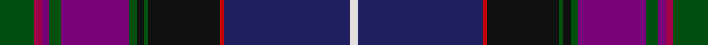

This page is one **sett** — a single exact thread-count. It belongs to the [tartan](/tartans/dg9m2dp2dg3dp18dg2k2dg1k19r1db33w2/)
(the same proportion at any scale), whose colour order is pattern [GRBGBGKGKRBW](/stripes/grbgbgkgkrbw/).

Sourced from tartans-authority.  It is a [12 stripe tartan](/stripes/stripes12/).

Original link http://www.tartansauthority.com/tartan-ferret/display/7463/

3 attestations — the source records this cloth was collapsed from (oldest owns this page)

<ul>
<li>1997 — Western Isles (Fashion) (tartans-authority, <a href="http://www.tartansauthority.com/tartan-ferret/display/7463/">record</a>)</li>
<li>undated — Western Isles (register-of-tartans, <a href="https://www.tartanregister.gov.uk/tartanDetails.aspx?ref=5508">record</a>)</li>
<li>undated — Western Isles Fashion Tartan Tartan Number: 7463. Earliest known date: 1997 Kenneth Dalgliesh designed the Pride of Scotland (see 2469) along with Scott Millson of McCalls of Aberdeen. McCalls decided later to patent the design to head up a new range of fashionable wedding tartans. Dalgliesh found that he was unable to weave the original pattern even though it was his own design and so he produced this pattern with an additional red line. See products available Copyright © Blair Urquhart, Comrie, 2015 (house-of-tartan, <a href="http://www.house-of-tartan.scotland.net/house/TartanViewjs.asp?colr=Def&tnam=7463">record</a>)</li>
</ul>

## Register references

External register numbers recorded for this tartan.

- Scottish Register of Tartans: [5508](https://www.tartanregister.gov.uk/tartanDetails.aspx?ref=5508)
- Scottish Tartans Authority (ITI): 7463

## Thread count
G/18 R4 P4 G6 P36 G4 K4 G2 K38 Ra2 DB66 LN/4

## Palette

Palette: <strong>Tartan Register</strong> <small style="color:#888">(6 of 7 colours)</small>
<table><thead><tr><th>Colour</th><th>Threads</th><th>Shade</th><th>Base</th><th>OKLCh</th></tr></thead><tbody><tr><td>G/</td><td style="text-align:right;font-variant-numeric:tabular-nums">18</td><td><code style="background-color:#005010;">#005010</code> <small style="color:#888">#005010</small></td><td>G <code style="background-color:#006100;">#006100</code></td><td><small style="color:#888">oklch(37.5% 0.118 144.9)</small></td></tr><tr><td>R</td><td style="text-align:right;font-variant-numeric:tabular-nums">4</td><td><code style="background-color:#A00048;">#A00048</code> <small style="color:#888">#A00048</small></td><td>R <code style="background-color:#CC0000;">#CC0000</code></td><td><small style="color:#888">oklch(45.4% 0.182 5.3)</small></td></tr><tr><td>P</td><td style="text-align:right;font-variant-numeric:tabular-nums">4</td><td><code style="background-color:#780078;">#780078</code> <small style="color:#888">#780078</small></td><td>B <code style="background-color:#2A418A;">#2A418A</code></td><td><small style="color:#888">oklch(40.2% 0.185 328.4)</small></td></tr><tr><td>G</td><td style="text-align:right;font-variant-numeric:tabular-nums">6</td><td><code style="background-color:#005010;">#005010</code> <small style="color:#888">#005010</small></td><td>G <code style="background-color:#006100;">#006100</code></td><td><small style="color:#888">oklch(37.5% 0.118 144.9)</small></td></tr><tr><td>P</td><td style="text-align:right;font-variant-numeric:tabular-nums">36</td><td><code style="background-color:#780078;">#780078</code> <small style="color:#888">#780078</small></td><td>B <code style="background-color:#2A418A;">#2A418A</code></td><td><small style="color:#888">oklch(40.2% 0.185 328.4)</small></td></tr><tr><td>G</td><td style="text-align:right;font-variant-numeric:tabular-nums">4</td><td><code style="background-color:#005010;">#005010</code> <small style="color:#888">#005010</small></td><td>G <code style="background-color:#006100;">#006100</code></td><td><small style="color:#888">oklch(37.5% 0.118 144.9)</small></td></tr><tr><td>K</td><td style="text-align:right;font-variant-numeric:tabular-nums">4</td><td><code style="background-color:#101010;">#101010</code> <small style="color:#888">#101010</small></td><td>K <code style="background-color:#000000;">#000000</code></td><td><small style="color:#888">oklch(17.3% 0.000 89.9)</small></td></tr><tr><td>G</td><td style="text-align:right;font-variant-numeric:tabular-nums">2</td><td><code style="background-color:#005010;">#005010</code> <small style="color:#888">#005010</small></td><td>G <code style="background-color:#006100;">#006100</code></td><td><small style="color:#888">oklch(37.5% 0.118 144.9)</small></td></tr><tr><td>K</td><td style="text-align:right;font-variant-numeric:tabular-nums">38</td><td><code style="background-color:#101010;">#101010</code> <small style="color:#888">#101010</small></td><td>K <code style="background-color:#000000;">#000000</code></td><td><small style="color:#888">oklch(17.3% 0.000 89.9)</small></td></tr><tr><td>Ra</td><td style="text-align:right;font-variant-numeric:tabular-nums">2</td><td><code style="background-color:#C80000;">#C80000</code> <small style="color:#888">#C80000</small></td><td>R <code style="background-color:#CC0000;">#CC0000</code></td><td><small style="color:#888">oklch(52.3% 0.215 29.2)</small></td></tr><tr><td>DB</td><td style="text-align:right;font-variant-numeric:tabular-nums">66</td><td><code style="background-color:#202060;">#202060</code> <small style="color:#888">#202060</small></td><td>B <code style="background-color:#2A418A;">#2A418A</code></td><td><small style="color:#888">oklch(28.9% 0.111 276.9)</small></td></tr><tr><td>LN/</td><td style="text-align:right;font-variant-numeric:tabular-nums">4</td><td><code style="background-color:#E0E0E0;">#E0E0E0</code> <small style="color:#888">#E0E0E0</small></td><td>W <code style="background-color:#F7F7F7;">#F7F7F7</code></td><td><small style="color:#888">oklch(90.7% 0.000 89.9)</small></td></tr></tbody></table>

## Nearest tartans

The nearest existing variants by ΔTartan distance, with this tartan at the top so the swatches line up against it.

ΔTartan

Tartan

Sett

—

<a href="/ttd/edit/#slug=dg9m2dp2dg3dp18dg2k2dg1k19r1db33w2~x2">Western Isles (Fashion)</a> <a class="nn-out" href="/setts/s12/dg9m2dp2dg3dp18dg2k2dg1k19r1db33w2~x2/" title="open its dictionary page">↗</a>

1.18

<a href="/ttd/edit/#slug=dg8dp2dp2dg3dp16dg2k2dg1k16db30w2~x2">Pride of Scotland General Tartan Tartan Number: 2469. Earliest known date: 1997 The Pride of Scotland tartan was designed by Kenneth Dalgleish of D C Dalgleish, Selkirk and promoted by McCalls of Aberdeen who own copyright and patent. See products available Copyright © Blair Urquhart, Comrie, 2015</a> <a class="nn-out" href="/setts/s11/dg8dp2dp2dg3dp16dg2k2dg1k16db30w2~x2/" title="open its dictionary page">↗</a>

1.25

<a href="/ttd/edit/#slug=g9m2m2g3m18g2k2g1k19db33w2~x2">Pride of Scotland</a> <a class="nn-out" href="/setts/s11/g9m2m2g3m18g2k2g1k19db33w2~x2/" title="open its dictionary page">↗</a>

1.32

<a href="/ttd/edit/#slug=dg4r1dg1r3dg16k12r1db27lb2db3lb1ly2~x2">McGuirk (2013)</a> <a class="nn-out" href="/setts/s12/dg4r1dg1r3dg16k12r1db27lb2db3lb1ly2~x2/" title="open its dictionary page">↗</a>

1.35

<a href="/ttd/edit/#slug=k2g2p1g2p1g2p1g12db4k3db3k3db3k3db4dp24r2~x2">Rendell, Charles (Personal)</a> <a class="nn-out" href="/setts/s17/k2g2p1g2p1g2p1g12db4k3db3k3db3k3db4dp24r2~x2/" title="open its dictionary page">↗</a>

1.46

<a href="/ttd/edit/#slug=k4dp2r7dp60y15db60b5w3">Albannach</a> <a class="nn-out" href="/setts/s8/k4dp2r7dp60y15db60b5w3/" title="open its dictionary page">↗</a>

1.51

<a href="/ttd/edit/#slug=g10ly2dp2g2dp13g2dp2g1k13db24w2~x2">Lang of Sherbrooke (Personal)</a> <a class="nn-out" href="/setts/s11/g10ly2dp2g2dp13g2dp2g1k13db24w2~x2/" title="open its dictionary page">↗</a>

1.51

<a href="/ttd/edit/#slug=db2r2db2r2db20k24dg12ly1k2dg2t2~x2">Unidentified #7</a> <a class="nn-out" href="/setts/s11/db2r2db2r2db20k24dg12ly1k2dg2t2~x2/" title="open its dictionary page">↗</a>

1.52

<a href="/ttd/edit/#slug=dt38n8db3dt20n42k2g6k2n2dp3n2w2db10n2k6">Causeway, The (District)</a> <a class="nn-out" href="/setts/s15/dt38n8db3dt20n42k2g6k2n2dp3n2w2db10n2k6/" title="open its dictionary page">↗</a>

1.52

<a href="/ttd/edit/#slug=db2w2y24k24ly1r2y2r2ly1db24y2~x2">Smithsonian (Corporate)</a> <a class="nn-out" href="/setts/s11/db2w2y24k24ly1r2y2r2ly1db24y2~x2/" title="open its dictionary page">↗</a>

1.53

<a href="/ttd/edit/#slug=dp23w1dp2db16k3db2k30lo1k2r3~x2">Cumnock Hunting (District)</a> <a class="nn-out" href="/setts/s10/dp23w1dp2db16k3db2k30lo1k2r3~x2/" title="open its dictionary page">↗</a>

## Neighbour map

Every grey dot is one of 14299 variants placed by the first two principal components of the ΔTartan feature space (44% of its variance). Red is this tartan; blue dots are its nearest — click one to open its page.

<svg viewBox="0 0 640 380" role="img" style="max-width:100%;height:auto;border:1px solid #e0e0e0;border-radius:4px;display:block" xmlns="http://www.w3.org/2000/svg"><image href="/nn/cloud.v1.png" width="640" height="380"/><a href="/setts/s11/dg8dp2dp2dg3dp16dg2k2dg1k16db30w2~x2/"><circle cx="244.1" cy="127.9" r="4" fill="#3465a4"><title>Pride of Scotland General Tartan Tartan Number: 2469. Earliest known date: 1997 The Pride of Scotland tartan was designed by Kenneth Dalgleish of D C Dalgleish, Selkirk and promoted by McCalls of Aberdeen who own copyright and patent. See products available Copyright © Blair Urquhart, Comrie, 2015</title></circle></a><a href="/setts/s11/g9m2m2g3m18g2k2g1k19db33w2~x2/"><circle cx="212.7" cy="95.9" r="4" fill="#3465a4"><title>Pride of Scotland</title></circle></a><a href="/setts/s12/dg4r1dg1r3dg16k12r1db27lb2db3lb1ly2~x2/"><circle cx="257.3" cy="112.0" r="4" fill="#3465a4"><title>McGuirk (2013)</title></circle></a><a href="/setts/s17/k2g2p1g2p1g2p1g12db4k3db3k3db3k3db4dp24r2~x2/"><circle cx="198.9" cy="90.1" r="4" fill="#3465a4"><title>Rendell, Charles (Personal)</title></circle></a><a href="/setts/s8/k4dp2r7dp60y15db60b5w3/"><circle cx="278.7" cy="116.4" r="4" fill="#3465a4"><title>Albannach</title></circle></a><a href="/setts/s11/g10ly2dp2g2dp13g2dp2g1k13db24w2~x2/"><circle cx="176.2" cy="112.5" r="4" fill="#3465a4"><title>Lang of Sherbrooke (Personal)</title></circle></a><a href="/setts/s11/db2r2db2r2db20k24dg12ly1k2dg2t2~x2/"><circle cx="232.6" cy="118.4" r="4" fill="#3465a4"><title>Unidentified #7</title></circle></a><a href="/setts/s15/dt38n8db3dt20n42k2g6k2n2dp3n2w2db10n2k6/"><circle cx="244.0" cy="100.8" r="4" fill="#3465a4"><title>Causeway, The (District)</title></circle></a><a href="/setts/s11/db2w2y24k24ly1r2y2r2ly1db24y2~x2/"><circle cx="207.6" cy="108.7" r="4" fill="#3465a4"><title>Smithsonian (Corporate)</title></circle></a><a href="/setts/s10/dp23w1dp2db16k3db2k30lo1k2r3~x2/"><circle cx="276.5" cy="108.8" r="4" fill="#3465a4"><title>Cumnock Hunting (District)</title></circle></a><circle cx="217.6" cy="87.8" r="5" fill="#c00000"/></svg>

ID: /setts/s12/dg9m2dp2dg3dp18dg2k2dg1k19r1db33w2~x2/
