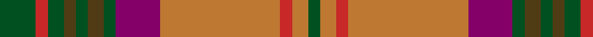

This page is one **sett** — a single exact thread-count. It belongs to the [tartan](/tartans/g9r3g4t3g3t4g3p11do30r3do4g3/)
(the same proportion at any scale), whose colour order is pattern [GRGGGGGBRRRG](/stripes/grgggggbrrrg/).

Sourced from register-of-tartans.  It is a [12 stripe tartan](/stripes/stripes12/).

Original link https://www.tartanregister.gov.uk/tartanDetails.aspx?ref=1610

## Register references

External register numbers recorded for this tartan.

- Scottish Register of Tartans: [1610](https://www.tartanregister.gov.uk/tartanDetails.aspx?ref=1610)
- Scottish Tartans World Register: 868

## Thread count
G/18 R6 G8 T6 G6 T8 G6 P22 DO60 R6 DO8 G/6

## Palette
Each colour and the base-6 reference it is a variant of.

| Colour | Shade | Base |
|---|---|---|
| DO | <code style="background-color:#BE7832;">#BE7832</code> `oklch(63.5% 0.121 62.2)` <small>#BE7832</small> | R <code style="background-color:#CC0000;">#CC0000</code> |
| G | <code style="background-color:#005020;">#005020</code> `oklch(37.7% 0.105 149.6)` <small>#005020</small> | G <code style="background-color:#006100;">#006100</code> |
| P | <code style="background-color:#840068;">#840068</code> `oklch(41.4% 0.179 340.5)` <small>#840068</small> | B <code style="background-color:#2A418A;">#2A418A</code> |
| R | <code style="background-color:#C82828;">#C82828</code> `oklch(54.2% 0.196 26.8)` <small>#C82828</small> | R <code style="background-color:#CC0000;">#CC0000</code> |
| T | <code style="background-color:#503C14;">#503C14</code> `oklch(37.0% 0.062 81.8)` <small>#503C14</small> | G <code style="background-color:#006100;">#006100</code> |

## Nearest tartans

The nearest existing variants by ΔTartan distance, with this tartan at the top so the swatches line up against it.

ΔTartan

Tartan

Sett

—

<a href="/ttd/edit/#slug=dg9r3dg4dy3dg3dy4dg3dp11o30r3o4dg3~x2">Harmony 5</a> <a class="nn-out" href="/setts/s12/dg9r3dg4dy3dg3dy4dg3dp11o30r3o4dg3~x2/" title="open its dictionary page">↗</a>

0.83

<a href="/ttd/edit/#slug=r3dy16db2dy2db2dy3db6o20lr3o2lr2o3~x2">Callum, Brown (Fashion)</a> <a class="nn-out" href="/setts/s12/r3dy16db2dy2db2dy3db6o20lr3o2lr2o3~x2/" title="open its dictionary page">↗</a>

0.88

<a href="/ttd/edit/#slug=y4lr2y2lr3y20k6do4k2do2k2do16o3~x2">Dorcas</a> <a class="nn-out" href="/setts/s12/y4lr2y2lr3y20k6do4k2do2k2do16o3~x2/" title="open its dictionary page">↗</a>

0.90

<a href="/ttd/edit/#slug=r8k5r8g27r8w2r3g3r3w2r8o27r8o3r3~x2">McCall (Name)</a> <a class="nn-out" href="/setts/s15/r8k5r8g27r8w2r3g3r3w2r8o27r8o3r3~x2/" title="open its dictionary page">↗</a>

0.97

<a href="/ttd/edit/#slug=g28lo18db4lo18r3r2r3r2r3r2r3~x2">Commonwealth Games - 2014</a> <a class="nn-out" href="/setts/s11/g28lo18db4lo18r3r2r3r2r3r2r3~x2/" title="open its dictionary page">↗</a>

1.00

<a href="/ttd/edit/#slug=o3g19r2g2r2db10r17g2r2g2r3t2r3t3~x2">Manx Heritage</a> <a class="nn-out" href="/setts/s14/o3g19r2g2r2db10r17g2r2g2r3t2r3t3~x2/" title="open its dictionary page">↗</a>

1.00

<a href="/ttd/edit/#slug=y14lo1y1lo1y2k3y3k3do3do1do9lo1~x4">Glen Nevis #2 (Personal)</a> <a class="nn-out" href="/setts/s12/y14lo1y1lo1y2k3y3k3do3do1do9lo1~x4/" title="open its dictionary page">↗</a>

1.04

<a href="/ttd/edit/#slug=ly25o2w2db2w2o13dy28db2o3~x2">Brousseau (Personal)</a> <a class="nn-out" href="/setts/s9/ly25o2w2db2w2o13dy28db2o3~x2/" title="open its dictionary page">↗</a>

1.05

<a href="/ttd/edit/#slug=y3dg19r2dg2r2db10r17dg2r2dg2r3t2r3t3~x2">Manx Heritage</a> <a class="nn-out" href="/setts/s14/y3dg19r2dg2r2db10r17dg2r2dg2r3t2r3t3~x2/" title="open its dictionary page">↗</a>

1.09

<a href="/ttd/edit/#slug=dr11g3dr4ly3dr3ly4dr3y13o34g3o4n3~x2">Harmony 1</a> <a class="nn-out" href="/setts/s12/dr11g3dr4ly3dr3ly4dr3y13o34g3o4n3~x2/" title="open its dictionary page">↗</a>

1.10

<a href="/ttd/edit/#slug=o2dg3dy18o2dy2o21g2dg2g2dg24lo2~x2">Methven</a> <a class="nn-out" href="/setts/s11/o2dg3dy18o2dy2o21g2dg2g2dg24lo2~x2/" title="open its dictionary page">↗</a>

## Neighbour map

Every grey dot is one of 14299 variants placed by the first two principal components of the ΔTartan feature space (44% of its variance). Red is this tartan; blue dots are its nearest — click one to open its page.

<svg viewBox="0 0 640 380" role="img" style="max-width:100%;height:auto;border:1px solid #e0e0e0;border-radius:4px;display:block" xmlns="http://www.w3.org/2000/svg"><image href="/nn/cloud.v1.png" width="640" height="380"/><a href="/setts/s12/r3dy16db2dy2db2dy3db6o20lr3o2lr2o3~x2/"><circle cx="204.5" cy="145.7" r="4" fill="#3465a4"><title>Callum, Brown (Fashion)</title></circle></a><a href="/setts/s12/y4lr2y2lr3y20k6do4k2do2k2do16o3~x2/"><circle cx="208.6" cy="153.9" r="4" fill="#3465a4"><title>Dorcas</title></circle></a><a href="/setts/s15/r8k5r8g27r8w2r3g3r3w2r8o27r8o3r3~x2/"><circle cx="247.6" cy="144.9" r="4" fill="#3465a4"><title>McCall (Name)</title></circle></a><a href="/setts/s11/g28lo18db4lo18r3r2r3r2r3r2r3~x2/"><circle cx="253.2" cy="138.9" r="4" fill="#3465a4"><title>Commonwealth Games - 2014</title></circle></a><a href="/setts/s14/o3g19r2g2r2db10r17g2r2g2r3t2r3t3~x2/"><circle cx="221.1" cy="144.8" r="4" fill="#3465a4"><title>Manx Heritage</title></circle></a><a href="/setts/s12/y14lo1y1lo1y2k3y3k3do3do1do9lo1~x4/"><circle cx="275.4" cy="146.5" r="4" fill="#3465a4"><title>Glen Nevis #2 (Personal)</title></circle></a><a href="/setts/s9/ly25o2w2db2w2o13dy28db2o3~x2/"><circle cx="225.5" cy="144.5" r="4" fill="#3465a4"><title>Brousseau (Personal)</title></circle></a><a href="/setts/s14/y3dg19r2dg2r2db10r17dg2r2dg2r3t2r3t3~x2/"><circle cx="221.7" cy="146.5" r="4" fill="#3465a4"><title>Manx Heritage</title></circle></a><a href="/setts/s12/dr11g3dr4ly3dr3ly4dr3y13o34g3o4n3~x2/"><circle cx="218.2" cy="127.0" r="4" fill="#3465a4"><title>Harmony 1</title></circle></a><a href="/setts/s11/o2dg3dy18o2dy2o21g2dg2g2dg24lo2~x2/"><circle cx="242.4" cy="159.1" r="4" fill="#3465a4"><title>Methven</title></circle></a><circle cx="234.5" cy="150.0" r="5" fill="#c00000"/></svg>

ID: /setts/s12/dg9r3dg4dy3dg3dy4dg3dp11o30r3o4dg3~x2/
