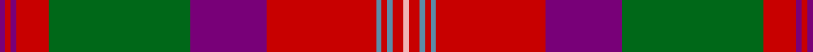

This page is one **sett** — a single exact thread-count. It belongs to the [tartan](/tartans/dp1r1dp1r6g26dp14r20t1r1t1r2lr1/)
(the same proportion at any scale), whose colour order is pattern [BRBRGBRBRBRY](/stripes/brbrgbrbrbry/).

Sourced from tartans-authority.  It is a [12 stripe tartan](/stripes/stripes12/).

Original link http://www.tartansauthority.com/tartan-ferret/display/10247/

## Register references

External register numbers recorded for this tartan.

- Scottish Register of Tartans: [10247](https://www.tartanregister.gov.uk/tartanDetails?ref=10247)
- Scottish Tartans Authority (ITI): 10247

## Thread count
P/2 R2 P2 R12 G52 P28 R40 B2 R2 B2 R4 LR/2

## Palette

Palette: <strong>Tartan Register</strong> <small style="color:#888">(4 of 5 colours)</small>
<table><thead><tr><th>Colour</th><th>Threads</th><th>Shade</th><th>Base</th><th>OKLCh</th></tr></thead><tbody><tr><td>P/</td><td style="text-align:right;font-variant-numeric:tabular-nums">2</td><td><code style="background-color:#780078;">#780078</code> <small style="color:#888">#780078</small></td><td>B <code style="background-color:#2A418A;">#2A418A</code></td><td><small style="color:#888">oklch(40.2% 0.185 328.4)</small></td></tr><tr><td>R</td><td style="text-align:right;font-variant-numeric:tabular-nums">2</td><td><code style="background-color:#C80000;">#C80000</code> <small style="color:#888">#C80000</small></td><td>R <code style="background-color:#CC0000;">#CC0000</code></td><td><small style="color:#888">oklch(52.3% 0.215 29.2)</small></td></tr><tr><td>P</td><td style="text-align:right;font-variant-numeric:tabular-nums">2</td><td><code style="background-color:#780078;">#780078</code> <small style="color:#888">#780078</small></td><td>B <code style="background-color:#2A418A;">#2A418A</code></td><td><small style="color:#888">oklch(40.2% 0.185 328.4)</small></td></tr><tr><td>R</td><td style="text-align:right;font-variant-numeric:tabular-nums">12</td><td><code style="background-color:#C80000;">#C80000</code> <small style="color:#888">#C80000</small></td><td>R <code style="background-color:#CC0000;">#CC0000</code></td><td><small style="color:#888">oklch(52.3% 0.215 29.2)</small></td></tr><tr><td>G</td><td style="text-align:right;font-variant-numeric:tabular-nums">52</td><td><code style="background-color:#006818;">#006818</code> <small style="color:#888">#006818</small></td><td>G <code style="background-color:#006100;">#006100</code></td><td><small style="color:#888">oklch(45.0% 0.142 145.0)</small></td></tr><tr><td>P</td><td style="text-align:right;font-variant-numeric:tabular-nums">28</td><td><code style="background-color:#780078;">#780078</code> <small style="color:#888">#780078</small></td><td>B <code style="background-color:#2A418A;">#2A418A</code></td><td><small style="color:#888">oklch(40.2% 0.185 328.4)</small></td></tr><tr><td>R</td><td style="text-align:right;font-variant-numeric:tabular-nums">40</td><td><code style="background-color:#C80000;">#C80000</code> <small style="color:#888">#C80000</small></td><td>R <code style="background-color:#CC0000;">#CC0000</code></td><td><small style="color:#888">oklch(52.3% 0.215 29.2)</small></td></tr><tr><td>B</td><td style="text-align:right;font-variant-numeric:tabular-nums">2</td><td><code style="background-color:#5C8CA8;">#5C8CA8</code> <small style="color:#888">#5C8CA8</small></td><td>B <code style="background-color:#2A418A;">#2A418A</code></td><td><small style="color:#888">oklch(61.7% 0.067 235.0)</small></td></tr><tr><td>R</td><td style="text-align:right;font-variant-numeric:tabular-nums">2</td><td><code style="background-color:#C80000;">#C80000</code> <small style="color:#888">#C80000</small></td><td>R <code style="background-color:#CC0000;">#CC0000</code></td><td><small style="color:#888">oklch(52.3% 0.215 29.2)</small></td></tr><tr><td>B</td><td style="text-align:right;font-variant-numeric:tabular-nums">2</td><td><code style="background-color:#5C8CA8;">#5C8CA8</code> <small style="color:#888">#5C8CA8</small></td><td>B <code style="background-color:#2A418A;">#2A418A</code></td><td><small style="color:#888">oklch(61.7% 0.067 235.0)</small></td></tr><tr><td>R</td><td style="text-align:right;font-variant-numeric:tabular-nums">4</td><td><code style="background-color:#C80000;">#C80000</code> <small style="color:#888">#C80000</small></td><td>R <code style="background-color:#CC0000;">#CC0000</code></td><td><small style="color:#888">oklch(52.3% 0.215 29.2)</small></td></tr><tr><td>LR/</td><td style="text-align:right;font-variant-numeric:tabular-nums">2</td><td><code style="background-color:#F0B4B4;">#F0B4B4</code> <small style="color:#888">#F0B4B4</small></td><td>Y <code style="background-color:#F2BF00;">#F2BF00</code></td><td><small style="color:#888">oklch(82.5% 0.070 18.7)</small></td></tr></tbody></table>

## Nearest tartans

The nearest existing variants by ΔTartan distance, with this tartan at the top so the swatches line up against it.

ΔTartan

Tartan

Sett

—

<a href="/ttd/edit/#slug=dp1r1dp1r6g26dp14r20t1r1t1r2lr1~x2">Scobie (Name)</a> <a class="nn-out" href="/setts/s12/dp1r1dp1r6g26dp14r20t1r1t1r2lr1~x2/" title="open its dictionary page">↗</a>

0.63

<a href="/ttd/edit/#slug=r3ly1dp1r20ri2dp9ri2g20dp1ly1g3~x2">Scotland (Personal)</a> <a class="nn-out" href="/setts/s11/r3ly1dp1r20ri2dp9ri2g20dp1ly1g3~x2/" title="open its dictionary page">↗</a>

0.88

<a href="/ttd/edit/#slug=r12dp2r4dp4r39t2r4dp11r6g4r6g45r4dp4db10">Grant or New Bruce Clan Tartan Tartan Number: 1385. Earliest known date: 1819 As ordered by Patrick Grant of Redcastle, the chief of the Clan Grant. The large red and the large green squares have been reduced by a factor of 4 to allow display. The original sett was S15 P2 S4 P4 S156 LB2 S4 P42 S6 G4 S6 G178 S4 P4 S10 (HSHP half sett half pivot). This tartan was also adopted by the Drummonds. See products available Copyright © Blair Urquhart, Comrie, 2015</a> <a class="nn-out" href="/setts/s15/r12dp2r4dp4r39t2r4dp11r6g4r6g45r4dp4db10/" title="open its dictionary page">↗</a>

0.91

<a href="/ttd/edit/#slug=r12p2r4p4r39t2r4p11r6g4r6g45r4p4db10">Grant or New Bruce</a> <a class="nn-out" href="/setts/s15/r12p2r4p4r39t2r4p11r6g4r6g45r4p4db10/" title="open its dictionary page">↗</a>

1.02

<a href="/ttd/edit/#slug=r7ri3r6db26r8dg2r2db2r2g1ri2r8g26r8g2r2ri2~x2">MacColl, Ancient</a> <a class="nn-out" href="/setts/s17/r7ri3r6db26r8dg2r2db2r2g1ri2r8g26r8g2r2ri2~x2/" title="open its dictionary page">↗</a>

1.04

<a href="/ttd/edit/#slug=r40k2w1lo40k3w2k3r5db22r3w1k3r7~x2">K9</a> <a class="nn-out" href="/setts/s13/r40k2w1lo40k3w2k3r5db22r3w1k3r7~x2/" title="open its dictionary page">↗</a>

1.05

<a href="/ttd/edit/#slug=n4lo2n2k5n4k4n8k6n2r32n2w4~x2">Orr, Gerald William (Personal)</a> <a class="nn-out" href="/setts/s12/n4lo2n2k5n4k4n8k6n2r32n2w4~x2/" title="open its dictionary page">↗</a>

1.09

<a href="/ttd/edit/#slug=p1r1p1r6g26mi14r20lt1r1lt1r2m1~x2">Scobie (Blackford)</a> <a class="nn-out" href="/setts/s12/p1r1p1r6g26mi14r20lt1r1lt1r2m1~x2/" title="open its dictionary page">↗</a>

1.09

<a href="/ttd/edit/#slug=dg6r2dg2r24t1db1r2db12r2db1t1r2dg24r2~x2">Unidentified Coat</a> <a class="nn-out" href="/setts/s14/dg6r2dg2r24t1db1r2db12r2db1t1r2dg24r2~x2/" title="open its dictionary page">↗</a>

1.10

<a href="/ttd/edit/#slug=n5lb5n2r47n18w2n5o9lb7w3~x2">Rikaco Red (Fashion)</a> <a class="nn-out" href="/setts/s10/n5lb5n2r47n18w2n5o9lb7w3~x2/" title="open its dictionary page">↗</a>

1.12

<a href="/ttd/edit/#slug=g4r3t1p1r35p1t1r3p16r3t1p1r2g35r7k1t2~x2">Unidentified 15</a> <a class="nn-out" href="/setts/s17/g4r3t1p1r35p1t1r3p16r3t1p1r2g35r7k1t2~x2/" title="open its dictionary page">↗</a>

## Neighbour map

Every grey dot is one of 14359 variants placed by the first two principal components of the ΔTartan feature space (44% of its variance). Red is this tartan; blue dots are its nearest — click one to open its page.

<svg viewBox="0 0 640 380" role="img" style="max-width:100%;height:auto;border:1px solid #e0e0e0;border-radius:4px;display:block" xmlns="http://www.w3.org/2000/svg"><image href="/nn/cloud.v1.png" width="640" height="380"/><a href="/setts/s11/r3ly1dp1r20ri2dp9ri2g20dp1ly1g3~x2/"><circle cx="244.4" cy="114.1" r="4" fill="#3465a4"><title>Scotland (Personal)</title></circle></a><a href="/setts/s15/r12dp2r4dp4r39t2r4dp11r6g4r6g45r4dp4db10/"><circle cx="298.9" cy="99.9" r="4" fill="#3465a4"><title>Grant or New Bruce Clan Tartan Tartan Number: 1385. Earliest known date: 1819 As ordered by Patrick Grant of Redcastle, the chief of the Clan Grant. The large red and the large green squares have been reduced by a factor of 4 to allow display. The original sett was S15 P2 S4 P4 S156 LB2 S4 P42 S6 G4 S6 G178 S4 P4 S10 (HSHP half sett half pivot). This tartan was also adopted by the Drummonds. See products available Copyright © Blair Urquhart, Comrie, 2015</title></circle></a><a href="/setts/s15/r12p2r4p4r39t2r4p11r6g4r6g45r4p4db10/"><circle cx="294.0" cy="98.1" r="4" fill="#3465a4"><title>Grant or New Bruce</title></circle></a><a href="/setts/s17/r7ri3r6db26r8dg2r2db2r2g1ri2r8g26r8g2r2ri2~x2/"><circle cx="249.7" cy="95.1" r="4" fill="#3465a4"><title>MacColl, Ancient</title></circle></a><a href="/setts/s13/r40k2w1lo40k3w2k3r5db22r3w1k3r7~x2/"><circle cx="271.0" cy="63.5" r="4" fill="#3465a4"><title>K9</title></circle></a><a href="/setts/s12/n4lo2n2k5n4k4n8k6n2r32n2w4~x2/"><circle cx="244.2" cy="106.8" r="4" fill="#3465a4"><title>Orr, Gerald William (Personal)</title></circle></a><a href="/setts/s12/p1r1p1r6g26mi14r20lt1r1lt1r2m1~x2/"><circle cx="244.9" cy="70.5" r="4" fill="#3465a4"><title>Scobie (Blackford)</title></circle></a><a href="/setts/s14/dg6r2dg2r24t1db1r2db12r2db1t1r2dg24r2~x2/"><circle cx="297.4" cy="109.2" r="4" fill="#3465a4"><title>Unidentified Coat</title></circle></a><a href="/setts/s10/n5lb5n2r47n18w2n5o9lb7w3~x2/"><circle cx="294.5" cy="107.8" r="4" fill="#3465a4"><title>Rikaco Red (Fashion)</title></circle></a><a href="/setts/s17/g4r3t1p1r35p1t1r3p16r3t1p1r2g35r7k1t2~x2/"><circle cx="310.6" cy="57.3" r="4" fill="#3465a4"><title>Unidentified 15</title></circle></a><circle cx="279.1" cy="96.1" r="5" fill="#c00000"/></svg>

ID: /setts/s12/dp1r1dp1r6g26dp14r20t1r1t1r2lr1~x2/
