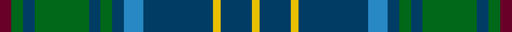

This page is one **sett** — a single exact thread-count. It belongs to the [tartan](/tartans/dr3g3db3g14db3g3db3b5db18y2db8y2/)
(the same proportion at any scale), whose colour order is pattern [BGBGBGBBBYBY](/stripes/bgbgbgbbbyby/).

Sourced from register-of-tartans.  It is a [12 stripe tartan](/stripes/stripes12/).

Original link https://www.tartanregister.gov.uk/tartanDetails.aspx?ref=480

2 attestations — the source records this cloth was collapsed from (oldest owns this page)

<ul>
<li>01/01/2004 — California Burns (Personal) (register-of-tartans, <a href="https://www.tartanregister.gov.uk/tartanDetails.aspx?ref=480">record</a>)</li>
<li>2004 — California Burns (Personal) (tartans-authority, <a href="http://www.tartansauthority.com/tartan-ferret/display/6663/">record</a>)</li>
</ul>

## Register references

External register numbers recorded for this tartan.

- Scottish Register of Tartans: [480](https://www.tartanregister.gov.uk/tartanDetails.aspx?ref=480)
- Scottish Tartans Authority (ITI): 6663

## Thread count
DR/6 G6 DB6 G28 DB6 G6 DB6 B10 DB36 Y4 DB16 Y/4

## Palette
Each colour and the base-6 reference it is a variant of.

| Colour | Shade | Base |
|---|---|---|
| B | <code style="background-color:#2888C4;">#2888C4</code> `oklch(60.1% 0.125 241.5)` <small>#2888C4</small> | B <code style="background-color:#2A418A;">#2A418A</code> |
| DB | <code style="background-color:#003C64;">#003C64</code> `oklch(34.5% 0.089 246.0)` <small>#003C64</small> | B <code style="background-color:#2A418A;">#2A418A</code> |
| DR | <code style="background-color:#680028;">#680028</code> `oklch(33.1% 0.133 8.3)` <small>#680028</small> | B <code style="background-color:#2A418A;">#2A418A</code> |
| G | <code style="background-color:#006818;">#006818</code> `oklch(45.0% 0.142 145.0)` <small>#006818</small> | G <code style="background-color:#006100;">#006100</code> |
| Y | <code style="background-color:#E8C000;">#E8C000</code> `oklch(81.9% 0.168 93.7)` <small>#E8C000</small> | Y <code style="background-color:#F2BF00;">#F2BF00</code> |

## Nearest tartans

The nearest existing variants by ΔTartan distance, with this tartan at the top so the swatches line up against it.

ΔTartan

Tartan

Sett

—

<a href="/ttd/edit/#slug=dr3g3dt3g14dt3g3dt3t5dt18ly2dt8ly2~x2">California Burns (Personal)</a> <a class="nn-out" href="/setts/s12/dr3g3dt3g14dt3g3dt3t5dt18ly2dt8ly2~x2/" title="open its dictionary page">↗</a>

0.73

<a href="/ttd/edit/#slug=lo3dg17b3dg3b3do5b18r2b8r2~x2">Donegal, County</a> <a class="nn-out" href="/setts/s10/lo3dg17b3dg3b3do5b18r2b8r2~x2/" title="open its dictionary page">↗</a>

0.74

<a href="/ttd/edit/#slug=y3g17db3g3db3dr5db18r2db8r2~x2">Donegal</a> <a class="nn-out" href="/setts/s10/y3g17db3g3db3dr5db18r2db8r2~x2/" title="open its dictionary page">↗</a>

0.92

<a href="/ttd/edit/#slug=dg21db4w4db32dg12ly4dg8r4dg6db12">Harkness Hunting</a> <a class="nn-out" href="/setts/s10/dg21db4w4db32dg12ly4dg8r4dg6db12/" title="open its dictionary page">↗</a>

0.96

<a href="/ttd/edit/#slug=db2y18db2y2db20r3db18g2db2g18w2">American Society of Travel Agents, The</a> <a class="nn-out" href="/setts/s11/db2y18db2y2db20r3db18g2db2g18w2/" title="open its dictionary page">↗</a>

0.98

<a href="/ttd/edit/#slug=lo3g17n3g3n3k5n18r2n8r2~x2">Donegal Irish County Tartan Tartan Number: 2247. Earliest known date: 1996 One of a series of Irish District tartans designed by Polly Wittering of the House of Edgar, with colours reminiscent of the Country with soft warm colours dominating. See products available Copyright © Blair Urquhart, Comrie, 2015</a> <a class="nn-out" href="/setts/s10/lo3g17n3g3n3k5n18r2n8r2~x2/" title="open its dictionary page">↗</a>

1.02

<a href="/ttd/edit/#slug=w2n4dy3dt3dy3dt20dy3n16dt8lt2~x2">Sverker</a> <a class="nn-out" href="/setts/s10/w2n4dy3dt3dy3dt20dy3n16dt8lt2~x2/" title="open its dictionary page">↗</a>

1.09

<a href="/ttd/edit/#slug=g5db20g20db2g2db2g25r2g2r17k8g2w2~x2">Boyle, Cameron (Personal)</a> <a class="nn-out" href="/setts/s13/g5db20g20db2g2db2g25r2g2r17k8g2w2~x2/" title="open its dictionary page">↗</a>

1.13

<a href="/ttd/edit/#slug=r2db10w1m1dg1r1dg6m1dg10w1~x2">Tennessee</a> <a class="nn-out" href="/setts/s10/r2db10w1m1dg1r1dg6m1dg10w1~x2/" title="open its dictionary page">↗</a>

1.14

<a href="/ttd/edit/#slug=db19g7db7t2g20k9g6k4g10w3~x2">O'Connell, William (Name)</a> <a class="nn-out" href="/setts/s10/db19g7db7t2g20k9g6k4g10w3~x2/" title="open its dictionary page">↗</a>

1.16

<a href="/ttd/edit/#slug=dg8r3dg8k10dp5g32dg5g32dp5k10dg8r3dg8dp3~x2">Scottish Power Corporate Tartan Tartan Number: 2435. Earliest known date: pre 1996 Designed by Lochcarron for Scottish Power using the main corporate colours and taking care to produce a sett that could be seen as pipe band kilts at a distance. Scottish Power say (9.12.02) that Kinloch Anderson deal with this tartan and that permission to order/wear it is required from Scottish Power, Corporate Communications, 0141 566 4856. . See products available Copyright © Blair Urquhart, Comrie, 2015</a> <a class="nn-out" href="/setts/s14/dg8r3dg8k10dp5g32dg5g32dp5k10dg8r3dg8dp3~x2/" title="open its dictionary page">↗</a>

## Neighbour map

Every grey dot is one of 14299 variants placed by the first two principal components of the ΔTartan feature space (44% of its variance). Red is this tartan; blue dots are its nearest — click one to open its page.

<svg viewBox="0 0 640 380" role="img" style="max-width:100%;height:auto;border:1px solid #e0e0e0;border-radius:4px;display:block" xmlns="http://www.w3.org/2000/svg"><image href="/nn/cloud.v1.png" width="640" height="380"/><a href="/setts/s10/lo3dg17b3dg3b3do5b18r2b8r2~x2/"><circle cx="266.3" cy="196.2" r="4" fill="#3465a4"><title>Donegal, County</title></circle></a><a href="/setts/s10/y3g17db3g3db3dr5db18r2db8r2~x2/"><circle cx="259.1" cy="190.8" r="4" fill="#3465a4"><title>Donegal</title></circle></a><a href="/setts/s10/dg21db4w4db32dg12ly4dg8r4dg6db12/"><circle cx="240.6" cy="203.2" r="4" fill="#3465a4"><title>Harkness Hunting</title></circle></a><a href="/setts/s11/db2y18db2y2db20r3db18g2db2g18w2/"><circle cx="263.8" cy="178.8" r="4" fill="#3465a4"><title>American Society of Travel Agents, The</title></circle></a><a href="/setts/s10/lo3g17n3g3n3k5n18r2n8r2~x2/"><circle cx="249.0" cy="184.4" r="4" fill="#3465a4"><title>Donegal Irish County Tartan Tartan Number: 2247. Earliest known date: 1996 One of a series of Irish District tartans designed by Polly Wittering of the House of Edgar, with colours reminiscent of the Country with soft warm colours dominating. See products available Copyright © Blair Urquhart, Comrie, 2015</title></circle></a><a href="/setts/s10/w2n4dy3dt3dy3dt20dy3n16dt8lt2~x2/"><circle cx="255.6" cy="183.7" r="4" fill="#3465a4"><title>Sverker</title></circle></a><a href="/setts/s13/g5db20g20db2g2db2g25r2g2r17k8g2w2~x2/"><circle cx="271.2" cy="160.6" r="4" fill="#3465a4"><title>Boyle, Cameron (Personal)</title></circle></a><a href="/setts/s10/r2db10w1m1dg1r1dg6m1dg10w1~x2/"><circle cx="262.2" cy="170.6" r="4" fill="#3465a4"><title>Tennessee</title></circle></a><a href="/setts/s10/db19g7db7t2g20k9g6k4g10w3~x2/"><circle cx="224.6" cy="205.5" r="4" fill="#3465a4"><title>O'Connell, William (Name)</title></circle></a><a href="/setts/s14/dg8r3dg8k10dp5g32dg5g32dp5k10dg8r3dg8dp3~x2/"><circle cx="239.7" cy="176.0" r="4" fill="#3465a4"><title>Scottish Power Corporate Tartan Tartan Number: 2435. Earliest known date: pre 1996 Designed by Lochcarron for Scottish Power using the main corporate colours and taking care to produce a sett that could be seen as pipe band kilts at a distance. Scottish Power say (9.12.02) that Kinloch Anderson deal with this tartan and that permission to order/wear it is required from Scottish Power, Corporate Communications, 0141 566 4856. . See products available Copyright © Blair Urquhart, Comrie, 2015</title></circle></a><circle cx="265.7" cy="191.1" r="5" fill="#c00000"/></svg>

ID: /setts/s12/dr3g3dt3g14dt3g3dt3t5dt18ly2dt8ly2~x2/
