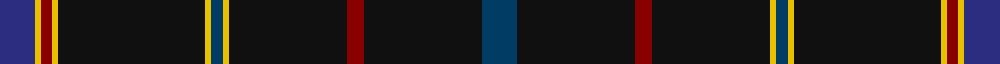

In pattern [BKRKYBYKYRYB](/stripes/bkrkybykyryb/).

This was sourced from register-of-tartans.  It is a [12 stripe tartan](/stripes/stripes12/).

Original link https://www.tartanregister.gov.uk/tartanDetails.aspx?ref=11118

## Register references

External register numbers recorded for this tartan.

- Scottish Register of Tartans: [11118](https://www.tartanregister.gov.uk/tartanDetails.aspx?ref=11118)

## Thread count
DB/12 Y2 DR4 Y2 K50 Y2 DBa4 Y2 K40 DR6 K40 DBa/12

## Palette
Each colour and the base-6 reference it is a variant of.

| Colour | Shade | Base |
|---|---|---|
| DB | <code style="background-color:#2C2C80;">#2C2C80</code> `oklch(35.0% 0.138 276.6)` <small>#2C2C80</small> | B <code style="background-color:#2A418A;">#2A418A</code> |
| DBa | <code style="background-color:#003C64;">#003C64</code> `oklch(34.5% 0.089 246.0)` <small>#003C64</small> | B <code style="background-color:#2A418A;">#2A418A</code> |
| DR | <code style="background-color:#880000;">#880000</code> `oklch(39.4% 0.162 29.2)` <small>#880000</small> | R <code style="background-color:#CC0000;">#CC0000</code> |
| K | <code style="background-color:#101010;">#101010</code> `oklch(17.3% 0.000 89.9)` <small>#101010</small> | K <code style="background-color:#000000;">#000000</code> |
| Y | <code style="background-color:#E8C000;">#E8C000</code> `oklch(81.9% 0.168 93.7)` <small>#E8C000</small> | Y <code style="background-color:#F2BF00;">#F2BF00</code> |

## Nearest tartans

The nearest existing variants by ΔTartan distance, with this tartan at the top so the swatches line up against it.

ΔTartan

Tartan

Sett

—

<a href="/ttd/edit/#slug=dt6k20r3k20ly1dt2ly1k25ly1r2ly1db6~x2">Martinez (2014)</a> <a class="nn-out" href="/setts/s12/dt6k20r3k20ly1dt2ly1k25ly1r2ly1db6~x2/" title="open its dictionary page">↗</a>

0.73

<a href="/ttd/edit/#slug=k10n2o2n2k14n2k2lp1n12k24m2~x2">Pride of Scotland Platinum</a> <a class="nn-out" href="/setts/s11/k10n2o2n2k14n2k2lp1n12k24m2~x2/" title="open its dictionary page">↗</a>

0.76

<a href="/ttd/edit/#slug=db6k20r3b2k20ly1ly1k25ly1r2ly1b6~x2">Martinez (2014)</a> <a class="nn-out" href="/setts/s12/db6k20r3b2k20ly1ly1k25ly1r2ly1b6~x2/" title="open its dictionary page">↗</a>

0.84

<a href="/ttd/edit/#slug=k9n2o2n2k18n2k2lp1n19k33dp2~x2">Pride of Scotland Contemporary</a> <a class="nn-out" href="/setts/s11/k9n2o2n2k18n2k2lp1n19k33dp2~x2/" title="open its dictionary page">↗</a>

0.86

<a href="/ttd/edit/#slug=k14n2k2n5k25lo1n9lp3k3w1k14~x2">Springbank</a> <a class="nn-out" href="/setts/s11/k14n2k2n5k25lo1n9lp3k3w1k14~x2/" title="open its dictionary page">↗</a>

1.06

<a href="/ttd/edit/#slug=k14n2k2n5k25w1n9m3k3w1k14~x2">Springbank</a> <a class="nn-out" href="/setts/s11/k14n2k2n5k25w1n9m3k3w1k14~x2/" title="open its dictionary page">↗</a>

1.15

<a href="/ttd/edit/#slug=k49db15k2lo6k33r4k3dy8lb3db5k3~x2">State Seal of Wisconsin (Fashion)</a> <a class="nn-out" href="/setts/s11/k49db15k2lo6k33r4k3dy8lb3db5k3~x2/" title="open its dictionary page">↗</a>

1.18

<a href="/ttd/edit/#slug=r2k25dy2k20n5k2n4k3n3k4n2k6ly2~x2">Gold-Smith (Personal)</a> <a class="nn-out" href="/setts/s13/r2k25dy2k20n5k2n4k3n3k4n2k6ly2~x2/" title="open its dictionary page">↗</a>

1.19

<a href="/ttd/edit/#slug=k49o8k4n6o4n6k4o8k49o2">Harley Davidson</a> <a class="nn-out" href="/setts/s10/k49o8k4n6o4n6k4o8k49o2/" title="open its dictionary page">↗</a>

1.22

<a href="/ttd/edit/#slug=k14n2k2n5k25w1n9p3k3w1k14~x2">Springbank</a> <a class="nn-out" href="/setts/s11/k14n2k2n5k25w1n9p3k3w1k14~x2/" title="open its dictionary page">↗</a>

1.28

<a href="/ttd/edit/#slug=lo2k3db6r4k48r4db6k3lb2~x2">Highland Park</a> <a class="nn-out" href="/setts/s9/lo2k3db6r4k48r4db6k3lb2~x2/" title="open its dictionary page">↗</a>

## Neighbour map

Every grey dot is one of 14299 variants placed by the first two principal components of the ΔTartan feature space (44% of its variance). Red is this tartan; blue dots are its nearest — click one to open its page.

<svg viewBox="0 0 640 380" role="img" style="max-width:100%;height:auto;border:1px solid #e0e0e0;border-radius:4px;display:block" xmlns="http://www.w3.org/2000/svg"><image href="/nn/cloud.v1.png" width="640" height="380"/><a href="/setts/s11/k10n2o2n2k14n2k2lp1n12k24m2~x2/"><circle cx="431.2" cy="147.6" r="4" fill="#3465a4"><title>Pride of Scotland Platinum</title></circle></a><a href="/setts/s12/db6k20r3b2k20ly1ly1k25ly1r2ly1b6~x2/"><circle cx="451.2" cy="131.7" r="4" fill="#3465a4"><title>Martinez (2014)</title></circle></a><a href="/setts/s11/k9n2o2n2k18n2k2lp1n19k33dp2~x2/"><circle cx="455.7" cy="133.4" r="4" fill="#3465a4"><title>Pride of Scotland Contemporary</title></circle></a><a href="/setts/s11/k14n2k2n5k25lo1n9lp3k3w1k14~x2/"><circle cx="451.4" cy="146.2" r="4" fill="#3465a4"><title>Springbank</title></circle></a><a href="/setts/s11/k14n2k2n5k25w1n9m3k3w1k14~x2/"><circle cx="476.0" cy="165.9" r="4" fill="#3465a4"><title>Springbank</title></circle></a><a href="/setts/s11/k49db15k2lo6k33r4k3dy8lb3db5k3~x2/"><circle cx="414.6" cy="122.9" r="4" fill="#3465a4"><title>State Seal of Wisconsin (Fashion)</title></circle></a><a href="/setts/s13/r2k25dy2k20n5k2n4k3n3k4n2k6ly2~x2/"><circle cx="458.3" cy="162.2" r="4" fill="#3465a4"><title>Gold-Smith (Personal)</title></circle></a><a href="/setts/s10/k49o8k4n6o4n6k4o8k49o2/"><circle cx="508.2" cy="154.7" r="4" fill="#3465a4"><title>Harley Davidson</title></circle></a><a href="/setts/s11/k14n2k2n5k25w1n9p3k3w1k14~x2/"><circle cx="467.4" cy="161.0" r="4" fill="#3465a4"><title>Springbank</title></circle></a><a href="/setts/s9/lo2k3db6r4k48r4db6k3lb2~x2/"><circle cx="468.4" cy="132.6" r="4" fill="#3465a4"><title>Highland Park</title></circle></a><circle cx="472.9" cy="143.9" r="5" fill="#c00000"/></svg>

ID: /setts/s12/dt6k20r3k20ly1dt2ly1k25ly1r2ly1db6~x2/
