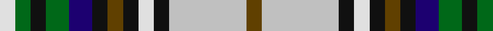

**Bands:** [GWKWKGKBGKGW](/stripes/gwkwkgkbgkgw/) · **Stripes:** [DY LB K W K DY K DB G K G W](/stripes/stripes12/) DY LB K W K DY K DB G K G W

This was sourced from tartans-authority.  It is a [12 band tartan](/bands/bands12/).

Original link http://www.tartansauthority.com/tartan-ferret/display/3572/

## Attestations

This cloth appears in 2 source records; the oldest owns this page.

- pre 2002 — MacSheehy (tartans-authority, [record](http://www.tartansauthority.com/tartan-ferret/display/3572/))
- undated — MacSheehy (register-of-tartans, [record](https://www.tartanregister.gov.uk/tartanDetails.aspx?ref=5254))

## Register references

External register numbers recorded for this tartan.

- Scottish Register of Tartans: [5254](https://www.tartanregister.gov.uk/tartanDetails.aspx?ref=5254)
- Scottish Tartans Authority (ITI): 3572

## Thread count
LN/8 G8 K8 G12 DB12 K8 T8 K8 LN8 K8 N40 T/8

## Palette
Each colour and its ΔE from the base-6 reference it is a variant of.

| Colour | Shade | Base | ΔE (OKLab) |
|---|---|---|---|
| DB | <code style="background-color:#1C0070;">#1C0070</code> `#1C0070` | B <code style="background-color:#2A418A;">#2A418A</code> | 0.14 |
| G | <code style="background-color:#006818;">#006818</code> `#006818` | G <code style="background-color:#006100;">#006100</code> | 0.02 |
| K | <code style="background-color:#101010;">#101010</code> `#101010` | K <code style="background-color:#000000;">#000000</code> | 0.17 |
| LN | <code style="background-color:#E0E0E0;">#E0E0E0</code> `#E0E0E0` | W <code style="background-color:#F7F7F7;">#F7F7F7</code> | 0.07 |
| N | <code style="background-color:#C0C0C0;">#C0C0C0</code> `#C0C0C0` | W <code style="background-color:#F7F7F7;">#F7F7F7</code> | 0.17 |
| T | <code style="background-color:#604000;">#604000</code> `#604000` | G <code style="background-color:#006100;">#006100</code> | 0.14 |

## Nearest tartans

The nearest existing variants by ΔTartan distance.

1. [Kagame (Personal)](/setts/s10/ly5lb14k3ly7g3k3g7k6db24w3~x2/) — ΔT 0.91
1. [Clodagh, Cork](/setts/s13/w3db20ly4k9w3k3w3k3g14o9k3o4w3~x2/) — ΔT 0.92
1. [Mitsukoshi Sendai](/setts/s10/o4k1w1k1w1k1o4n2dg6r1~x6/) — ΔT 0.92
1. [Coulter (Personal)](/setts/s17/t7k9k2k2k2r14g14w2t3w2g14r14k2t7k9k2k2~x2/) — ΔT 0.95
1. [Clodagh Cork Irish District Tartan Tartan Number: 1795. Earliest known date: 1970 In a letter from a Northern Irish bagpipe maker in 1979 it says, '...it has been established that it originated somewhere in the Bog of Allen in Southern Ireland.' However, there is a marked similarity with the King George VI tartan which is a variation of the Royal Stewart. There is also a similarity with the MacBeth tartan. See products available Copyright © Blair Urquhart, Comrie, 2015](/setts/s13/w3db20ly4k9w3k3w3k3g14dy9k3dy4w3~x2/) — ΔT 0.98
1. [Festival Celtique de Qubecc](/setts/s14/g5k1g5k1db5w1db5g2w1ly2db1r3ly1r3~x4/) — ΔT 1.00
1. [MacPherson, dress](/setts/s15/w13db3w13g10ly2k7db5k2db2k2db5r8w2k2r2~x2/) — ΔT 1.02
1. [MacKenzie Dress](/setts/s14/w3t2w7t2w2k7g8k1w2k1g8k7db7r2~x2/) — ΔT 1.03
1. [Clodagh/Cork](/setts/s13/w4dy4k3dy9dg13k3w3k3w3k9ly4n20w3~x2/) — ΔT 1.04
1. [Festival Celtique de Québec](/setts/s14/g5k1g5k1db5w1db5g2w1lo2db1r3lo1r3~x4/) — ΔT 1.04

## Neighbour map

Every grey dot is one of 14313 variants placed by the first two principal components of the ΔTartan feature space (44% of its variance). Red is this tartan; blue dots are its nearest — click one to open its page.

<svg viewBox="0 0 640 380" role="img" style="max-width:100%;height:auto;border:1px solid #e0e0e0;border-radius:4px;display:block" xmlns="http://www.w3.org/2000/svg"><image href="/nn/cloud.v1.png" width="640" height="380"/><a href="/setts/s10/ly5lb14k3ly7g3k3g7k6db24w3~x2/"><circle cx="52.4" cy="140.5" r="4" fill="#3465a4"><title>Kagame (Personal)</title></circle></a><a href="/setts/s13/w3db20ly4k9w3k3w3k3g14o9k3o4w3~x2/"><circle cx="14.0" cy="140.8" r="4" fill="#3465a4"><title>Clodagh, Cork</title></circle></a><a href="/setts/s10/o4k1w1k1w1k1o4n2dg6r1~x6/"><circle cx="79.2" cy="165.3" r="4" fill="#3465a4"><title>Mitsukoshi Sendai</title></circle></a><a href="/setts/s17/t7k9k2k2k2r14g14w2t3w2g14r14k2t7k9k2k2~x2/"><circle cx="27.7" cy="132.3" r="4" fill="#3465a4"><title>Coulter (Personal)</title></circle></a><a href="/setts/s13/w3db20ly4k9w3k3w3k3g14dy9k3dy4w3~x2/"><circle cx="26.3" cy="147.3" r="4" fill="#3465a4"><title>Clodagh Cork Irish District Tartan Tartan Number: 1795. Earliest known date: 1970 In a letter from a Northern Irish bagpipe maker in 1979 it says, '...it has been established that it originated somewhere in the Bog of Allen in Southern Ireland.' However, there is a marked similarity with the King George VI tartan which is a variation of the Royal Stewart. There is also a similarity with the MacBeth tartan. See products available Copyright © Blair Urquhart, Comrie, 2015</title></circle></a><a href="/setts/s14/g5k1g5k1db5w1db5g2w1ly2db1r3ly1r3~x4/"><circle cx="50.1" cy="169.9" r="4" fill="#3465a4"><title>Festival Celtique de Qubecc</title></circle></a><a href="/setts/s15/w13db3w13g10ly2k7db5k2db2k2db5r8w2k2r2~x2/"><circle cx="45.2" cy="130.4" r="4" fill="#3465a4"><title>MacPherson, dress</title></circle></a><a href="/setts/s14/w3t2w7t2w2k7g8k1w2k1g8k7db7r2~x2/"><circle cx="24.1" cy="149.7" r="4" fill="#3465a4"><title>MacKenzie Dress</title></circle></a><a href="/setts/s13/w4dy4k3dy9dg13k3w3k3w3k9ly4n20w3~x2/"><circle cx="14.0" cy="142.0" r="4" fill="#3465a4"><title>Clodagh/Cork</title></circle></a><a href="/setts/s14/g5k1g5k1db5w1db5g2w1lo2db1r3lo1r3~x4/"><circle cx="46.3" cy="171.0" r="4" fill="#3465a4"><title>Festival Celtique de Québec</title></circle></a><circle cx="18.6" cy="155.7" r="5" fill="#c00000"/></svg>

ID: /setts/s12/dy2lb10k2w2k2dy2k2db3g3k2g2w2~x4/
