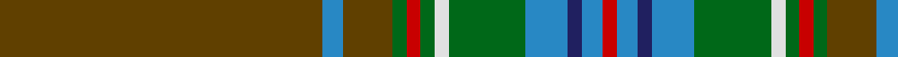

**Bands:** [RBBBGWGRGGBG](/stripes/rbbbgwgrggbg/) · **Stripes:** [R T DB T G W G R G DY T DY](/stripes/stripes12/) R T DB T G W G R G DY T DY

This was sourced from house-of-tartan.  It is a [12 band tartan](/bands/bands12/).

Original link http://www.house-of-tartan.scotland.net/house/TartanViewjs.asp?colr=Def&tnam=1318

## Thread count
T/92 B6 T14 G4 R4 G4 LN4 G22 B12 DB4 B6 R/4

## Palette
Each colour and its ΔE from the base-6 reference it is a variant of.

| Colour | Shade | Base | ΔE (OKLab) |
|---|---|---|---|
| B | <code style="background-color:#2888C4;">#2888C4</code> `#2888C4` | B <code style="background-color:#2A418A;">#2A418A</code> | 0.21 |
| DB | <code style="background-color:#202060;">#202060</code> `#202060` | B <code style="background-color:#2A418A;">#2A418A</code> | 0.11 |
| G | <code style="background-color:#006818;">#006818</code> `#006818` | G <code style="background-color:#006100;">#006100</code> | 0.02 |
| LN | <code style="background-color:#E0E0E0;">#E0E0E0</code> `#E0E0E0` | W <code style="background-color:#F7F7F7;">#F7F7F7</code> | 0.07 |
| R | <code style="background-color:#C80000;">#C80000</code> `#C80000` | R <code style="background-color:#CC0000;">#CC0000</code> | 0.01 |
| T | <code style="background-color:#604000;">#604000</code> `#604000` | G <code style="background-color:#006100;">#006100</code> | 0.14 |

## Nearest tartans

The nearest existing variants by ΔTartan distance.

1. [Diana, hunting Plaid](/setts/s12/o46b3o7g2r2g2w2g11b6db2b3r2~x2/) — ΔT 0.99
1. [Diana Hunting Plaid](/setts/s12/dy46b3dy7dg2r2dg2w2dg11b6db2b3r2~x2/) — ΔT 1.01
1. [Sarna (District)](/setts/s13/g8ly2dy4dp4g3dp4dy42g4r3g4dy4dp5r3/) — ΔT 1.34
1. [Forster (Personal)](/setts/s14/r1dg20r1dg1dy2dg1ly1dg1dy4lr1dy1lr1dy1lr1~x4/) — ΔT 1.34
1. [Cavalier, Green](/setts/s11/y40dt10o2dt2w2dt3r8y6dt2y4w2~x2/) — ΔT 1.37
1. [Sarna](/setts/s13/g8ly2o4p4g3p4o42g4r3g4o4p5r3/) — ΔT 1.40
1. [British Caledonian Airways #2](/setts/s12/n68b5k9lo3k3lb3k3n20r9k3r5lb4/) — ΔT 1.43
1. [Williams](/setts/s11/dy46dy6r3dy3w3dy3dg10dy8dy3dy6w3~x2/) — ΔT 1.44
1. [Inches of Perth](/setts/s16/dy44ly2k4dp2dy15m6k3t3ly2~x2/) — ΔT 1.44
1. [California Department of Forestry (Corporate)](/setts/s11/y30dg5g3r1g3k1g3r1g3db1lo1~x4/) — ΔT 1.44

## Neighbour map

Every grey dot is one of 14299 variants placed by the first two principal components of the ΔTartan feature space (44% of its variance). Red is this tartan; blue dots are its nearest — click one to open its page.

<svg viewBox="0 0 640 380" role="img" style="max-width:100%;height:auto;border:1px solid #e0e0e0;border-radius:4px;display:block" xmlns="http://www.w3.org/2000/svg"><image href="/nn/cloud.v1.png" width="640" height="380"/><a href="/setts/s12/o46b3o7g2r2g2w2g11b6db2b3r2~x2/"><circle cx="399.7" cy="102.7" r="4" fill="#3465a4"><title>Diana, hunting Plaid</title></circle></a><a href="/setts/s12/dy46b3dy7dg2r2dg2w2dg11b6db2b3r2~x2/"><circle cx="368.6" cy="94.2" r="4" fill="#3465a4"><title>Diana Hunting Plaid</title></circle></a><a href="/setts/s13/g8ly2dy4dp4g3dp4dy42g4r3g4dy4dp5r3/"><circle cx="388.2" cy="129.8" r="4" fill="#3465a4"><title>Sarna (District)</title></circle></a><a href="/setts/s14/r1dg20r1dg1dy2dg1ly1dg1dy4lr1dy1lr1dy1lr1~x4/"><circle cx="381.5" cy="87.8" r="4" fill="#3465a4"><title>Forster (Personal)</title></circle></a><a href="/setts/s11/y40dt10o2dt2w2dt3r8y6dt2y4w2~x2/"><circle cx="387.8" cy="122.6" r="4" fill="#3465a4"><title>Cavalier, Green</title></circle></a><a href="/setts/s13/g8ly2o4p4g3p4o42g4r3g4o4p5r3/"><circle cx="379.8" cy="121.9" r="4" fill="#3465a4"><title>Sarna</title></circle></a><a href="/setts/s12/n68b5k9lo3k3lb3k3n20r9k3r5lb4/"><circle cx="405.0" cy="96.4" r="4" fill="#3465a4"><title>British Caledonian Airways #2</title></circle></a><a href="/setts/s11/dy46dy6r3dy3w3dy3dg10dy8dy3dy6w3~x2/"><circle cx="407.9" cy="148.0" r="4" fill="#3465a4"><title>Williams</title></circle></a><a href="/setts/s16/dy44ly2k4dp2dy15m6k3t3ly2~x2/"><circle cx="386.2" cy="90.8" r="4" fill="#3465a4"><title>Inches of Perth</title></circle></a><a href="/setts/s11/y30dg5g3r1g3k1g3r1g3db1lo1~x4/"><circle cx="372.5" cy="76.3" r="4" fill="#3465a4"><title>California Department of Forestry (Corporate)</title></circle></a><circle cx="393.0" cy="104.4" r="5" fill="#c00000"/></svg>

ID: /setts/s12/dy46t3dy7g2r2g2w2g11t6db2t3r2~x2/
