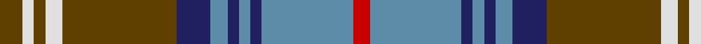

In pattern [GWGWGBBBBBBR](/stripes/gwgwgbbbbbbr/).

This was sourced from house-of-tartan.  It is a [12 stripe tartan](/stripes/stripes12/).

Original link http://www.house-of-tartan.scotland.net/house/TartanViewjs.asp?colr=Def&tnam=1319

## Thread count
T/8 LN4 T4 LN6 T40 DB12 B6 DB4 B4 DB4 B32 R/6

## Palette
Each colour and the base-6 reference it is a variant of.

| Colour | Shade | Base |
|---|---|---|
| B | <code style="background-color:#5C8CA8;">#5C8CA8</code> `oklch(61.7% 0.067 235.0)` <small>#5C8CA8</small> | B <code style="background-color:#2A418A;">#2A418A</code> |
| DB | <code style="background-color:#202060;">#202060</code> `oklch(28.9% 0.111 276.9)` <small>#202060</small> | B <code style="background-color:#2A418A;">#2A418A</code> |
| LN | <code style="background-color:#E0E0E0;">#E0E0E0</code> `oklch(90.7% 0.000 89.9)` <small>#E0E0E0</small> | W <code style="background-color:#F7F7F7;">#F7F7F7</code> |
| R | <code style="background-color:#C80000;">#C80000</code> `oklch(52.3% 0.215 29.2)` <small>#C80000</small> | R <code style="background-color:#CC0000;">#CC0000</code> |
| T | <code style="background-color:#604000;">#604000</code> `oklch(39.8% 0.083 76.8)` <small>#604000</small> | G <code style="background-color:#006100;">#006100</code> |

## Nearest tartans

The nearest existing variants by ΔTartan distance, with this tartan at the top so the swatches line up against it.

ΔTartan

Tartan

Sett

—

<a href="/ttd/edit/#slug=dy4w2dy2w3dy20db6t3db2t2db2t16r3~x2">Callum Scotch House Trade Tartan Tartan Number: 1319. Earliest known date: pre 2003 Sett identical to Vestiarium Scoticum No 196 'Menzies' See products available Copyright © Blair Urquhart, Comrie, 2015</a> <a class="nn-out" href="/setts/s12/dy4w2dy2w3dy20db6t3db2t2db2t16r3~x2/" title="open its dictionary page">↗</a>

0.27

<a href="/ttd/edit/#slug=r3n16db2n2db2n3db6o20lr3o2lr2o3~x2">Callum</a> <a class="nn-out" href="/setts/s12/r3n16db2n2db2n3db6o20lr3o2lr2o3~x2/" title="open its dictionary page">↗</a>

0.70

<a href="/ttd/edit/#slug=o4w2o2w3o20db6t3db2t2db2t16r3~x2">Callum, Scotch House</a> <a class="nn-out" href="/setts/s12/o4w2o2w3o20db6t3db2t2db2t16r3~x2/" title="open its dictionary page">↗</a>

0.82

<a href="/ttd/edit/#slug=lb3k1n12k1n1k2n1k6lr12k1lo1~x4">McCandlish Dress, Grey (Name)</a> <a class="nn-out" href="/setts/s11/lb3k1n12k1n1k2n1k6lr12k1lo1~x4/" title="open its dictionary page">↗</a>

0.83

<a href="/ttd/edit/#slug=o3r3o4r4o20k5n4k3o3k2n25w3~x2">MacLellan of Gartbreck (Personal)</a> <a class="nn-out" href="/setts/s12/o3r3o4r4o20k5n4k3o3k2n25w3~x2/" title="open its dictionary page">↗</a>

0.87

<a href="/ttd/edit/#slug=o9w2o18k3o3k3o3k12n30k6n6r6">Urquhart (Fashion)</a> <a class="nn-out" href="/setts/s12/o9w2o18k3o3k3o3k12n30k6n6r6/" title="open its dictionary page">↗</a>

0.87

<a href="/ttd/edit/#slug=dt4r1dt12w1r4w1dg4w1r4dg12dt1w2~x2">Glenfalloch</a> <a class="nn-out" href="/setts/s12/dt4r1dt12w1r4w1dg4w1r4dg12dt1w2~x2/" title="open its dictionary page">↗</a>

0.93

<a href="/ttd/edit/#slug=lb3k1do12k1do1k2do1k6o12k1lo1~x4">MacCandlish Dress Grey</a> <a class="nn-out" href="/setts/s11/lb3k1do12k1do1k2do1k6o12k1lo1~x4/" title="open its dictionary page">↗</a>

0.97

<a href="/ttd/edit/#slug=t5r3t30k6w4k6g24r4g6r3">Law Society of Scotland</a> <a class="nn-out" href="/setts/s10/t5r3t30k6w4k6g24r4g6r3/" title="open its dictionary page">↗</a>

0.98

<a href="/ttd/edit/#slug=db16g4k4o22db5o22k3r5g4o4g4r4k4~x2">Gayre Hunting Clan Tartan Tartan Number: 165. Earliest known date: 1963 Five versions of Gayre tartan are recorded. Hunting, Dress, Bodyguard, Arisaidh and the version recorded by Lord Lyon, the Clan sett. This can be found in the Public Register of All Arms and Bearings in Scotland. (1992) See products available Copyright © Blair Urquhart, Comrie, 2015</a> <a class="nn-out" href="/setts/s13/db16g4k4o22db5o22k3r5g4o4g4r4k4~x2/" title="open its dictionary page">↗</a>

0.99

<a href="/ttd/edit/#slug=dp4t2dp2t8k3dp8g3dp4g24g2~x2">Jones Htg (Name)</a> <a class="nn-out" href="/setts/s10/dp4t2dp2t8k3dp8g3dp4g24g2~x2/" title="open its dictionary page">↗</a>

## Neighbour map

Every grey dot is one of 14299 variants placed by the first two principal components of the ΔTartan feature space (44% of its variance). Red is this tartan; blue dots are its nearest — click one to open its page.

<svg viewBox="0 0 640 380" role="img" style="max-width:100%;height:auto;border:1px solid #e0e0e0;border-radius:4px;display:block" xmlns="http://www.w3.org/2000/svg"><image href="/nn/cloud.v1.png" width="640" height="380"/><a href="/setts/s12/r3n16db2n2db2n3db6o20lr3o2lr2o3~x2/"><circle cx="199.4" cy="147.9" r="4" fill="#3465a4"><title>Callum</title></circle></a><a href="/setts/s12/o4w2o2w3o20db6t3db2t2db2t16r3~x2/"><circle cx="197.4" cy="147.9" r="4" fill="#3465a4"><title>Callum, Scotch House</title></circle></a><a href="/setts/s11/lb3k1n12k1n1k2n1k6lr12k1lo1~x4/"><circle cx="167.5" cy="134.3" r="4" fill="#3465a4"><title>McCandlish Dress, Grey (Name)</title></circle></a><a href="/setts/s12/o3r3o4r4o20k5n4k3o3k2n25w3~x2/"><circle cx="222.7" cy="147.2" r="4" fill="#3465a4"><title>MacLellan of Gartbreck (Personal)</title></circle></a><a href="/setts/s12/o9w2o18k3o3k3o3k12n30k6n6r6/"><circle cx="194.1" cy="146.2" r="4" fill="#3465a4"><title>Urquhart (Fashion)</title></circle></a><a href="/setts/s12/dt4r1dt12w1r4w1dg4w1r4dg12dt1w2~x2/"><circle cx="172.5" cy="150.3" r="4" fill="#3465a4"><title>Glenfalloch</title></circle></a><a href="/setts/s11/lb3k1do12k1do1k2do1k6o12k1lo1~x4/"><circle cx="179.1" cy="140.9" r="4" fill="#3465a4"><title>MacCandlish Dress Grey</title></circle></a><a href="/setts/s10/t5r3t30k6w4k6g24r4g6r3/"><circle cx="183.4" cy="164.7" r="4" fill="#3465a4"><title>Law Society of Scotland</title></circle></a><a href="/setts/s13/db16g4k4o22db5o22k3r5g4o4g4r4k4~x2/"><circle cx="199.5" cy="170.5" r="4" fill="#3465a4"><title>Gayre Hunting Clan Tartan Tartan Number: 165. Earliest known date: 1963 Five versions of Gayre tartan are recorded. Hunting, Dress, Bodyguard, Arisaidh and the version recorded by Lord Lyon, the Clan sett. This can be found in the Public Register of All Arms and Bearings in Scotland. (1992) See products available Copyright © Blair Urquhart, Comrie, 2015</title></circle></a><a href="/setts/s10/dp4t2dp2t8k3dp8g3dp4g24g2~x2/"><circle cx="238.4" cy="159.7" r="4" fill="#3465a4"><title>Jones Htg (Name)</title></circle></a><circle cx="197.0" cy="147.4" r="5" fill="#c00000"/></svg>

ID: /setts/s12/dy4w2dy2w3dy20db6t3db2t2db2t16r3~x2/
