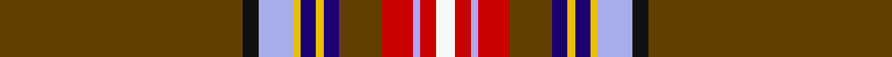

In pattern [GKWYBYBGRWRW](/stripes/gkwybybgrwrw/).

This was sourced from tartans-authority.  It is a [12 stripe tartan](/stripes/stripes12/).

Original link http://www.tartansauthority.com/tartan-ferret/display/1737/

## Thread count
T/126 K8 LP18 Y4 DB8 Y4 DB8 T22 R16 LP4 R8 W/10

## Palette
Each colour and the base-6 reference it is a variant of.

| Colour | Shade | Base |
|---|---|---|
| DB | <code style="background-color:#1C0070;">#1C0070</code> `oklch(26.3% 0.162 277.1)` <small>#1C0070</small> | B <code style="background-color:#2A418A;">#2A418A</code> |
| K | <code style="background-color:#101010;">#101010</code> `oklch(17.3% 0.000 89.9)` <small>#101010</small> | K <code style="background-color:#000000;">#000000</code> |
| LP | <code style="background-color:#A8ACE8;">#A8ACE8</code> `oklch(76.3% 0.086 281.2)` <small>#A8ACE8</small> | W <code style="background-color:#F7F7F7;">#F7F7F7</code> |
| R | <code style="background-color:#C80000;">#C80000</code> `oklch(52.3% 0.215 29.2)` <small>#C80000</small> | R <code style="background-color:#CC0000;">#CC0000</code> |
| T | <code style="background-color:#604000;">#604000</code> `oklch(39.8% 0.083 76.8)` <small>#604000</small> | G <code style="background-color:#006100;">#006100</code> |
| W | <code style="background-color:#F8F8F8;">#F8F8F8</code> `oklch(97.9% 0.000 89.9)` <small>#F8F8F8</small> | W <code style="background-color:#F7F7F7;">#F7F7F7</code> |
| Y | <code style="background-color:#E8C000;">#E8C000</code> `oklch(81.9% 0.168 93.7)` <small>#E8C000</small> | Y <code style="background-color:#F2BF00;">#F2BF00</code> |

## Nearest tartans

The nearest existing variants by ΔTartan distance.

1. [Seller Sillar Family Tartan Tartan Number: 1737. Earliest known date: 1978 The design is based on the Sillers connection with the Isle of Arran and the Clan Stewart. See products available Copyright © Blair Urquhart, Comrie, 2015](/setts/s12/dy63k4t9ly2db4ly2db4dy11r8t2r4w5~x2/) — ΔT 0.78
1. [Seller, Sillar](/setts/s12/o63k4t9ly2db4ly2db4o11r8t2r4w5~x2/) — ΔT 1.39
1. [Stewart of Rothesay](/setts/s13/g7r122db17r12k12ly3k4w3g48r16k4r6w5/) — ΔT 1.55
1. [Banause-Zunft zu Olte](/setts/s11/ly2dg4dt1r3dt3dg3g1r32dt14w3ly2~x2/) — ΔT 1.58
1. [U.S. Customs & Border Protection (C](/setts/s11/lo24k7db1k1w1k1dy4r3k1r2lo1~x4/) — ΔT 1.58
1. [Legion of Frontiersmen](/setts/s8/dr62ly7g7r3w3db13w3r5~x2/) — ΔT 1.61
1. [MacRae, of Ardentoul](/setts/s18/r11t3db18ly1db2w1k1g18r3k1r2k3r2k1r40k1r2k3~x2/) — ΔT 1.63
1. [Unidentified Scarlett #16](/setts/s20/db9lb1k8ly1k2w2k2g13r45w1r4~x2/) — ΔT 1.64
1. [Wattenhofer (2016)](/setts/s9/do60b8r16b4lo8do4r2b6w1~x2/) — ΔT 1.65
1. [Stuart / Stewart](/setts/s14/g2r30db4r4k6ly1k1w1k1g10r4k1r1w1~x2/) — ΔT 1.65

## Neighbour map

Every grey dot is one of 14299 variants placed by the first two principal components of the ΔTartan feature space (44% of its variance). Red is this tartan; blue dots are its nearest — click one to open its page.

<svg viewBox="0 0 640 380" role="img" style="max-width:100%;height:auto;border:1px solid #e0e0e0;border-radius:4px;display:block" xmlns="http://www.w3.org/2000/svg"><image href="/nn/cloud.v1.png" width="640" height="380"/><a href="/setts/s12/dy63k4t9ly2db4ly2db4dy11r8t2r4w5~x2/"><circle cx="371.2" cy="54.7" r="4" fill="#3465a4"><title>Seller Sillar Family Tartan Tartan Number: 1737. Earliest known date: 1978 The design is based on the Sillers connection with the Isle of Arran and the Clan Stewart. See products available Copyright © Blair Urquhart, Comrie, 2015</title></circle></a><a href="/setts/s12/o63k4t9ly2db4ly2db4o11r8t2r4w5~x2/"><circle cx="379.2" cy="56.8" r="4" fill="#3465a4"><title>Seller, Sillar</title></circle></a><a href="/setts/s13/g7r122db17r12k12ly3k4w3g48r16k4r6w5/"><circle cx="361.7" cy="36.0" r="4" fill="#3465a4"><title>Stewart of Rothesay</title></circle></a><a href="/setts/s11/ly2dg4dt1r3dt3dg3g1r32dt14w3ly2~x2/"><circle cx="309.9" cy="73.2" r="4" fill="#3465a4"><title>Banause-Zunft zu Olte</title></circle></a><a href="/setts/s11/lo24k7db1k1w1k1dy4r3k1r2lo1~x4/"><circle cx="279.0" cy="61.7" r="4" fill="#3465a4"><title>U.S. Customs &amp; Border Protection (C</title></circle></a><a href="/setts/s8/dr62ly7g7r3w3db13w3r5~x2/"><circle cx="326.8" cy="92.1" r="4" fill="#3465a4"><title>Legion of Frontiersmen</title></circle></a><a href="/setts/s18/r11t3db18ly1db2w1k1g18r3k1r2k3r2k1r40k1r2k3~x2/"><circle cx="287.5" cy="14.0" r="4" fill="#3465a4"><title>MacRae, of Ardentoul</title></circle></a><a href="/setts/s20/db9lb1k8ly1k2w2k2g13r45w1r4~x2/"><circle cx="328.8" cy="14.0" r="4" fill="#3465a4"><title>Unidentified Scarlett #16</title></circle></a><a href="/setts/s9/do60b8r16b4lo8do4r2b6w1~x2/"><circle cx="381.6" cy="73.7" r="4" fill="#3465a4"><title>Wattenhofer (2016)</title></circle></a><a href="/setts/s14/g2r30db4r4k6ly1k1w1k1g10r4k1r1w1~x2/"><circle cx="323.1" cy="41.2" r="4" fill="#3465a4"><title>Stuart / Stewart</title></circle></a><circle cx="349.6" cy="42.2" r="5" fill="#c00000"/></svg>

ID: /setts/s12/dy63k4lb9ly2db4ly2db4dy11r8lb2r4w5~x2/
