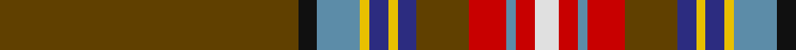

In pattern [GKBYBYBGRBRW](/stripes/gkbybybgrbrw/).

This was sourced from house-of-tartan.  It is a [12 stripe tartan](/stripes/stripes12/).

Original link http://www.house-of-tartan.scotland.net/house/TartanViewjs.asp?colr=Def&tnam=1737

## Thread count
T/126 K8 B18 Y4 DB8 Y4 DB8 T22 R16 B4 R8 LN/10

## Palette
Each colour and its ΔE from the base-6 reference it is a variant of.

| Colour | Shade | Base | ΔE (OKLab) |
|---|---|---|---|
| B | <code style="background-color:#5C8CA8;">#5C8CA8</code> `#5C8CA8` | B <code style="background-color:#2A418A;">#2A418A</code> | 0.23 |
| DB | <code style="background-color:#2C2C80;">#2C2C80</code> `#2C2C80` | B <code style="background-color:#2A418A;">#2A418A</code> | 0.06 |
| K | <code style="background-color:#101010;">#101010</code> `#101010` | K <code style="background-color:#000000;">#000000</code> | 0.17 |
| LN | <code style="background-color:#E0E0E0;">#E0E0E0</code> `#E0E0E0` | W <code style="background-color:#F7F7F7;">#F7F7F7</code> | 0.07 |
| R | <code style="background-color:#C80000;">#C80000</code> `#C80000` | R <code style="background-color:#CC0000;">#CC0000</code> | 0.01 |
| T | <code style="background-color:#604000;">#604000</code> `#604000` | G <code style="background-color:#006100;">#006100</code> | 0.14 |
| Y | <code style="background-color:#E8C000;">#E8C000</code> `#E8C000` | Y <code style="background-color:#F2BF00;">#F2BF00</code> | 0.02 |

## Nearest tartans

The nearest existing variants by ΔTartan distance.

1. [Seller (Personal)](/setts/s12/dy63k4lb9ly2db4ly2db4dy11r8lb2r4w5~x2/) — ΔT 0.78
1. [Seller, Sillar](/setts/s12/o63k4t9ly2db4ly2db4o11r8t2r4w5~x2/) — ΔT 0.97
1. [Inches of Perth](/setts/s16/dy44ly2k4dp2dy15m6k3t3ly2~x2/) — ΔT 1.40
1. [Diana Hunting Plaid](/setts/s12/dy46b3dy7dg2r2dg2w2dg11b6db2b3r2~x2/) — ΔT 1.47
1. [Wattenhofer (2016)](/setts/s9/do60b8r16b4lo8do4r2b6w1~x2/) — ΔT 1.55
1. [British Caledonian Airways #2](/setts/s12/n68b5k9lo3k3lb3k3n20r9k3r5lb4/) — ΔT 1.56
1. [Banause-Zunft zu Olte](/setts/s11/ly2dg4dt1r3dt3dg3g1r32dt14w3ly2~x2/) — ΔT 1.62
1. [Stewart - Pr Ch Ed - Pendleton](/setts/s12/r32db2k8lo1k2lb2k2g18r10k2r2lb2~x4/) — ΔT 1.63
1. [Ellis Island (District)](/setts/s13/r68k1g6t4g1t12w1g6ly1g24ly1g2ly3~x2/) — ΔT 1.67
1. [Drummond of Perth](/setts/s9/r36lr1db3ly1dg16r8db3b2lr1~x2/) — ΔT 1.69

## Neighbour map

Every grey dot is one of 14299 variants placed by the first two principal components of the ΔTartan feature space (44% of its variance). Red is this tartan; blue dots are its nearest — click one to open its page.

<svg viewBox="0 0 640 380" role="img" style="max-width:100%;height:auto;border:1px solid #e0e0e0;border-radius:4px;display:block" xmlns="http://www.w3.org/2000/svg"><image href="/nn/cloud.v1.png" width="640" height="380"/><a href="/setts/s12/dy63k4lb9ly2db4ly2db4dy11r8lb2r4w5~x2/"><circle cx="349.6" cy="42.2" r="4" fill="#3465a4"><title>Seller (Personal)</title></circle></a><a href="/setts/s12/o63k4t9ly2db4ly2db4o11r8t2r4w5~x2/"><circle cx="379.2" cy="56.8" r="4" fill="#3465a4"><title>Seller, Sillar</title></circle></a><a href="/setts/s16/dy44ly2k4dp2dy15m6k3t3ly2~x2/"><circle cx="386.2" cy="90.8" r="4" fill="#3465a4"><title>Inches of Perth</title></circle></a><a href="/setts/s12/dy46b3dy7dg2r2dg2w2dg11b6db2b3r2~x2/"><circle cx="368.6" cy="94.2" r="4" fill="#3465a4"><title>Diana Hunting Plaid</title></circle></a><a href="/setts/s9/do60b8r16b4lo8do4r2b6w1~x2/"><circle cx="381.6" cy="73.7" r="4" fill="#3465a4"><title>Wattenhofer (2016)</title></circle></a><a href="/setts/s12/n68b5k9lo3k3lb3k3n20r9k3r5lb4/"><circle cx="405.0" cy="96.4" r="4" fill="#3465a4"><title>British Caledonian Airways #2</title></circle></a><a href="/setts/s11/ly2dg4dt1r3dt3dg3g1r32dt14w3ly2~x2/"><circle cx="309.9" cy="73.2" r="4" fill="#3465a4"><title>Banause-Zunft zu Olte</title></circle></a><a href="/setts/s12/r32db2k8lo1k2lb2k2g18r10k2r2lb2~x4/"><circle cx="319.6" cy="82.6" r="4" fill="#3465a4"><title>Stewart - Pr Ch Ed - Pendleton</title></circle></a><a href="/setts/s13/r68k1g6t4g1t12w1g6ly1g24ly1g2ly3~x2/"><circle cx="372.5" cy="43.3" r="4" fill="#3465a4"><title>Ellis Island (District)</title></circle></a><a href="/setts/s9/r36lr1db3ly1dg16r8db3b2lr1~x2/"><circle cx="404.3" cy="85.2" r="4" fill="#3465a4"><title>Drummond of Perth</title></circle></a><circle cx="371.2" cy="54.7" r="5" fill="#c00000"/></svg>

ID: /setts/s12/dy63k4t9ly2db4ly2db4dy11r8t2r4w5~x2/
