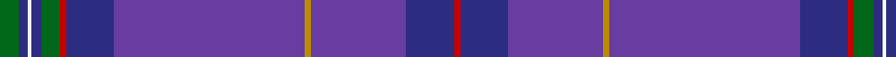

In pattern [GBWBGRBBYBBR](/patterns/gbwbgrbbybbr/).

This was sourced from tartans-authority.  It is a [12 stripes tartan](/stripes/stripes12/).

Original link http://www.tartansauthority.com/tartan-ferret/display/6838/

## Thread count
G/12 DB6 W2 DB6 G12 R4 DB30 B120 DY4 B60 DB30 R/4

## Palette
Each colour and its ΔE from the base-6 reference it is a variant of.

| Colour | Shade | Base | ΔE (OKLab) |
|---|---|---|---|
| B | <code style="background-color:#683CA0;">#683CA0</code> `#683CA0` | B <code style="background-color:#2C4084;">#2C4084</code> | 0.11 |
| DB | <code style="background-color:#2C2C80;">#2C2C80</code> `#2C2C80` | B <code style="background-color:#2C4084;">#2C4084</code> | 0.05 |
| DY | <code style="background-color:#BC8C00;">#BC8C00</code> `#BC8C00` | Y <code style="background-color:#E8C000;">#E8C000</code> | 0.16 |
| G | <code style="background-color:#006818;">#006818</code> `#006818` | G <code style="background-color:#006400;">#006400</code> | 0.02 |
| R | <code style="background-color:#C80000;">#C80000</code> `#C80000` | R <code style="background-color:#C80000;">#C80000</code> | 0.00 |
| W | <code style="background-color:#F8F8F8;">#F8F8F8</code> `#F8F8F8` | W <code style="background-color:#F4F4F0;">#F4F4F0</code> | 0.01 |

## Nearest tartans

The nearest existing variants by ΔTartan distance.

1. [Roslin Roseline Da Vinci](/setts/s12/g12b6w2b6g12r4b30ba120y4ba60b30r4-b2c2c80-ba440044-g006818-rc80000-wf8f8f8-ybc8c00/) — ΔT 1.55
1. [Bank of Scotland (2000)](/setts/s10/b128ba6bb8r10bb16bc24b6bc8b4y2-b3850c8-ba1c0070-bb14283c-bc003c64-r880000-yd09800/) — ΔT 1.55
1. [Roseline](/setts/s12/b10g18r6b36ba160y6ba80b36r6g18b10w4-b2c4084-ba5a1c38-g005020-rdc0000-we0e0e0-ye8c000/) — ΔT 1.93
1. [Highland Pride 2 (Fashion)](/setts/s11/b76k8b4g12ba22bb6ba4r4b22k2w4-b202060-ba440044-bb003c64-g003820-k101010-r880000-we0e0e0/) — ΔT 1.94
1. [Ulster Scots (Fashion)](/setts/s10/b168ba2b2k4b4k60ba14b4g6y4-b2c2c80-ba780078-g006818-k101010-yd87c00/) — ΔT 1.97
1. [RAAF #2](/setts/s9/b132w2ba20w2ba20w2ba24r4bb48-b2c2c80-ba003c64-bb5c8ca8-rc80000-we0e0e0/) — ΔT 2.07
1. [Royal British Legion Scotland (Corp)](/setts/s8/y8b4ba60k6b16ba10b2r4-b440044-ba202060-k101010-rc80000-ybc8c00/) — ΔT 2.13
1. [Gretna Gold](/setts/s14/b4r4b56ba76y4ba4w6ba4y4ba76b56r4b4ra4-b202060-ba6c0070-rb468ac-rac80000-we0e0e0-ybc8c00/) — ΔT 2.14
1. [Gretna Gold Fashion Tartan Tartan Number: 6032. Earliest known date: 01/01/2003 Presumably a fashion tartan. Lochcarron swatch. See products available Copyright © Blair Urquhart, Comrie, 2015](/setts/s14/b4r4b56ba76k4ba4w6ba4k4ba76b56r4b4ra4-b202060-ba6c0070-k000000-rb468ac-rac80000-we0e0e0/) — ΔT 2.16
1. [CAL FIRE Local 2881](/setts/s10/b112g22r4g14k4g14r4g14ba6y8-b2c2c80-ba202060-g003820-k101010-rc80000-yd09800/) — ΔT 2.22

## Neighbour map

Every grey dot is one of 15726 variants placed by the first two principal components of the ΔTartan feature space (44% of its variance). Red is this tartan; blue dots are its nearest — click one to open its page.

<svg viewBox="0 0 640 380" role="img" style="max-width:100%;height:auto;border:1px solid #e0e0e0;border-radius:4px;display:block" xmlns="http://www.w3.org/2000/svg"><image href="/nn/cloud.v1.png" width="640" height="380"/><a href="/setts/s12/g12b6w2b6g12r4b30ba120y4ba60b30r4-b2c2c80-ba440044-g006818-rc80000-wf8f8f8-ybc8c00/"><circle cx="447.7" cy="91.2" r="4" fill="#3465a4"><title>Roslin Roseline Da Vinci</title></circle></a><a href="/setts/s10/b128ba6bb8r10bb16bc24b6bc8b4y2-b3850c8-ba1c0070-bb14283c-bc003c64-r880000-yd09800/"><circle cx="472.1" cy="91.5" r="4" fill="#3465a4"><title>Bank of Scotland (2000)</title></circle></a><a href="/setts/s12/b10g18r6b36ba160y6ba80b36r6g18b10w4-b2c4084-ba5a1c38-g005020-rdc0000-we0e0e0-ye8c000/"><circle cx="438.9" cy="101.1" r="4" fill="#3465a4"><title>Roseline</title></circle></a><a href="/setts/s11/b76k8b4g12ba22bb6ba4r4b22k2w4-b202060-ba440044-bb003c64-g003820-k101010-r880000-we0e0e0/"><circle cx="432.8" cy="109.8" r="4" fill="#3465a4"><title>Highland Pride 2 (Fashion)</title></circle></a><a href="/setts/s10/b168ba2b2k4b4k60ba14b4g6y4-b2c2c80-ba780078-g006818-k101010-yd87c00/"><circle cx="521.8" cy="104.5" r="4" fill="#3465a4"><title>Ulster Scots (Fashion)</title></circle></a><a href="/setts/s9/b132w2ba20w2ba20w2ba24r4bb48-b2c2c80-ba003c64-bb5c8ca8-rc80000-we0e0e0/"><circle cx="389.2" cy="117.4" r="4" fill="#3465a4"><title>RAAF #2</title></circle></a><a href="/setts/s8/y8b4ba60k6b16ba10b2r4-b440044-ba202060-k101010-rc80000-ybc8c00/"><circle cx="446.6" cy="146.5" r="4" fill="#3465a4"><title>Royal British Legion Scotland (Corp)</title></circle></a><a href="/setts/s14/b4r4b56ba76y4ba4w6ba4y4ba76b56r4b4ra4-b202060-ba6c0070-rb468ac-rac80000-we0e0e0-ybc8c00/"><circle cx="362.9" cy="116.8" r="4" fill="#3465a4"><title>Gretna Gold</title></circle></a><a href="/setts/s14/b4r4b56ba76k4ba4w6ba4k4ba76b56r4b4ra4-b202060-ba6c0070-k000000-rb468ac-rac80000-we0e0e0/"><circle cx="364.5" cy="118.5" r="4" fill="#3465a4"><title>Gretna Gold Fashion Tartan Tartan Number: 6032. Earliest known date: 01/01/2003 Presumably a fashion tartan. Lochcarron swatch. See products available Copyright © Blair Urquhart, Comrie, 2015</title></circle></a><a href="/setts/s10/b112g22r4g14k4g14r4g14ba6y8-b2c2c80-ba202060-g003820-k101010-rc80000-yd09800/"><circle cx="383.7" cy="112.8" r="4" fill="#3465a4"><title>CAL FIRE Local 2881</title></circle></a><circle cx="458.4" cy="96.4" r="5" fill="#c00000"/></svg>

ID: /setts/s12/g12b6w2b6g12r4b30ba120y4ba60b30r4-b2c2c80-ba683ca0-g006818-rc80000-wf8f8f8-ybc8c00/
