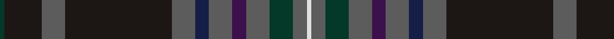

In pattern [GKBKBBBBBGBW](/patterns/gkbkbbbbbgbw/).

This was sourced from register-of-tartans.  It is a [12 stripes tartan](/stripes/stripes12/).

Original link https://www.tartanregister.gov.uk/tartanDetails.aspx?ref=10640

## Register references

External register numbers recorded for this tartan.

- Scottish Register of Tartans: [10640](https://www.tartanregister.gov.uk/tartanDetails.aspx?ref=10640)

## Thread count
DG/2 K16 N10 K46 N10 DB6 N10 DP6 N10 DG10 N6 LN/2

## Palette
Each colour and its ΔE from the base-6 reference it is a variant of.

| Colour | Shade | Base | ΔE (OKLab) |
|---|---|---|---|
| DB | <code style="background-color:#141E46;">#141E46</code> `#141E46` | B <code style="background-color:#2A418A;">#2A418A</code> | 0.16 |
| DG | <code style="background-color:#043828;">#043828</code> `#043828` | G <code style="background-color:#006100;">#006100</code> | 0.15 |
| DP | <code style="background-color:#3C104C;">#3C104C</code> `#3C104C` | B <code style="background-color:#2A418A;">#2A418A</code> | 0.15 |
| K | <code style="background-color:#1C1714;">#1C1714</code> `#1C1714` | K <code style="background-color:#000000;">#000000</code> | 0.21 |
| LN | <code style="background-color:#E0E0E0;">#E0E0E0</code> `#E0E0E0` | W <code style="background-color:#F7F7F7;">#F7F7F7</code> | 0.07 |
| N | <code style="background-color:#5C5C5C;">#5C5C5C</code> `#5C5C5C` | B <code style="background-color:#2A418A;">#2A418A</code> | 0.15 |

## Nearest tartans

The nearest existing variants by ΔTartan distance.

1. [Scottish Spirit Fashion Tartan Tartan Number: 10970. Earliest known date: 2013 ACS Clothing. Designed by Lochcarron. Wanted 'Highland Spirit' but that was taken by Ian McLure of T J Matthews. See products available Copyright © Blair Urquhart, Comrie, 2015](/setts/s12/b10r3b32g12k5g2k4g2k17ra4k2y2~b484848-g747474-k101010-r88243c-ra8c708c-ya0a0a0~x2/) — ΔT 0.90
1. [Capercaillie](/setts/s14/b4r3b4r2b4ba8b30k4ba4k36b4ra2k4w2~b4c3428-ba2c2c80-k101010-r98481c-rac80000-wf8f8f8/) — ΔT 1.11
1. [Kinfauns Castle](/setts/s10/r4b10g2b2g24ba2g2ba16g2w1~b2c2c80-ba783055-g003820-rc80000-we0e0e0~x2/) — ΔT 1.12
1. [Evans (Welsh Name)](/setts/s11/b2k2r30k36ba30k2ba4k2ba30k3ra2~b5c8ca8-ba003c64-k101010-r901c38-rac80000/) — ΔT 1.20
1. [Capercaillie Corporate Tartan Tartan Number: 6857. Earliest known date: 2005 RSPB Scotland will receive a 7% royalty on all products made from the new tartan, created in the colours of the world's largest woodland grouse, in a deal struck with the leading tartan weavers Lochcarron. See products available Copyright © Blair Urquhart, Comrie, 2015](/setts/s14/b4r3b4r2b4ba8b30k4ba4k36b4ra2k4w2~b505050-ba3c4464-k101010-r98481c-rac80000-wf8f8f8/) — ΔT 1.21
1. [Mann](/setts/s9/k3r2g4r1b25ga12g14b3r1~b202060-g604000-ga006818-k101010-rc80000~x2/) — ΔT 1.21
1. [Highland Pride of Scotland (Fashion)](/setts/s11/b9g2ba2bb2g18ba2k2g1k19b33w2~b202060-ba780078-bb440044-g285800-k101010-we0e0e0~x2/) — ΔT 1.21
1. [State Seal of Arkansas (Fashion)](/setts/s10/b49y3g13b12r4b5k7ga26b4r2~b003c64-g604000-ga5c6428-k101010-rc80000-ybc8c00~x2/) — ΔT 1.24
1. [Dugan (Personal)](/setts/s10/k10b4k34ba3g3ba3g3ba26bb2w3~b506878-ba1c1c50-bb84407c-g006818-k101010-wccd8e4~x2/) — ΔT 1.25
1. [Rikaco Classic (Fashion)](/setts/s10/b4ba4b1g24b10r1b2ra5ba3r2~b202060-ba1474b4-g003820-rc80000-ra880000~x2/) — ΔT 1.27

## Neighbour map

Every grey dot is one of 15726 variants placed by the first two principal components of the ΔTartan feature space (44% of its variance). Red is this tartan; blue dots are its nearest — click one to open its page.

<svg viewBox="0 0 640 380" role="img" style="max-width:100%;height:auto;border:1px solid #e0e0e0;border-radius:4px;display:block" xmlns="http://www.w3.org/2000/svg"><image href="/nn/cloud.v1.png" width="640" height="380"/><a href="/setts/s12/b10r3b32g12k5g2k4g2k17ra4k2y2~b484848-g747474-k101010-r88243c-ra8c708c-ya0a0a0~x2/"><circle cx="257.5" cy="134.6" r="4" fill="#3465a4"><title>Scottish Spirit Fashion Tartan Tartan Number: 10970. Earliest known date: 2013 ACS Clothing. Designed by Lochcarron. Wanted 'Highland Spirit' but that was taken by Ian McLure of T J Matthews. See products available Copyright © Blair Urquhart, Comrie, 2015</title></circle></a><a href="/setts/s14/b4r3b4r2b4ba8b30k4ba4k36b4ra2k4w2~b4c3428-ba2c2c80-k101010-r98481c-rac80000-wf8f8f8/"><circle cx="283.8" cy="117.2" r="4" fill="#3465a4"><title>Capercaillie</title></circle></a><a href="/setts/s10/r4b10g2b2g24ba2g2ba16g2w1~b2c2c80-ba783055-g003820-rc80000-we0e0e0~x2/"><circle cx="317.9" cy="145.3" r="4" fill="#3465a4"><title>Kinfauns Castle</title></circle></a><a href="/setts/s11/b2k2r30k36ba30k2ba4k2ba30k3ra2~b5c8ca8-ba003c64-k101010-r901c38-rac80000/"><circle cx="306.7" cy="158.5" r="4" fill="#3465a4"><title>Evans (Welsh Name)</title></circle></a><a href="/setts/s14/b4r3b4r2b4ba8b30k4ba4k36b4ra2k4w2~b505050-ba3c4464-k101010-r98481c-rac80000-wf8f8f8/"><circle cx="267.6" cy="110.8" r="4" fill="#3465a4"><title>Capercaillie Corporate Tartan Tartan Number: 6857. Earliest known date: 2005 RSPB Scotland will receive a 7% royalty on all products made from the new tartan, created in the colours of the world's largest woodland grouse, in a deal struck with the leading tartan weavers Lochcarron. See products available Copyright © Blair Urquhart, Comrie, 2015</title></circle></a><a href="/setts/s9/k3r2g4r1b25ga12g14b3r1~b202060-g604000-ga006818-k101010-rc80000~x2/"><circle cx="292.8" cy="151.3" r="4" fill="#3465a4"><title>Mann</title></circle></a><a href="/setts/s11/b9g2ba2bb2g18ba2k2g1k19b33w2~b202060-ba780078-bb440044-g285800-k101010-we0e0e0~x2/"><circle cx="294.2" cy="110.8" r="4" fill="#3465a4"><title>Highland Pride of Scotland (Fashion)</title></circle></a><a href="/setts/s10/b49y3g13b12r4b5k7ga26b4r2~b003c64-g604000-ga5c6428-k101010-rc80000-ybc8c00~x2/"><circle cx="357.0" cy="139.7" r="4" fill="#3465a4"><title>State Seal of Arkansas (Fashion)</title></circle></a><a href="/setts/s10/k10b4k34ba3g3ba3g3ba26bb2w3~b506878-ba1c1c50-bb84407c-g006818-k101010-wccd8e4~x2/"><circle cx="298.2" cy="142.7" r="4" fill="#3465a4"><title>Dugan (Personal)</title></circle></a><a href="/setts/s10/b4ba4b1g24b10r1b2ra5ba3r2~b202060-ba1474b4-g003820-rc80000-ra880000~x2/"><circle cx="296.4" cy="144.4" r="4" fill="#3465a4"><title>Rikaco Classic (Fashion)</title></circle></a><circle cx="295.0" cy="137.5" r="5" fill="#c00000"/></svg>

ID: /setts/s12/g1k8b5k23b5ba3b5bb3b5g5b3w1~b5c5c5c-ba141e46-bb3c104c-g043828-k1c1714-we0e0e0~x2/
